# Read data

**Most of this code was developed in Phase 1.**
Results will be suppressed for brevity.

**Use only the REDCap survey data**

Notes on the REDCap identifier variables:

* If `[consent] == 1`, they started the eligibility survey; 
  * if `== 0` or `== NA`, they didn't.
* If `[consent_and_eligibility_complete] == 2`, they finished the screener (whether eligible or ineligible); 
  * if `== 0`, they dropped out or never started.
* If `[eligible] == 1`, they completed the screener and were eligible; 
  * if `== 0`, they completed and were ineligible;
  * if `== NA` , they dropped out or never started.
* If `[veterans_and_social_media_use_co] == 2`, they finished the survey; 
  * if `== 0`, they dropped out or never started (this includes people who were ineligible or didn't consent).
* If `[analytic_sample] == 0`, they completed the survey but were disqualified for data quality reasons; 
  * if `== 1`, they completed survey and was not disqualified for data quality reasons;
  * if `== NA`, they didn't complete the survey.


| consent| consent_and_eligibility_complete| eligible| veterans_and_social_media_use_co| analytic_sample|   n|
|-------:|--------------------------------:|--------:|--------------------------------:|---------------:|---:|
|       0|                                0|       NA|                                0|              NA|   8|
|       0|                                2|        0|                                0|              NA|   7|
|       1|                                0|       NA|                                0|              NA|  84|
|       1|                                2|        0|                                0|              NA| 534|
|       1|                                2|        1|                                0|              NA| 106|
|       1|                                2|        1|                                2|               0|  18|
|       1|                                2|        1|                                2|               1| 587|
|      NA|                                0|       NA|                                0|              NA|  96|

Inclusion criteria

* Completed survey and was not disqualified for data quality reasons; `[analytic_sample] == 1`

**Number included: n = 587**

Cleaning

* Parse out `fba` into 2 separate variables for `image` and `text`
* Assign indicator for survey participation, `indSurveyParticipation`
  * `analytic_sample == 1`: Participant completed survey and was not disqualified for data quality reasons
* Assign indicator for eligibility screener participation, `indScreenerParticipation`
  * `eligible == 1`: Participant completed eligibility screener and was eligible to participate in full survey


## Use of VA health services


Recoding logic

* Primary analysis will code `9` (not sure) as `0` (No)
* Sensitivity analysis will exclude the `9` values from the analysis
* If `va_ever_enrolled == FALSE` & `is.na(va_use_12mo)`, then recode `va_use_12mo` to `FALSE`
* If `va_use_12mo == TRUE` & `va_ever_enrolled == FALSE`, then recode `va_ever_enrolled` to `TRUE`
* Code indicators `indVANeverEnrolled` and `indVANotUse12mo` as the logical opposites of `va_ever_enrolled` and `va_use_12mo`


## Independent variables

* Score the Modified Facebook Measure of Social Support (FMSS)
  * Reverse-scored items are `fmss_r7` through `fmss_r10`
* Standardize FMSS
* Prep FMSS items
  * Combine categories due to small cell sizes


```
##       fmss           fmssZ         
##  Min.   :14.00   Min.   :-2.29729  
##  1st Qu.:25.00   1st Qu.:-0.62179  
##  Median :29.00   Median :-0.01252  
##  Mean   :29.08   Mean   : 0.00000  
##  3rd Qu.:34.00   3rd Qu.: 0.74908  
##  Max.   :48.00   Max.   : 2.88153  
##  NA's   :15      NA's   :15
```

```
##       fmss fmssZ
## fmss     1     1
## fmssZ    1     1
```

```
##           fmss    fmssZ
## fmss  6.565197 2.562264
## fmssZ 2.562264 1.000000
```


|fmssQuartile |   n| min| max|
|:------------|---:|---:|---:|
|Q1: [14,25]  | 175|  14|  25|
|Q2: (25,29]  | 135|  26|  29|
|Q3: (29,34]  | 138|  30|  34|
|Q4: (34,48]  | 124|  35|  48|
|NA           |  15|  NA|  NA|

Check.

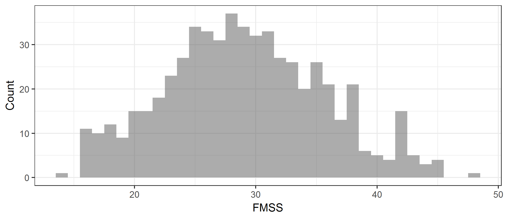

Cronbach's alpha for FMSS items 1-3.


```
## 
## Reliability analysis   
## Call: psych::alpha(x = .)
## 
##   raw_alpha std.alpha G6(smc) average_r S/N    ase mean  sd median_r
##       0.91      0.91    0.87      0.77  10 0.0065  1.1 0.9     0.78
## 
##  lower alpha upper     95% confidence boundaries
## 0.9 0.91 0.92 
## 
##  Reliability if an item is dropped:
##         raw_alpha std.alpha G6(smc) average_r S/N alpha se var.r med.r
## fmss_r1      0.89      0.89    0.80      0.80 7.8   0.0094    NA  0.80
## fmss_r2      0.85      0.85    0.74      0.74 5.7   0.0124    NA  0.74
## fmss_r3      0.87      0.87    0.78      0.78 7.0   0.0104    NA  0.78
## 
##  Item statistics 
##           n raw.r std.r r.cor r.drop mean   sd
## fmss_r1 585  0.91  0.91  0.84   0.80  1.0 0.94
## fmss_r2 584  0.93  0.93  0.89   0.84  1.1 0.97
## fmss_r3 584  0.92  0.92  0.86   0.82  1.1 1.03
## 
## Non missing response frequency for each item
##            0    1    2    3    4 miss
## fmss_r1 0.36 0.37 0.21 0.06 0.01 0.00
## fmss_r2 0.33 0.38 0.21 0.08 0.01 0.01
## fmss_r3 0.33 0.35 0.21 0.10 0.02 0.01
```

Cronbach's alpha for FMSS items 1-3 = Cronbach's alpha = 0.910.

Create FMSS subscore for items 1-3.


```
##   fmssSubscore   
##  Min.   : 0.000  
##  1st Qu.: 0.000  
##  Median : 3.000  
##  Mean   : 3.197  
##  3rd Qu.: 5.000  
##  Max.   :12.000  
##  NA's   :4
```


## Dependent variables

### Psychiatric symptoms (RQ1)

Code indicators for psychiatric disorder screening scales

* PTSD
  * Name of scale: PC-PTSD 
  * Positive screen: `ptsd_intrusive` + `ptsd_avoidant` + `ptsd_guarded` + `ptsd_numb` + `ptsd_guilty` $\ge$ 3
* Major depression
  * Name of scale: PHQ-2
  * Positive screen: `phq_interest` + `phq_mood` $\ge$ 3
* Alcohol misuse
  * Name of scale: AUDIT-C
  * Positive screen: `auditc_freq` + `auditc_amount` + `auditc_binge` $\ge$ 4 for men, $\ge$ 3 for women

Presence of suicidality is defined as DSI-SS score $\ge$ 2.
This cut-off score was chosen based on recommendations for population-based samples noted in 
[von Glischinski M Clin Psychol Psychotherapy 2015](http://onlinelibrary.wiley.com/doi/10.1002/cpp.2007/full)

* Score the DSI-SS inventory
  * See [Joiner 2002](http://www.sciencedirect.com/science/article/pii/S0005796701000171)
  * *Scores on each item range from 0 to 3 and, for the inventory, from 0 to 12, with higher scores reflecting greater severity of suicidal ideation.*


Check.


|yvariable |indPTSD | mean | sd  | min | max |  n  | freq  |
|:---------|:-------|:----:|:---:|:---:|:---:|:---:|:-----:|
|ptsd      |FALSE   | 0.7  | 0.8 |  0  |  2  | 319 | 54.5% |
|ptsd      |TRUE    | 4.2  | 0.8 |  3  |  5  | 266 | 45.5% |

\newline


|yvariable |indPHQ | mean | sd  | min | max |  n  | freq  |
|:---------|:------|:----:|:---:|:---:|:---:|:---:|:-----:|
|phq       |FALSE  | 1.0  | 0.9 |  0  |  2  | 422 | 72.0% |
|phq       |TRUE   | 4.5  | 1.2 |  3  |  6  | 164 | 28.0% |

\newline


|yvariable |indAuditC | mean | sd  | min | max |  n  | freq  |
|:---------|:---------|:----:|:---:|:---:|:---:|:---:|:-----:|
|auditc    |FALSE     | 1.3  | 1.1 |  0  |  3  | 341 | 58.4% |
|auditc    |TRUE      | 5.9  | 2.1 |  3  | 12  | 243 | 41.6% |

\newline


|yvariable |indDSISS | mean | sd  | min | max |  n  | freq  |
|:---------|:--------|:----:|:---:|:---:|:---:|:---:|:-----:|
|dsiss     |FALSE    | 0.1  | 0.3 |  0  |  1  | 453 | 77.4% |
|dsiss     |TRUE     | 3.9  | 1.6 |  2  |  9  | 132 | 22.6% |

Also create logical opposite for use in RQ3 modeling


### Social media use (RQ2)

* Spending more time on Facebook?
  * Frequency of Facebook use: `fb_freq`
  * Active use of Facebook: `comm_facebook`
* Sharing more personal or health-related information on social media?
  * `sm_emot_support`
  * `sm_med_info`
  * `sm_med_advice`
  * `sm_med_questions`
  * `sm_share_sympt`
  * `sm_share_health`
  * `sm_share_suicide`
  
Mutate variables to factors.


## Covariates

* Social media platforms used: `sm_used___1`, ..., `sm_used___7`, `sm_used___99`, `sm_used_other`
  * Recode the following `sm_used_other` values such that `sm_used___99 = 0`
    * `I use Wikipedia to read about illnesses I don't have; it's a curiosity/hobby thing.`
    * `just in person`
    * `Just plain internet search`
    * `TV/phone conversations, veterans group meetings`
    * `google; bing`
    * `aol`
    * `e-mail`
    * `Web MD`
    * `webmd`
* Offline social contact: `comm_inperson`
* History of suicidal ideation and suicide attempts
  * `suicide_considered_ever`
  * `suicide_considered_12mo`
  * `suicide_attempts` 
* Demographics
  * `age`
  * `gender`
  * `race`
  * `hispanic`
  * `marital`


Check.


|smOther |sm_used_other                                                                       |   n|
|:-------|:-----------------------------------------------------------------------------------|---:|
|FALSE   |                                                                                    | 552|
|FALSE   |aol                                                                                 |   1|
|FALSE   |e-mail                                                                              |   1|
|FALSE   |google; bing                                                                        |   1|
|FALSE   |I use Wikipedia to read about illnesses I don't have; it's a curiosity/hobby thing. |   1|
|FALSE   |just in person                                                                      |   1|
|FALSE   |TV/phone conversations, veterans group meetings                                     |   1|
|FALSE   |Web MD,                                                                             |   1|
|FALSE   |webmd                                                                               |   1|
|TRUE    |4chan                                                                               |   2|
|TRUE    |Gmail Hangouts; Reddit.com                                                          |   1|
|TRUE    |Google+                                                                             |   2|
|TRUE    |I used LiveJournal for the majority of my service as well as my deployment to Iraq  |   1|
|TRUE    |Linked In                                                                           |   1|
|TRUE    |LinkedIn, Snapchat                                                                  |   1|
|TRUE    |LiveJournal                                                                         |   1|
|TRUE    |MIL.MIL                                                                             |   1|
|TRUE    |Ravelry Forums                                                                      |   1|
|TRUE    |reddit                                                                              |   3|
|TRUE    |Reddit                                                                              |   5|
|TRUE    |Snao Chat                                                                           |   1|
|TRUE    |snapchat                                                                            |   3|
|TRUE    |Snapchat                                                                            |   1|
|TRUE    |SnapChat                                                                            |   1|
|TRUE    |webmd, mayoclinic,wikipedia, va                                                     |   1|
|TRUE    |www.coping-with-epilepsy.com                                                        |   1|

\newline

Number of social media platforms used (excluding Facebook):


| countSocialMediaExclFB|   n|
|----------------------:|---:|
|                      0| 347|
|                      1| 138|
|                      2|  68|
|                      3|  21|
|                      4|  11|
|                      5|   2|

\newline


|comm_inperson                 |   n|
|:-----------------------------|---:|
|Every few weeks or less often | 169|
|Once a week                   |  70|
|A few times a week            | 114|
|Once a day                    |  58|
|Several times a day           | 175|
|(Missing)                     |   1|

\newline


|indSuicideConsideredEver |indSuicideConsidered12mo |indSuicideAttempt | countSuicideAttempts|   n|
|:------------------------|:------------------------|:-----------------|--------------------:|---:|
|FALSE                    |FALSE                    |FALSE             |                    0| 330|
|TRUE                     |FALSE                    |FALSE             |                    0| 140|
|TRUE                     |FALSE                    |TRUE              |                    1|  31|
|TRUE                     |TRUE                     |FALSE             |                    0|  29|
|TRUE                     |FALSE                    |TRUE              |                    2|  16|
|TRUE                     |TRUE                     |TRUE              |                    1|  11|
|TRUE                     |FALSE                    |TRUE              |                    3|   9|
|TRUE                     |TRUE                     |TRUE              |                    3|   8|
|TRUE                     |TRUE                     |TRUE              |                    2|   7|
|TRUE                     |FALSE                    |TRUE              |                    4|   2|
|TRUE                     |FALSE                    |TRUE              |                    5|   2|
|TRUE                     |TRUE                     |TRUE              |                    5|   1|
|NA                       |NA                       |NA                |                  NaN|   1|


Of the 358 who had social contact on Facebook at least daily, 167 (47%) also had at least daily in-person social contact while 191 (53%) had in-person social contact less than daily, a non-significant difference (p = 0.224). 


Of the 233 who had in-person social contact at least daily, 167 (72%) also had at least daily social contact on Facebook while 66 (28%) had social contact on Facebook less than daily, a significant difference (p = 0.000).

Mean (SD) age: 40.0 (12.0)


|gender                   |   n|      prop|
|:------------------------|---:|---------:|
|Male                     | 474| 0.8074957|
|Female                   | 111| 0.1890971|
|A gender not listed here |   2| 0.0034072|


|fct_explicit_na(race)                         |   n|      prop|
|:---------------------------------------------|---:|---------:|
|White                                         | 492| 0.8381601|
|American Indian/Alaska Native/Native Hawaiian |   7| 0.0119250|
|Asian                                         |   8| 0.0136286|
|Black or African American                     |   7| 0.0119250|
|Multiple races                                |  52| 0.0885860|
|Other                                         |  17| 0.0289608|
|(Missing)                                     |   4| 0.0068143|


|fct_explicit_na(hispanic) |   n|      prop|
|:-------------------------|---:|---------:|
|No                        | 550| 0.9369676|
|Yes                       |  34| 0.0579216|
|(Missing)                 |   3| 0.0051107|


|fct_explicit_na(raceNonHispWhite) |   n|      prop|
|:---------------------------------|---:|---------:|
|Non-Hispanic White                | 473| 0.8057922|
|Not non-Hispanic White            | 112| 0.1908007|
|(Missing)                         |   2| 0.0034072|


|fct_explicit_na(educCollege) |   n|     prop|
|:----------------------------|---:|--------:|
|Some college or less         | 284| 0.483816|
|At least a college degree    | 303| 0.516184|


|fct_explicit_na(marital)   |   n|      prop|
|:--------------------------|---:|---------:|
|Single, never been married | 112| 0.1908007|
|Divorced                   |  88| 0.1499148|
|Separated                  |  16| 0.0272572|
|Married                    | 339| 0.5775128|
|Living as married          |  24| 0.0408859|
|Widowed                    |   7| 0.0119250|
|(Missing)                  |   1| 0.0017036|


|fct_explicit_na(marital2)         |   n|      prop|
|:---------------------------------|---:|---------:|
|Married or living as married      | 363| 0.6183986|
|Single/Divorced/Widowed/Separated | 223| 0.3798978|
|(Missing)                         |   1| 0.0017036|
# Research Question 1

**Is perceived social support received from Facebook (FMSS) associated with lower rates of**

* Positive screens for psychiatric disorders
  * PC-PTSD
  * PHQ-2
  * AUDIT-C
* Positive screen for suicidality?
  * DSI-SS


## Unadjusted comparisons


|yvariable |indPTSD | mean | sd  | min | max |  n  | freq  |
|:---------|:-------|:----:|:---:|:---:|:---:|:---:|:-----:|
|fmss      |FALSE   | 29.7 | 6.3 | 14  | 45  | 309 | 54.2% |
|fmss      |TRUE    | 28.3 | 6.8 | 16  | 48  | 261 | 45.8% |

\newline


|yvariable |indPHQ | mean | sd  | min | max |  n  | freq  |
|:---------|:------|:----:|:---:|:---:|:---:|:---:|:-----:|
|fmss      |FALSE  | 29.5 | 6.4 | 16  | 48  | 412 | 72.2% |
|fmss      |TRUE   | 27.9 | 6.9 | 14  | 44  | 159 | 27.8% |

\newline


|yvariable |indAuditC | mean | sd  | min | max |  n  | freq  |
|:---------|:---------|:----:|:---:|:---:|:---:|:---:|:-----:|
|fmss      |FALSE     | 29.2 | 6.8 | 14  | 48  | 335 | 58.9% |
|fmss      |TRUE      | 29.0 | 6.3 | 16  | 45  | 234 | 41.1% |

\newline


|yvariable |indDSISS | mean | sd  | min | max |  n  | freq  |
|:---------|:--------|:----:|:---:|:---:|:---:|:---:|:-----:|
|fmss      |FALSE    | 29.5 | 6.6 | 16  | 48  | 442 | 77.5% |
|fmss      |TRUE     | 27.6 | 6.4 | 14  | 44  | 128 | 22.5% |

\newline

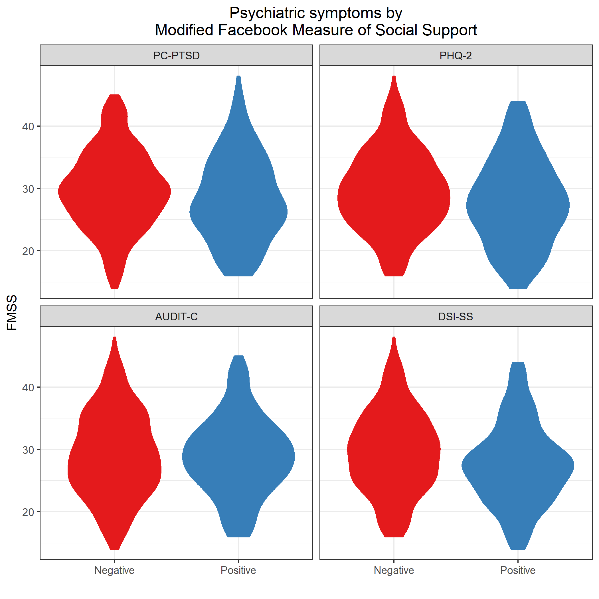


## Adjusted comparisons


Filter subjects with missing covariates.


Set modeling covariates.


```
## [1] "age"                      "gender"                  
## [3] "race"                     "hispanic"                
## [5] "marital2"                 "countSocialMediaExclFB"  
## [7] "comm_inperson"            "indSuicideConsideredEver"
## [9] "countSuicideAttempts"
```

### PC-PTSD


|model      |term                                              |   oddsratio| std.error| statistic| p.value|
|:----------|:-------------------------------------------------|-----------:|---------:|---------:|-------:|
|Unadjusted |(Intercept)                                       |       2.299|     0.393|     2.119|   0.034|
|Unadjusted |fmss                                              |       0.965|     0.013|    -2.655|   0.008|
|Adjusted   |(Intercept)                                       |       1.520|     0.564|     0.742|   0.458|
|Adjusted   |fmss                                              |       0.970|     0.015|    -2.092|   0.036|
|Adjusted   |age                                               |       1.005|     0.008|     0.666|   0.505|
|Adjusted   |genderFemale                                      |       0.908|     0.239|    -0.404|   0.687|
|Adjusted   |genderA gender not listed here                    | 1712539.376|   607.365|     0.024|   0.981|
|Adjusted   |raceAmerican Indian/Alaska Native/Native Hawaiian |       1.262|     0.823|     0.283|   0.777|
|Adjusted   |raceAsian                                         |       0.797|     0.761|    -0.298|   0.766|
|Adjusted   |raceBlack or African American                     |       1.573|     0.820|     0.552|   0.581|
|Adjusted   |raceMultiple races                                |       1.224|     0.325|     0.623|   0.533|
|Adjusted   |raceOther                                         |       1.128|     0.613|     0.197|   0.844|
|Adjusted   |hispanicYes                                       |       0.894|     0.418|    -0.268|   0.789|
|Adjusted   |marital2Single/Divorced/Widowed/Separated         |       1.120|     0.200|     0.568|   0.570|
|Adjusted   |countSocialMediaExclFB                            |       1.066|     0.096|     0.664|   0.507|
|Adjusted   |comm_inpersonOnce a week                          |       0.802|     0.321|    -0.688|   0.491|
|Adjusted   |comm_inpersonA few times a week                   |       0.533|     0.268|    -2.349|   0.019|
|Adjusted   |comm_inpersonOnce a day                           |       0.559|     0.340|    -1.709|   0.087|
|Adjusted   |comm_inpersonSeveral times a day                  |       0.401|     0.248|    -3.682|   0.000|
|Adjusted   |indSuicideConsideredEverTRUE                      |       2.064|     0.201|     3.610|   0.000|
|Adjusted   |countSuicideAttempts                              |       1.668|     0.163|     3.136|   0.002|

\newline


|model      | null.deviance| df.null|   logLik|     AIC|     BIC| deviance| df.residual| nobs|
|:----------|-------------:|-------:|--------:|-------:|-------:|--------:|-----------:|----:|
|Unadjusted |       775.487|     562| -384.156| 772.311| 780.978|  768.311|         561|  563|
|Adjusted   |       775.487|     562| -347.336| 732.671| 815.003|  694.671|         544|  563|


```
## Warning: glm.fit: fitted probabilities numerically 0 or 1 occurred

## Warning: glm.fit: fitted probabilities numerically 0 or 1 occurred

## Warning: glm.fit: fitted probabilities numerically 0 or 1 occurred

## Warning: glm.fit: fitted probabilities numerically 0 or 1 occurred

## Warning: glm.fit: fitted probabilities numerically 0 or 1 occurred

## Warning: glm.fit: fitted probabilities numerically 0 or 1 occurred

## Warning: glm.fit: fitted probabilities numerically 0 or 1 occurred

## Warning: glm.fit: fitted probabilities numerically 0 or 1 occurred

## Warning: glm.fit: fitted probabilities numerically 0 or 1 occurred

## Warning: glm.fit: fitted probabilities numerically 0 or 1 occurred

## Warning: glm.fit: fitted probabilities numerically 0 or 1 occurred

## Warning: glm.fit: fitted probabilities numerically 0 or 1 occurred

## Warning: glm.fit: fitted probabilities numerically 0 or 1 occurred

## Warning: glm.fit: fitted probabilities numerically 0 or 1 occurred

## Warning: glm.fit: fitted probabilities numerically 0 or 1 occurred

## Warning: glm.fit: fitted probabilities numerically 0 or 1 occurred

## Warning: glm.fit: fitted probabilities numerically 0 or 1 occurred

## Warning: glm.fit: fitted probabilities numerically 0 or 1 occurred

## Warning: glm.fit: fitted probabilities numerically 0 or 1 occurred

## Warning: glm.fit: fitted probabilities numerically 0 or 1 occurred

## Warning: glm.fit: fitted probabilities numerically 0 or 1 occurred

## Warning: glm.fit: fitted probabilities numerically 0 or 1 occurred

## Warning: glm.fit: fitted probabilities numerically 0 or 1 occurred

## Warning: glm.fit: fitted probabilities numerically 0 or 1 occurred

## Warning: glm.fit: fitted probabilities numerically 0 or 1 occurred

## Warning: glm.fit: fitted probabilities numerically 0 or 1 occurred

## Warning: glm.fit: fitted probabilities numerically 0 or 1 occurred

## Warning: glm.fit: fitted probabilities numerically 0 or 1 occurred

## Warning: glm.fit: fitted probabilities numerically 0 or 1 occurred

## Warning: glm.fit: fitted probabilities numerically 0 or 1 occurred

## Warning: glm.fit: fitted probabilities numerically 0 or 1 occurred

## Warning: glm.fit: fitted probabilities numerically 0 or 1 occurred

## Warning: glm.fit: fitted probabilities numerically 0 or 1 occurred

## Warning: glm.fit: fitted probabilities numerically 0 or 1 occurred

## Warning: glm.fit: fitted probabilities numerically 0 or 1 occurred

## Warning: glm.fit: fitted probabilities numerically 0 or 1 occurred

## Warning: glm.fit: fitted probabilities numerically 0 or 1 occurred

## Warning: glm.fit: fitted probabilities numerically 0 or 1 occurred

## Warning: glm.fit: fitted probabilities numerically 0 or 1 occurred

## Warning: glm.fit: fitted probabilities numerically 0 or 1 occurred

## Warning: glm.fit: fitted probabilities numerically 0 or 1 occurred

## Warning: glm.fit: fitted probabilities numerically 0 or 1 occurred

## Warning: glm.fit: fitted probabilities numerically 0 or 1 occurred

## Warning: glm.fit: fitted probabilities numerically 0 or 1 occurred

## Warning: glm.fit: fitted probabilities numerically 0 or 1 occurred

## Warning: glm.fit: fitted probabilities numerically 0 or 1 occurred

## Warning: glm.fit: fitted probabilities numerically 0 or 1 occurred

## Warning: glm.fit: fitted probabilities numerically 0 or 1 occurred

## Warning: glm.fit: fitted probabilities numerically 0 or 1 occurred
```

```
## Warning in regularize.values(x, y, ties, missing(ties), na.rm = na.rm):
## collapsing to unique 'x' values
```

For a 9-point increase in FMSS (the IQR), the adjusted odds ratio is 0.759
(95% CI: 0.584, 0.981).


### PHQ-2


|model      |term                                              | oddsratio| std.error| statistic| p.value|
|:----------|:-------------------------------------------------|---------:|---------:|---------:|-------:|
|Unadjusted |(Intercept)                                       |     1.087|     0.431|     0.194|   0.846|
|Unadjusted |fmss                                              |     0.964|     0.015|    -2.454|   0.014|
|Adjusted   |(Intercept)                                       |     1.299|     0.624|     0.420|   0.675|
|Adjusted   |fmss                                              |     0.975|     0.016|    -1.560|   0.119|
|Adjusted   |age                                               |     0.986|     0.009|    -1.550|   0.121|
|Adjusted   |genderFemale                                      |     0.800|     0.268|    -0.834|   0.404|
|Adjusted   |genderA gender not listed here                    |     1.187|     1.505|     0.114|   0.909|
|Adjusted   |raceAmerican Indian/Alaska Native/Native Hawaiian |     0.338|     1.128|    -0.962|   0.336|
|Adjusted   |raceAsian                                         |     0.599|     0.868|    -0.590|   0.555|
|Adjusted   |raceBlack or African American                     |     1.147|     0.926|     0.148|   0.882|
|Adjusted   |raceMultiple races                                |     0.968|     0.348|    -0.095|   0.924|
|Adjusted   |raceOther                                         |     2.139|     0.617|     1.232|   0.218|
|Adjusted   |hispanicYes                                       |     0.646|     0.503|    -0.870|   0.384|
|Adjusted   |marital2Single/Divorced/Widowed/Separated         |     1.124|     0.221|     0.528|   0.597|
|Adjusted   |countSocialMediaExclFB                            |     0.943|     0.108|    -0.537|   0.591|
|Adjusted   |comm_inpersonOnce a week                          |     0.725|     0.326|    -0.984|   0.325|
|Adjusted   |comm_inpersonA few times a week                   |     0.346|     0.310|    -3.427|   0.001|
|Adjusted   |comm_inpersonOnce a day                           |     0.447|     0.410|    -1.965|   0.049|
|Adjusted   |comm_inpersonSeveral times a day                  |     0.436|     0.274|    -3.029|   0.002|
|Adjusted   |indSuicideConsideredEverTRUE                      |     3.201|     0.227|     5.131|   0.000|
|Adjusted   |countSuicideAttempts                              |     1.210|     0.130|     1.468|   0.142|

\newline


|model      | null.deviance| df.null|   logLik|     AIC|     BIC| deviance| df.residual| nobs|
|:----------|-------------:|-------:|--------:|-------:|-------:|--------:|-----------:|----:|
|Unadjusted |       665.192|     563| -329.524| 663.048| 671.718|  659.048|         562|  564|
|Adjusted   |       665.192|     563| -291.661| 621.323| 703.689|  583.323|         545|  564|


For a 9-point increase in FMSS (the IQR), the adjusted odds ratio is 0.796
(95% CI: 0.597, 1.059).

### AUDIT-C


|model      |term                                              | oddsratio| std.error| statistic| p.value|
|:----------|:-------------------------------------------------|---------:|---------:|---------:|-------:|
|Unadjusted |(Intercept)                                       |     0.857|     0.391|    -0.394|   0.694|
|Unadjusted |fmss                                              |     0.993|     0.013|    -0.499|   0.618|
|Adjusted   |(Intercept)                                       |     3.021|     0.565|     1.956|   0.050|
|Adjusted   |fmss                                              |     0.988|     0.014|    -0.820|   0.412|
|Adjusted   |age                                               |     0.968|     0.008|    -3.946|   0.000|
|Adjusted   |genderFemale                                      |     0.701|     0.242|    -1.469|   0.142|
|Adjusted   |raceAmerican Indian/Alaska Native/Native Hawaiian |     9.413|     1.102|     2.034|   0.042|
|Adjusted   |raceAsian                                         |     0.150|     1.110|    -1.710|   0.087|
|Adjusted   |raceBlack or African American                     |     1.225|     0.808|     0.251|   0.802|
|Adjusted   |raceMultiple races                                |     0.956|     0.315|    -0.142|   0.887|
|Adjusted   |raceOther                                         |     0.186|     0.815|    -2.067|   0.039|
|Adjusted   |hispanicYes                                       |     1.021|     0.412|     0.050|   0.960|
|Adjusted   |marital2Single/Divorced/Widowed/Separated         |     1.712|     0.197|     2.732|   0.006|
|Adjusted   |countSocialMediaExclFB                            |     1.112|     0.095|     1.117|   0.264|
|Adjusted   |comm_inpersonOnce a week                          |     1.190|     0.313|     0.557|   0.577|
|Adjusted   |comm_inpersonA few times a week                   |     0.777|     0.264|    -0.956|   0.339|
|Adjusted   |comm_inpersonOnce a day                           |     0.870|     0.346|    -0.403|   0.687|
|Adjusted   |comm_inpersonSeveral times a day                  |     0.847|     0.244|    -0.679|   0.497|
|Adjusted   |indSuicideConsideredEverTRUE                      |     1.387|     0.202|     1.616|   0.106|
|Adjusted   |countSuicideAttempts                              |     0.813|     0.132|    -1.574|   0.115|

\newline


|model      | null.deviance| df.null|   logLik|     AIC|     BIC| deviance| df.residual| nobs|
|:----------|-------------:|-------:|--------:|-------:|-------:|--------:|-----------:|----:|
|Unadjusted |       762.618|     561| -381.184| 766.369| 775.032|  762.369|         560|  562|
|Adjusted   |       762.618|     561| -353.837| 743.675| 821.642|  707.675|         544|  562|


For a 9-point increase in FMSS (the IQR), the adjusted odds ratio is 0.900
(95% CI: 0.698, 1.157).


### DSI-SS


|model      |term                                              | oddsratio| std.error| statistic| p.value|
|:----------|:-------------------------------------------------|---------:|---------:|---------:|-------:|
|Unadjusted |(Intercept)                                       |     1.076|     0.462|     0.158|   0.874|
|Unadjusted |fmss                                              |     0.955|     0.016|    -2.875|   0.004|
|Adjusted   |(Intercept)                                       |     0.875|     0.708|    -0.189|   0.850|
|Adjusted   |fmss                                              |     0.961|     0.018|    -2.140|   0.032|
|Adjusted   |age                                               |     0.976|     0.011|    -2.261|   0.024|
|Adjusted   |genderFemale                                      |     0.683|     0.303|    -1.255|   0.209|
|Adjusted   |genderA gender not listed here                    |     1.381|     1.511|     0.214|   0.831|
|Adjusted   |raceAmerican Indian/Alaska Native/Native Hawaiian |     0.000|   813.378|    -0.019|   0.985|
|Adjusted   |raceAsian                                         |     0.730|     0.896|    -0.351|   0.726|
|Adjusted   |raceBlack or African American                     |     1.262|     0.975|     0.239|   0.811|
|Adjusted   |raceMultiple races                                |     1.267|     0.360|     0.656|   0.512|
|Adjusted   |raceOther                                         |     0.870|     0.697|    -0.200|   0.842|
|Adjusted   |hispanicYes                                       |     1.314|     0.505|     0.540|   0.589|
|Adjusted   |marital2Single/Divorced/Widowed/Separated         |     1.353|     0.243|     1.243|   0.214|
|Adjusted   |countSocialMediaExclFB                            |     1.010|     0.116|     0.082|   0.935|
|Adjusted   |comm_inpersonOnce a week                          |     0.766|     0.362|    -0.737|   0.461|
|Adjusted   |comm_inpersonA few times a week                   |     0.659|     0.331|    -1.260|   0.208|
|Adjusted   |comm_inpersonOnce a day                           |     0.638|     0.468|    -0.960|   0.337|
|Adjusted   |comm_inpersonSeveral times a day                  |     0.692|     0.313|    -1.177|   0.239|
|Adjusted   |indSuicideConsideredEverTRUE                      |     5.951|     0.265|     6.732|   0.000|
|Adjusted   |countSuicideAttempts                              |     1.305|     0.132|     2.022|   0.043|

\newline


|model      | null.deviance| df.null|   logLik|     AIC|     BIC| deviance| df.residual| nobs|
|:----------|-------------:|-------:|--------:|-------:|-------:|--------:|-----------:|----:|
|Unadjusted |       599.174|     563| -295.329| 594.658| 603.328|  590.658|         562|  564|
|Adjusted   |       599.174|     563| -243.010| 524.019| 606.385|  486.019|         545|  564|


```
## Warning: glm.fit: fitted probabilities numerically 0 or 1 occurred

## Warning: glm.fit: fitted probabilities numerically 0 or 1 occurred

## Warning: glm.fit: fitted probabilities numerically 0 or 1 occurred

## Warning: glm.fit: fitted probabilities numerically 0 or 1 occurred

## Warning: glm.fit: fitted probabilities numerically 0 or 1 occurred

## Warning: glm.fit: fitted probabilities numerically 0 or 1 occurred

## Warning: glm.fit: fitted probabilities numerically 0 or 1 occurred

## Warning: glm.fit: fitted probabilities numerically 0 or 1 occurred

## Warning: glm.fit: fitted probabilities numerically 0 or 1 occurred

## Warning: glm.fit: fitted probabilities numerically 0 or 1 occurred

## Warning: glm.fit: fitted probabilities numerically 0 or 1 occurred

## Warning: glm.fit: fitted probabilities numerically 0 or 1 occurred

## Warning: glm.fit: fitted probabilities numerically 0 or 1 occurred

## Warning: glm.fit: fitted probabilities numerically 0 or 1 occurred

## Warning: glm.fit: fitted probabilities numerically 0 or 1 occurred

## Warning: glm.fit: fitted probabilities numerically 0 or 1 occurred

## Warning: glm.fit: fitted probabilities numerically 0 or 1 occurred

## Warning: glm.fit: fitted probabilities numerically 0 or 1 occurred

## Warning: glm.fit: fitted probabilities numerically 0 or 1 occurred

## Warning: glm.fit: fitted probabilities numerically 0 or 1 occurred

## Warning: glm.fit: fitted probabilities numerically 0 or 1 occurred

## Warning: glm.fit: fitted probabilities numerically 0 or 1 occurred

## Warning: glm.fit: fitted probabilities numerically 0 or 1 occurred

## Warning: glm.fit: fitted probabilities numerically 0 or 1 occurred

## Warning: glm.fit: fitted probabilities numerically 0 or 1 occurred

## Warning: glm.fit: fitted probabilities numerically 0 or 1 occurred

## Warning: glm.fit: fitted probabilities numerically 0 or 1 occurred

## Warning: glm.fit: fitted probabilities numerically 0 or 1 occurred

## Warning: glm.fit: fitted probabilities numerically 0 or 1 occurred

## Warning: glm.fit: fitted probabilities numerically 0 or 1 occurred

## Warning: glm.fit: fitted probabilities numerically 0 or 1 occurred

## Warning: glm.fit: fitted probabilities numerically 0 or 1 occurred

## Warning: glm.fit: fitted probabilities numerically 0 or 1 occurred

## Warning: glm.fit: fitted probabilities numerically 0 or 1 occurred

## Warning: glm.fit: fitted probabilities numerically 0 or 1 occurred

## Warning: glm.fit: fitted probabilities numerically 0 or 1 occurred

## Warning: glm.fit: fitted probabilities numerically 0 or 1 occurred

## Warning: glm.fit: fitted probabilities numerically 0 or 1 occurred

## Warning: glm.fit: fitted probabilities numerically 0 or 1 occurred

## Warning: glm.fit: fitted probabilities numerically 0 or 1 occurred

## Warning: glm.fit: fitted probabilities numerically 0 or 1 occurred

## Warning: glm.fit: fitted probabilities numerically 0 or 1 occurred

## Warning: glm.fit: fitted probabilities numerically 0 or 1 occurred

## Warning: glm.fit: fitted probabilities numerically 0 or 1 occurred

## Warning: glm.fit: fitted probabilities numerically 0 or 1 occurred

## Warning: glm.fit: fitted probabilities numerically 0 or 1 occurred

## Warning: glm.fit: fitted probabilities numerically 0 or 1 occurred

## Warning: glm.fit: fitted probabilities numerically 0 or 1 occurred

## Warning: glm.fit: fitted probabilities numerically 0 or 1 occurred

## Warning: glm.fit: fitted probabilities numerically 0 or 1 occurred

## Warning: glm.fit: fitted probabilities numerically 0 or 1 occurred

## Warning: glm.fit: fitted probabilities numerically 0 or 1 occurred

## Warning: glm.fit: fitted probabilities numerically 0 or 1 occurred

## Warning: glm.fit: fitted probabilities numerically 0 or 1 occurred

## Warning: glm.fit: fitted probabilities numerically 0 or 1 occurred

## Warning: glm.fit: fitted probabilities numerically 0 or 1 occurred

## Warning: glm.fit: fitted probabilities numerically 0 or 1 occurred

## Warning: glm.fit: fitted probabilities numerically 0 or 1 occurred

## Warning: glm.fit: fitted probabilities numerically 0 or 1 occurred

## Warning: glm.fit: fitted probabilities numerically 0 or 1 occurred

## Warning: glm.fit: fitted probabilities numerically 0 or 1 occurred

## Warning: glm.fit: fitted probabilities numerically 0 or 1 occurred

## Warning: glm.fit: fitted probabilities numerically 0 or 1 occurred

## Warning: glm.fit: fitted probabilities numerically 0 or 1 occurred

## Warning: glm.fit: fitted probabilities numerically 0 or 1 occurred

## Warning: glm.fit: fitted probabilities numerically 0 or 1 occurred

## Warning: glm.fit: fitted probabilities numerically 0 or 1 occurred

## Warning: glm.fit: fitted probabilities numerically 0 or 1 occurred

## Warning: glm.fit: fitted probabilities numerically 0 or 1 occurred

## Warning: glm.fit: fitted probabilities numerically 0 or 1 occurred

## Warning: glm.fit: fitted probabilities numerically 0 or 1 occurred

## Warning: glm.fit: fitted probabilities numerically 0 or 1 occurred

## Warning: glm.fit: fitted probabilities numerically 0 or 1 occurred

## Warning: glm.fit: fitted probabilities numerically 0 or 1 occurred

## Warning: glm.fit: fitted probabilities numerically 0 or 1 occurred

## Warning: glm.fit: fitted probabilities numerically 0 or 1 occurred

## Warning: glm.fit: fitted probabilities numerically 0 or 1 occurred

## Warning: glm.fit: fitted probabilities numerically 0 or 1 occurred

## Warning: glm.fit: fitted probabilities numerically 0 or 1 occurred

## Warning: glm.fit: fitted probabilities numerically 0 or 1 occurred

## Warning: glm.fit: fitted probabilities numerically 0 or 1 occurred

## Warning: glm.fit: fitted probabilities numerically 0 or 1 occurred

## Warning: glm.fit: fitted probabilities numerically 0 or 1 occurred

## Warning: glm.fit: fitted probabilities numerically 0 or 1 occurred

## Warning: glm.fit: fitted probabilities numerically 0 or 1 occurred

## Warning: glm.fit: fitted probabilities numerically 0 or 1 occurred

## Warning: glm.fit: fitted probabilities numerically 0 or 1 occurred

## Warning: glm.fit: fitted probabilities numerically 0 or 1 occurred

## Warning: glm.fit: fitted probabilities numerically 0 or 1 occurred

## Warning: glm.fit: fitted probabilities numerically 0 or 1 occurred

## Warning: glm.fit: fitted probabilities numerically 0 or 1 occurred

## Warning: glm.fit: fitted probabilities numerically 0 or 1 occurred

## Warning: glm.fit: fitted probabilities numerically 0 or 1 occurred

## Warning: glm.fit: fitted probabilities numerically 0 or 1 occurred

## Warning: glm.fit: fitted probabilities numerically 0 or 1 occurred

## Warning: glm.fit: fitted probabilities numerically 0 or 1 occurred

## Warning: glm.fit: fitted probabilities numerically 0 or 1 occurred

## Warning: glm.fit: fitted probabilities numerically 0 or 1 occurred

## Warning: glm.fit: fitted probabilities numerically 0 or 1 occurred

## Warning: glm.fit: fitted probabilities numerically 0 or 1 occurred

## Warning: glm.fit: fitted probabilities numerically 0 or 1 occurred

## Warning: glm.fit: fitted probabilities numerically 0 or 1 occurred

## Warning: glm.fit: fitted probabilities numerically 0 or 1 occurred

## Warning: glm.fit: fitted probabilities numerically 0 or 1 occurred

## Warning: glm.fit: fitted probabilities numerically 0 or 1 occurred

## Warning: glm.fit: fitted probabilities numerically 0 or 1 occurred
```

For a 9-point increase in FMSS (the IQR), the adjusted odds ratio is 0.702
(95% CI: 0.505, 0.967).


## Additional questions

> Some issues that additional analysis could clarify is whether people have a
> tendency to substitute social contact on social media for in-person social
> contact, and whether that substitution is bad for your emotional well-being.
> It would be interesting to look at:
> 
> * Do people who spend a lot of time (or frequently use) Facebook spend less
>   time meeting up in-person (i.e., possibly substitute one form of social
>   contact for another)? Variables: `comm_facebook`, `fb_freq`, `comm_inperson`
> * Do people who spend a lot of time (or frequently use) Facebook and spend
>   less time in-person have higher risk for psychiatric disorders?


```
## $table
##                  fb_freq
## comm_facebook     Less than daily Daily or more Sum
##   Less than daily              59           170 229
##   Daily or more                 2           354 356
##   Sum                          61           524 585
## 
## $expected
##                  fb_freq
## comm_facebook     Less than daily Daily or more
##   Less than daily        23.87863      205.1214
##   Daily or more          37.12137      318.8786
## 
## $chisq.test
## 
## 	Pearson's Chi-squared test with Yates' continuity correction
## 
## data:  T
## X-squared = 92.089, df = 1, p-value < 2.2e-16
```

```
## $table
##                  comm_inperson
## comm_facebook     Less than daily Daily or more Sum
##   Less than daily             162            66 228
##   Daily or more               191           167 358
##   Sum                         353           233 586
## 
## $expected
##                  comm_inperson
## comm_facebook     Less than daily Daily or more
##   Less than daily        137.3447      90.65529
##   Daily or more          215.6553     142.34471
## 
## $chisq.test
## 
## 	Pearson's Chi-squared test with Yates' continuity correction
## 
## data:  T
## X-squared = 17.489, df = 1, p-value = 2.89e-05
```

```
## $table
##                  comm_inperson
## fb_freq           Less than daily Daily or more Sum
##   Less than daily              37            23  60
##   Daily or more               314           210 524
##   Sum                         351           233 584
## 
## $expected
##                  comm_inperson
## fb_freq           Less than daily Daily or more
##   Less than daily        36.06164      23.93836
##   Daily or more         314.93836     209.06164
## 
## $chisq.test
## 
## 	Pearson's Chi-squared test with Yates' continuity correction
## 
## data:  T
## X-squared = 0.014885, df = 1, p-value = 0.9029
```


```
## $table
##              comm_facebook
## comm_inperson Daily or more Less than daily Sum
##           A             132              43 175
##           B              35              23  58
##           C              67              47 114
##           D              39              31  70
##           E              85              84 169
##           Sum           358             228 586
## 
## $expected
##              comm_facebook
## comm_inperson Daily or more Less than daily
##             A     106.91126        68.08874
##             B      35.43345        22.56655
##             C      69.64505        44.35495
##             D      42.76451        27.23549
##             E     103.24573        65.75427
## 
## $residual
##              comm_facebook
## comm_inperson Daily or more Less than daily
##             A    2.42642612     -3.04047308
##             B   -0.07281643      0.09124383
##             C   -0.31694868      0.39715775
##             D   -0.57566015      0.72134040
##             E   -1.79566483      2.25008729
## 
## $chisq.test
## 
## 	Pearson's Chi-squared test
## 
## data:  T
## X-squared = 24.543, df = 4, p-value = 6.216e-05
```

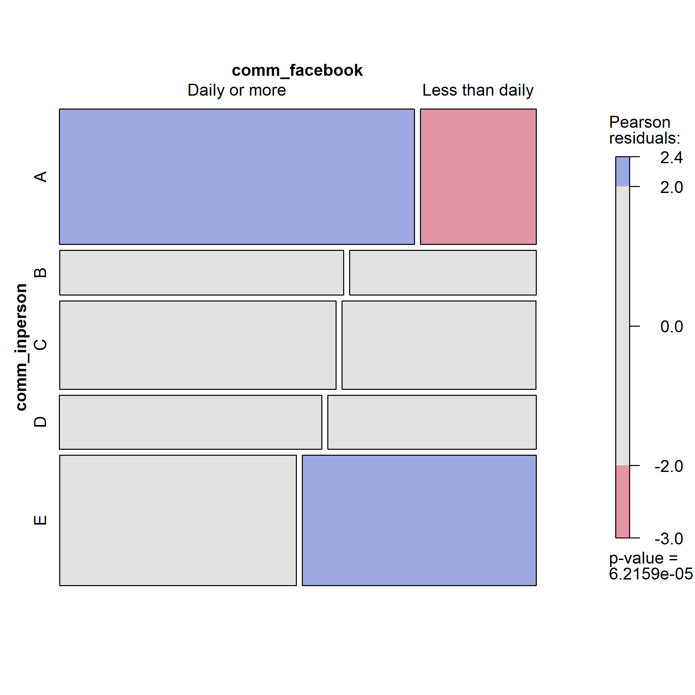

## FMSS items

Closely exam FMSS items 1, 2, 3, and 11

* `fmss_r1` For you, how good is Facebook for getting real help or support?
* `fmss_r2` For the support you get on Facebook, how much practical help is it?
* `fmss_r3` How much does the support you get on Facebook make you feel better?
* `fmss_r11` How close to people does Facebook make you feel?


```
## $table
##        fmss_r1
## indPHQ  Not at all A little Somewhat Very or Extremely Sum
##   FALSE        146      161       88                25 420
##   TRUE          61       55       33                15 164
##   Sum          207      216      121                40 584
## 
## $expected
##        fmss_r1
## indPHQ  Not at all  A little Somewhat Very or Extremely
##   FALSE  148.86986 155.34247 87.02055          28.76712
##   TRUE    58.13014  60.65753 33.97945          11.23288
## 
## $chisq.test
## 
## 	Pearson's Chi-squared test
## 
## data:  T
## X-squared = 2.7267, df = 3, p-value = 0.4357
```

```
## $table
##        fmss_r2
## indPHQ  None A little Some Quite a bit or A lot Sum
##   FALSE  132      160   93                   34 419
##   TRUE    59       58   27                   20 164
##   Sum    191      218  120                   54 583
## 
## $expected
##        fmss_r2
## indPHQ       None  A little     Some Quite a bit or A lot
##   FALSE 137.27101 156.67581 86.24357             38.80961
##   TRUE   53.72899  61.32419 33.75643             15.19039
## 
## $chisq.test
## 
## 	Pearson's Chi-squared test
## 
## data:  T
## X-squared = 4.9707, df = 3, p-value = 0.174
```

```
## $table
##        fmss_r3
## indPHQ  Not at all A little Somewhat Quite a bit or A lot Sum
##   FALSE        132      149       87                   51 419
##   TRUE          58       57       33                   16 164
##   Sum          190      206      120                   67 583
## 
## $expected
##        fmss_r3
## indPHQ  Not at all  A little Somewhat Quite a bit or A lot
##   FALSE  136.55232 148.05146 86.24357             48.15266
##   TRUE    53.44768  57.94854 33.75643             18.84734
## 
## $chisq.test
## 
## 	Pearson's Chi-squared test
## 
## data:  T
## X-squared = 1.1832, df = 3, p-value = 0.757
```

```
## $table
##        fmss_r11
## indPHQ  Not at all A little Somewhat Very or Extremely Sum
##   FALSE         77      192      126                26 421
##   TRUE          49       53       56                 6 164
##   Sum          126      245      182                32 585
## 
## $expected
##        fmss_r11
## indPHQ  Not at all  A little  Somewhat Very or Extremely
##   FALSE   90.67692 176.31624 130.97778          23.02906
##   TRUE    35.32308  68.68376  51.02222           8.97094
## 
## $chisq.test
## 
## 	Pearson's Chi-squared test
## 
## data:  T
## X-squared = 14.377, df = 3, p-value = 0.002434
```

```
## $table
##         fmss_r1
## indDSISS Not at all A little Somewhat Very or Extremely Sum
##    FALSE        157      164       98                33 452
##    TRUE          51       50       23                 7 131
##    Sum          208      214      121                40 583
## 
## $expected
##         fmss_r1
## indDSISS Not at all  A little Somewhat Very or Extremely
##    FALSE  161.26244 165.91424 93.81132         31.012007
##    TRUE    46.73756  48.08576 27.18868          8.987993
## 
## $chisq.test
## 
## 	Pearson's Chi-squared test
## 
## data:  T
## X-squared = 1.9992, df = 3, p-value = 0.5726
```

```
## $table
##         fmss_r2
## indDSISS None A little Some Quite a bit or A lot Sum
##    FALSE  148      159  101                   43 451
##    TRUE    43       58   19                   11 131
##    Sum    191      217  120                   54 582
## 
## $expected
##         fmss_r2
## indDSISS      None  A little     Some Quite a bit or A lot
##    FALSE 148.00859 168.15636 92.98969             41.84536
##    TRUE   42.99141  48.84364 27.01031             12.15464
## 
## $chisq.test
## 
## 	Pearson's Chi-squared test
## 
## data:  T
## X-squared = 5.4222, df = 3, p-value = 0.1434
```

```
## $table
##         fmss_r3
## indDSISS Not at all A little Somewhat Quite a bit or A lot Sum
##    FALSE        146      153       92                   59 450
##    TRUE          44       53       27                    8 132
##    Sum          190      206      119                   67 582
## 
## $expected
##         fmss_r3
## indDSISS Not at all  A little Somewhat Quite a bit or A lot
##    FALSE  146.90722 159.27835 92.01031             51.80412
##    TRUE    43.09278  46.72165 26.98969             15.19588
## 
## $chisq.test
## 
## 	Pearson's Chi-squared test
## 
## data:  T
## X-squared = 5.5229, df = 3, p-value = 0.1373
```

```
## $table
##         fmss_r11
## indDSISS Not at all A little Somewhat Very or Extremely Sum
##    FALSE         94      190      146                22 452
##    TRUE          33       53       36                10 132
##    Sum          127      243      182                32 584
## 
## $expected
##         fmss_r11
## indDSISS Not at all  A little  Somewhat Very or Extremely
##    FALSE   98.29452 188.07534 140.86301         24.767123
##    TRUE    28.70548  54.92466  41.13699          7.232877
## 
## $chisq.test
## 
## 	Pearson's Chi-squared test
## 
## data:  T
## X-squared = 3.1139, df = 3, p-value = 0.3744
```


### PC-PTSD


|model      |term                                              |   oddsratio| std.error| statistic| p.value|
|:----------|:-------------------------------------------------|-----------:|---------:|---------:|-------:|
|Unadjusted |(Intercept)                                       |       0.841|     0.130|    -1.330|   0.183|
|Unadjusted |fmssSubscore                                      |       0.996|     0.031|    -0.120|   0.905|
|Adjusted   |(Intercept)                                       |       0.673|     0.388|    -1.021|   0.307|
|Adjusted   |fmssSubscore                                      |       0.976|     0.035|    -0.698|   0.485|
|Adjusted   |age                                               |       1.006|     0.008|     0.714|   0.475|
|Adjusted   |genderFemale                                      |       0.855|     0.237|    -0.660|   0.509|
|Adjusted   |genderA gender not listed here                    | 1703155.678|   613.544|     0.023|   0.981|
|Adjusted   |raceAmerican Indian/Alaska Native/Native Hawaiian |       1.159|     0.822|     0.180|   0.857|
|Adjusted   |raceAsian                                         |       0.890|     0.754|    -0.154|   0.877|
|Adjusted   |raceBlack or African American                     |       1.723|     0.822|     0.662|   0.508|
|Adjusted   |raceMultiple races                                |       1.288|     0.323|     0.785|   0.433|
|Adjusted   |raceOther                                         |       1.436|     0.589|     0.614|   0.539|
|Adjusted   |hispanicYes                                       |       0.844|     0.413|    -0.410|   0.682|
|Adjusted   |marital2Single/Divorced/Widowed/Separated         |       1.106|     0.197|     0.511|   0.610|
|Adjusted   |countSocialMediaExclFB                            |       1.057|     0.095|     0.585|   0.559|
|Adjusted   |comm_inpersonOnce a week                          |       0.821|     0.315|    -0.626|   0.532|
|Adjusted   |comm_inpersonA few times a week                   |       0.531|     0.265|    -2.386|   0.017|
|Adjusted   |comm_inpersonOnce a day                           |       0.551|     0.338|    -1.766|   0.077|
|Adjusted   |comm_inpersonSeveral times a day                  |       0.408|     0.243|    -3.695|   0.000|
|Adjusted   |indSuicideConsideredEverTRUE                      |       2.072|     0.198|     3.674|   0.000|
|Adjusted   |countSuicideAttempts                              |       1.704|     0.166|     3.212|   0.001|

\newline


|model      | null.deviance| df.null|   logLik|     AIC|     BIC| deviance| df.residual| nobs|
|:----------|-------------:|-------:|--------:|-------:|-------:|--------:|-----------:|----:|
|Unadjusted |       789.437|     572| -394.712| 793.423| 802.125|  789.423|         571|  573|
|Adjusted   |       789.437|     572| -355.970| 749.939| 832.606|  711.939|         554|  573|


```
## Warning: glm.fit: fitted probabilities numerically 0 or 1 occurred

## Warning: glm.fit: fitted probabilities numerically 0 or 1 occurred

## Warning: glm.fit: fitted probabilities numerically 0 or 1 occurred

## Warning: glm.fit: fitted probabilities numerically 0 or 1 occurred

## Warning: glm.fit: fitted probabilities numerically 0 or 1 occurred

## Warning: glm.fit: fitted probabilities numerically 0 or 1 occurred

## Warning: glm.fit: fitted probabilities numerically 0 or 1 occurred

## Warning: glm.fit: fitted probabilities numerically 0 or 1 occurred

## Warning: glm.fit: fitted probabilities numerically 0 or 1 occurred

## Warning: glm.fit: fitted probabilities numerically 0 or 1 occurred

## Warning: glm.fit: fitted probabilities numerically 0 or 1 occurred

## Warning: glm.fit: fitted probabilities numerically 0 or 1 occurred

## Warning: glm.fit: fitted probabilities numerically 0 or 1 occurred

## Warning: glm.fit: fitted probabilities numerically 0 or 1 occurred

## Warning: glm.fit: fitted probabilities numerically 0 or 1 occurred

## Warning: glm.fit: fitted probabilities numerically 0 or 1 occurred

## Warning: glm.fit: fitted probabilities numerically 0 or 1 occurred

## Warning: glm.fit: fitted probabilities numerically 0 or 1 occurred

## Warning: glm.fit: fitted probabilities numerically 0 or 1 occurred

## Warning: glm.fit: fitted probabilities numerically 0 or 1 occurred

## Warning: glm.fit: fitted probabilities numerically 0 or 1 occurred

## Warning: glm.fit: fitted probabilities numerically 0 or 1 occurred

## Warning: glm.fit: fitted probabilities numerically 0 or 1 occurred

## Warning: glm.fit: fitted probabilities numerically 0 or 1 occurred

## Warning: glm.fit: fitted probabilities numerically 0 or 1 occurred

## Warning: glm.fit: fitted probabilities numerically 0 or 1 occurred

## Warning: glm.fit: fitted probabilities numerically 0 or 1 occurred

## Warning: glm.fit: fitted probabilities numerically 0 or 1 occurred

## Warning: glm.fit: fitted probabilities numerically 0 or 1 occurred

## Warning: glm.fit: fitted probabilities numerically 0 or 1 occurred

## Warning: glm.fit: fitted probabilities numerically 0 or 1 occurred

## Warning: glm.fit: fitted probabilities numerically 0 or 1 occurred

## Warning: glm.fit: fitted probabilities numerically 0 or 1 occurred

## Warning: glm.fit: fitted probabilities numerically 0 or 1 occurred

## Warning: glm.fit: fitted probabilities numerically 0 or 1 occurred

## Warning: glm.fit: fitted probabilities numerically 0 or 1 occurred

## Warning: glm.fit: fitted probabilities numerically 0 or 1 occurred

## Warning: glm.fit: fitted probabilities numerically 0 or 1 occurred

## Warning: glm.fit: fitted probabilities numerically 0 or 1 occurred

## Warning: glm.fit: fitted probabilities numerically 0 or 1 occurred

## Warning: glm.fit: fitted probabilities numerically 0 or 1 occurred
```

For a 5-point increase in FMSS subscore (the IQR), the adjusted odds ratio is 0.886
(95% CI: 0.630, 1.242).


### PHQ-2


|model      |term                                              | oddsratio| std.error| statistic| p.value|
|:----------|:-------------------------------------------------|---------:|---------:|---------:|-------:|
|Unadjusted |(Intercept)                                       |     0.391|     0.145|    -6.497|   0.000|
|Unadjusted |fmssSubscore                                      |     0.996|     0.035|    -0.102|   0.919|
|Adjusted   |(Intercept)                                       |     0.619|     0.437|    -1.099|   0.272|
|Adjusted   |fmssSubscore                                      |     0.991|     0.039|    -0.234|   0.815|
|Adjusted   |age                                               |     0.988|     0.009|    -1.316|   0.188|
|Adjusted   |genderFemale                                      |     0.744|     0.267|    -1.106|   0.269|
|Adjusted   |genderA gender not listed here                    |     1.162|     1.487|     0.101|   0.919|
|Adjusted   |raceAmerican Indian/Alaska Native/Native Hawaiian |     0.290|     1.131|    -1.094|   0.274|
|Adjusted   |raceAsian                                         |     0.653|     0.865|    -0.492|   0.623|
|Adjusted   |raceBlack or African American                     |     1.188|     0.932|     0.185|   0.853|
|Adjusted   |raceMultiple races                                |     0.996|     0.347|    -0.010|   0.992|
|Adjusted   |raceOther                                         |     2.007|     0.594|     1.173|   0.241|
|Adjusted   |hispanicYes                                       |     0.659|     0.498|    -0.837|   0.402|
|Adjusted   |marital2Single/Divorced/Widowed/Separated         |     1.069|     0.218|     0.304|   0.761|
|Adjusted   |countSocialMediaExclFB                            |     0.913|     0.108|    -0.847|   0.397|
|Adjusted   |comm_inpersonOnce a week                          |     0.791|     0.320|    -0.733|   0.464|
|Adjusted   |comm_inpersonA few times a week                   |     0.339|     0.308|    -3.514|   0.000|
|Adjusted   |comm_inpersonOnce a day                           |     0.431|     0.408|    -2.064|   0.039|
|Adjusted   |comm_inpersonSeveral times a day                  |     0.411|     0.270|    -3.295|   0.001|
|Adjusted   |indSuicideConsideredEverTRUE                      |     3.367|     0.224|     5.427|   0.000|
|Adjusted   |countSuicideAttempts                              |     1.210|     0.130|     1.471|   0.141|

\newline


|model      | null.deviance| df.null|   logLik|     AIC|     BIC| deviance| df.residual| nobs|
|:----------|-------------:|-------:|--------:|-------:|-------:|--------:|-----------:|----:|
|Unadjusted |       679.346|     573| -339.668| 683.335| 692.041|  679.335|         572|  574|
|Adjusted   |       679.346|     573| -297.961| 633.923| 716.623|  595.923|         555|  574|


For a 5-point increase in FMSS subscore (the IQR), the adjusted odds ratio is 0.956
(95% CI: 0.653, 1.393).


### AUDIT-C


|model      |term                                              | oddsratio| std.error| statistic| p.value|
|:----------|:-------------------------------------------------|---------:|---------:|---------:|-------:|
|Unadjusted |(Intercept)                                       |     0.793|     0.131|    -1.767|   0.077|
|Unadjusted |fmssSubscore                                      |     0.971|     0.032|    -0.924|   0.355|
|Adjusted   |(Intercept)                                       |     2.566|     0.395|     2.386|   0.017|
|Adjusted   |fmssSubscore                                      |     0.956|     0.034|    -1.318|   0.187|
|Adjusted   |age                                               |     0.967|     0.008|    -4.128|   0.000|
|Adjusted   |genderFemale                                      |     0.684|     0.241|    -1.574|   0.115|
|Adjusted   |raceAmerican Indian/Alaska Native/Native Hawaiian |     9.418|     1.103|     2.034|   0.042|
|Adjusted   |raceAsian                                         |     0.143|     1.114|    -1.744|   0.081|
|Adjusted   |raceBlack or African American                     |     1.254|     0.811|     0.279|   0.780|
|Adjusted   |raceMultiple races                                |     0.954|     0.314|    -0.150|   0.880|
|Adjusted   |raceOther                                         |     0.274|     0.696|    -1.858|   0.063|
|Adjusted   |hispanicYes                                       |     0.953|     0.409|    -0.117|   0.907|
|Adjusted   |marital2Single/Divorced/Widowed/Separated         |     1.792|     0.195|     2.988|   0.003|
|Adjusted   |countSocialMediaExclFB                            |     1.114|     0.094|     1.148|   0.251|
|Adjusted   |comm_inpersonOnce a week                          |     1.198|     0.310|     0.581|   0.561|
|Adjusted   |comm_inpersonA few times a week                   |     0.757|     0.264|    -1.059|   0.290|
|Adjusted   |comm_inpersonOnce a day                           |     0.858|     0.345|    -0.444|   0.657|
|Adjusted   |comm_inpersonSeveral times a day                  |     0.891|     0.240|    -0.480|   0.631|
|Adjusted   |indSuicideConsideredEverTRUE                      |     1.411|     0.200|     1.716|   0.086|
|Adjusted   |countSuicideAttempts                              |     0.820|     0.132|    -1.505|   0.132|

\newline


|model      | null.deviance| df.null|   logLik|     AIC|     BIC| deviance| df.residual| nobs|
|:----------|-------------:|-------:|--------:|-------:|-------:|--------:|-----------:|----:|
|Unadjusted |       778.099|     571| -388.621| 781.241| 789.940|  777.241|         570|  572|
|Adjusted   |       778.099|     571| -360.216| 756.431| 834.716|  720.431|         554|  572|


For a 5-point increase in FMSS subscore (the IQR), the adjusted odds ratio is 0.799
(95% CI: 0.570, 1.114).


### DSI-SS


|model      |term                                              | oddsratio| std.error| statistic| p.value|
|:----------|:-------------------------------------------------|---------:|---------:|---------:|-------:|
|Unadjusted |(Intercept)                                       |     0.340|     0.152|    -7.106|   0.000|
|Unadjusted |fmssSubscore                                      |     0.950|     0.038|    -1.350|   0.177|
|Adjusted   |(Intercept)                                       |     0.369|     0.503|    -1.984|   0.047|
|Adjusted   |fmssSubscore                                      |     0.916|     0.044|    -1.965|   0.049|
|Adjusted   |age                                               |     0.976|     0.011|    -2.311|   0.021|
|Adjusted   |genderFemale                                      |     0.666|     0.302|    -1.344|   0.179|
|Adjusted   |genderA gender not listed here                    |     1.338|     1.490|     0.196|   0.845|
|Adjusted   |raceAmerican Indian/Alaska Native/Native Hawaiian |     0.000|   815.917|    -0.019|   0.985|
|Adjusted   |raceAsian                                         |     0.761|     0.900|    -0.304|   0.761|
|Adjusted   |raceBlack or African American                     |     1.364|     0.972|     0.319|   0.750|
|Adjusted   |raceMultiple races                                |     1.335|     0.359|     0.806|   0.420|
|Adjusted   |raceOther                                         |     0.871|     0.679|    -0.204|   0.838|
|Adjusted   |hispanicYes                                       |     1.291|     0.501|     0.509|   0.610|
|Adjusted   |marital2Single/Divorced/Widowed/Separated         |     1.427|     0.241|     1.477|   0.140|
|Adjusted   |countSocialMediaExclFB                            |     0.985|     0.115|    -0.131|   0.896|
|Adjusted   |comm_inpersonOnce a week                          |     0.722|     0.360|    -0.907|   0.365|
|Adjusted   |comm_inpersonA few times a week                   |     0.638|     0.329|    -1.369|   0.171|
|Adjusted   |comm_inpersonOnce a day                           |     0.624|     0.465|    -1.013|   0.311|
|Adjusted   |comm_inpersonSeveral times a day                  |     0.719|     0.307|    -1.077|   0.281|
|Adjusted   |indSuicideConsideredEverTRUE                      |     6.313|     0.262|     7.040|   0.000|
|Adjusted   |countSuicideAttempts                              |     1.319|     0.132|     2.092|   0.036|

\newline


|model      | null.deviance| df.null|   logLik|     AIC|     BIC| deviance| df.residual| nobs|
|:----------|-------------:|-------:|--------:|-------:|-------:|--------:|-----------:|----:|
|Unadjusted |       611.701|     573| -304.922| 613.844| 622.549|  609.844|         572|  574|
|Adjusted   |       611.701|     573| -248.169| 534.337| 617.037|  496.337|         555|  574|


```
## Warning: glm.fit: fitted probabilities numerically 0 or 1 occurred

## Warning: glm.fit: fitted probabilities numerically 0 or 1 occurred

## Warning: glm.fit: fitted probabilities numerically 0 or 1 occurred

## Warning: glm.fit: fitted probabilities numerically 0 or 1 occurred

## Warning: glm.fit: fitted probabilities numerically 0 or 1 occurred

## Warning: glm.fit: fitted probabilities numerically 0 or 1 occurred

## Warning: glm.fit: fitted probabilities numerically 0 or 1 occurred

## Warning: glm.fit: fitted probabilities numerically 0 or 1 occurred

## Warning: glm.fit: fitted probabilities numerically 0 or 1 occurred

## Warning: glm.fit: fitted probabilities numerically 0 or 1 occurred

## Warning: glm.fit: fitted probabilities numerically 0 or 1 occurred

## Warning: glm.fit: fitted probabilities numerically 0 or 1 occurred

## Warning: glm.fit: fitted probabilities numerically 0 or 1 occurred

## Warning: glm.fit: fitted probabilities numerically 0 or 1 occurred

## Warning: glm.fit: fitted probabilities numerically 0 or 1 occurred

## Warning: glm.fit: fitted probabilities numerically 0 or 1 occurred

## Warning: glm.fit: fitted probabilities numerically 0 or 1 occurred

## Warning: glm.fit: fitted probabilities numerically 0 or 1 occurred

## Warning: glm.fit: fitted probabilities numerically 0 or 1 occurred

## Warning: glm.fit: fitted probabilities numerically 0 or 1 occurred

## Warning: glm.fit: fitted probabilities numerically 0 or 1 occurred

## Warning: glm.fit: fitted probabilities numerically 0 or 1 occurred

## Warning: glm.fit: fitted probabilities numerically 0 or 1 occurred

## Warning: glm.fit: fitted probabilities numerically 0 or 1 occurred

## Warning: glm.fit: fitted probabilities numerically 0 or 1 occurred

## Warning: glm.fit: fitted probabilities numerically 0 or 1 occurred

## Warning: glm.fit: fitted probabilities numerically 0 or 1 occurred

## Warning: glm.fit: fitted probabilities numerically 0 or 1 occurred

## Warning: glm.fit: fitted probabilities numerically 0 or 1 occurred

## Warning: glm.fit: fitted probabilities numerically 0 or 1 occurred

## Warning: glm.fit: fitted probabilities numerically 0 or 1 occurred

## Warning: glm.fit: fitted probabilities numerically 0 or 1 occurred

## Warning: glm.fit: fitted probabilities numerically 0 or 1 occurred

## Warning: glm.fit: fitted probabilities numerically 0 or 1 occurred

## Warning: glm.fit: fitted probabilities numerically 0 or 1 occurred

## Warning: glm.fit: fitted probabilities numerically 0 or 1 occurred

## Warning: glm.fit: fitted probabilities numerically 0 or 1 occurred

## Warning: glm.fit: fitted probabilities numerically 0 or 1 occurred

## Warning: glm.fit: fitted probabilities numerically 0 or 1 occurred

## Warning: glm.fit: fitted probabilities numerically 0 or 1 occurred

## Warning: glm.fit: fitted probabilities numerically 0 or 1 occurred

## Warning: glm.fit: fitted probabilities numerically 0 or 1 occurred

## Warning: glm.fit: fitted probabilities numerically 0 or 1 occurred

## Warning: glm.fit: fitted probabilities numerically 0 or 1 occurred

## Warning: glm.fit: fitted probabilities numerically 0 or 1 occurred

## Warning: glm.fit: fitted probabilities numerically 0 or 1 occurred

## Warning: glm.fit: fitted probabilities numerically 0 or 1 occurred

## Warning: glm.fit: fitted probabilities numerically 0 or 1 occurred

## Warning: glm.fit: fitted probabilities numerically 0 or 1 occurred

## Warning: glm.fit: fitted probabilities numerically 0 or 1 occurred

## Warning: glm.fit: fitted probabilities numerically 0 or 1 occurred

## Warning: glm.fit: fitted probabilities numerically 0 or 1 occurred

## Warning: glm.fit: fitted probabilities numerically 0 or 1 occurred

## Warning: glm.fit: fitted probabilities numerically 0 or 1 occurred

## Warning: glm.fit: fitted probabilities numerically 0 or 1 occurred

## Warning: glm.fit: fitted probabilities numerically 0 or 1 occurred

## Warning: glm.fit: fitted probabilities numerically 0 or 1 occurred

## Warning: glm.fit: fitted probabilities numerically 0 or 1 occurred

## Warning: glm.fit: fitted probabilities numerically 0 or 1 occurred

## Warning: glm.fit: fitted probabilities numerically 0 or 1 occurred

## Warning: glm.fit: fitted probabilities numerically 0 or 1 occurred

## Warning: glm.fit: fitted probabilities numerically 0 or 1 occurred

## Warning: glm.fit: fitted probabilities numerically 0 or 1 occurred

## Warning: glm.fit: fitted probabilities numerically 0 or 1 occurred

## Warning: glm.fit: fitted probabilities numerically 0 or 1 occurred

## Warning: glm.fit: fitted probabilities numerically 0 or 1 occurred

## Warning: glm.fit: fitted probabilities numerically 0 or 1 occurred

## Warning: glm.fit: fitted probabilities numerically 0 or 1 occurred

## Warning: glm.fit: fitted probabilities numerically 0 or 1 occurred

## Warning: glm.fit: fitted probabilities numerically 0 or 1 occurred

## Warning: glm.fit: fitted probabilities numerically 0 or 1 occurred

## Warning: glm.fit: fitted probabilities numerically 0 or 1 occurred

## Warning: glm.fit: fitted probabilities numerically 0 or 1 occurred

## Warning: glm.fit: fitted probabilities numerically 0 or 1 occurred

## Warning: glm.fit: fitted probabilities numerically 0 or 1 occurred

## Warning: glm.fit: fitted probabilities numerically 0 or 1 occurred

## Warning: glm.fit: fitted probabilities numerically 0 or 1 occurred

## Warning: glm.fit: fitted probabilities numerically 0 or 1 occurred

## Warning: glm.fit: fitted probabilities numerically 0 or 1 occurred

## Warning: glm.fit: fitted probabilities numerically 0 or 1 occurred

## Warning: glm.fit: fitted probabilities numerically 0 or 1 occurred

## Warning: glm.fit: fitted probabilities numerically 0 or 1 occurred

## Warning: glm.fit: fitted probabilities numerically 0 or 1 occurred

## Warning: glm.fit: fitted probabilities numerically 0 or 1 occurred

## Warning: glm.fit: fitted probabilities numerically 0 or 1 occurred

## Warning: glm.fit: fitted probabilities numerically 0 or 1 occurred

## Warning: glm.fit: fitted probabilities numerically 0 or 1 occurred

## Warning: glm.fit: fitted probabilities numerically 0 or 1 occurred

## Warning: glm.fit: fitted probabilities numerically 0 or 1 occurred

## Warning: glm.fit: fitted probabilities numerically 0 or 1 occurred

## Warning: glm.fit: fitted probabilities numerically 0 or 1 occurred

## Warning: glm.fit: fitted probabilities numerically 0 or 1 occurred

## Warning: glm.fit: fitted probabilities numerically 0 or 1 occurred

## Warning: glm.fit: fitted probabilities numerically 0 or 1 occurred

## Warning: glm.fit: fitted probabilities numerically 0 or 1 occurred

## Warning: glm.fit: fitted probabilities numerically 0 or 1 occurred

## Warning: glm.fit: fitted probabilities numerically 0 or 1 occurred

## Warning: glm.fit: fitted probabilities numerically 0 or 1 occurred

## Warning: glm.fit: fitted probabilities numerically 0 or 1 occurred

## Warning: glm.fit: fitted probabilities numerically 0 or 1 occurred

## Warning: glm.fit: fitted probabilities numerically 0 or 1 occurred

## Warning: glm.fit: fitted probabilities numerically 0 or 1 occurred

## Warning: glm.fit: fitted probabilities numerically 0 or 1 occurred

## Warning: glm.fit: fitted probabilities numerically 0 or 1 occurred

## Warning: glm.fit: fitted probabilities numerically 0 or 1 occurred
```

For a 5-point increase in FMSS subscore (the IQR), the adjusted odds ratio is 0.647
(95% CI: 0.415, 0.992).


## FMSS quartiles

Stratify by FMSS quartile and compare Q1 vs Q4.


```
## $table
##        fmssQuartile
## indPHQ  Q1: [14,25] Q4: (34,48] Sum
##   FALSE         111          94 205
##   TRUE           63          30  93
##   Sum           174         124 298
## 
## $expected
##        fmssQuartile
## indPHQ  Q1: [14,25] Q4: (34,48]
##   FALSE   119.69799    85.30201
##   TRUE     54.30201    38.69799
## 
## $chisq.test
## 
## 	Pearson's Chi-squared test with Yates' continuity correction
## 
## data:  T
## X-squared = 4.3237, df = 1, p-value = 0.03759
```

```
## $table
##         fmssQuartile
## indDSISS Q1: [14,25] Q4: (34,48] Sum
##    FALSE         127         104 231
##    TRUE           47          20  67
##    Sum           174         124 298
## 
## $expected
##         fmssQuartile
## indDSISS Q1: [14,25] Q4: (34,48]
##    FALSE   134.87919    96.12081
##    TRUE     39.12081    27.87919
## 
## $chisq.test
## 
## 	Pearson's Chi-squared test with Yates' continuity correction
## 
## data:  T
## X-squared = 4.3153, df = 1, p-value = 0.03777
```


### PC-PTSD


|model      |term                                              |   oddsratio| std.error| statistic| p.value|
|:----------|:-------------------------------------------------|-----------:|---------:|---------:|-------:|
|Unadjusted |(Intercept)                                       |       1.320|     0.153|     1.814|   0.070|
|Unadjusted |fmssQuartileQ4: (34,48]                           |       0.584|     0.237|    -2.265|   0.024|
|Adjusted   |(Intercept)                                       |       0.573|     0.539|    -1.032|   0.302|
|Adjusted   |fmssQuartileQ4: (34,48]                           |       0.615|     0.271|    -1.799|   0.072|
|Adjusted   |age                                               |       1.014|     0.011|     1.306|   0.192|
|Adjusted   |genderFemale                                      |       0.765|     0.344|    -0.778|   0.437|
|Adjusted   |raceAmerican Indian/Alaska Native/Native Hawaiian |       1.031|     1.291|     0.024|   0.981|
|Adjusted   |raceAsian                                         |       0.776|     0.898|    -0.283|   0.777|
|Adjusted   |raceBlack or African American                     | 3893059.682|   623.358|     0.024|   0.981|
|Adjusted   |raceMultiple races                                |       1.398|     0.440|     0.762|   0.446|
|Adjusted   |raceOther                                         |       5.370|     1.181|     1.424|   0.155|
|Adjusted   |hispanicYes                                       |       0.757|     0.571|    -0.488|   0.625|
|Adjusted   |marital2Single/Divorced/Widowed/Separated         |       1.263|     0.288|     0.810|   0.418|
|Adjusted   |countSocialMediaExclFB                            |       1.169|     0.136|     1.147|   0.251|
|Adjusted   |comm_inpersonOnce a week                          |       0.750|     0.450|    -0.638|   0.523|
|Adjusted   |comm_inpersonA few times a week                   |       0.509|     0.377|    -1.790|   0.073|
|Adjusted   |comm_inpersonOnce a day                           |       0.560|     0.489|    -1.186|   0.235|
|Adjusted   |comm_inpersonSeveral times a day                  |       0.429|     0.339|    -2.498|   0.012|
|Adjusted   |indSuicideConsideredEverTRUE                      |       2.088|     0.282|     2.616|   0.009|
|Adjusted   |countSuicideAttempts                              |       1.551|     0.203|     2.165|   0.030|

\newline


|model      | null.deviance| df.null|   logLik|     AIC|     BIC| deviance| df.residual| nobs|
|:----------|-------------:|-------:|--------:|-------:|-------:|--------:|-----------:|----:|
|Unadjusted |       412.901|     297| -203.862| 411.725| 419.119|  407.725|         296|  298|
|Adjusted   |       404.784|     291| -177.773| 391.545| 457.727|  355.545|         274|  292|


### PHQ-2


|model      |term                                              | oddsratio| std.error| statistic| p.value|
|:----------|:-------------------------------------------------|---------:|---------:|---------:|-------:|
|Unadjusted |(Intercept)                                       |     0.555|     0.160|    -3.693|   0.000|
|Unadjusted |fmssQuartileQ2: (25,29]                           |     0.688|     0.251|    -1.493|   0.135|
|Unadjusted |fmssQuartileQ3: (29,34]                           |     0.480|     0.263|    -2.793|   0.005|
|Unadjusted |fmssQuartileQ4: (34,48]                           |     0.568|     0.266|    -2.122|   0.034|
|Adjusted   |(Intercept)                                       |     0.914|     0.459|    -0.197|   0.844|
|Adjusted   |fmssQuartileQ2: (25,29]                           |     0.684|     0.279|    -1.364|   0.172|
|Adjusted   |fmssQuartileQ3: (29,34]                           |     0.543|     0.288|    -2.120|   0.034|
|Adjusted   |fmssQuartileQ4: (34,48]                           |     0.638|     0.294|    -1.530|   0.126|
|Adjusted   |age                                               |     0.984|     0.009|    -1.683|   0.092|
|Adjusted   |genderFemale                                      |     0.802|     0.268|    -0.823|   0.410|
|Adjusted   |genderA gender not listed here                    |     1.358|     1.526|     0.200|   0.841|
|Adjusted   |raceAmerican Indian/Alaska Native/Native Hawaiian |     0.336|     1.131|    -0.965|   0.334|
|Adjusted   |raceAsian                                         |     0.569|     0.865|    -0.651|   0.515|
|Adjusted   |raceBlack or African American                     |     1.254|     0.925|     0.245|   0.807|
|Adjusted   |raceMultiple races                                |     0.950|     0.349|    -0.147|   0.883|
|Adjusted   |raceOther                                         |     2.144|     0.620|     1.229|   0.219|
|Adjusted   |hispanicYes                                       |     0.616|     0.506|    -0.958|   0.338|
|Adjusted   |marital2Single/Divorced/Widowed/Separated         |     1.166|     0.224|     0.684|   0.494|
|Adjusted   |countSocialMediaExclFB                            |     0.942|     0.108|    -0.550|   0.582|
|Adjusted   |comm_inpersonOnce a week                          |     0.710|     0.329|    -1.043|   0.297|
|Adjusted   |comm_inpersonA few times a week                   |     0.339|     0.310|    -3.486|   0.000|
|Adjusted   |comm_inpersonOnce a day                           |     0.448|     0.413|    -1.948|   0.051|
|Adjusted   |comm_inpersonSeveral times a day                  |     0.438|     0.275|    -3.002|   0.003|
|Adjusted   |indSuicideConsideredEverTRUE                      |     3.169|     0.228|     5.066|   0.000|
|Adjusted   |countSuicideAttempts                              |     1.196|     0.130|     1.376|   0.169|

\newline


|model      | null.deviance| df.null|   logLik|     AIC|     BIC| deviance| df.residual| nobs|
|:----------|-------------:|-------:|--------:|-------:|-------:|--------:|-----------:|----:|
|Unadjusted |       665.192|     563| -327.955| 663.910| 681.250|  655.910|         560|  564|
|Adjusted   |       665.192|     563| -290.279| 622.558| 713.595|  580.558|         543|  564|


### AUDIT-C


|model      |term                                              | oddsratio| std.error| statistic| p.value|
|:----------|:-------------------------------------------------|---------:|---------:|---------:|-------:|
|Unadjusted |(Intercept)                                       |     0.607|     0.157|    -3.170|   0.002|
|Unadjusted |fmssQuartileQ2: (25,29]                           |     1.503|     0.235|     1.736|   0.083|
|Unadjusted |fmssQuartileQ3: (29,34]                           |     1.530|     0.232|     1.831|   0.067|
|Unadjusted |fmssQuartileQ4: (34,48]                           |     0.783|     0.250|    -0.978|   0.328|
|Adjusted   |(Intercept)                                       |     1.951|     0.415|     1.612|   0.107|
|Adjusted   |fmssQuartileQ2: (25,29]                           |     1.408|     0.252|     1.356|   0.175|
|Adjusted   |fmssQuartileQ3: (29,34]                           |     1.381|     0.250|     1.295|   0.195|
|Adjusted   |fmssQuartileQ4: (34,48]                           |     0.723|     0.268|    -1.211|   0.226|
|Adjusted   |age                                               |     0.968|     0.008|    -3.847|   0.000|
|Adjusted   |genderFemale                                      |     0.709|     0.244|    -1.407|   0.160|
|Adjusted   |raceAmerican Indian/Alaska Native/Native Hawaiian |     9.261|     1.107|     2.010|   0.044|
|Adjusted   |raceAsian                                         |     0.163|     1.112|    -1.630|   0.103|
|Adjusted   |raceBlack or African American                     |     1.064|     0.819|     0.076|   0.940|
|Adjusted   |raceMultiple races                                |     0.961|     0.317|    -0.126|   0.900|
|Adjusted   |raceOther                                         |     0.171|     0.830|    -2.127|   0.033|
|Adjusted   |hispanicYes                                       |     1.096|     0.416|     0.221|   0.825|
|Adjusted   |marital2Single/Divorced/Widowed/Separated         |     1.632|     0.199|     2.455|   0.014|
|Adjusted   |countSocialMediaExclFB                            |     1.110|     0.095|     1.091|   0.275|
|Adjusted   |comm_inpersonOnce a week                          |     1.164|     0.315|     0.482|   0.630|
|Adjusted   |comm_inpersonA few times a week                   |     0.768|     0.267|    -0.992|   0.321|
|Adjusted   |comm_inpersonOnce a day                           |     0.840|     0.351|    -0.497|   0.619|
|Adjusted   |comm_inpersonSeveral times a day                  |     0.809|     0.246|    -0.861|   0.389|
|Adjusted   |indSuicideConsideredEverTRUE                      |     1.411|     0.205|     1.683|   0.092|
|Adjusted   |countSuicideAttempts                              |     0.831|     0.134|    -1.388|   0.165|

\newline


|model      | null.deviance| df.null|   logLik|     AIC|     BIC| deviance| df.residual| nobs|
|:----------|-------------:|-------:|--------:|-------:|-------:|--------:|-----------:|----:|
|Unadjusted |       762.618|     561| -376.331| 760.662| 777.988|  752.662|         558|  562|
|Adjusted   |       762.618|     561| -350.161| 740.323| 826.953|  700.323|         542|  562|


### DSI-SS


|model      |term                                              | oddsratio| std.error| statistic| p.value|
|:----------|:-------------------------------------------------|---------:|---------:|---------:|-------:|
|Unadjusted |(Intercept)                                       |     0.370|     0.171|    -5.822|   0.000|
|Unadjusted |fmssQuartileQ4: (34,48]                           |     0.520|     0.298|    -2.197|   0.028|
|Adjusted   |(Intercept)                                       |     0.209|     0.710|    -2.201|   0.028|
|Adjusted   |fmssQuartileQ4: (34,48]                           |     0.580|     0.355|    -1.534|   0.125|
|Adjusted   |age                                               |     0.989|     0.014|    -0.800|   0.424|
|Adjusted   |genderFemale                                      |     0.542|     0.455|    -1.349|   0.177|
|Adjusted   |raceAmerican Indian/Alaska Native/Native Hawaiian |     0.000|  1376.306|    -0.011|   0.991|
|Adjusted   |raceAsian                                         |     0.599|     1.204|    -0.426|   0.670|
|Adjusted   |raceBlack or African American                     |     0.000|  1563.062|    -0.010|   0.992|
|Adjusted   |raceMultiple races                                |     1.228|     0.490|     0.420|   0.675|
|Adjusted   |raceOther                                         |     1.813|     0.913|     0.652|   0.515|
|Adjusted   |hispanicYes                                       |     1.742|     0.662|     0.838|   0.402|
|Adjusted   |marital2Single/Divorced/Widowed/Separated         |     1.155|     0.348|     0.415|   0.678|
|Adjusted   |countSocialMediaExclFB                            |     0.972|     0.168|    -0.168|   0.866|
|Adjusted   |comm_inpersonOnce a week                          |     0.669|     0.497|    -0.808|   0.419|
|Adjusted   |comm_inpersonA few times a week                   |     0.530|     0.462|    -1.375|   0.169|
|Adjusted   |comm_inpersonOnce a day                           |     0.797|     0.638|    -0.356|   0.722|
|Adjusted   |comm_inpersonSeveral times a day                  |     0.433|     0.453|    -1.848|   0.065|
|Adjusted   |indSuicideConsideredEverTRUE                      |     8.577|     0.397|     5.416|   0.000|
|Adjusted   |countSuicideAttempts                              |     1.182|     0.166|     1.007|   0.314|

\newline


|model      | null.deviance| df.null|   logLik|     AIC|     BIC| deviance| df.residual| nobs|
|:----------|-------------:|-------:|--------:|-------:|-------:|--------:|-----------:|----:|
|Unadjusted |       317.642|     297| -156.291| 316.581| 323.975|  312.581|         296|  298|
|Adjusted   |       310.129|     292| -121.940| 279.881| 346.124|  243.881|         275|  293|
# Research Question 2

**Are certains features of social media use are associated with positive screens for psychiatric disorders or a positive screen for suicidality?**

* Spending more time on Facebook?
  * Frequency of Facebook use: `fb_freq`
  * Active use of Facebook: `comm_facebook`
* Sharing more personal or health-related information on social media?
  * Get emotional support from others `sm_emot_support`
  * Get information about health or medical topics `sm_med_info`
  * Get advice about health or medical topics `sm_med_advice`
  * Ask questions about health or medical issues `sm_med_questions`
  * Share symptoms such as mood swings, depression, anxiety, or sleep problems `sm_share_sympt`
  * Share information related to your health `sm_share_health`
  * Share thoughts about suicide or hurting yourself in some way `sm_share_suicide`
  
  
## Association between frequency of Facebook use and active use of Facebook

Correlation (Spearman) between frequency of Facebook use and active use of Facebook is
0.457


## Unadjusted comparisons


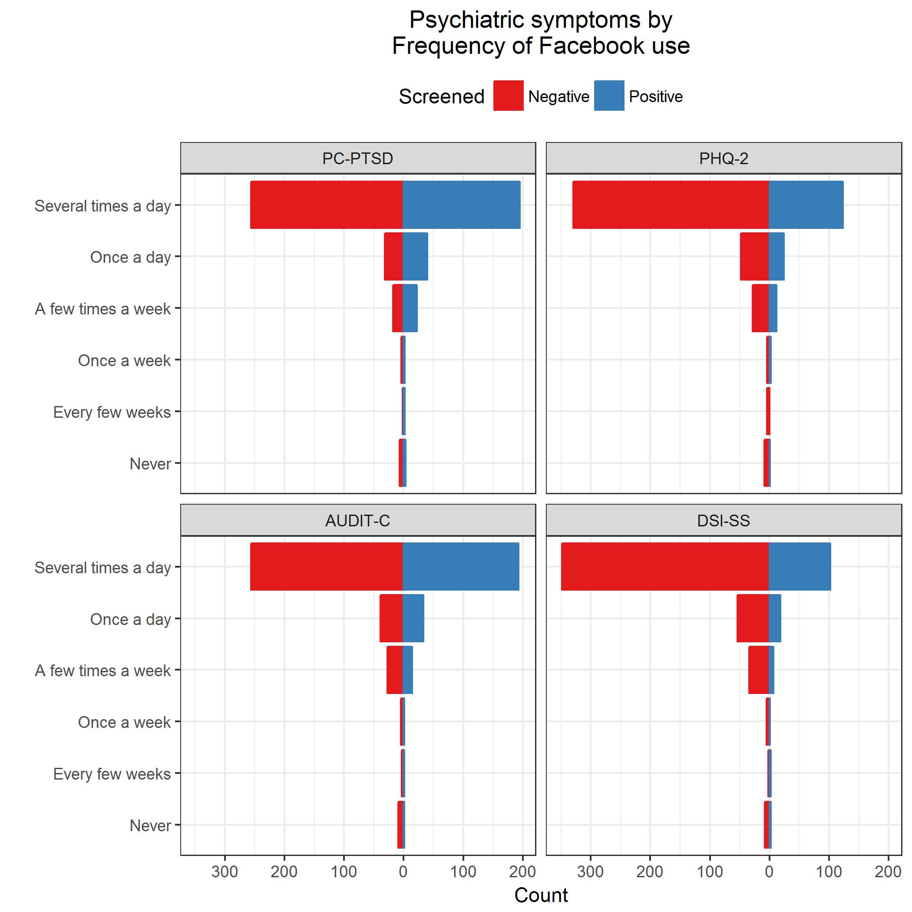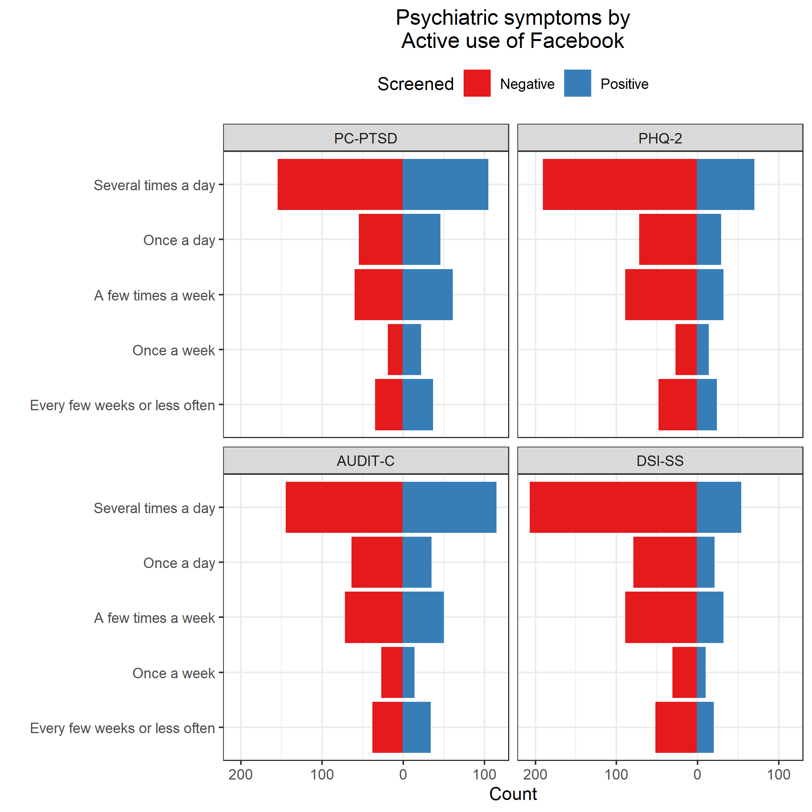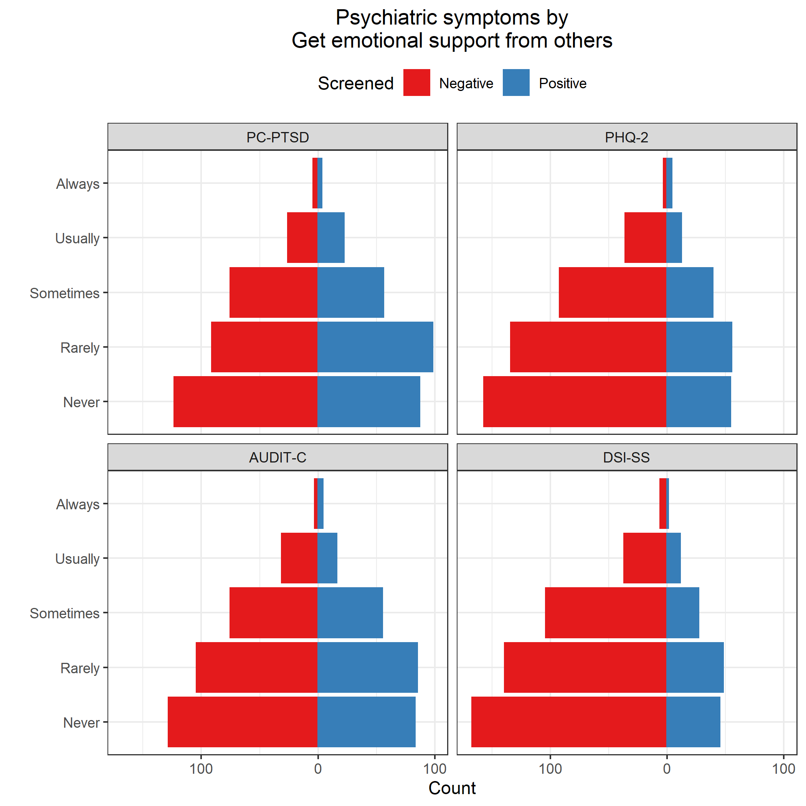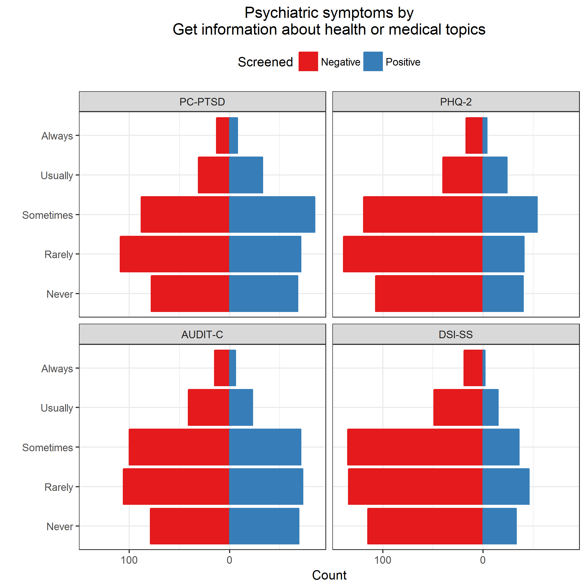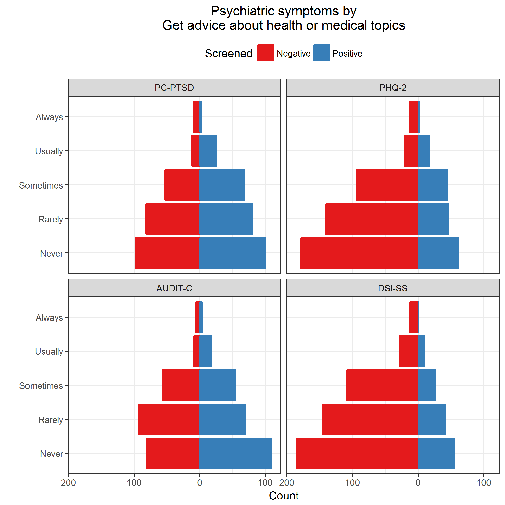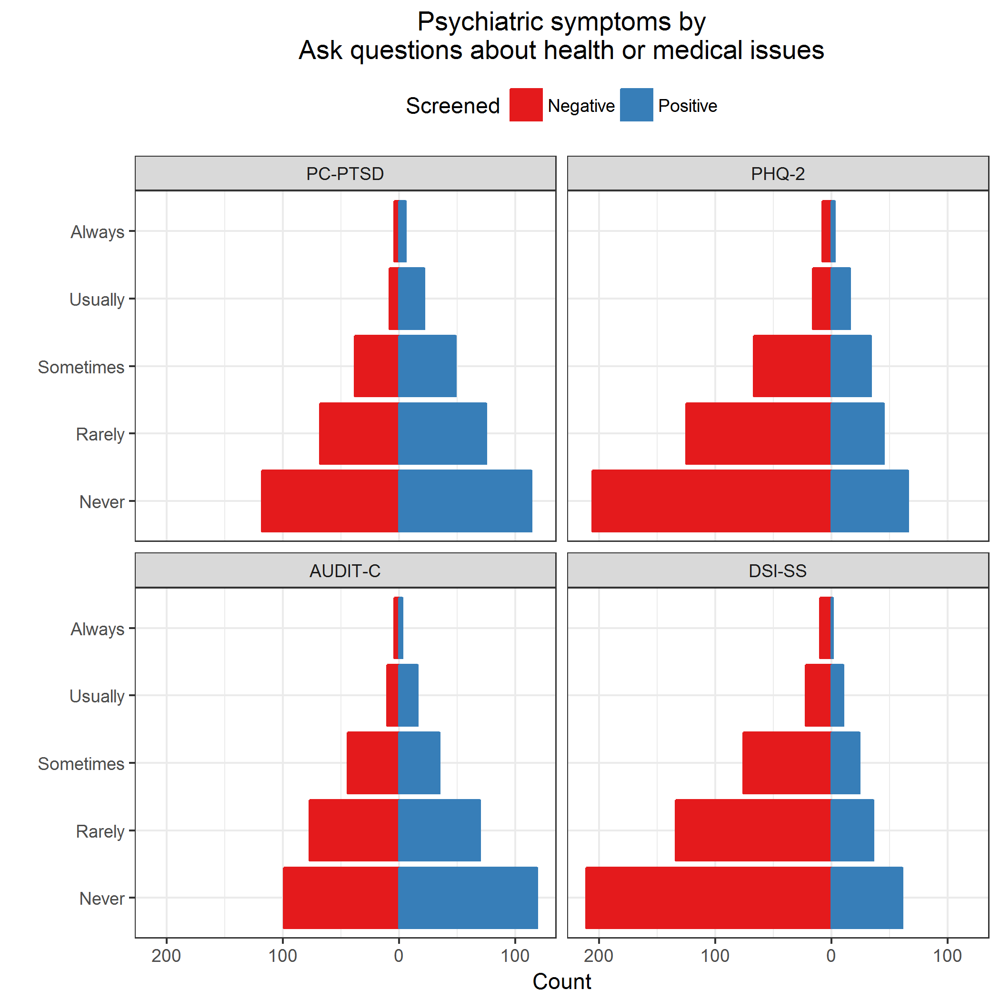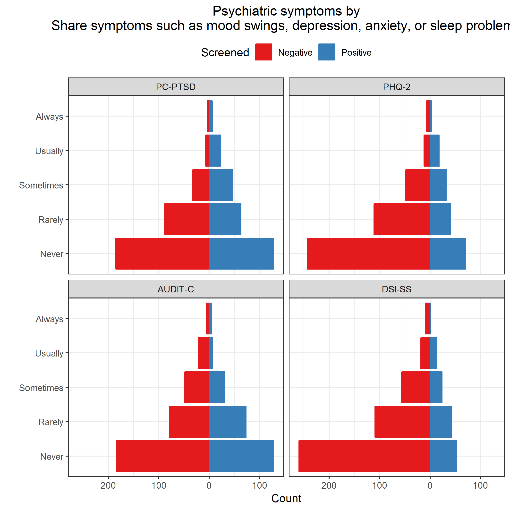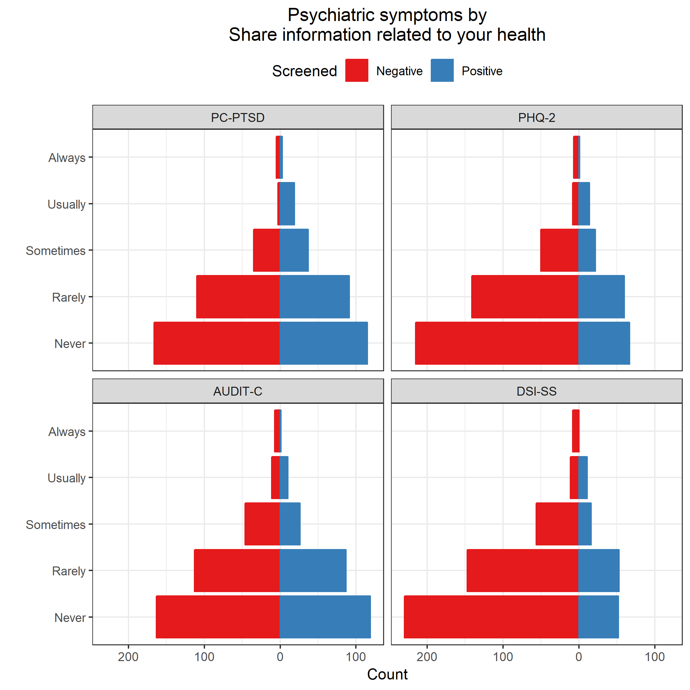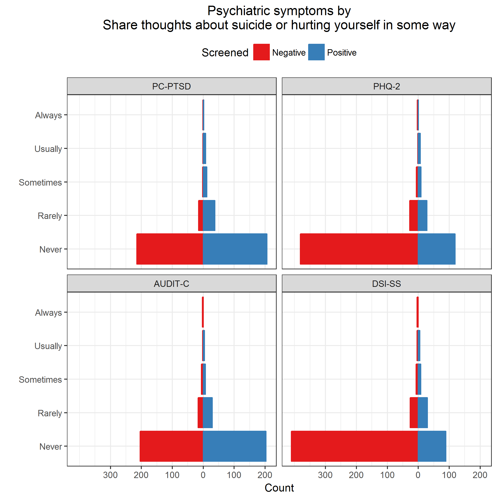


## Adjusted comparisons


Show the covariates used in the adjusted models.


```r
covarDemog <- c("age", "gender", "race", "hispanic", "marital2")
covarPsySoc <- c("countSocialMediaExclFB",
                 "comm_inperson",
                 "indSuicideConsideredEver",
                 "countSuicideAttempts")
```

Filter subjects with missing covariates.


Set modeling covariates.


```
## [1] "age"                      "gender"                  
## [3] "race"                     "hispanic"                
## [5] "marital2"                 "countSocialMediaExclFB"  
## [7] "comm_inperson"            "indSuicideConsideredEver"
## [9] "countSuicideAttempts"
```

Relabel factors; replace spaces with underscores.


### PC-PTSD vs Frequency of Facebook use


|model      |     F| df1| df2| pValue|
|:----------|-----:|---:|---:|------:|
|Unadjusted | 1.373|   5| 570|  0.233|
|Adjusted   | 1.433|   5| 553|  0.210|

\newline


|model      |term                                              |   oddsratio| std.error| statistic| p.value|
|:----------|:-------------------------------------------------|-----------:|---------:|---------:|-------:|
|Unadjusted |(Intercept)                                       |       0.429|     0.690|    -1.228|   0.220|
|Unadjusted |fb_freqEvery_few_weeks                            |       2.333|     1.215|     0.697|   0.486|
|Unadjusted |fb_freqOnce_a_week                                |       1.167|     1.107|     0.139|   0.889|
|Unadjusted |fb_freqA_few_times_a_week                         |       2.882|     0.763|     1.387|   0.165|
|Unadjusted |fb_freqOnce_a_day                                 |       2.935|     0.731|     1.474|   0.141|
|Unadjusted |fb_freqSeveral_times_a_day                        |       1.750|     0.697|     0.803|   0.422|
|Adjusted   |(Intercept)                                       |       0.461|     0.798|    -0.971|   0.332|
|Adjusted   |fb_freqEvery_few_weeks                            |       2.268|     1.296|     0.632|   0.527|
|Adjusted   |fb_freqOnce_a_week                                |       0.785|     1.156|    -0.209|   0.834|
|Adjusted   |fb_freqA_few_times_a_week                         |       2.993|     0.791|     1.386|   0.166|
|Adjusted   |fb_freqOnce_a_day                                 |       2.485|     0.761|     1.196|   0.232|
|Adjusted   |fb_freqSeveral_times_a_day                        |       1.506|     0.719|     0.570|   0.569|
|Adjusted   |age                                               |       1.002|     0.008|     0.196|   0.844|
|Adjusted   |genderFemale                                      |       0.826|     0.236|    -0.808|   0.419|
|Adjusted   |genderA gender not listed here                    | 1828078.705|   610.081|     0.024|   0.981|
|Adjusted   |raceAmerican Indian/Alaska Native/Native Hawaiian |       1.445|     0.845|     0.435|   0.663|
|Adjusted   |raceAsian                                         |       0.921|     0.747|    -0.111|   0.912|
|Adjusted   |raceBlack or African American                     |       1.453|     0.824|     0.453|   0.650|
|Adjusted   |raceMultiple races                                |       1.230|     0.326|     0.636|   0.525|
|Adjusted   |raceOther                                         |       1.431|     0.590|     0.607|   0.544|
|Adjusted   |hispanicYes                                       |       0.836|     0.411|    -0.435|   0.664|
|Adjusted   |marital2Single/Divorced/Widowed/Separated         |       1.053|     0.199|     0.261|   0.794|
|Adjusted   |countSocialMediaExclFB                            |       1.074|     0.095|     0.747|   0.455|
|Adjusted   |comm_inpersonOnce a week                          |       0.801|     0.320|    -0.694|   0.488|
|Adjusted   |comm_inpersonA few times a week                   |       0.490|     0.269|    -2.651|   0.008|
|Adjusted   |comm_inpersonOnce a day                           |       0.510|     0.338|    -1.995|   0.046|
|Adjusted   |comm_inpersonSeveral times a day                  |       0.397|     0.245|    -3.773|   0.000|
|Adjusted   |indSuicideConsideredEverTRUE                      |       2.053|     0.199|     3.607|   0.000|
|Adjusted   |countSuicideAttempts                              |       1.701|     0.167|     3.190|   0.001|

\newline


|model      | null.deviance| df.null|   logLik|     AIC|     BIC| deviance| df.residual| nobs|
|:----------|-------------:|-------:|--------:|-------:|-------:|--------:|-----------:|----:|
|Unadjusted |       792.655|     575| -392.834| 797.668| 823.805|  785.668|         570|  576|
|Adjusted   |       792.655|     575| -353.897| 753.795| 853.985|  707.795|         553|  576|


### PC-PTSD vs Active use of Facebook


|model      |     F| df1| df2| pValue|
|:----------|-----:|---:|---:|------:|
|Unadjusted | 1.572|   4| 572|  0.180|
|Adjusted   | 1.253|   4| 555|  0.287|

\newline


|model      |term                                              |   oddsratio| std.error| statistic| p.value|
|:----------|:-------------------------------------------------|-----------:|---------:|---------:|-------:|
|Unadjusted |(Intercept)                                       |       1.059|     0.239|     0.239|   0.811|
|Unadjusted |comm_facebookOnce_a_week                          |       1.102|     0.400|     0.242|   0.809|
|Unadjusted |comm_facebookA_few_times_a_week                   |       0.944|     0.303|    -0.189|   0.850|
|Unadjusted |comm_facebookOnce_a_day                           |       0.766|     0.315|    -0.845|   0.398|
|Unadjusted |comm_facebookSeveral_times_a_day                  |       0.626|     0.271|    -1.731|   0.084|
|Adjusted   |(Intercept)                                       |       0.707|     0.411|    -0.843|   0.399|
|Adjusted   |comm_facebookOnce_a_week                          |       1.094|     0.436|     0.207|   0.836|
|Adjusted   |comm_facebookA_few_times_a_week                   |       0.942|     0.333|    -0.180|   0.857|
|Adjusted   |comm_facebookOnce_a_day                           |       0.824|     0.353|    -0.547|   0.584|
|Adjusted   |comm_facebookSeveral_times_a_day                  |       0.625|     0.307|    -1.534|   0.125|
|Adjusted   |age                                               |       1.008|     0.008|     0.936|   0.350|
|Adjusted   |genderFemale                                      |       0.854|     0.236|    -0.668|   0.504|
|Adjusted   |genderA gender not listed here                    | 1960576.682|   620.344|     0.023|   0.981|
|Adjusted   |raceAmerican Indian/Alaska Native/Native Hawaiian |       1.114|     0.828|     0.130|   0.897|
|Adjusted   |raceAsian                                         |       0.903|     0.748|    -0.137|   0.891|
|Adjusted   |raceBlack or African American                     |       1.626|     0.829|     0.586|   0.558|
|Adjusted   |raceMultiple races                                |       1.320|     0.324|     0.857|   0.392|
|Adjusted   |raceOther                                         |       1.381|     0.591|     0.546|   0.585|
|Adjusted   |hispanicYes                                       |       0.896|     0.414|    -0.266|   0.790|
|Adjusted   |marital2Single/Divorced/Widowed/Separated         |       1.068|     0.199|     0.331|   0.741|
|Adjusted   |countSocialMediaExclFB                            |       1.088|     0.096|     0.881|   0.378|
|Adjusted   |comm_inpersonOnce a week                          |       0.820|     0.318|    -0.623|   0.533|
|Adjusted   |comm_inpersonA few times a week                   |       0.527|     0.268|    -2.393|   0.017|
|Adjusted   |comm_inpersonOnce a day                           |       0.525|     0.338|    -1.908|   0.056|
|Adjusted   |comm_inpersonSeveral times a day                  |       0.439|     0.248|    -3.324|   0.001|
|Adjusted   |indSuicideConsideredEverTRUE                      |       2.077|     0.200|     3.659|   0.000|
|Adjusted   |countSuicideAttempts                              |       1.737|     0.168|     3.280|   0.001|

\newline


|model      | null.deviance| df.null|   logLik|     AIC|     BIC| deviance| df.residual| nobs|
|:----------|-------------:|-------:|--------:|-------:|-------:|--------:|-----------:|----:|
|Unadjusted |       794.252|     576| -393.962| 797.924| 819.713|  787.924|         572|  577|
|Adjusted   |       794.252|     576| -355.650| 755.300| 851.172|  711.300|         555|  577|


### PC-PTSD vs Get emotional support from others


|model      |     F| df1| df2| pValue|
|:----------|-----:|---:|---:|------:|
|Unadjusted | 1.460|   4| 572|  0.213|
|Adjusted   | 1.694|   4| 555|  0.150|

\newline


|model      |term                                              |   oddsratio| std.error| statistic| p.value|
|:----------|:-------------------------------------------------|-----------:|---------:|---------:|-------:|
|Unadjusted |(Intercept)                                       |       0.683|     0.142|    -2.694|   0.007|
|Unadjusted |sm_emot_supportRarely                             |       1.596|     0.204|     2.292|   0.022|
|Unadjusted |sm_emot_supportSometimes                          |       1.074|     0.227|     0.314|   0.754|
|Unadjusted |sm_emot_supportUsually                            |       1.183|     0.326|     0.515|   0.606|
|Unadjusted |sm_emot_supportAlways                             |       1.098|     0.777|     0.121|   0.904|
|Adjusted   |(Intercept)                                       |       0.604|     0.387|    -1.305|   0.192|
|Adjusted   |sm_emot_supportRarely                             |       1.601|     0.229|     2.059|   0.039|
|Adjusted   |sm_emot_supportSometimes                          |       0.902|     0.257|    -0.401|   0.688|
|Adjusted   |sm_emot_supportUsually                            |       0.999|     0.373|    -0.004|   0.997|
|Adjusted   |sm_emot_supportAlways                             |       0.936|     0.873|    -0.076|   0.939|
|Adjusted   |age                                               |       1.004|     0.008|     0.546|   0.585|
|Adjusted   |genderFemale                                      |       0.814|     0.240|    -0.857|   0.391|
|Adjusted   |genderA gender not listed here                    | 2042133.225|   608.629|     0.024|   0.981|
|Adjusted   |raceAmerican Indian/Alaska Native/Native Hawaiian |       1.348|     0.824|     0.363|   0.717|
|Adjusted   |raceAsian                                         |       0.959|     0.760|    -0.055|   0.956|
|Adjusted   |raceBlack or African American                     |       2.160|     0.834|     0.924|   0.356|
|Adjusted   |raceMultiple races                                |       1.275|     0.324|     0.750|   0.453|
|Adjusted   |raceOther                                         |       1.579|     0.589|     0.776|   0.438|
|Adjusted   |hispanicYes                                       |       0.896|     0.415|    -0.264|   0.792|
|Adjusted   |marital2Single/Divorced/Widowed/Separated         |       1.085|     0.198|     0.414|   0.679|
|Adjusted   |countSocialMediaExclFB                            |       1.056|     0.098|     0.554|   0.579|
|Adjusted   |comm_inpersonOnce a week                          |       0.806|     0.320|    -0.674|   0.500|
|Adjusted   |comm_inpersonA few times a week                   |       0.494|     0.269|    -2.617|   0.009|
|Adjusted   |comm_inpersonOnce a day                           |       0.546|     0.338|    -1.788|   0.074|
|Adjusted   |comm_inpersonSeveral times a day                  |       0.382|     0.245|    -3.926|   0.000|
|Adjusted   |indSuicideConsideredEverTRUE                      |       1.979|     0.199|     3.425|   0.001|
|Adjusted   |countSuicideAttempts                              |       1.750|     0.171|     3.263|   0.001|

\newline


|model      | null.deviance| df.null|   logLik|     AIC|     BIC| deviance| df.residual| nobs|
|:----------|-------------:|-------:|--------:|-------:|-------:|--------:|-----------:|----:|
|Unadjusted |       794.252|     576| -394.195| 798.390| 820.179|  788.390|         572|  577|
|Adjusted   |       794.252|     576| -354.761| 753.523| 849.395|  709.523|         555|  577|


### PC-PTSD vs Get information about health or medical topics


|model      |     F| df1| df2| pValue|
|:----------|-----:|---:|---:|------:|
|Unadjusted | 1.577|   4| 571|  0.179|
|Adjusted   | 1.703|   4| 554|  0.148|

\newline


|model      |term                                              |   oddsratio| std.error| statistic| p.value|
|:----------|:-------------------------------------------------|-----------:|---------:|---------:|-------:|
|Unadjusted |(Intercept)                                       |       0.872|     0.166|    -0.827|   0.408|
|Unadjusted |sm_med_infoRarely                                 |       0.733|     0.226|    -1.373|   0.170|
|Unadjusted |sm_med_infoSometimes                              |       1.082|     0.226|     0.349|   0.727|
|Unadjusted |sm_med_infoUsually                                |       1.262|     0.302|     0.770|   0.441|
|Unadjusted |sm_med_infoAlways                                 |       0.529|     0.521|    -1.221|   0.222|
|Adjusted   |(Intercept)                                       |       0.772|     0.390|    -0.662|   0.508|
|Adjusted   |sm_med_infoRarely                                 |       0.605|     0.250|    -2.013|   0.044|
|Adjusted   |sm_med_infoSometimes                              |       0.966|     0.258|    -0.133|   0.894|
|Adjusted   |sm_med_infoUsually                                |       1.051|     0.342|     0.145|   0.885|
|Adjusted   |sm_med_infoAlways                                 |       0.529|     0.585|    -1.088|   0.276|
|Adjusted   |age                                               |       1.006|     0.008|     0.674|   0.500|
|Adjusted   |genderFemale                                      |       0.860|     0.238|    -0.631|   0.528|
|Adjusted   |genderA gender not listed here                    | 2006275.326|   593.556|     0.024|   0.980|
|Adjusted   |raceAmerican Indian/Alaska Native/Native Hawaiian |       1.134|     0.845|     0.148|   0.882|
|Adjusted   |raceAsian                                         |       1.106|     0.769|     0.131|   0.895|
|Adjusted   |raceBlack or African American                     |       1.674|     0.825|     0.624|   0.532|
|Adjusted   |raceMultiple races                                |       1.395|     0.327|     1.018|   0.309|
|Adjusted   |raceOther                                         |       1.405|     0.591|     0.575|   0.565|
|Adjusted   |hispanicYes                                       |       0.880|     0.415|    -0.309|   0.757|
|Adjusted   |marital2Single/Divorced/Widowed/Separated         |       1.062|     0.198|     0.305|   0.760|
|Adjusted   |countSocialMediaExclFB                            |       1.054|     0.099|     0.530|   0.596|
|Adjusted   |comm_inpersonOnce a week                          |       0.821|     0.317|    -0.621|   0.534|
|Adjusted   |comm_inpersonA few times a week                   |       0.516|     0.267|    -2.476|   0.013|
|Adjusted   |comm_inpersonOnce a day                           |       0.529|     0.340|    -1.873|   0.061|
|Adjusted   |comm_inpersonSeveral times a day                  |       0.382|     0.245|    -3.916|   0.000|
|Adjusted   |indSuicideConsideredEverTRUE                      |       1.990|     0.199|     3.459|   0.001|
|Adjusted   |countSuicideAttempts                              |       1.714|     0.166|     3.239|   0.001|

\newline


|model      | null.deviance| df.null|   logLik|     AIC|     BIC| deviance| df.residual| nobs|
|:----------|-------------:|-------:|--------:|-------:|-------:|--------:|-----------:|----:|
|Unadjusted |       792.655|     575| -393.113| 796.226| 818.007|  786.226|         571|  576|
|Adjusted   |       792.655|     575| -354.415| 752.829| 848.663|  708.829|         554|  576|


### PC-PTSD vs Get advice about health or medical topics


|model      |     F| df1| df2| pValue|
|:----------|-----:|---:|---:|------:|
|Unadjusted | 2.114|   4| 572|  0.078|
|Adjusted   | 2.046|   4| 555|  0.087|

\newline


|model      |term                                              |   oddsratio| std.error| statistic| p.value|
|:----------|:-------------------------------------------------|-----------:|---------:|---------:|-------:|
|Unadjusted |(Intercept)                                       |       0.758|     0.135|    -2.060|   0.039|
|Unadjusted |sm_med_adviceRarely                               |       1.000|     0.204|    -0.002|   0.999|
|Unadjusted |sm_med_adviceSometimes                            |       1.280|     0.221|     1.115|   0.265|
|Unadjusted |sm_med_adviceUsually                              |       2.074|     0.367|     1.985|   0.047|
|Unadjusted |sm_med_adviceAlways                               |       0.264|     0.786|    -1.694|   0.090|
|Adjusted   |(Intercept)                                       |       0.648|     0.384|    -1.130|   0.258|
|Adjusted   |sm_med_adviceRarely                               |       0.918|     0.225|    -0.382|   0.703|
|Adjusted   |sm_med_adviceSometimes                            |       1.279|     0.250|     0.982|   0.326|
|Adjusted   |sm_med_adviceUsually                              |       1.747|     0.401|     1.392|   0.164|
|Adjusted   |sm_med_adviceAlways                               |       0.147|     0.945|    -2.031|   0.042|
|Adjusted   |age                                               |       1.005|     0.008|     0.554|   0.580|
|Adjusted   |genderFemale                                      |       0.900|     0.238|    -0.444|   0.657|
|Adjusted   |genderA gender not listed here                    | 1638855.832|   601.187|     0.024|   0.981|
|Adjusted   |raceAmerican Indian/Alaska Native/Native Hawaiian |       1.103|     0.844|     0.116|   0.908|
|Adjusted   |raceAsian                                         |       1.126|     0.803|     0.148|   0.882|
|Adjusted   |raceBlack or African American                     |       1.799|     0.831|     0.707|   0.480|
|Adjusted   |raceMultiple races                                |       1.254|     0.324|     0.698|   0.485|
|Adjusted   |raceOther                                         |       1.338|     0.601|     0.484|   0.628|
|Adjusted   |hispanicYes                                       |       0.876|     0.419|    -0.316|   0.752|
|Adjusted   |marital2Single/Divorced/Widowed/Separated         |       1.111|     0.199|     0.529|   0.597|
|Adjusted   |countSocialMediaExclFB                            |       1.039|     0.098|     0.389|   0.697|
|Adjusted   |comm_inpersonOnce a week                          |       0.783|     0.318|    -0.769|   0.442|
|Adjusted   |comm_inpersonA few times a week                   |       0.498|     0.268|    -2.596|   0.009|
|Adjusted   |comm_inpersonOnce a day                           |       0.520|     0.341|    -1.920|   0.055|
|Adjusted   |comm_inpersonSeveral times a day                  |       0.393|     0.245|    -3.804|   0.000|
|Adjusted   |indSuicideConsideredEverTRUE                      |       2.010|     0.199|     3.506|   0.000|
|Adjusted   |countSuicideAttempts                              |       1.746|     0.167|     3.346|   0.001|

\newline


|model      | null.deviance| df.null|  logLik|     AIC|     BIC| deviance| df.residual| nobs|
|:----------|-------------:|-------:|-------:|-------:|-------:|--------:|-----------:|----:|
|Unadjusted |       794.252|     576| -392.32| 794.641| 816.430|  784.641|         572|  577|
|Adjusted   |       794.252|     576| -353.19| 750.381| 846.253|  706.381|         555|  577|


### PC-PTSD vs Ask questions about health or medical issues


|model      |     F| df1| df2| pValue|
|:----------|-----:|---:|---:|------:|
|Unadjusted | 2.147|   4| 572|  0.074|
|Adjusted   | 1.252|   4| 555|  0.288|

\newline


|model      |term                                              |   oddsratio| std.error| statistic| p.value|
|:----------|:-------------------------------------------------|-----------:|---------:|---------:|-------:|
|Unadjusted |(Intercept)                                       |       0.718|     0.124|    -2.675|   0.007|
|Unadjusted |sm_med_questionsRarely                            |       1.070|     0.199|     0.342|   0.733|
|Unadjusted |sm_med_questionsSometimes                         |       1.311|     0.236|     1.146|   0.252|
|Unadjusted |sm_med_questionsUsually                           |       3.064|     0.401|     2.793|   0.005|
|Unadjusted |sm_med_questionsAlways                            |       1.393|     0.644|     0.514|   0.607|
|Adjusted   |(Intercept)                                       |       0.655|     0.381|    -1.111|   0.267|
|Adjusted   |sm_med_questionsRarely                            |       1.015|     0.220|     0.067|   0.946|
|Adjusted   |sm_med_questionsSometimes                         |       1.343|     0.260|     1.135|   0.257|
|Adjusted   |sm_med_questionsUsually                           |       2.358|     0.432|     1.984|   0.047|
|Adjusted   |sm_med_questionsAlways                            |       0.992|     0.740|    -0.010|   0.992|
|Adjusted   |age                                               |       1.003|     0.008|     0.333|   0.739|
|Adjusted   |genderFemale                                      |       0.837|     0.237|    -0.752|   0.452|
|Adjusted   |genderA gender not listed here                    | 1988874.353|   608.239|     0.024|   0.981|
|Adjusted   |raceAmerican Indian/Alaska Native/Native Hawaiian |       1.162|     0.847|     0.177|   0.859|
|Adjusted   |raceAsian                                         |       0.987|     0.769|    -0.017|   0.987|
|Adjusted   |raceBlack or African American                     |       1.798|     0.823|     0.713|   0.476|
|Adjusted   |raceMultiple races                                |       1.338|     0.324|     0.899|   0.369|
|Adjusted   |raceOther                                         |       1.563|     0.587|     0.761|   0.447|
|Adjusted   |hispanicYes                                       |       0.859|     0.415|    -0.367|   0.714|
|Adjusted   |marital2Single/Divorced/Widowed/Separated         |       1.080|     0.198|     0.391|   0.696|
|Adjusted   |countSocialMediaExclFB                            |       1.029|     0.097|     0.295|   0.768|
|Adjusted   |comm_inpersonOnce a week                          |       0.829|     0.319|    -0.588|   0.556|
|Adjusted   |comm_inpersonA few times a week                   |       0.529|     0.267|    -2.387|   0.017|
|Adjusted   |comm_inpersonOnce a day                           |       0.505|     0.338|    -2.026|   0.043|
|Adjusted   |comm_inpersonSeveral times a day                  |       0.415|     0.244|    -3.615|   0.000|
|Adjusted   |indSuicideConsideredEverTRUE                      |       1.986|     0.199|     3.457|   0.001|
|Adjusted   |countSuicideAttempts                              |       1.690|     0.168|     3.128|   0.002|

\newline


|model      | null.deviance| df.null|   logLik|     AIC|     BIC| deviance| df.residual| nobs|
|:----------|-------------:|-------:|--------:|-------:|-------:|--------:|-----------:|----:|
|Unadjusted |       794.252|     576| -392.522| 795.043| 816.832|  785.043|         572|  577|
|Adjusted   |       794.252|     576| -355.582| 755.164| 851.036|  711.164|         555|  577|


### PC-PTSD vs Share symptoms such as mood swings, depression, anxiety, or sleep problems


|model      |     F| df1| df2| pValue|
|:----------|-----:|---:|---:|------:|
|Unadjusted | 4.971|   4| 571|  0.001|
|Adjusted   | 2.213|   4| 554|  0.066|

\newline


|model      |term                                              |   oddsratio| std.error| statistic| p.value|
|:----------|:-------------------------------------------------|-----------:|---------:|---------:|-------:|
|Unadjusted |(Intercept)                                       |       0.668|     0.116|    -3.458|   0.001|
|Unadjusted |sm_share_symptRarely                              |       1.071|     0.202|     0.339|   0.734|
|Unadjusted |sm_share_symptSometimes                           |       2.085|     0.256|     2.869|   0.004|
|Unadjusted |sm_share_symptUsually                             |       4.915|     0.447|     3.561|   0.000|
|Unadjusted |sm_share_symptAlways                              |       1.870|     0.681|     0.919|   0.358|
|Adjusted   |(Intercept)                                       |       0.619|     0.383|    -1.255|   0.209|
|Adjusted   |sm_share_symptRarely                              |       0.875|     0.225|    -0.591|   0.555|
|Adjusted   |sm_share_symptSometimes                           |       1.495|     0.283|     1.423|   0.155|
|Adjusted   |sm_share_symptUsually                             |       3.104|     0.476|     2.380|   0.017|
|Adjusted   |sm_share_symptAlways                              |       0.876|     0.758|    -0.175|   0.861|
|Adjusted   |age                                               |       1.004|     0.008|     0.536|   0.592|
|Adjusted   |genderFemale                                      |       0.823|     0.238|    -0.820|   0.412|
|Adjusted   |genderA gender not listed here                    | 1255206.415|   558.827|     0.025|   0.980|
|Adjusted   |raceAmerican Indian/Alaska Native/Native Hawaiian |       1.135|     0.836|     0.151|   0.880|
|Adjusted   |raceAsian                                         |       0.825|     0.776|    -0.247|   0.805|
|Adjusted   |raceBlack or African American                     |       1.851|     0.841|     0.732|   0.464|
|Adjusted   |raceMultiple races                                |       1.346|     0.325|     0.913|   0.361|
|Adjusted   |raceOther                                         |       1.503|     0.591|     0.690|   0.490|
|Adjusted   |hispanicYes                                       |       0.795|     0.420|    -0.544|   0.586|
|Adjusted   |marital2Single/Divorced/Widowed/Separated         |       1.110|     0.198|     0.525|   0.599|
|Adjusted   |countSocialMediaExclFB                            |       1.057|     0.097|     0.572|   0.567|
|Adjusted   |comm_inpersonOnce a week                          |       0.891|     0.323|    -0.358|   0.721|
|Adjusted   |comm_inpersonA few times a week                   |       0.550|     0.270|    -2.219|   0.027|
|Adjusted   |comm_inpersonOnce a day                           |       0.538|     0.339|    -1.829|   0.067|
|Adjusted   |comm_inpersonSeveral times a day                  |       0.427|     0.246|    -3.465|   0.001|
|Adjusted   |indSuicideConsideredEverTRUE                      |       1.916|     0.203|     3.201|   0.001|
|Adjusted   |countSuicideAttempts                              |       1.665|     0.171|     2.976|   0.003|

\newline


|model      | null.deviance| df.null|   logLik|     AIC|     BIC| deviance| df.residual| nobs|
|:----------|-------------:|-------:|--------:|-------:|-------:|--------:|-----------:|----:|
|Unadjusted |       793.052|     575| -385.446| 780.893| 802.674|  770.893|         571|  576|
|Adjusted   |       793.052|     575| -353.085| 750.170| 846.004|  706.170|         554|  576|


### PC-PTSD vs Share information related to your health


|model      |     F| df1| df2| pValue|
|:----------|-----:|---:|---:|------:|
|Unadjusted | 3.748|   4| 571|  0.005|
|Adjusted   | 2.397|   4| 554|  0.049|

\newline


|model      |term                                              |   oddsratio| std.error| statistic| p.value|
|:----------|:-------------------------------------------------|-----------:|---------:|---------:|-------:|
|Unadjusted |(Intercept)                                       |       0.679|     0.122|    -3.165|   0.002|
|Unadjusted |sm_share_healthRarely                             |       1.203|     0.188|     0.982|   0.326|
|Unadjusted |sm_share_healthSometimes                          |       1.557|     0.266|     1.667|   0.095|
|Unadjusted |sm_share_healthUsually                            |       9.330|     0.633|     3.527|   0.000|
|Unadjusted |sm_share_healthAlways                             |       0.589|     0.846|    -0.625|   0.532|
|Adjusted   |(Intercept)                                       |       0.611|     0.387|    -1.275|   0.202|
|Adjusted   |sm_share_healthRarely                             |       0.946|     0.207|    -0.269|   0.788|
|Adjusted   |sm_share_healthSometimes                          |       1.089|     0.300|     0.284|   0.776|
|Adjusted   |sm_share_healthUsually                            |       5.308|     0.664|     2.515|   0.012|
|Adjusted   |sm_share_healthAlways                             |       0.178|     1.054|    -1.639|   0.101|
|Adjusted   |age                                               |       1.006|     0.008|     0.716|   0.474|
|Adjusted   |genderFemale                                      |       0.884|     0.238|    -0.516|   0.606|
|Adjusted   |genderA gender not listed here                    | 1113052.378|   541.716|     0.026|   0.979|
|Adjusted   |raceAmerican Indian/Alaska Native/Native Hawaiian |       1.129|     0.834|     0.145|   0.885|
|Adjusted   |raceAsian                                         |       0.848|     0.783|    -0.211|   0.833|
|Adjusted   |raceBlack or African American                     |       2.210|     0.874|     0.907|   0.364|
|Adjusted   |raceMultiple races                                |       1.197|     0.330|     0.544|   0.587|
|Adjusted   |raceOther                                         |       1.491|     0.594|     0.672|   0.502|
|Adjusted   |hispanicYes                                       |       0.830|     0.417|    -0.447|   0.655|
|Adjusted   |marital2Single/Divorced/Widowed/Separated         |       1.087|     0.198|     0.422|   0.673|
|Adjusted   |countSocialMediaExclFB                            |       1.049|     0.097|     0.489|   0.625|
|Adjusted   |comm_inpersonOnce a week                          |       0.861|     0.321|    -0.468|   0.640|
|Adjusted   |comm_inpersonA few times a week                   |       0.547|     0.270|    -2.240|   0.025|
|Adjusted   |comm_inpersonOnce a day                           |       0.540|     0.340|    -1.812|   0.070|
|Adjusted   |comm_inpersonSeveral times a day                  |       0.403|     0.247|    -3.676|   0.000|
|Adjusted   |indSuicideConsideredEverTRUE                      |       1.941|     0.202|     3.275|   0.001|
|Adjusted   |countSuicideAttempts                              |       1.786|     0.174|     3.329|   0.001|

\newline


|model      | null.deviance| df.null|   logLik|     AIC|     BIC| deviance| df.residual| nobs|
|:----------|-------------:|-------:|--------:|-------:|-------:|--------:|-----------:|----:|
|Unadjusted |       792.655|     575| -385.961| 781.921| 803.702|  771.921|         571|  576|
|Adjusted   |       792.655|     575| -350.926| 745.852| 841.687|  701.852|         554|  576|


### PC-PTSD vs Share thoughts about suicide or hurting yourself in some way


|model      |     F| df1| df2| pValue|
|:----------|-----:|---:|---:|------:|
|Unadjusted | 6.082|   4| 570|  0.000|
|Adjusted   | 4.041|   4| 553|  0.003|

\newline


|model      |term                                              |   oddsratio| std.error| statistic| p.value|
|:----------|:-------------------------------------------------|-----------:|---------:|---------:|-------:|
|Unadjusted |(Intercept)                                       |       0.691|     0.092|    -4.034|   0.000|
|Unadjusted |sm_share_suicideRarely                            |       2.976|     0.302|     3.615|   0.000|
|Unadjusted |sm_share_suicideSometimes                         |       5.791|     0.652|     2.694|   0.007|
|Unadjusted |sm_share_suicideUsually                           |      11.582|     1.065|     2.301|   0.021|
|Unadjusted |sm_share_suicideAlways                            |       1.448|     1.004|     0.368|   0.713|
|Adjusted   |(Intercept)                                       |       0.600|     0.384|    -1.331|   0.183|
|Adjusted   |sm_share_suicideRarely                            |       2.527|     0.327|     2.834|   0.005|
|Adjusted   |sm_share_suicideSometimes                         |       3.533|     0.701|     1.801|   0.072|
|Adjusted   |sm_share_suicideUsually                           |      12.989|     1.123|     2.284|   0.022|
|Adjusted   |sm_share_suicideAlways                            |       0.450|     1.242|    -0.643|   0.520|
|Adjusted   |age                                               |       1.006|     0.008|     0.773|   0.440|
|Adjusted   |genderFemale                                      |       0.877|     0.240|    -0.546|   0.585|
|Adjusted   |genderA gender not listed here                    | 1317796.489|   560.117|     0.025|   0.980|
|Adjusted   |raceAmerican Indian/Alaska Native/Native Hawaiian |       1.065|     0.854|     0.074|   0.941|
|Adjusted   |raceAsian                                         |       0.677|     0.778|    -0.502|   0.616|
|Adjusted   |raceBlack or African American                     |       1.689|     0.869|     0.603|   0.546|
|Adjusted   |raceMultiple races                                |       1.308|     0.330|     0.813|   0.416|
|Adjusted   |raceOther                                         |       1.717|     0.594|     0.910|   0.363|
|Adjusted   |hispanicYes                                       |       0.767|     0.443|    -0.600|   0.548|
|Adjusted   |marital2Single/Divorced/Widowed/Separated         |       1.030|     0.201|     0.148|   0.882|
|Adjusted   |countSocialMediaExclFB                            |       1.049|     0.097|     0.493|   0.622|
|Adjusted   |comm_inpersonOnce a week                          |       0.817|     0.321|    -0.630|   0.529|
|Adjusted   |comm_inpersonA few times a week                   |       0.493|     0.272|    -2.600|   0.009|
|Adjusted   |comm_inpersonOnce a day                           |       0.528|     0.340|    -1.877|   0.061|
|Adjusted   |comm_inpersonSeveral times a day                  |       0.380|     0.249|    -3.897|   0.000|
|Adjusted   |indSuicideConsideredEverTRUE                      |       1.794|     0.202|     2.889|   0.004|
|Adjusted   |countSuicideAttempts                              |       1.755|     0.173|     3.255|   0.001|

\newline


|model      | null.deviance| df.null|   logLik|     AIC|     BIC| deviance| df.residual| nobs|
|:----------|-------------:|-------:|--------:|-------:|-------:|--------:|-----------:|----:|
|Unadjusted |        791.85|     574| -380.941| 771.882| 793.654|  761.882|         570|  575|
|Adjusted   |        791.85|     574| -347.290| 738.580| 834.377|  694.580|         553|  575|


### PHQ-2 vs Frequency of Facebook use


|model      |     F| df1| df2| pValue|
|:----------|-----:|---:|---:|------:|
|Unadjusted | 0.496|   5| 571|  0.779|
|Adjusted   | 0.409|   5| 554|  0.843|

\newline


|model      |term                                              | oddsratio| std.error| statistic| p.value|
|:----------|:-------------------------------------------------|---------:|---------:|---------:|-------:|
|Unadjusted |(Intercept)                                       |     0.111|     1.054|    -2.084|   0.037|
|Unadjusted |fb_freqEvery_few_weeks                            |     0.000|   441.373|    -0.028|   0.978|
|Unadjusted |fb_freqOnce_a_week                                |     4.500|     1.364|     1.103|   0.270|
|Unadjusted |fb_freqA_few_times_a_week                         |     3.667|     1.113|     1.167|   0.243|
|Unadjusted |fb_freqOnce_a_day                                 |     4.404|     1.084|     1.367|   0.172|
|Unadjusted |fb_freqSeveral_times_a_day                        |     3.358|     1.059|     1.143|   0.253|
|Adjusted   |(Intercept)                                       |     0.237|     1.157|    -1.244|   0.213|
|Adjusted   |fb_freqEvery_few_weeks                            |     0.000|   629.421|    -0.022|   0.983|
|Adjusted   |fb_freqOnce_a_week                                |     3.419|     1.423|     0.864|   0.387|
|Adjusted   |fb_freqA_few_times_a_week                         |     3.813|     1.140|     1.174|   0.240|
|Adjusted   |fb_freqOnce_a_day                                 |     3.936|     1.112|     1.232|   0.218|
|Adjusted   |fb_freqSeveral_times_a_day                        |     3.049|     1.079|     1.033|   0.302|
|Adjusted   |age                                               |     0.985|     0.009|    -1.642|   0.101|
|Adjusted   |genderFemale                                      |     0.742|     0.267|    -1.117|   0.264|
|Adjusted   |genderA gender not listed here                    |     1.175|     1.488|     0.108|   0.914|
|Adjusted   |raceAmerican Indian/Alaska Native/Native Hawaiian |     0.300|     1.136|    -1.059|   0.290|
|Adjusted   |raceAsian                                         |     0.657|     0.864|    -0.486|   0.627|
|Adjusted   |raceBlack or African American                     |     1.131|     0.947|     0.130|   0.896|
|Adjusted   |raceMultiple races                                |     0.956|     0.352|    -0.128|   0.898|
|Adjusted   |raceOther                                         |     1.960|     0.596|     1.129|   0.259|
|Adjusted   |hispanicYes                                       |     0.647|     0.498|    -0.874|   0.382|
|Adjusted   |marital2Single/Divorced/Widowed/Separated         |     0.985|     0.221|    -0.067|   0.947|
|Adjusted   |countSocialMediaExclFB                            |     0.905|     0.109|    -0.923|   0.356|
|Adjusted   |comm_inpersonOnce a week                          |     0.773|     0.325|    -0.791|   0.429|
|Adjusted   |comm_inpersonA few times a week                   |     0.307|     0.314|    -3.765|   0.000|
|Adjusted   |comm_inpersonOnce a day                           |     0.417|     0.408|    -2.142|   0.032|
|Adjusted   |comm_inpersonSeveral times a day                  |     0.393|     0.271|    -3.441|   0.001|
|Adjusted   |indSuicideConsideredEverTRUE                      |     3.282|     0.225|     5.279|   0.000|
|Adjusted   |countSuicideAttempts                              |     1.218|     0.131|     1.511|   0.131|

\newline


|model      | null.deviance| df.null|   logLik|     AIC|     BIC| deviance| df.residual| nobs|
|:----------|-------------:|-------:|--------:|-------:|-------:|--------:|-----------:|----:|
|Unadjusted |       679.376|     576| -336.901| 685.802| 711.949|  673.802|         571|  577|
|Adjusted   |       679.376|     576| -294.643| 635.286| 735.517|  589.286|         554|  577|


### PHQ-2 vs Active use of Facebook


|model      |     F| df1| df2| pValue|
|:----------|-----:|---:|---:|------:|
|Unadjusted | 0.487|   4| 573|  0.745|
|Adjusted   | 0.331|   4| 556|  0.857|

\newline


|model      |term                                              | oddsratio| std.error| statistic| p.value|
|:----------|:-------------------------------------------------|---------:|---------:|---------:|-------:|
|Unadjusted |(Intercept)                                       |     0.489|     0.254|    -2.808|   0.005|
|Unadjusted |comm_facebookOnce_a_week                          |     1.022|     0.424|     0.051|   0.960|
|Unadjusted |comm_facebookA_few_times_a_week                   |     0.713|     0.331|    -1.022|   0.307|
|Unadjusted |comm_facebookOnce_a_day                           |     0.759|     0.343|    -0.804|   0.421|
|Unadjusted |comm_facebookSeveral_times_a_day                  |     0.735|     0.291|    -1.057|   0.291|
|Adjusted   |(Intercept)                                       |     0.662|     0.461|    -0.896|   0.370|
|Adjusted   |comm_facebookOnce_a_week                          |     1.138|     0.476|     0.272|   0.785|
|Adjusted   |comm_facebookA_few_times_a_week                   |     0.731|     0.371|    -0.845|   0.398|
|Adjusted   |comm_facebookOnce_a_day                           |     0.928|     0.392|    -0.191|   0.849|
|Adjusted   |comm_facebookSeveral_times_a_day                  |     0.890|     0.335|    -0.348|   0.728|
|Adjusted   |age                                               |     0.988|     0.009|    -1.277|   0.201|
|Adjusted   |genderFemale                                      |     0.757|     0.267|    -1.046|   0.296|
|Adjusted   |genderA gender not listed here                    |     1.176|     1.494|     0.109|   0.913|
|Adjusted   |raceAmerican Indian/Alaska Native/Native Hawaiian |     0.276|     1.136|    -1.135|   0.257|
|Adjusted   |raceAsian                                         |     0.704|     0.870|    -0.404|   0.686|
|Adjusted   |raceBlack or African American                     |     1.082|     0.940|     0.084|   0.933|
|Adjusted   |raceMultiple races                                |     0.995|     0.349|    -0.014|   0.989|
|Adjusted   |raceOther                                         |     1.999|     0.596|     1.163|   0.245|
|Adjusted   |hispanicYes                                       |     0.675|     0.497|    -0.790|   0.429|
|Adjusted   |marital2Single/Divorced/Widowed/Separated         |     1.065|     0.221|     0.284|   0.777|
|Adjusted   |countSocialMediaExclFB                            |     0.914|     0.108|    -0.834|   0.404|
|Adjusted   |comm_inpersonOnce a week                          |     0.798|     0.322|    -0.703|   0.482|
|Adjusted   |comm_inpersonA few times a week                   |     0.339|     0.310|    -3.487|   0.000|
|Adjusted   |comm_inpersonOnce a day                           |     0.404|     0.407|    -2.229|   0.026|
|Adjusted   |comm_inpersonSeveral times a day                  |     0.417|     0.276|    -3.169|   0.002|
|Adjusted   |indSuicideConsideredEverTRUE                      |     3.416|     0.226|     5.445|   0.000|
|Adjusted   |countSuicideAttempts                              |     1.203|     0.130|     1.417|   0.156|

\newline


|model      | null.deviance| df.null|  logLik|    AIC|     BIC| deviance| df.residual| nobs|
|:----------|-------------:|-------:|-------:|------:|-------:|--------:|-----------:|----:|
|Unadjusted |       681.949|     577| -340.02| 690.04| 711.838|   680.04|         573|  578|
|Adjusted   |       681.949|     577| -298.33| 640.66| 736.571|   596.66|         556|  578|


### PHQ-2 vs Get emotional support from others


|model      |     F| df1| df2| pValue|
|:----------|-----:|---:|---:|------:|
|Unadjusted | 1.083|   4| 573|  0.364|
|Adjusted   | 1.099|   4| 556|  0.356|

\newline


|model      |term                                              | oddsratio| std.error| statistic| p.value|
|:----------|:-------------------------------------------------|---------:|---------:|---------:|-------:|
|Unadjusted |(Intercept)                                       |     0.325|     0.161|    -6.976|   0.000|
|Unadjusted |sm_emot_supportRarely                             |     1.259|     0.228|     1.011|   0.312|
|Unadjusted |sm_emot_supportSometimes                          |     1.319|     0.250|     1.108|   0.268|
|Unadjusted |sm_emot_supportUsually                            |     1.055|     0.371|     0.145|   0.884|
|Unadjusted |sm_emot_supportAlways                             |     4.105|     0.781|     1.809|   0.070|
|Adjusted   |(Intercept)                                       |     0.551|     0.439|    -1.358|   0.175|
|Adjusted   |sm_emot_supportRarely                             |     1.288|     0.260|     0.973|   0.331|
|Adjusted   |sm_emot_supportSometimes                          |     1.361|     0.286|     1.076|   0.282|
|Adjusted   |sm_emot_supportUsually                            |     1.092|     0.425|     0.207|   0.836|
|Adjusted   |sm_emot_supportAlways                             |     5.040|     0.865|     1.869|   0.062|
|Adjusted   |age                                               |     0.987|     0.009|    -1.369|   0.171|
|Adjusted   |genderFemale                                      |     0.684|     0.272|    -1.400|   0.162|
|Adjusted   |genderA gender not listed here                    |     1.172|     1.492|     0.107|   0.915|
|Adjusted   |raceAmerican Indian/Alaska Native/Native Hawaiian |     0.309|     1.140|    -1.031|   0.302|
|Adjusted   |raceAsian                                         |     0.747|     0.869|    -0.335|   0.737|
|Adjusted   |raceBlack or African American                     |     1.277|     0.956|     0.256|   0.798|
|Adjusted   |raceMultiple races                                |     0.976|     0.351|    -0.070|   0.944|
|Adjusted   |raceOther                                         |     2.166|     0.594|     1.301|   0.193|
|Adjusted   |hispanicYes                                       |     0.639|     0.509|    -0.879|   0.379|
|Adjusted   |marital2Single/Divorced/Widowed/Separated         |     1.077|     0.219|     0.339|   0.735|
|Adjusted   |countSocialMediaExclFB                            |     0.901|     0.111|    -0.945|   0.345|
|Adjusted   |comm_inpersonOnce a week                          |     0.767|     0.325|    -0.815|   0.415|
|Adjusted   |comm_inpersonA few times a week                   |     0.314|     0.312|    -3.722|   0.000|
|Adjusted   |comm_inpersonOnce a day                           |     0.386|     0.412|    -2.306|   0.021|
|Adjusted   |comm_inpersonSeveral times a day                  |     0.392|     0.273|    -3.434|   0.001|
|Adjusted   |indSuicideConsideredEverTRUE                      |     3.242|     0.225|     5.230|   0.000|
|Adjusted   |countSuicideAttempts                              |     1.200|     0.133|     1.367|   0.172|

\newline


|model      | null.deviance| df.null|   logLik|     AIC|     BIC| deviance| df.residual| nobs|
|:----------|-------------:|-------:|--------:|-------:|-------:|--------:|-----------:|----:|
|Unadjusted |       681.949|     577| -338.802| 687.603| 709.401|  677.603|         573|  578|
|Adjusted   |       681.949|     577| -296.793| 637.585| 733.496|  593.585|         556|  578|


### PHQ-2 vs Get information about health or medical topics


|model      |     F| df1| df2| pValue|
|:----------|-----:|---:|---:|------:|
|Unadjusted | 2.327|   4| 572|  0.055|
|Adjusted   | 2.898|   4| 555|  0.022|

\newline


|model      |term                                              | oddsratio| std.error| statistic| p.value|
|:----------|:-------------------------------------------------|---------:|---------:|---------:|-------:|
|Unadjusted |(Intercept)                                       |     0.374|     0.185|    -5.309|   0.000|
|Unadjusted |sm_med_infoRarely                                 |     0.731|     0.260|    -1.201|   0.230|
|Unadjusted |sm_med_infoSometimes                              |     1.235|     0.248|     0.850|   0.395|
|Unadjusted |sm_med_infoUsually                                |     1.646|     0.319|     1.563|   0.118|
|Unadjusted |sm_med_infoAlways                                 |     0.502|     0.656|    -1.052|   0.293|
|Adjusted   |(Intercept)                                       |     0.722|     0.444|    -0.734|   0.463|
|Adjusted   |sm_med_infoRarely                                 |     0.730|     0.290|    -1.085|   0.278|
|Adjusted   |sm_med_infoSometimes                              |     1.577|     0.290|     1.567|   0.117|
|Adjusted   |sm_med_infoUsually                                |     1.980|     0.372|     1.833|   0.067|
|Adjusted   |sm_med_infoAlways                                 |     0.813|     0.742|    -0.280|   0.780|
|Adjusted   |age                                               |     0.982|     0.010|    -1.854|   0.064|
|Adjusted   |genderFemale                                      |     0.730|     0.273|    -1.152|   0.249|
|Adjusted   |genderA gender not listed here                    |     1.207|     1.601|     0.118|   0.906|
|Adjusted   |raceAmerican Indian/Alaska Native/Native Hawaiian |     0.268|     1.152|    -1.141|   0.254|
|Adjusted   |raceAsian                                         |     0.733|     0.920|    -0.338|   0.735|
|Adjusted   |raceBlack or African American                     |     1.309|     0.918|     0.293|   0.770|
|Adjusted   |raceMultiple races                                |     1.086|     0.354|     0.233|   0.816|
|Adjusted   |raceOther                                         |     2.068|     0.599|     1.214|   0.225|
|Adjusted   |hispanicYes                                       |     0.653|     0.508|    -0.838|   0.402|
|Adjusted   |marital2Single/Divorced/Widowed/Separated         |     1.031|     0.222|     0.137|   0.891|
|Adjusted   |countSocialMediaExclFB                            |     0.852|     0.113|    -1.422|   0.155|
|Adjusted   |comm_inpersonOnce a week                          |     0.765|     0.326|    -0.821|   0.412|
|Adjusted   |comm_inpersonA few times a week                   |     0.325|     0.313|    -3.593|   0.000|
|Adjusted   |comm_inpersonOnce a day                           |     0.419|     0.414|    -2.098|   0.036|
|Adjusted   |comm_inpersonSeveral times a day                  |     0.384|     0.274|    -3.488|   0.000|
|Adjusted   |indSuicideConsideredEverTRUE                      |     3.354|     0.228|     5.314|   0.000|
|Adjusted   |countSuicideAttempts                              |     1.198|     0.130|     1.389|   0.165|

\newline


|model      | null.deviance| df.null|   logLik|     AIC|     BIC| deviance| df.residual| nobs|
|:----------|-------------:|-------:|--------:|-------:|-------:|--------:|-----------:|----:|
|Unadjusted |       679.376|     576| -334.901| 679.803| 701.592|  669.803|         572|  577|
|Adjusted   |       679.376|     576| -292.522| 629.045| 724.917|  585.045|         555|  577|


### PHQ-2 vs Get advice about health or medical topics


|model      |     F| df1| df2| pValue|
|:----------|-----:|---:|---:|------:|
|Unadjusted | 2.087|   4| 573|  0.081|
|Adjusted   | 2.491|   4| 556|  0.042|

\newline


|model      |term                                              | oddsratio| std.error| statistic| p.value|
|:----------|:-------------------------------------------------|---------:|---------:|---------:|-------:|
|Unadjusted |(Intercept)                                       |     0.337|     0.153|    -7.096|   0.000|
|Unadjusted |sm_med_adviceRarely                               |     0.973|     0.233|    -0.116|   0.907|
|Unadjusted |sm_med_adviceSometimes                            |     1.415|     0.242|     1.434|   0.152|
|Unadjusted |sm_med_adviceUsually                              |     2.372|     0.369|     2.342|   0.019|
|Unadjusted |sm_med_adviceAlways                               |     0.593|     0.790|    -0.662|   0.508|
|Adjusted   |(Intercept)                                       |     0.644|     0.434|    -1.013|   0.311|
|Adjusted   |sm_med_adviceRarely                               |     0.982|     0.261|    -0.070|   0.944|
|Adjusted   |sm_med_adviceSometimes                            |     1.797|     0.281|     2.082|   0.037|
|Adjusted   |sm_med_adviceUsually                              |     2.522|     0.419|     2.205|   0.027|
|Adjusted   |sm_med_adviceAlways                               |     0.594|     0.897|    -0.580|   0.562|
|Adjusted   |age                                               |     0.983|     0.010|    -1.803|   0.071|
|Adjusted   |genderFemale                                      |     0.801|     0.268|    -0.828|   0.408|
|Adjusted   |genderA gender not listed here                    |     1.081|     1.588|     0.049|   0.961|
|Adjusted   |raceAmerican Indian/Alaska Native/Native Hawaiian |     0.243|     1.161|    -1.218|   0.223|
|Adjusted   |raceAsian                                         |     0.737|     0.910|    -0.335|   0.738|
|Adjusted   |raceBlack or African American                     |     1.341|     0.932|     0.315|   0.753|
|Adjusted   |raceMultiple races                                |     1.029|     0.349|     0.081|   0.935|
|Adjusted   |raceOther                                         |     2.016|     0.614|     1.142|   0.253|
|Adjusted   |hispanicYes                                       |     0.666|     0.502|    -0.809|   0.419|
|Adjusted   |marital2Single/Divorced/Widowed/Separated         |     1.071|     0.222|     0.310|   0.756|
|Adjusted   |countSocialMediaExclFB                            |     0.862|     0.112|    -1.334|   0.182|
|Adjusted   |comm_inpersonOnce a week                          |     0.753|     0.325|    -0.870|   0.384|
|Adjusted   |comm_inpersonA few times a week                   |     0.318|     0.313|    -3.656|   0.000|
|Adjusted   |comm_inpersonOnce a day                           |     0.387|     0.412|    -2.305|   0.021|
|Adjusted   |comm_inpersonSeveral times a day                  |     0.401|     0.272|    -3.354|   0.001|
|Adjusted   |indSuicideConsideredEverTRUE                      |     3.313|     0.226|     5.292|   0.000|
|Adjusted   |countSuicideAttempts                              |     1.212|     0.130|     1.473|   0.141|

\newline


|model      | null.deviance| df.null|   logLik|     AIC|     BIC| deviance| df.residual| nobs|
|:----------|-------------:|-------:|--------:|-------:|-------:|--------:|-----------:|----:|
|Unadjusted |       681.949|     577| -336.856| 683.713| 705.511|  673.713|         573|  578|
|Adjusted   |       681.949|     577| -293.981| 631.962| 727.873|  587.962|         556|  578|


### PHQ-2 vs Ask questions about health or medical issues


|model      |     F| df1| df2| pValue|
|:----------|-----:|---:|---:|------:|
|Unadjusted | 2.793|   4| 573|  0.026|
|Adjusted   | 2.823|   4| 556|  0.024|

\newline


|model      |term                                              | oddsratio| std.error| statistic| p.value|
|:----------|:-------------------------------------------------|---------:|---------:|---------:|-------:|
|Unadjusted |(Intercept)                                       |     0.312|     0.143|    -8.130|   0.000|
|Unadjusted |sm_med_questionsRarely                            |     1.137|     0.226|     0.565|   0.572|
|Unadjusted |sm_med_questionsSometimes                         |     1.602|     0.257|     1.834|   0.067|
|Unadjusted |sm_med_questionsUsually                           |     3.203|     0.381|     3.052|   0.002|
|Unadjusted |sm_med_questionsAlways                            |     1.373|     0.705|     0.450|   0.653|
|Adjusted   |(Intercept)                                       |     0.630|     0.434|    -1.066|   0.287|
|Adjusted   |sm_med_questionsRarely                            |     1.232|     0.255|     0.820|   0.412|
|Adjusted   |sm_med_questionsSometimes                         |     1.946|     0.290|     2.293|   0.022|
|Adjusted   |sm_med_questionsUsually                           |     3.361|     0.428|     2.833|   0.005|
|Adjusted   |sm_med_questionsAlways                            |     0.922|     0.815|    -0.099|   0.921|
|Adjusted   |age                                               |     0.982|     0.010|    -1.936|   0.053|
|Adjusted   |genderFemale                                      |     0.722|     0.271|    -1.205|   0.228|
|Adjusted   |genderA gender not listed here                    |     1.390|     1.528|     0.216|   0.829|
|Adjusted   |raceAmerican Indian/Alaska Native/Native Hawaiian |     0.250|     1.168|    -1.186|   0.235|
|Adjusted   |raceAsian                                         |     0.707|     0.916|    -0.379|   0.705|
|Adjusted   |raceBlack or African American                     |     1.280|     0.929|     0.266|   0.791|
|Adjusted   |raceMultiple races                                |     1.076|     0.350|     0.209|   0.835|
|Adjusted   |raceOther                                         |     2.353|     0.590|     1.451|   0.147|
|Adjusted   |hispanicYes                                       |     0.661|     0.509|    -0.815|   0.415|
|Adjusted   |marital2Single/Divorced/Widowed/Separated         |     1.049|     0.223|     0.214|   0.830|
|Adjusted   |countSocialMediaExclFB                            |     0.860|     0.111|    -1.353|   0.176|
|Adjusted   |comm_inpersonOnce a week                          |     0.768|     0.327|    -0.805|   0.421|
|Adjusted   |comm_inpersonA few times a week                   |     0.331|     0.313|    -3.534|   0.000|
|Adjusted   |comm_inpersonOnce a day                           |     0.397|     0.414|    -2.230|   0.026|
|Adjusted   |comm_inpersonSeveral times a day                  |     0.418|     0.273|    -3.196|   0.001|
|Adjusted   |indSuicideConsideredEverTRUE                      |     3.284|     0.226|     5.254|   0.000|
|Adjusted   |countSuicideAttempts                              |     1.193|     0.131|     1.353|   0.176|

\newline


|model      | null.deviance| df.null|   logLik|     AIC|     BIC| deviance| df.residual| nobs|
|:----------|-------------:|-------:|--------:|-------:|-------:|--------:|-----------:|----:|
|Unadjusted |       681.949|     577| -335.503| 681.005| 702.803|  671.005|         573|  578|
|Adjusted   |       681.949|     577| -293.348| 630.696| 726.607|  586.696|         556|  578|


### PHQ-2 vs Share symptoms such as mood swings, depression, anxiety, or sleep problems


|model      |     F| df1| df2| pValue|
|:----------|-----:|---:|---:|------:|
|Unadjusted | 6.011|   4| 572|  0.000|
|Adjusted   | 2.885|   4| 555|  0.022|

\newline


|model      |term                                              | oddsratio| std.error| statistic| p.value|
|:----------|:-------------------------------------------------|---------:|---------:|---------:|-------:|
|Unadjusted |(Intercept)                                       |     0.278|     0.138|    -9.269|   0.000|
|Unadjusted |sm_share_symptRarely                              |     1.341|     0.229|     1.279|   0.201|
|Unadjusted |sm_share_symptSometimes                           |     2.323|     0.269|     3.138|   0.002|
|Unadjusted |sm_share_symptUsually                             |     5.396|     0.397|     4.241|   0.000|
|Unadjusted |sm_share_symptAlways                              |     1.799|     0.720|     0.815|   0.415|
|Adjusted   |(Intercept)                                       |     0.572|     0.435|    -1.285|   0.199|
|Adjusted   |sm_share_symptRarely                              |     1.116|     0.258|     0.426|   0.670|
|Adjusted   |sm_share_symptSometimes                           |     1.927|     0.303|     2.163|   0.031|
|Adjusted   |sm_share_symptUsually                             |     3.436|     0.433|     2.849|   0.004|
|Adjusted   |sm_share_symptAlways                              |     1.000|     0.798|     0.000|   1.000|
|Adjusted   |age                                               |     0.986|     0.009|    -1.524|   0.127|
|Adjusted   |genderFemale                                      |     0.710|     0.271|    -1.267|   0.205|
|Adjusted   |genderA gender not listed here                    |     0.800|     1.699|    -0.132|   0.895|
|Adjusted   |raceAmerican Indian/Alaska Native/Native Hawaiian |     0.277|     1.146|    -1.119|   0.263|
|Adjusted   |raceAsian                                         |     0.533|     0.901|    -0.698|   0.485|
|Adjusted   |raceBlack or African American                     |     1.154|     1.007|     0.142|   0.887|
|Adjusted   |raceMultiple races                                |     1.029|     0.350|     0.083|   0.934|
|Adjusted   |raceOther                                         |     2.060|     0.602|     1.201|   0.230|
|Adjusted   |hispanicYes                                       |     0.608|     0.514|    -0.967|   0.333|
|Adjusted   |marital2Single/Divorced/Widowed/Separated         |     1.081|     0.221|     0.350|   0.726|
|Adjusted   |countSocialMediaExclFB                            |     0.897|     0.110|    -0.986|   0.324|
|Adjusted   |comm_inpersonOnce a week                          |     0.797|     0.331|    -0.685|   0.494|
|Adjusted   |comm_inpersonA few times a week                   |     0.345|     0.314|    -3.396|   0.001|
|Adjusted   |comm_inpersonOnce a day                           |     0.418|     0.413|    -2.116|   0.034|
|Adjusted   |comm_inpersonSeveral times a day                  |     0.420|     0.274|    -3.164|   0.002|
|Adjusted   |indSuicideConsideredEverTRUE                      |     3.045|     0.229|     4.858|   0.000|
|Adjusted   |countSuicideAttempts                              |     1.160|     0.133|     1.122|   0.262|

\newline


|model      | null.deviance| df.null|   logLik|     AIC|     BIC| deviance| df.residual| nobs|
|:----------|-------------:|-------:|--------:|-------:|-------:|--------:|-----------:|----:|
|Unadjusted |         681.3|     576| -328.454| 666.909| 688.698|  656.909|         572|  577|
|Adjusted   |         681.3|     576| -293.084| 630.168| 726.041|  586.168|         555|  577|


### PHQ-2 vs Share information related to your health


|model      |     F| df1| df2| pValue|
|:----------|-----:|---:|---:|------:|
|Unadjusted | 3.728|   4| 572|  0.005|
|Adjusted   | 1.549|   4| 555|  0.186|

\newline


|model      |term                                              | oddsratio| std.error| statistic| p.value|
|:----------|:-------------------------------------------------|---------:|---------:|---------:|-------:|
|Unadjusted |(Intercept)                                       |     0.311|     0.141|    -8.279|   0.000|
|Unadjusted |sm_share_healthRarely                             |     1.299|     0.211|     1.238|   0.216|
|Unadjusted |sm_share_healthSometimes                          |     1.413|     0.292|     1.184|   0.236|
|Unadjusted |sm_share_healthUsually                            |     5.621|     0.465|     3.712|   0.000|
|Unadjusted |sm_share_healthAlways                             |     0.535|     1.089|    -0.574|   0.566|
|Adjusted   |(Intercept)                                       |     0.575|     0.436|    -1.269|   0.205|
|Adjusted   |sm_share_healthRarely                             |     1.033|     0.235|     0.137|   0.891|
|Adjusted   |sm_share_healthSometimes                          |     1.108|     0.335|     0.306|   0.759|
|Adjusted   |sm_share_healthUsually                            |     2.934|     0.510|     2.112|   0.035|
|Adjusted   |sm_share_healthAlways                             |     0.242|     1.215|    -1.169|   0.242|
|Adjusted   |age                                               |     0.988|     0.009|    -1.290|   0.197|
|Adjusted   |genderFemale                                      |     0.784|     0.270|    -0.902|   0.367|
|Adjusted   |genderA gender not listed here                    |     0.766|     1.651|    -0.161|   0.872|
|Adjusted   |raceAmerican Indian/Alaska Native/Native Hawaiian |     0.290|     1.137|    -1.089|   0.276|
|Adjusted   |raceAsian                                         |     0.570|     0.898|    -0.625|   0.532|
|Adjusted   |raceBlack or African American                     |     1.258|     1.034|     0.222|   0.824|
|Adjusted   |raceMultiple races                                |     0.981|     0.354|    -0.055|   0.956|
|Adjusted   |raceOther                                         |     2.071|     0.598|     1.217|   0.223|
|Adjusted   |hispanicYes                                       |     0.653|     0.500|    -0.851|   0.395|
|Adjusted   |marital2Single/Divorced/Widowed/Separated         |     1.053|     0.219|     0.237|   0.813|
|Adjusted   |countSocialMediaExclFB                            |     0.898|     0.109|    -0.983|   0.326|
|Adjusted   |comm_inpersonOnce a week                          |     0.808|     0.325|    -0.656|   0.512|
|Adjusted   |comm_inpersonA few times a week                   |     0.350|     0.312|    -3.362|   0.001|
|Adjusted   |comm_inpersonOnce a day                           |     0.423|     0.410|    -2.095|   0.036|
|Adjusted   |comm_inpersonSeveral times a day                  |     0.419|     0.273|    -3.186|   0.001|
|Adjusted   |indSuicideConsideredEverTRUE                      |     3.154|     0.228|     5.047|   0.000|
|Adjusted   |countSuicideAttempts                              |     1.237|     0.134|     1.586|   0.113|

\newline


|model      | null.deviance| df.null|   logLik|     AIC|    BIC| deviance| df.residual| nobs|
|:----------|-------------:|-------:|--------:|-------:|------:|--------:|-----------:|----:|
|Unadjusted |         681.3|     576| -332.820| 675.641| 697.43|  665.641|         572|  577|
|Adjusted   |         681.3|     576| -295.489| 634.978| 730.85|  590.978|         555|  577|


### PHQ-2 vs Share thoughts about suicide or hurting yourself in some way


|model      |     F| df1| df2| pValue|
|:----------|-----:|---:|---:|------:|
|Unadjusted | 7.572|   4| 571|      0|
|Adjusted   | 5.354|   4| 554|      0|

\newline


|model      |term                                              | oddsratio| std.error| statistic| p.value|
|:----------|:-------------------------------------------------|---------:|---------:|---------:|-------:|
|Unadjusted |(Intercept)                                       |     0.308|     0.106|   -11.101|   0.000|
|Unadjusted |sm_share_suicideRarely                            |     3.134|     0.290|     3.941|   0.000|
|Unadjusted |sm_share_suicideSometimes                         |     4.875|     0.538|     2.946|   0.003|
|Unadjusted |sm_share_suicideUsually                           |    11.375|     0.809|     3.006|   0.003|
|Unadjusted |sm_share_suicideAlways                            |     1.083|     1.160|     0.069|   0.945|
|Adjusted   |(Intercept)                                       |     0.589|     0.438|    -1.206|   0.228|
|Adjusted   |sm_share_suicideRarely                            |     2.740|     0.323|     3.117|   0.002|
|Adjusted   |sm_share_suicideSometimes                         |     3.492|     0.585|     2.137|   0.033|
|Adjusted   |sm_share_suicideUsually                           |    15.068|     0.957|     2.834|   0.005|
|Adjusted   |sm_share_suicideAlways                            |     0.334|     1.254|    -0.876|   0.381|
|Adjusted   |age                                               |     0.987|     0.009|    -1.349|   0.177|
|Adjusted   |genderFemale                                      |     0.782|     0.276|    -0.892|   0.373|
|Adjusted   |genderA gender not listed here                    |     0.805|     1.686|    -0.129|   0.898|
|Adjusted   |raceAmerican Indian/Alaska Native/Native Hawaiian |     0.217|     1.169|    -1.308|   0.191|
|Adjusted   |raceAsian                                         |     0.518|     0.905|    -0.727|   0.467|
|Adjusted   |raceBlack or African American                     |     0.976|     1.034|    -0.023|   0.981|
|Adjusted   |raceMultiple races                                |     0.989|     0.362|    -0.032|   0.975|
|Adjusted   |raceOther                                         |     2.673|     0.603|     1.629|   0.103|
|Adjusted   |hispanicYes                                       |     0.526|     0.546|    -1.177|   0.239|
|Adjusted   |marital2Single/Divorced/Widowed/Separated         |     0.975|     0.225|    -0.114|   0.909|
|Adjusted   |countSocialMediaExclFB                            |     0.882|     0.112|    -1.117|   0.264|
|Adjusted   |comm_inpersonOnce a week                          |     0.802|     0.328|    -0.672|   0.502|
|Adjusted   |comm_inpersonA few times a week                   |     0.314|     0.319|    -3.635|   0.000|
|Adjusted   |comm_inpersonOnce a day                           |     0.424|     0.415|    -2.070|   0.038|
|Adjusted   |comm_inpersonSeveral times a day                  |     0.388|     0.278|    -3.402|   0.001|
|Adjusted   |indSuicideConsideredEverTRUE                      |     2.953|     0.229|     4.721|   0.000|
|Adjusted   |countSuicideAttempts                              |     1.227|     0.137|     1.491|   0.136|

\newline


|model      | null.deviance| df.null|   logLik|     AIC|     BIC| deviance| df.residual| nobs|
|:----------|-------------:|-------:|--------:|-------:|-------:|--------:|-----------:|----:|
|Unadjusted |        680.65|     575| -324.204| 658.408| 680.189|  648.408|         571|  576|
|Adjusted   |        680.65|     575| -286.604| 617.208| 713.042|  573.208|         554|  576|


### AUDIT-C vs Frequency of Facebook use


|model      |     F| df1| df2| pValue|
|:----------|-----:|---:|---:|------:|
|Unadjusted | 1.246|   5| 569|  0.286|
|Adjusted   | 1.571|   5| 553|  0.166|

\newline


|model      |term                                              | oddsratio| std.error| statistic| p.value|
|:----------|:-------------------------------------------------|---------:|---------:|---------:|-------:|
|Unadjusted |(Intercept)                                       |     0.111|     1.054|    -2.085|   0.037|
|Unadjusted |fb_freqEvery_few_weeks                            |     3.000|     1.563|     0.703|   0.482|
|Unadjusted |fb_freqOnce_a_week                                |     1.800|     1.520|     0.387|   0.699|
|Unadjusted |fb_freqA_few_times_a_week                         |     5.040|     1.106|     1.463|   0.143|
|Unadjusted |fb_freqOnce_a_day                                 |     7.579|     1.081|     1.874|   0.061|
|Unadjusted |fb_freqSeveral_times_a_day                        |     6.866|     1.058|     1.820|   0.069|
|Adjusted   |(Intercept)                                       |     0.340|     1.124|    -0.961|   0.337|
|Adjusted   |fb_freqEvery_few_weeks                            |     4.859|     1.598|     0.989|   0.323|
|Adjusted   |fb_freqOnce_a_week                                |     0.742|     1.731|    -0.172|   0.863|
|Adjusted   |fb_freqA_few_times_a_week                         |     6.325|     1.121|     1.646|   0.100|
|Adjusted   |fb_freqOnce_a_day                                 |     9.881|     1.098|     2.087|   0.037|
|Adjusted   |fb_freqSeveral_times_a_day                        |     7.414|     1.069|     1.874|   0.061|
|Adjusted   |age                                               |     0.966|     0.008|    -4.076|   0.000|
|Adjusted   |genderFemale                                      |     0.659|     0.239|    -1.745|   0.081|
|Adjusted   |raceAmerican Indian/Alaska Native/Native Hawaiian |    14.527|     1.238|     2.162|   0.031|
|Adjusted   |raceAsian                                         |     0.141|     1.108|    -1.765|   0.078|
|Adjusted   |raceBlack or African American                     |     1.192|     0.829|     0.212|   0.832|
|Adjusted   |raceMultiple races                                |     0.903|     0.317|    -0.322|   0.748|
|Adjusted   |raceOther                                         |     0.294|     0.692|    -1.768|   0.077|
|Adjusted   |hispanicYes                                       |     0.924|     0.408|    -0.192|   0.847|
|Adjusted   |marital2Single/Divorced/Widowed/Separated         |     1.724|     0.196|     2.774|   0.006|
|Adjusted   |countSocialMediaExclFB                            |     1.098|     0.095|     0.991|   0.322|
|Adjusted   |comm_inpersonOnce a week                          |     1.139|     0.315|     0.414|   0.679|
|Adjusted   |comm_inpersonA few times a week                   |     0.732|     0.265|    -1.177|   0.239|
|Adjusted   |comm_inpersonOnce a day                           |     0.862|     0.343|    -0.433|   0.665|
|Adjusted   |comm_inpersonSeveral times a day                  |     0.820|     0.242|    -0.818|   0.413|
|Adjusted   |indSuicideConsideredEverTRUE                      |     1.403|     0.201|     1.681|   0.093|
|Adjusted   |countSuicideAttempts                              |     0.785|     0.132|    -1.824|   0.068|

\newline


|model      | null.deviance| df.null|   logLik|     AIC|     BIC| deviance| df.residual| nobs|
|:----------|-------------:|-------:|--------:|-------:|-------:|--------:|-----------:|----:|
|Unadjusted |       782.657|     574| -387.022| 786.044| 812.170|  774.044|         569|  575|
|Adjusted   |       782.657|     574| -358.336| 760.672| 856.468|  716.672|         553|  575|


### AUDIT-C vs Active use of Facebook


|model      |     F| df1| df2| pValue|
|:----------|-----:|---:|---:|------:|
|Unadjusted | 1.110|   4| 571|  0.351|
|Adjusted   | 1.455|   4| 555|  0.214|

\newline


|model      |term                                              | oddsratio| std.error| statistic| p.value|
|:----------|:-------------------------------------------------|---------:|---------:|---------:|-------:|
|Unadjusted |(Intercept)                                       |     0.892|     0.239|    -0.478|   0.633|
|Unadjusted |comm_facebookOnce_a_week                          |     0.561|     0.416|    -1.393|   0.164|
|Unadjusted |comm_facebookA_few_times_a_week                   |     0.808|     0.304|    -0.701|   0.483|
|Unadjusted |comm_facebookOnce_a_day                           |     0.607|     0.323|    -1.550|   0.121|
|Unadjusted |comm_facebookSeveral_times_a_day                  |     0.900|     0.270|    -0.389|   0.697|
|Adjusted   |(Intercept)                                       |     2.456|     0.417|     2.157|   0.031|
|Adjusted   |comm_facebookOnce_a_week                          |     0.542|     0.439|    -1.394|   0.163|
|Adjusted   |comm_facebookA_few_times_a_week                   |     0.869|     0.328|    -0.427|   0.669|
|Adjusted   |comm_facebookOnce_a_day                           |     0.742|     0.351|    -0.850|   0.395|
|Adjusted   |comm_facebookSeveral_times_a_day                  |     1.159|     0.298|     0.496|   0.620|
|Adjusted   |age                                               |     0.967|     0.008|    -4.052|   0.000|
|Adjusted   |genderFemale                                      |     0.680|     0.239|    -1.610|   0.107|
|Adjusted   |raceAmerican Indian/Alaska Native/Native Hawaiian |     8.505|     1.099|     1.948|   0.051|
|Adjusted   |raceAsian                                         |     0.152|     1.113|    -1.691|   0.091|
|Adjusted   |raceBlack or African American                     |     1.376|     0.815|     0.391|   0.696|
|Adjusted   |raceMultiple races                                |     0.965|     0.315|    -0.114|   0.909|
|Adjusted   |raceOther                                         |     0.282|     0.699|    -1.812|   0.070|
|Adjusted   |hispanicYes                                       |     0.896|     0.412|    -0.268|   0.789|
|Adjusted   |marital2Single/Divorced/Widowed/Separated         |     1.819|     0.197|     3.043|   0.002|
|Adjusted   |countSocialMediaExclFB                            |     1.070|     0.095|     0.711|   0.477|
|Adjusted   |comm_inpersonOnce a week                          |     1.247|     0.312|     0.708|   0.479|
|Adjusted   |comm_inpersonA few times a week                   |     0.776|     0.264|    -0.960|   0.337|
|Adjusted   |comm_inpersonOnce a day                           |     0.883|     0.343|    -0.363|   0.717|
|Adjusted   |comm_inpersonSeveral times a day                  |     0.827|     0.246|    -0.773|   0.439|
|Adjusted   |indSuicideConsideredEverTRUE                      |     1.374|     0.201|     1.577|   0.115|
|Adjusted   |countSuicideAttempts                              |     0.807|     0.132|    -1.624|   0.104|

\newline


|model      | null.deviance| df.null|   logLik|     AIC|     BIC| deviance| df.residual| nobs|
|:----------|-------------:|-------:|--------:|-------:|-------:|--------:|-----------:|----:|
|Unadjusted |       783.748|     575| -389.612| 789.223| 811.004|  779.223|         571|  576|
|Adjusted   |       783.748|     575| -361.394| 764.789| 856.267|  722.789|         555|  576|


### AUDIT-C vs Get emotional support from others


|model      |     F| df1| df2| pValue|
|:----------|-----:|---:|---:|------:|
|Unadjusted | 0.930|   4| 571|  0.446|
|Adjusted   | 1.315|   4| 555|  0.263|

\newline


|model      |term                                              | oddsratio| std.error| statistic| p.value|
|:----------|:-------------------------------------------------|---------:|---------:|---------:|-------:|
|Unadjusted |(Intercept)                                       |     0.664|     0.142|    -2.892|   0.004|
|Unadjusted |sm_emot_supportRarely                             |     1.267|     0.204|     1.160|   0.246|
|Unadjusted |sm_emot_supportSometimes                          |     1.119|     0.227|     0.496|   0.620|
|Unadjusted |sm_emot_supportUsually                            |     0.729|     0.345|    -0.917|   0.359|
|Unadjusted |sm_emot_supportAlways                             |     2.008|     0.777|     0.897|   0.369|
|Adjusted   |(Intercept)                                       |     2.143|     0.390|     1.956|   0.051|
|Adjusted   |sm_emot_supportRarely                             |     1.480|     0.226|     1.736|   0.083|
|Adjusted   |sm_emot_supportSometimes                          |     1.206|     0.253|     0.741|   0.459|
|Adjusted   |sm_emot_supportUsually                            |     0.836|     0.372|    -0.483|   0.629|
|Adjusted   |sm_emot_supportAlways                             |     2.723|     0.820|     1.221|   0.222|
|Adjusted   |age                                               |     0.965|     0.008|    -4.230|   0.000|
|Adjusted   |genderFemale                                      |     0.651|     0.243|    -1.761|   0.078|
|Adjusted   |raceAmerican Indian/Alaska Native/Native Hawaiian |    10.030|     1.104|     2.089|   0.037|
|Adjusted   |raceAsian                                         |     0.167|     1.120|    -1.600|   0.110|
|Adjusted   |raceBlack or African American                     |     1.499|     0.825|     0.491|   0.623|
|Adjusted   |raceMultiple races                                |     0.922|     0.316|    -0.258|   0.796|
|Adjusted   |raceOther                                         |     0.294|     0.700|    -1.749|   0.080|
|Adjusted   |hispanicYes                                       |     0.956|     0.412|    -0.109|   0.913|
|Adjusted   |marital2Single/Divorced/Widowed/Separated         |     1.755|     0.195|     2.893|   0.004|
|Adjusted   |countSocialMediaExclFB                            |     1.086|     0.096|     0.856|   0.392|
|Adjusted   |comm_inpersonOnce a week                          |     1.175|     0.313|     0.516|   0.606|
|Adjusted   |comm_inpersonA few times a week                   |     0.729|     0.265|    -1.191|   0.234|
|Adjusted   |comm_inpersonOnce a day                           |     0.899|     0.344|    -0.309|   0.757|
|Adjusted   |comm_inpersonSeveral times a day                  |     0.843|     0.240|    -0.709|   0.479|
|Adjusted   |indSuicideConsideredEverTRUE                      |     1.329|     0.200|     1.420|   0.156|
|Adjusted   |countSuicideAttempts                              |     0.816|     0.131|    -1.557|   0.119|

\newline


|model      | null.deviance| df.null|   logLik|     AIC|     BIC| deviance| df.residual| nobs|
|:----------|-------------:|-------:|--------:|-------:|-------:|--------:|-----------:|----:|
|Unadjusted |       783.748|     575| -389.976| 789.953| 811.733|  779.953|         571|  576|
|Adjusted   |       783.748|     575| -361.718| 765.436| 856.915|  723.436|         555|  576|


### AUDIT-C vs Get information about health or medical topics


|model      |     F| df1| df2| pValue|
|:----------|-----:|---:|---:|------:|
|Unadjusted | 0.737|   4| 570|  0.567|
|Adjusted   | 0.122|   4| 554|  0.975|

\newline


|model      |term                                              | oddsratio| std.error| statistic| p.value|
|:----------|:-------------------------------------------------|---------:|---------:|---------:|-------:|
|Unadjusted |(Intercept)                                       |     0.873|     0.165|    -0.821|   0.411|
|Unadjusted |sm_med_infoRarely                                 |     0.811|     0.225|    -0.929|   0.353|
|Unadjusted |sm_med_infoSometimes                              |     0.810|     0.227|    -0.931|   0.352|
|Unadjusted |sm_med_infoUsually                                |     0.658|     0.309|    -1.352|   0.176|
|Unadjusted |sm_med_infoAlways                                 |     0.528|     0.520|    -1.226|   0.220|
|Adjusted   |(Intercept)                                       |     2.316|     0.393|     2.136|   0.033|
|Adjusted   |sm_med_infoRarely                                 |     0.941|     0.241|    -0.254|   0.799|
|Adjusted   |sm_med_infoSometimes                              |     1.022|     0.254|     0.085|   0.932|
|Adjusted   |sm_med_infoUsually                                |     0.845|     0.342|    -0.494|   0.622|
|Adjusted   |sm_med_infoAlways                                 |     0.824|     0.556|    -0.348|   0.728|
|Adjusted   |age                                               |     0.967|     0.009|    -3.936|   0.000|
|Adjusted   |genderFemale                                      |     0.712|     0.240|    -1.418|   0.156|
|Adjusted   |raceAmerican Indian/Alaska Native/Native Hawaiian |     8.887|     1.101|     1.985|   0.047|
|Adjusted   |raceAsian                                         |     0.160|     1.114|    -1.643|   0.100|
|Adjusted   |raceBlack or African American                     |     1.213|     0.812|     0.238|   0.812|
|Adjusted   |raceMultiple races                                |     0.970|     0.314|    -0.097|   0.922|
|Adjusted   |raceOther                                         |     0.275|     0.695|    -1.856|   0.063|
|Adjusted   |hispanicYes                                       |     0.942|     0.407|    -0.147|   0.883|
|Adjusted   |marital2Single/Divorced/Widowed/Separated         |     1.703|     0.194|     2.744|   0.006|
|Adjusted   |countSocialMediaExclFB                            |     1.104|     0.097|     1.023|   0.306|
|Adjusted   |comm_inpersonOnce a week                          |     1.213|     0.309|     0.625|   0.532|
|Adjusted   |comm_inpersonA few times a week                   |     0.773|     0.263|    -0.978|   0.328|
|Adjusted   |comm_inpersonOnce a day                           |     0.903|     0.342|    -0.297|   0.766|
|Adjusted   |comm_inpersonSeveral times a day                  |     0.878|     0.240|    -0.540|   0.589|
|Adjusted   |indSuicideConsideredEverTRUE                      |     1.375|     0.200|     1.592|   0.111|
|Adjusted   |countSuicideAttempts                              |     0.817|     0.131|    -1.545|   0.122|

\newline


|model      | null.deviance| df.null|   logLik|     AIC|     BIC| deviance| df.residual| nobs|
|:----------|-------------:|-------:|--------:|-------:|-------:|--------:|-----------:|----:|
|Unadjusted |       782.011|     574| -389.509| 789.018| 810.790|  779.018|         570|  575|
|Adjusted   |       782.011|     574| -363.448| 768.895| 860.337|  726.895|         554|  575|


### AUDIT-C vs Get advice about health or medical topics


|model      |     F| df1| df2| pValue|
|:----------|-----:|---:|---:|------:|
|Unadjusted | 1.307|   4| 571|  0.266|
|Adjusted   | 0.997|   4| 555|  0.409|

\newline


|model      |term                                              | oddsratio| std.error| statistic| p.value|
|:----------|:-------------------------------------------------|---------:|---------:|---------:|-------:|
|Unadjusted |(Intercept)                                       |     0.868|     0.133|    -1.063|   0.288|
|Unadjusted |sm_med_adviceRarely                               |     0.687|     0.206|    -1.823|   0.068|
|Unadjusted |sm_med_adviceSometimes                            |     0.788|     0.224|    -1.061|   0.289|
|Unadjusted |sm_med_adviceUsually                              |     1.031|     0.360|     0.085|   0.932|
|Unadjusted |sm_med_adviceAlways                               |     0.384|     0.680|    -1.407|   0.159|
|Adjusted   |(Intercept)                                       |     2.453|     0.387|     2.315|   0.021|
|Adjusted   |sm_med_adviceRarely                               |     0.681|     0.221|    -1.737|   0.082|
|Adjusted   |sm_med_adviceSometimes                            |     0.915|     0.244|    -0.364|   0.716|
|Adjusted   |sm_med_adviceUsually                              |     1.084|     0.395|     0.204|   0.838|
|Adjusted   |sm_med_adviceAlways                               |     0.552|     0.715|    -0.833|   0.405|
|Adjusted   |age                                               |     0.968|     0.008|    -3.844|   0.000|
|Adjusted   |genderFemale                                      |     0.723|     0.239|    -1.358|   0.175|
|Adjusted   |raceAmerican Indian/Alaska Native/Native Hawaiian |     7.911|     1.100|     1.881|   0.060|
|Adjusted   |raceAsian                                         |     0.159|     1.115|    -1.651|   0.099|
|Adjusted   |raceBlack or African American                     |     1.241|     0.819|     0.264|   0.792|
|Adjusted   |raceMultiple races                                |     0.926|     0.316|    -0.242|   0.809|
|Adjusted   |raceOther                                         |     0.252|     0.696|    -1.980|   0.048|
|Adjusted   |hispanicYes                                       |     0.933|     0.410|    -0.169|   0.866|
|Adjusted   |marital2Single/Divorced/Widowed/Separated         |     1.752|     0.194|     2.884|   0.004|
|Adjusted   |countSocialMediaExclFB                            |     1.116|     0.096|     1.143|   0.253|
|Adjusted   |comm_inpersonOnce a week                          |     1.211|     0.311|     0.617|   0.537|
|Adjusted   |comm_inpersonA few times a week                   |     0.772|     0.264|    -0.979|   0.327|
|Adjusted   |comm_inpersonOnce a day                           |     0.867|     0.341|    -0.417|   0.677|
|Adjusted   |comm_inpersonSeveral times a day                  |     0.857|     0.240|    -0.643|   0.520|
|Adjusted   |indSuicideConsideredEverTRUE                      |     1.402|     0.200|     1.691|   0.091|
|Adjusted   |countSuicideAttempts                              |     0.815|     0.132|    -1.551|   0.121|

\newline


|model      | null.deviance| df.null|   logLik|     AIC|     BIC| deviance| df.residual| nobs|
|:----------|-------------:|-------:|--------:|-------:|-------:|--------:|-----------:|----:|
|Unadjusted |       783.748|     575| -389.173| 788.346| 810.127|  778.346|         571|  576|
|Adjusted   |       783.748|     575| -362.364| 766.728| 858.206|  724.728|         555|  576|


### AUDIT-C vs Ask questions about health or medical issues


|model      |     F| df1| df2| pValue|
|:----------|-----:|---:|---:|------:|
|Unadjusted | 0.894|   4| 571|  0.467|
|Adjusted   | 0.432|   4| 555|  0.786|

\newline


|model      |term                                              | oddsratio| std.error| statistic| p.value|
|:----------|:-------------------------------------------------|---------:|---------:|---------:|-------:|
|Unadjusted |(Intercept)                                       |     0.793|     0.123|    -1.886|   0.059|
|Unadjusted |sm_med_questionsRarely                            |     0.887|     0.199|    -0.598|   0.550|
|Unadjusted |sm_med_questionsSometimes                         |     0.700|     0.244|    -1.460|   0.144|
|Unadjusted |sm_med_questionsUsually                           |     1.261|     0.374|     0.619|   0.536|
|Unadjusted |sm_med_questionsAlways                            |     0.540|     0.701|    -0.879|   0.380|
|Adjusted   |(Intercept)                                       |     2.296|     0.385|     2.160|   0.031|
|Adjusted   |sm_med_questionsRarely                            |     0.937|     0.215|    -0.305|   0.760|
|Adjusted   |sm_med_questionsSometimes                         |     0.816|     0.263|    -0.776|   0.438|
|Adjusted   |sm_med_questionsUsually                           |     1.358|     0.409|     0.748|   0.455|
|Adjusted   |sm_med_questionsAlways                            |     0.667|     0.741|    -0.547|   0.585|
|Adjusted   |age                                               |     0.968|     0.008|    -3.964|   0.000|
|Adjusted   |genderFemale                                      |     0.709|     0.240|    -1.437|   0.151|
|Adjusted   |raceAmerican Indian/Alaska Native/Native Hawaiian |     8.334|     1.101|     1.925|   0.054|
|Adjusted   |raceAsian                                         |     0.158|     1.110|    -1.664|   0.096|
|Adjusted   |raceBlack or African American                     |     1.289|     0.815|     0.311|   0.756|
|Adjusted   |raceMultiple races                                |     0.948|     0.315|    -0.169|   0.866|
|Adjusted   |raceOther                                         |     0.290|     0.696|    -1.781|   0.075|
|Adjusted   |hispanicYes                                       |     0.922|     0.409|    -0.198|   0.843|
|Adjusted   |marital2Single/Divorced/Widowed/Separated         |     1.761|     0.194|     2.915|   0.004|
|Adjusted   |countSocialMediaExclFB                            |     1.093|     0.095|     0.933|   0.351|
|Adjusted   |comm_inpersonOnce a week                          |     1.182|     0.310|     0.540|   0.589|
|Adjusted   |comm_inpersonA few times a week                   |     0.770|     0.263|    -0.994|   0.320|
|Adjusted   |comm_inpersonOnce a day                           |     0.869|     0.340|    -0.414|   0.679|
|Adjusted   |comm_inpersonSeveral times a day                  |     0.886|     0.240|    -0.504|   0.614|
|Adjusted   |indSuicideConsideredEverTRUE                      |     1.387|     0.200|     1.641|   0.101|
|Adjusted   |countSuicideAttempts                              |     0.814|     0.130|    -1.580|   0.114|

\newline


|model      | null.deviance| df.null|   logLik|     AIC|     BIC| deviance| df.residual| nobs|
|:----------|-------------:|-------:|--------:|-------:|-------:|--------:|-----------:|----:|
|Unadjusted |       783.748|     575| -390.053| 790.105| 811.886|  780.105|         571|  576|
|Adjusted   |       783.748|     575| -363.518| 769.035| 860.514|  727.035|         555|  576|


### AUDIT-C vs Share symptoms such as mood swings, depression, anxiety, or sleep problems


|model      |     F| df1| df2| pValue|
|:----------|-----:|---:|---:|------:|
|Unadjusted | 1.594|   4| 570|  0.174|
|Adjusted   | 1.660|   4| 554|  0.158|

\newline


|model      |term                                              | oddsratio| std.error| statistic| p.value|
|:----------|:-------------------------------------------------|---------:|---------:|---------:|-------:|
|Unadjusted |(Intercept)                                       |     0.706|     0.116|    -3.010|   0.003|
|Unadjusted |sm_share_symptRarely                              |     1.326|     0.200|     1.414|   0.158|
|Unadjusted |sm_share_symptSometimes                           |     0.915|     0.258|    -0.343|   0.732|
|Unadjusted |sm_share_symptUsually                             |     0.451|     0.449|    -1.773|   0.076|
|Unadjusted |sm_share_symptAlways                              |     1.134|     0.681|     0.185|   0.854|
|Adjusted   |(Intercept)                                       |     2.320|     0.386|     2.178|   0.029|
|Adjusted   |sm_share_symptRarely                              |     1.356|     0.219|     1.387|   0.166|
|Adjusted   |sm_share_symptSometimes                           |     0.969|     0.284|    -0.111|   0.912|
|Adjusted   |sm_share_symptUsually                             |     0.417|     0.474|    -1.847|   0.065|
|Adjusted   |sm_share_symptAlways                              |     0.795|     0.752|    -0.306|   0.760|
|Adjusted   |age                                               |     0.967|     0.008|    -4.060|   0.000|
|Adjusted   |genderFemale                                      |     0.672|     0.239|    -1.659|   0.097|
|Adjusted   |raceAmerican Indian/Alaska Native/Native Hawaiian |     9.150|     1.103|     2.008|   0.045|
|Adjusted   |raceAsian                                         |     0.150|     1.123|    -1.689|   0.091|
|Adjusted   |raceBlack or African American                     |     1.396|     0.807|     0.413|   0.679|
|Adjusted   |raceMultiple races                                |     0.914|     0.317|    -0.284|   0.777|
|Adjusted   |raceOther                                         |     0.249|     0.706|    -1.970|   0.049|
|Adjusted   |hispanicYes                                       |     1.001|     0.410|     0.003|   0.997|
|Adjusted   |marital2Single/Divorced/Widowed/Separated         |     1.712|     0.195|     2.761|   0.006|
|Adjusted   |countSocialMediaExclFB                            |     1.087|     0.095|     0.874|   0.382|
|Adjusted   |comm_inpersonOnce a week                          |     1.121|     0.314|     0.365|   0.715|
|Adjusted   |comm_inpersonA few times a week                   |     0.720|     0.267|    -1.230|   0.219|
|Adjusted   |comm_inpersonOnce a day                           |     0.817|     0.343|    -0.591|   0.554|
|Adjusted   |comm_inpersonSeveral times a day                  |     0.804|     0.243|    -0.901|   0.367|
|Adjusted   |indSuicideConsideredEverTRUE                      |     1.395|     0.204|     1.632|   0.103|
|Adjusted   |countSuicideAttempts                              |     0.833|     0.134|    -1.367|   0.172|

\newline


|model      | null.deviance| df.null|   logLik|     AIC|     BIC| deviance| df.residual| nobs|
|:----------|-------------:|-------:|--------:|-------:|-------:|--------:|-----------:|----:|
|Unadjusted |       782.657|     574| -387.906| 785.811| 807.583|  775.811|         570|  575|
|Adjusted   |       782.657|     574| -360.401| 762.802| 854.244|  720.802|         554|  575|


### AUDIT-C vs Share information related to your health


|model      |     F| df1| df2| pValue|
|:----------|-----:|---:|---:|------:|
|Unadjusted | 0.882|   4| 570|  0.474|
|Adjusted   | 0.705|   4| 554|  0.589|

\newline


|model      |term                                              | oddsratio| std.error| statistic| p.value|
|:----------|:-------------------------------------------------|---------:|---------:|---------:|-------:|
|Unadjusted |(Intercept)                                       |     0.738|     0.121|    -2.509|   0.012|
|Unadjusted |sm_share_healthRarely                             |     1.072|     0.188|     0.372|   0.710|
|Unadjusted |sm_share_healthSometimes                          |     0.766|     0.274|    -0.972|   0.331|
|Unadjusted |sm_share_healthUsually                            |     1.233|     0.453|     0.461|   0.645|
|Unadjusted |sm_share_healthAlways                             |     0.226|     1.087|    -1.368|   0.171|
|Adjusted   |(Intercept)                                       |     2.251|     0.388|     2.093|   0.036|
|Adjusted   |sm_share_healthRarely                             |     1.128|     0.203|     0.596|   0.551|
|Adjusted   |sm_share_healthSometimes                          |     0.817|     0.302|    -0.668|   0.504|
|Adjusted   |sm_share_healthUsually                            |     0.985|     0.488|    -0.031|   0.975|
|Adjusted   |sm_share_healthAlways                             |     0.223|     1.167|    -1.285|   0.199|
|Adjusted   |age                                               |     0.967|     0.008|    -4.063|   0.000|
|Adjusted   |genderFemale                                      |     0.701|     0.239|    -1.487|   0.137|
|Adjusted   |raceAmerican Indian/Alaska Native/Native Hawaiian |     9.427|     1.104|     2.032|   0.042|
|Adjusted   |raceAsian                                         |     0.156|     1.112|    -1.673|   0.094|
|Adjusted   |raceBlack or African American                     |     1.641|     0.825|     0.600|   0.548|
|Adjusted   |raceMultiple races                                |     0.949|     0.317|    -0.164|   0.869|
|Adjusted   |raceOther                                         |     0.293|     0.696|    -1.762|   0.078|
|Adjusted   |hispanicYes                                       |     0.913|     0.408|    -0.223|   0.824|
|Adjusted   |marital2Single/Divorced/Widowed/Separated         |     1.736|     0.193|     2.853|   0.004|
|Adjusted   |countSocialMediaExclFB                            |     1.106|     0.095|     1.065|   0.287|
|Adjusted   |comm_inpersonOnce a week                          |     1.169|     0.311|     0.502|   0.615|
|Adjusted   |comm_inpersonA few times a week                   |     0.753|     0.265|    -1.067|   0.286|
|Adjusted   |comm_inpersonOnce a day                           |     0.870|     0.341|    -0.407|   0.684|
|Adjusted   |comm_inpersonSeveral times a day                  |     0.876|     0.241|    -0.551|   0.582|
|Adjusted   |indSuicideConsideredEverTRUE                      |     1.357|     0.202|     1.511|   0.131|
|Adjusted   |countSuicideAttempts                              |     0.844|     0.134|    -1.265|   0.206|

\newline


|model      | null.deviance| df.null|   logLik|     AIC|     BIC| deviance| df.residual| nobs|
|:----------|-------------:|-------:|--------:|-------:|-------:|--------:|-----------:|----:|
|Unadjusted |       782.657|     574| -389.209| 788.419| 810.191|  778.419|         570|  575|
|Adjusted   |       782.657|     574| -362.452| 766.905| 858.346|  724.905|         554|  575|


### AUDIT-C vs Share thoughts about suicide or hurting yourself in some way


|model      |     F| df1| df2| pValue|
|:----------|-----:|---:|---:|------:|
|Unadjusted | 0.769|   4| 569|  0.546|
|Adjusted   | 0.266|   4| 553|  0.900|

\newline


|model      |term                                              | oddsratio| std.error| statistic| p.value|
|:----------|:-------------------------------------------------|---------:|---------:|---------:|-------:|
|Unadjusted |(Intercept)                                       |     0.697|     0.092|    -3.946|   0.000|
|Unadjusted |sm_share_suicideRarely                            |     1.601|     0.285|     1.651|   0.099|
|Unadjusted |sm_share_suicideSometimes                         |     1.436|     0.542|     0.667|   0.505|
|Unadjusted |sm_share_suicideUsually                           |     1.149|     0.677|     0.205|   0.838|
|Unadjusted |sm_share_suicideAlways                            |     0.000|   441.372|    -0.032|   0.974|
|Adjusted   |(Intercept)                                       |     2.286|     0.384|     2.155|   0.031|
|Adjusted   |sm_share_suicideRarely                            |     1.283|     0.308|     0.808|   0.419|
|Adjusted   |sm_share_suicideSometimes                         |     1.512|     0.586|     0.705|   0.481|
|Adjusted   |sm_share_suicideUsually                           |     1.005|     0.736|     0.007|   0.994|
|Adjusted   |sm_share_suicideAlways                            |     0.000|   434.041|    -0.033|   0.974|
|Adjusted   |age                                               |     0.967|     0.008|    -4.054|   0.000|
|Adjusted   |genderFemale                                      |     0.710|     0.238|    -1.438|   0.150|
|Adjusted   |raceAmerican Indian/Alaska Native/Native Hawaiian |     8.292|     1.101|     1.921|   0.055|
|Adjusted   |raceAsian                                         |     0.141|     1.135|    -1.726|   0.084|
|Adjusted   |raceBlack or African American                     |     1.146|     0.833|     0.164|   0.870|
|Adjusted   |raceMultiple races                                |     0.936|     0.316|    -0.209|   0.835|
|Adjusted   |raceOther                                         |     0.275|     0.697|    -1.848|   0.065|
|Adjusted   |hispanicYes                                       |     0.990|     0.417|    -0.024|   0.981|
|Adjusted   |marital2Single/Divorced/Widowed/Separated         |     1.727|     0.195|     2.805|   0.005|
|Adjusted   |countSocialMediaExclFB                            |     1.090|     0.094|     0.915|   0.360|
|Adjusted   |comm_inpersonOnce a week                          |     1.159|     0.313|     0.471|   0.638|
|Adjusted   |comm_inpersonA few times a week                   |     0.738|     0.264|    -1.151|   0.250|
|Adjusted   |comm_inpersonOnce a day                           |     0.859|     0.342|    -0.445|   0.656|
|Adjusted   |comm_inpersonSeveral times a day                  |     0.843|     0.241|    -0.708|   0.479|
|Adjusted   |indSuicideConsideredEverTRUE                      |     1.345|     0.202|     1.470|   0.142|
|Adjusted   |countSuicideAttempts                              |     0.826|     0.138|    -1.390|   0.165|

\newline


|model      | null.deviance| df.null|   logLik|     AIC|     BIC| deviance| df.residual| nobs|
|:----------|-------------:|-------:|--------:|-------:|-------:|--------:|-----------:|----:|
|Unadjusted |       781.563|     573| -387.044| 784.088| 805.851|  774.088|         569|  574|
|Adjusted   |       781.563|     573| -360.668| 763.335| 854.740|  721.335|         553|  574|


### DSI-SS vs Frequency of Facebook use


|model      |     F| df1| df2| pValue|
|:----------|-----:|---:|---:|------:|
|Unadjusted | 0.640|   5| 571|  0.669|
|Adjusted   | 0.848|   5| 554|  0.516|

\newline


|model      |term                                              | oddsratio| std.error| statistic| p.value|
|:----------|:-------------------------------------------------|---------:|---------:|---------:|-------:|
|Unadjusted |(Intercept)                                       |     0.250|     0.791|    -1.754|   0.080|
|Unadjusted |fb_freqEvery_few_weeks                            |     4.000|     1.275|     1.087|   0.277|
|Unadjusted |fb_freqOnce_a_week                                |     0.800|     1.351|    -0.165|   0.869|
|Unadjusted |fb_freqA_few_times_a_week                         |     0.727|     0.907|    -0.351|   0.725|
|Unadjusted |fb_freqOnce_a_day                                 |     1.385|     0.837|     0.389|   0.697|
|Unadjusted |fb_freqSeveral_times_a_day                        |     1.164|     0.799|     0.190|   0.849|
|Adjusted   |(Intercept)                                       |     0.388|     0.977|    -0.969|   0.333|
|Adjusted   |fb_freqEvery_few_weeks                            |     6.675|     1.438|     1.320|   0.187|
|Adjusted   |fb_freqOnce_a_week                                |     0.405|     1.492|    -0.606|   0.545|
|Adjusted   |fb_freqA_few_times_a_week                         |     0.553|     0.971|    -0.611|   0.541|
|Adjusted   |fb_freqOnce_a_day                                 |     0.753|     0.907|    -0.313|   0.755|
|Adjusted   |fb_freqSeveral_times_a_day                        |     0.721|     0.857|    -0.381|   0.703|
|Adjusted   |age                                               |     0.977|     0.011|    -2.146|   0.032|
|Adjusted   |genderFemale                                      |     0.663|     0.295|    -1.394|   0.163|
|Adjusted   |genderA gender not listed here                    |     1.305|     1.491|     0.178|   0.858|
|Adjusted   |raceAmerican Indian/Alaska Native/Native Hawaiian |     0.000|   807.035|    -0.019|   0.985|
|Adjusted   |raceAsian                                         |     0.844|     0.893|    -0.190|   0.849|
|Adjusted   |raceBlack or African American                     |     1.365|     0.974|     0.320|   0.749|
|Adjusted   |raceMultiple races                                |     1.346|     0.360|     0.825|   0.409|
|Adjusted   |raceOther                                         |     0.922|     0.678|    -0.120|   0.905|
|Adjusted   |hispanicYes                                       |     1.287|     0.498|     0.507|   0.612|
|Adjusted   |marital2Single/Divorced/Widowed/Separated         |     1.400|     0.239|     1.410|   0.158|
|Adjusted   |countSocialMediaExclFB                            |     0.962|     0.114|    -0.339|   0.734|
|Adjusted   |comm_inpersonOnce a week                          |     0.737|     0.360|    -0.848|   0.396|
|Adjusted   |comm_inpersonA few times a week                   |     0.621|     0.327|    -1.460|   0.144|
|Adjusted   |comm_inpersonOnce a day                           |     0.642|     0.451|    -0.981|   0.327|
|Adjusted   |comm_inpersonSeveral times a day                  |     0.721|     0.305|    -1.072|   0.284|
|Adjusted   |indSuicideConsideredEverTRUE                      |     6.098|     0.260|     6.957|   0.000|
|Adjusted   |countSuicideAttempts                              |     1.279|     0.131|     1.873|   0.061|

\newline


|model      | null.deviance| df.null|   logLik|     AIC|     BIC| deviance| df.residual| nobs|
|:----------|-------------:|-------:|--------:|-------:|-------:|--------:|-----------:|----:|
|Unadjusted |       615.704|     576| -306.231| 624.463| 650.610|  612.463|         571|  577|
|Adjusted   |       615.704|     576| -252.473| 550.946| 651.176|  504.946|         554|  577|


### DSI-SS vs Active use of Facebook


|model      |     F| df1| df2| pValue|
|:----------|-----:|---:|---:|------:|
|Unadjusted | 0.596|   4| 573|  0.666|
|Adjusted   | 0.502|   4| 556|  0.734|

\newline


|model      |term                                              | oddsratio| std.error| statistic| p.value|
|:----------|:-------------------------------------------------|---------:|---------:|---------:|-------:|
|Unadjusted |(Intercept)                                       |     0.373|     0.269|    -3.674|   0.000|
|Unadjusted |comm_facebookOnce_a_week                          |     0.805|     0.465|    -0.465|   0.642|
|Unadjusted |comm_facebookA_few_times_a_week                   |     0.926|     0.342|    -0.226|   0.821|
|Unadjusted |comm_facebookOnce_a_day                           |     0.671|     0.372|    -1.074|   0.283|
|Unadjusted |comm_facebookSeveral_times_a_day                  |     0.697|     0.310|    -1.163|   0.245|
|Adjusted   |(Intercept)                                       |     0.367|     0.522|    -1.919|   0.055|
|Adjusted   |comm_facebookOnce_a_week                          |     0.731|     0.533|    -0.586|   0.558|
|Adjusted   |comm_facebookA_few_times_a_week                   |     0.752|     0.403|    -0.709|   0.479|
|Adjusted   |comm_facebookOnce_a_day                           |     0.612|     0.437|    -1.124|   0.261|
|Adjusted   |comm_facebookSeveral_times_a_day                  |     0.613|     0.374|    -1.308|   0.191|
|Adjusted   |age                                               |     0.979|     0.011|    -1.969|   0.049|
|Adjusted   |genderFemale                                      |     0.699|     0.296|    -1.208|   0.227|
|Adjusted   |genderA gender not listed here                    |     1.480|     1.486|     0.264|   0.792|
|Adjusted   |raceAmerican Indian/Alaska Native/Native Hawaiian |     0.000|   808.550|    -0.019|   0.985|
|Adjusted   |raceAsian                                         |     0.789|     0.903|    -0.262|   0.793|
|Adjusted   |raceBlack or African American                     |     1.293|     0.984|     0.261|   0.794|
|Adjusted   |raceMultiple races                                |     1.351|     0.358|     0.841|   0.400|
|Adjusted   |raceOther                                         |     0.844|     0.669|    -0.254|   0.799|
|Adjusted   |hispanicYes                                       |     1.296|     0.496|     0.524|   0.601|
|Adjusted   |marital2Single/Divorced/Widowed/Separated         |     1.371|     0.240|     1.317|   0.188|
|Adjusted   |countSocialMediaExclFB                            |     0.968|     0.115|    -0.287|   0.774|
|Adjusted   |comm_inpersonOnce a week                          |     0.734|     0.359|    -0.859|   0.390|
|Adjusted   |comm_inpersonA few times a week                   |     0.631|     0.328|    -1.402|   0.161|
|Adjusted   |comm_inpersonOnce a day                           |     0.692|     0.447|    -0.826|   0.409|
|Adjusted   |comm_inpersonSeveral times a day                  |     0.759|     0.309|    -0.893|   0.372|
|Adjusted   |indSuicideConsideredEverTRUE                      |     6.083|     0.261|     6.923|   0.000|
|Adjusted   |countSuicideAttempts                              |     1.295|     0.132|     1.957|   0.050|

\newline


|model      | null.deviance| df.null|   logLik|     AIC|     BIC| deviance| df.residual| nobs|
|:----------|-------------:|-------:|--------:|-------:|-------:|--------:|-----------:|----:|
|Unadjusted |       616.214|     577| -306.928| 623.857| 645.655|  613.857|         573|  578|
|Adjusted   |       616.214|     577| -253.649| 551.298| 647.209|  507.298|         556|  578|


### DSI-SS vs Get emotional support from others


|model      |     F| df1| df2| pValue|
|:----------|-----:|---:|---:|------:|
|Unadjusted | 0.552|   4| 573|  0.698|
|Adjusted   | 0.555|   4| 556|  0.695|

\newline


|model      |term                                              | oddsratio| std.error| statistic| p.value|
|:----------|:-------------------------------------------------|---------:|---------:|---------:|-------:|
|Unadjusted |(Intercept)                                       |     0.259|     0.171|    -7.894|   0.000|
|Unadjusted |sm_emot_supportRarely                             |     1.353|     0.240|     1.260|   0.208|
|Unadjusted |sm_emot_supportSometimes                          |     1.012|     0.276|     0.043|   0.966|
|Unadjusted |sm_emot_supportUsually                            |     1.180|     0.385|     0.429|   0.668|
|Unadjusted |sm_emot_supportAlways                             |     0.643|     1.094|    -0.403|   0.687|
|Adjusted   |(Intercept)                                       |     0.303|     0.497|    -2.401|   0.016|
|Adjusted   |sm_emot_supportRarely                             |     1.165|     0.282|     0.542|   0.588|
|Adjusted   |sm_emot_supportSometimes                          |     0.810|     0.325|    -0.651|   0.515|
|Adjusted   |sm_emot_supportUsually                            |     0.994|     0.454|    -0.013|   0.990|
|Adjusted   |sm_emot_supportAlways                             |     0.329|     1.211|    -0.917|   0.359|
|Adjusted   |age                                               |     0.976|     0.011|    -2.265|   0.023|
|Adjusted   |genderFemale                                      |     0.681|     0.299|    -1.283|   0.199|
|Adjusted   |genderA gender not listed here                    |     1.385|     1.508|     0.216|   0.829|
|Adjusted   |raceAmerican Indian/Alaska Native/Native Hawaiian |     0.000|   817.602|    -0.019|   0.985|
|Adjusted   |raceAsian                                         |     0.793|     0.903|    -0.257|   0.797|
|Adjusted   |raceBlack or African American                     |     1.482|     0.961|     0.410|   0.682|
|Adjusted   |raceMultiple races                                |     1.347|     0.358|     0.834|   0.405|
|Adjusted   |raceOther                                         |     0.896|     0.679|    -0.162|   0.871|
|Adjusted   |hispanicYes                                       |     1.338|     0.493|     0.591|   0.554|
|Adjusted   |marital2Single/Divorced/Widowed/Separated         |     1.323|     0.238|     1.175|   0.240|
|Adjusted   |countSocialMediaExclFB                            |     0.958|     0.118|    -0.362|   0.717|
|Adjusted   |comm_inpersonOnce a week                          |     0.734|     0.363|    -0.853|   0.394|
|Adjusted   |comm_inpersonA few times a week                   |     0.607|     0.330|    -1.515|   0.130|
|Adjusted   |comm_inpersonOnce a day                           |     0.730|     0.446|    -0.705|   0.481|
|Adjusted   |comm_inpersonSeveral times a day                  |     0.703|     0.304|    -1.157|   0.247|
|Adjusted   |indSuicideConsideredEverTRUE                      |     5.910|     0.259|     6.861|   0.000|
|Adjusted   |countSuicideAttempts                              |     1.317|     0.134|     2.053|   0.040|

\newline


|model      | null.deviance| df.null|   logLik|     AIC|     BIC| deviance| df.residual| nobs|
|:----------|-------------:|-------:|--------:|-------:|-------:|--------:|-----------:|----:|
|Unadjusted |       616.214|     577| -306.996| 623.992| 645.790|  613.992|         573|  578|
|Adjusted   |       616.214|     577| -253.444| 550.888| 646.798|  506.888|         556|  578|


### DSI-SS vs Get information about health or medical topics


|model      |     F| df1| df2| pValue|
|:----------|-----:|---:|---:|------:|
|Unadjusted | 0.562|   4| 572|  0.690|
|Adjusted   | 0.314|   4| 555|  0.869|

\newline


|model      |term                                              | oddsratio| std.error| statistic| p.value|
|:----------|:-------------------------------------------------|---------:|---------:|---------:|-------:|
|Unadjusted |(Intercept)                                       |     0.287|     0.197|    -6.322|   0.000|
|Unadjusted |sm_med_infoRarely                                 |     1.153|     0.263|     0.541|   0.589|
|Unadjusted |sm_med_infoSometimes                              |     0.936|     0.272|    -0.242|   0.809|
|Unadjusted |sm_med_infoUsually                                |     1.089|     0.356|     0.240|   0.811|
|Unadjusted |sm_med_infoAlways                                 |     0.410|     0.773|    -1.153|   0.249|
|Adjusted   |(Intercept)                                       |     0.272|     0.503|    -2.590|   0.010|
|Adjusted   |sm_med_infoRarely                                 |     1.235|     0.304|     0.696|   0.486|
|Adjusted   |sm_med_infoSometimes                              |     1.080|     0.324|     0.239|   0.811|
|Adjusted   |sm_med_infoUsually                                |     1.087|     0.421|     0.199|   0.843|
|Adjusted   |sm_med_infoAlways                                 |     0.530|     0.896|    -0.708|   0.479|
|Adjusted   |age                                               |     0.977|     0.011|    -2.107|   0.035|
|Adjusted   |genderFemale                                      |     0.674|     0.298|    -1.325|   0.185|
|Adjusted   |genderA gender not listed here                    |     1.205|     1.481|     0.126|   0.900|
|Adjusted   |raceAmerican Indian/Alaska Native/Native Hawaiian |     0.000|   820.659|    -0.019|   0.985|
|Adjusted   |raceAsian                                         |     0.900|     0.896|    -0.118|   0.906|
|Adjusted   |raceBlack or African American                     |     1.364|     0.971|     0.320|   0.749|
|Adjusted   |raceMultiple races                                |     1.286|     0.359|     0.700|   0.484|
|Adjusted   |raceOther                                         |     0.842|     0.677|    -0.254|   0.800|
|Adjusted   |hispanicYes                                       |     1.224|     0.495|     0.408|   0.683|
|Adjusted   |marital2Single/Divorced/Widowed/Separated         |     1.418|     0.239|     1.461|   0.144|
|Adjusted   |countSocialMediaExclFB                            |     0.945|     0.118|    -0.475|   0.635|
|Adjusted   |comm_inpersonOnce a week                          |     0.712|     0.358|    -0.950|   0.342|
|Adjusted   |comm_inpersonA few times a week                   |     0.600|     0.328|    -1.557|   0.119|
|Adjusted   |comm_inpersonOnce a day                           |     0.668|     0.449|    -0.900|   0.368|
|Adjusted   |comm_inpersonSeveral times a day                  |     0.713|     0.305|    -1.107|   0.268|
|Adjusted   |indSuicideConsideredEverTRUE                      |     5.872|     0.258|     6.852|   0.000|
|Adjusted   |countSuicideAttempts                              |     1.313|     0.132|     2.054|   0.040|

\newline


|model      | null.deviance| df.null|   logLik|     AIC|     BIC| deviance| df.residual| nobs|
|:----------|-------------:|-------:|--------:|-------:|-------:|--------:|-----------:|----:|
|Unadjusted |       615.704|     576| -306.534| 623.068| 644.858|  613.068|         572|  577|
|Adjusted   |       615.704|     576| -253.210| 550.421| 646.293|  506.421|         555|  577|


### DSI-SS vs Get advice about health or medical topics


|model      |     F| df1| df2| pValue|
|:----------|-----:|---:|---:|------:|
|Unadjusted | 0.524|   4| 573|  0.718|
|Adjusted   | 0.518|   4| 556|  0.722|

\newline


|model      |term                                              | oddsratio| std.error| statistic| p.value|
|:----------|:-------------------------------------------------|---------:|---------:|---------:|-------:|
|Unadjusted |(Intercept)                                       |     0.290|     0.159|    -7.789|   0.000|
|Unadjusted |sm_med_adviceRarely                               |     1.064|     0.239|     0.259|   0.796|
|Unadjusted |sm_med_adviceSometimes                            |     0.913|     0.269|    -0.337|   0.736|
|Unadjusted |sm_med_adviceUsually                              |     1.327|     0.405|     0.700|   0.484|
|Unadjusted |sm_med_adviceAlways                               |     0.314|     1.056|    -1.098|   0.272|
|Adjusted   |(Intercept)                                       |     0.290|     0.495|    -2.503|   0.012|
|Adjusted   |sm_med_adviceRarely                               |     1.022|     0.275|     0.078|   0.938|
|Adjusted   |sm_med_adviceSometimes                            |     0.948|     0.317|    -0.170|   0.865|
|Adjusted   |sm_med_adviceUsually                              |     1.278|     0.467|     0.526|   0.599|
|Adjusted   |sm_med_adviceAlways                               |     0.222|     1.183|    -1.274|   0.203|
|Adjusted   |age                                               |     0.978|     0.011|    -2.079|   0.038|
|Adjusted   |genderFemale                                      |     0.710|     0.297|    -1.152|   0.249|
|Adjusted   |genderA gender not listed here                    |     1.340|     1.485|     0.197|   0.844|
|Adjusted   |raceAmerican Indian/Alaska Native/Native Hawaiian |     0.000|   811.836|    -0.019|   0.985|
|Adjusted   |raceAsian                                         |     0.981|     0.920|    -0.020|   0.984|
|Adjusted   |raceBlack or African American                     |     1.329|     0.966|     0.295|   0.768|
|Adjusted   |raceMultiple races                                |     1.286|     0.357|     0.704|   0.481|
|Adjusted   |raceOther                                         |     0.818|     0.676|    -0.298|   0.766|
|Adjusted   |hispanicYes                                       |     1.274|     0.497|     0.487|   0.626|
|Adjusted   |marital2Single/Divorced/Widowed/Separated         |     1.396|     0.239|     1.400|   0.162|
|Adjusted   |countSocialMediaExclFB                            |     0.948|     0.117|    -0.456|   0.648|
|Adjusted   |comm_inpersonOnce a week                          |     0.715|     0.360|    -0.930|   0.352|
|Adjusted   |comm_inpersonA few times a week                   |     0.608|     0.327|    -1.523|   0.128|
|Adjusted   |comm_inpersonOnce a day                           |     0.674|     0.449|    -0.876|   0.381|
|Adjusted   |comm_inpersonSeveral times a day                  |     0.713|     0.304|    -1.112|   0.266|
|Adjusted   |indSuicideConsideredEverTRUE                      |     5.812|     0.258|     6.834|   0.000|
|Adjusted   |countSuicideAttempts                              |     1.329|     0.133|     2.135|   0.033|

\newline


|model      | null.deviance| df.null|   logLik|     AIC|     BIC| deviance| df.residual| nobs|
|:----------|-------------:|-------:|--------:|-------:|-------:|--------:|-----------:|----:|
|Unadjusted |       616.214|     577| -306.831| 623.663| 645.461|  613.663|         573|  578|
|Adjusted   |       616.214|     577| -253.358| 550.715| 646.626|  506.715|         556|  578|


### DSI-SS vs Ask questions about health or medical issues


|model      |     F| df1| df2| pValue|
|:----------|-----:|---:|---:|------:|
|Unadjusted | 0.677|   4| 573|  0.608|
|Adjusted   | 0.980|   4| 556|  0.418|

\newline


|model      |term                                              | oddsratio| std.error| statistic| p.value|
|:----------|:-------------------------------------------------|---------:|---------:|---------:|-------:|
|Unadjusted |(Intercept)                                       |     0.286|     0.146|    -8.558|   0.000|
|Unadjusted |sm_med_questionsRarely                            |     0.921|     0.240|    -0.343|   0.732|
|Unadjusted |sm_med_questionsSometimes                         |     1.135|     0.277|     0.458|   0.647|
|Unadjusted |sm_med_questionsUsually                           |     1.591|     0.409|     1.137|   0.256|
|Unadjusted |sm_med_questionsAlways                            |     0.389|     1.064|    -0.888|   0.375|
|Adjusted   |(Intercept)                                       |     0.316|     0.492|    -2.346|   0.019|
|Adjusted   |sm_med_questionsRarely                            |     0.874|     0.279|    -0.483|   0.629|
|Adjusted   |sm_med_questionsSometimes                         |     1.248|     0.321|     0.690|   0.490|
|Adjusted   |sm_med_questionsUsually                           |     1.413|     0.473|     0.731|   0.464|
|Adjusted   |sm_med_questionsAlways                            |     0.181|     1.160|    -1.475|   0.140|
|Adjusted   |age                                               |     0.975|     0.011|    -2.367|   0.018|
|Adjusted   |genderFemale                                      |     0.719|     0.297|    -1.112|   0.266|
|Adjusted   |genderA gender not listed here                    |     1.396|     1.482|     0.225|   0.822|
|Adjusted   |raceAmerican Indian/Alaska Native/Native Hawaiian |     0.000|   807.969|    -0.019|   0.985|
|Adjusted   |raceAsian                                         |     1.048|     0.932|     0.050|   0.960|
|Adjusted   |raceBlack or African American                     |     1.377|     0.957|     0.335|   0.738|
|Adjusted   |raceMultiple races                                |     1.335|     0.361|     0.801|   0.423|
|Adjusted   |raceOther                                         |     1.039|     0.682|     0.056|   0.955|
|Adjusted   |hispanicYes                                       |     1.181|     0.497|     0.335|   0.738|
|Adjusted   |marital2Single/Divorced/Widowed/Separated         |     1.427|     0.240|     1.481|   0.139|
|Adjusted   |countSocialMediaExclFB                            |     0.938|     0.118|    -0.538|   0.591|
|Adjusted   |comm_inpersonOnce a week                          |     0.733|     0.360|    -0.863|   0.388|
|Adjusted   |comm_inpersonA few times a week                   |     0.612|     0.329|    -1.495|   0.135|
|Adjusted   |comm_inpersonOnce a day                           |     0.667|     0.450|    -0.902|   0.367|
|Adjusted   |comm_inpersonSeveral times a day                  |     0.708|     0.305|    -1.133|   0.257|
|Adjusted   |indSuicideConsideredEverTRUE                      |     5.838|     0.258|     6.844|   0.000|
|Adjusted   |countSuicideAttempts                              |     1.312|     0.133|     2.042|   0.041|

\newline


|model      | null.deviance| df.null|   logLik|     AIC|     BIC| deviance| df.residual| nobs|
|:----------|-------------:|-------:|--------:|-------:|-------:|--------:|-----------:|----:|
|Unadjusted |       616.214|     577| -306.671| 623.343| 645.140|  613.343|         573|  578|
|Adjusted   |       616.214|     577| -252.293| 548.587| 644.498|  504.587|         556|  578|


### DSI-SS vs Share symptoms such as mood swings, depression, anxiety, or sleep problems


|model      |     F| df1| df2| pValue|
|:----------|-----:|---:|---:|------:|
|Unadjusted | 3.905|   4| 572|  0.004|
|Adjusted   | 1.349|   4| 555|  0.251|

\newline


|model      |term                                              | oddsratio| std.error| statistic| p.value|
|:----------|:-------------------------------------------------|---------:|---------:|---------:|-------:|
|Unadjusted |(Intercept)                                       |     0.202|     0.152|   -10.508|   0.000|
|Unadjusted |sm_share_symptRarely                              |     1.922|     0.237|     2.756|   0.006|
|Unadjusted |sm_share_symptSometimes                           |     2.030|     0.291|     2.436|   0.015|
|Unadjusted |sm_share_symptUsually                             |     3.295|     0.403|     2.962|   0.003|
|Unadjusted |sm_share_symptAlways                              |     0.618|     1.071|    -0.449|   0.653|
|Adjusted   |(Intercept)                                       |     0.289|     0.496|    -2.504|   0.012|
|Adjusted   |sm_share_symptRarely                              |     1.459|     0.274|     1.381|   0.167|
|Adjusted   |sm_share_symptSometimes                           |     1.422|     0.341|     1.034|   0.301|
|Adjusted   |sm_share_symptUsually                             |     1.650|     0.455|     1.100|   0.271|
|Adjusted   |sm_share_symptAlways                              |     0.204|     1.151|    -1.381|   0.167|
|Adjusted   |age                                               |     0.975|     0.011|    -2.356|   0.018|
|Adjusted   |genderFemale                                      |     0.665|     0.298|    -1.367|   0.172|
|Adjusted   |genderA gender not listed here                    |     1.192|     1.566|     0.112|   0.911|
|Adjusted   |raceAmerican Indian/Alaska Native/Native Hawaiian |     0.000|   814.523|    -0.019|   0.985|
|Adjusted   |raceAsian                                         |     0.728|     0.913|    -0.347|   0.728|
|Adjusted   |raceBlack or African American                     |     1.464|     1.021|     0.373|   0.709|
|Adjusted   |raceMultiple races                                |     1.263|     0.360|     0.649|   0.516|
|Adjusted   |raceOther                                         |     0.751|     0.693|    -0.413|   0.680|
|Adjusted   |hispanicYes                                       |     1.338|     0.499|     0.583|   0.560|
|Adjusted   |marital2Single/Divorced/Widowed/Separated         |     1.395|     0.239|     1.393|   0.164|
|Adjusted   |countSocialMediaExclFB                            |     0.956|     0.115|    -0.387|   0.699|
|Adjusted   |comm_inpersonOnce a week                          |     0.660|     0.368|    -1.127|   0.260|
|Adjusted   |comm_inpersonA few times a week                   |     0.568|     0.332|    -1.702|   0.089|
|Adjusted   |comm_inpersonOnce a day                           |     0.630|     0.452|    -1.022|   0.307|
|Adjusted   |comm_inpersonSeveral times a day                  |     0.683|     0.306|    -1.244|   0.214|
|Adjusted   |indSuicideConsideredEverTRUE                      |     5.459|     0.261|     6.500|   0.000|
|Adjusted   |countSuicideAttempts                              |     1.319|     0.136|     2.037|   0.042|

\newline


|model      | null.deviance| df.null|   logLik|     AIC|     BIC| deviance| df.residual| nobs|
|:----------|-------------:|-------:|--------:|-------:|-------:|--------:|-----------:|----:|
|Unadjusted |       615.704|     576| -299.948| 609.897| 631.686|  599.897|         572|  577|
|Adjusted   |       615.704|     576| -251.415| 546.831| 642.703|  502.831|         555|  577|


### DSI-SS vs Share information related to your health


|model      |     F| df1| df2| pValue|
|:----------|-----:|---:|---:|------:|
|Unadjusted | 3.202|   4| 572|  0.013|
|Adjusted   | 0.664|   4| 555|  0.617|

\newline


|model      |term                                              | oddsratio| std.error| statistic| p.value|
|:----------|:-------------------------------------------------|---------:|---------:|---------:|-------:|
|Unadjusted |(Intercept)                                       |     0.224|     0.155|    -9.668|   0.000|
|Unadjusted |sm_share_healthRarely                             |     1.603|     0.224|     2.108|   0.035|
|Unadjusted |sm_share_healthSometimes                          |     1.277|     0.323|     0.758|   0.449|
|Unadjusted |sm_share_healthUsually                            |     4.471|     0.454|     3.301|   0.001|
|Unadjusted |sm_share_healthAlways                             |     0.000|   550.089|    -0.026|   0.980|
|Adjusted   |(Intercept)                                       |     0.282|     0.499|    -2.539|   0.011|
|Adjusted   |sm_share_healthRarely                             |     1.192|     0.257|     0.685|   0.494|
|Adjusted   |sm_share_healthSometimes                          |     0.815|     0.379|    -0.540|   0.589|
|Adjusted   |sm_share_healthUsually                            |     1.946|     0.526|     1.266|   0.205|
|Adjusted   |sm_share_healthAlways                             |     0.000|   751.592|    -0.021|   0.983|
|Adjusted   |age                                               |     0.977|     0.011|    -2.201|   0.028|
|Adjusted   |genderFemale                                      |     0.737|     0.299|    -1.019|   0.308|
|Adjusted   |genderA gender not listed here                    |     0.939|     1.554|    -0.041|   0.968|
|Adjusted   |raceAmerican Indian/Alaska Native/Native Hawaiian |     0.000|   818.412|    -0.019|   0.985|
|Adjusted   |raceAsian                                         |     0.760|     0.936|    -0.294|   0.769|
|Adjusted   |raceBlack or African American                     |     1.558|     1.081|     0.410|   0.681|
|Adjusted   |raceMultiple races                                |     1.240|     0.364|     0.591|   0.555|
|Adjusted   |raceOther                                         |     0.957|     0.678|    -0.065|   0.949|
|Adjusted   |hispanicYes                                       |     1.197|     0.500|     0.360|   0.719|
|Adjusted   |marital2Single/Divorced/Widowed/Separated         |     1.378|     0.239|     1.343|   0.179|
|Adjusted   |countSocialMediaExclFB                            |     0.955|     0.116|    -0.400|   0.689|
|Adjusted   |comm_inpersonOnce a week                          |     0.722|     0.365|    -0.893|   0.372|
|Adjusted   |comm_inpersonA few times a week                   |     0.620|     0.332|    -1.440|   0.150|
|Adjusted   |comm_inpersonOnce a day                           |     0.680|     0.450|    -0.856|   0.392|
|Adjusted   |comm_inpersonSeveral times a day                  |     0.723|     0.308|    -1.052|   0.293|
|Adjusted   |indSuicideConsideredEverTRUE                      |     5.532|     0.260|     6.567|   0.000|
|Adjusted   |countSuicideAttempts                              |     1.393|     0.140|     2.361|   0.018|

\newline


|model      | null.deviance| df.null|   logLik|     AIC|     BIC| deviance| df.residual| nobs|
|:----------|-------------:|-------:|--------:|-------:|-------:|--------:|-----------:|----:|
|Unadjusted |       615.704|     576| -299.782| 609.565| 631.354|  599.565|         572|  577|
|Adjusted   |       615.704|     576| -250.137| 544.273| 640.146|  500.273|         555|  577|


### DSI-SS vs Share thoughts about suicide or hurting yourself in some way


|model      |      F| df1| df2| pValue|
|:----------|------:|---:|---:|------:|
|Unadjusted | 10.570|   4| 571|      0|
|Adjusted   |  6.173|   4| 554|      0|

\newline


|model      |term                                              | oddsratio| std.error| statistic| p.value|
|:----------|:-------------------------------------------------|---------:|---------:|---------:|-------:|
|Unadjusted |(Intercept)                                       |     0.217|     0.118|   -12.979|   0.000|
|Unadjusted |sm_share_suicideRarely                            |     5.133|     0.295|     5.553|   0.000|
|Unadjusted |sm_share_suicideSometimes                         |     5.260|     0.531|     3.128|   0.002|
|Unadjusted |sm_share_suicideUsually                           |     5.753|     0.681|     2.569|   0.010|
|Unadjusted |sm_share_suicideAlways                            |     0.000|   727.699|    -0.019|   0.985|
|Adjusted   |(Intercept)                                       |     0.288|     0.503|    -2.478|   0.013|
|Adjusted   |sm_share_suicideRarely                            |     4.664|     0.345|     4.466|   0.000|
|Adjusted   |sm_share_suicideSometimes                         |     2.959|     0.607|     1.786|   0.074|
|Adjusted   |sm_share_suicideUsually                           |     4.320|     0.768|     1.906|   0.057|
|Adjusted   |sm_share_suicideAlways                            |     0.000|  1050.607|    -0.015|   0.988|
|Adjusted   |age                                               |     0.975|     0.011|    -2.333|   0.020|
|Adjusted   |genderFemale                                      |     0.746|     0.309|    -0.949|   0.343|
|Adjusted   |genderA gender not listed here                    |     0.996|     1.642|    -0.003|   0.998|
|Adjusted   |raceAmerican Indian/Alaska Native/Native Hawaiian |     0.000|   770.969|    -0.021|   0.983|
|Adjusted   |raceAsian                                         |     0.774|     0.920|    -0.279|   0.780|
|Adjusted   |raceBlack or African American                     |     1.173|     1.060|     0.151|   0.880|
|Adjusted   |raceMultiple races                                |     1.379|     0.373|     0.861|   0.389|
|Adjusted   |raceOther                                         |     1.166|     0.681|     0.225|   0.822|
|Adjusted   |hispanicYes                                       |     1.197|     0.529|     0.340|   0.734|
|Adjusted   |marital2Single/Divorced/Widowed/Separated         |     1.234|     0.247|     0.853|   0.393|
|Adjusted   |countSocialMediaExclFB                            |     0.912|     0.121|    -0.760|   0.447|
|Adjusted   |comm_inpersonOnce a week                          |     0.735|     0.375|    -0.820|   0.412|
|Adjusted   |comm_inpersonA few times a week                   |     0.563|     0.341|    -1.688|   0.091|
|Adjusted   |comm_inpersonOnce a day                           |     0.684|     0.461|    -0.823|   0.410|
|Adjusted   |comm_inpersonSeveral times a day                  |     0.664|     0.313|    -1.305|   0.192|
|Adjusted   |indSuicideConsideredEverTRUE                      |     5.295|     0.265|     6.298|   0.000|
|Adjusted   |countSuicideAttempts                              |     1.342|     0.145|     2.030|   0.042|

\newline


|model      | null.deviance| df.null|   logLik|     AIC|     BIC| deviance| df.residual| nobs|
|:----------|-------------:|-------:|--------:|-------:|-------:|--------:|-----------:|----:|
|Unadjusted |       615.193|     575| -285.859| 581.718| 603.498|  571.718|         571|  576|
|Adjusted   |       615.193|     575| -239.300| 522.601| 618.435|  478.601|         554|  576|


## F-tests


|depvar    |indepvar         |model      |      F| df1| df2| pValue|indSig |
|:---------|:----------------|:----------|------:|---:|---:|------:|:------|
|indPTSD   |fb_freq          |Unadjusted |  1.373|   5| 570|  0.233|.      |
|indPTSD   |fb_freq          |Adjusted   |  1.433|   5| 553|  0.210|.      |
|indPTSD   |comm_facebook    |Unadjusted |  1.572|   4| 572|  0.180|.      |
|indPTSD   |comm_facebook    |Adjusted   |  1.253|   4| 555|  0.287|.      |
|indPTSD   |sm_emot_support  |Unadjusted |  1.460|   4| 572|  0.213|.      |
|indPTSD   |sm_emot_support  |Adjusted   |  1.694|   4| 555|  0.150|.      |
|indPTSD   |sm_med_info      |Unadjusted |  1.577|   4| 571|  0.179|.      |
|indPTSD   |sm_med_info      |Adjusted   |  1.703|   4| 554|  0.148|.      |
|indPTSD   |sm_med_advice    |Unadjusted |  2.114|   4| 572|  0.078|.      |
|indPTSD   |sm_med_advice    |Adjusted   |  2.046|   4| 555|  0.087|.      |
|indPTSD   |sm_med_questions |Unadjusted |  2.147|   4| 572|  0.074|.      |
|indPTSD   |sm_med_questions |Adjusted   |  1.252|   4| 555|  0.288|.      |
|indPTSD   |sm_share_sympt   |Unadjusted |  4.971|   4| 571|  0.001|***    |
|indPTSD   |sm_share_sympt   |Adjusted   |  2.213|   4| 554|  0.066|.      |
|indPTSD   |sm_share_health  |Unadjusted |  3.748|   4| 571|  0.005|**     |
|indPTSD   |sm_share_health  |Adjusted   |  2.397|   4| 554|  0.049|*      |
|indPTSD   |sm_share_suicide |Unadjusted |  6.082|   4| 570|  0.000|***    |
|indPTSD   |sm_share_suicide |Adjusted   |  4.041|   4| 553|  0.003|**     |
|indPHQ    |fb_freq          |Unadjusted |  0.496|   5| 571|  0.779|.      |
|indPHQ    |fb_freq          |Adjusted   |  0.409|   5| 554|  0.843|.      |
|indPHQ    |comm_facebook    |Unadjusted |  0.487|   4| 573|  0.745|.      |
|indPHQ    |comm_facebook    |Adjusted   |  0.331|   4| 556|  0.857|.      |
|indPHQ    |sm_emot_support  |Unadjusted |  1.083|   4| 573|  0.364|.      |
|indPHQ    |sm_emot_support  |Adjusted   |  1.099|   4| 556|  0.356|.      |
|indPHQ    |sm_med_info      |Unadjusted |  2.327|   4| 572|  0.055|.      |
|indPHQ    |sm_med_info      |Adjusted   |  2.898|   4| 555|  0.022|*      |
|indPHQ    |sm_med_advice    |Unadjusted |  2.087|   4| 573|  0.081|.      |
|indPHQ    |sm_med_advice    |Adjusted   |  2.491|   4| 556|  0.042|*      |
|indPHQ    |sm_med_questions |Unadjusted |  2.793|   4| 573|  0.026|*      |
|indPHQ    |sm_med_questions |Adjusted   |  2.823|   4| 556|  0.024|*      |
|indPHQ    |sm_share_sympt   |Unadjusted |  6.011|   4| 572|  0.000|***    |
|indPHQ    |sm_share_sympt   |Adjusted   |  2.885|   4| 555|  0.022|*      |
|indPHQ    |sm_share_health  |Unadjusted |  3.728|   4| 572|  0.005|**     |
|indPHQ    |sm_share_health  |Adjusted   |  1.549|   4| 555|  0.186|.      |
|indPHQ    |sm_share_suicide |Unadjusted |  7.572|   4| 571|  0.000|***    |
|indPHQ    |sm_share_suicide |Adjusted   |  5.354|   4| 554|  0.000|***    |
|indAuditC |fb_freq          |Unadjusted |  1.246|   5| 569|  0.286|.      |
|indAuditC |fb_freq          |Adjusted   |  1.571|   5| 553|  0.166|.      |
|indAuditC |comm_facebook    |Unadjusted |  1.110|   4| 571|  0.351|.      |
|indAuditC |comm_facebook    |Adjusted   |  1.455|   4| 555|  0.214|.      |
|indAuditC |sm_emot_support  |Unadjusted |  0.930|   4| 571|  0.446|.      |
|indAuditC |sm_emot_support  |Adjusted   |  1.315|   4| 555|  0.263|.      |
|indAuditC |sm_med_info      |Unadjusted |  0.737|   4| 570|  0.567|.      |
|indAuditC |sm_med_info      |Adjusted   |  0.122|   4| 554|  0.975|.      |
|indAuditC |sm_med_advice    |Unadjusted |  1.307|   4| 571|  0.266|.      |
|indAuditC |sm_med_advice    |Adjusted   |  0.997|   4| 555|  0.409|.      |
|indAuditC |sm_med_questions |Unadjusted |  0.894|   4| 571|  0.467|.      |
|indAuditC |sm_med_questions |Adjusted   |  0.432|   4| 555|  0.786|.      |
|indAuditC |sm_share_sympt   |Unadjusted |  1.594|   4| 570|  0.174|.      |
|indAuditC |sm_share_sympt   |Adjusted   |  1.660|   4| 554|  0.158|.      |
|indAuditC |sm_share_health  |Unadjusted |  0.882|   4| 570|  0.474|.      |
|indAuditC |sm_share_health  |Adjusted   |  0.705|   4| 554|  0.589|.      |
|indAuditC |sm_share_suicide |Unadjusted |  0.769|   4| 569|  0.546|.      |
|indAuditC |sm_share_suicide |Adjusted   |  0.266|   4| 553|  0.900|.      |
|indDSISS  |fb_freq          |Unadjusted |  0.640|   5| 571|  0.669|.      |
|indDSISS  |fb_freq          |Adjusted   |  0.848|   5| 554|  0.516|.      |
|indDSISS  |comm_facebook    |Unadjusted |  0.596|   4| 573|  0.666|.      |
|indDSISS  |comm_facebook    |Adjusted   |  0.502|   4| 556|  0.734|.      |
|indDSISS  |sm_emot_support  |Unadjusted |  0.552|   4| 573|  0.698|.      |
|indDSISS  |sm_emot_support  |Adjusted   |  0.555|   4| 556|  0.695|.      |
|indDSISS  |sm_med_info      |Unadjusted |  0.562|   4| 572|  0.690|.      |
|indDSISS  |sm_med_info      |Adjusted   |  0.314|   4| 555|  0.869|.      |
|indDSISS  |sm_med_advice    |Unadjusted |  0.524|   4| 573|  0.718|.      |
|indDSISS  |sm_med_advice    |Adjusted   |  0.518|   4| 556|  0.722|.      |
|indDSISS  |sm_med_questions |Unadjusted |  0.677|   4| 573|  0.608|.      |
|indDSISS  |sm_med_questions |Adjusted   |  0.980|   4| 556|  0.418|.      |
|indDSISS  |sm_share_sympt   |Unadjusted |  3.905|   4| 572|  0.004|**     |
|indDSISS  |sm_share_sympt   |Adjusted   |  1.349|   4| 555|  0.251|.      |
|indDSISS  |sm_share_health  |Unadjusted |  3.202|   4| 572|  0.013|*      |
|indDSISS  |sm_share_health  |Adjusted   |  0.664|   4| 555|  0.617|.      |
|indDSISS  |sm_share_suicide |Unadjusted | 10.570|   4| 571|  0.000|***    |
|indDSISS  |sm_share_suicide |Adjusted   |  6.173|   4| 554|  0.000|***    |


## Additional questions

> An issue that additional data analysis could clarify is whether veterans who
> are actively experiencing psychiatric problems are using social media for
> health-related purposes. If so, this would suggest potential for an
> intervention that aims to increase the likelihood of veterans using social
> media to initiate help-seeking or take a screener for psychiatric problems
> after developing psychiatric symptoms. It would be interest to see if:
> 
> * Of those who screen positive for PTSD, alcohol misuse, depression, and
>   suicidal ideation, how often do they use a social media platform for health-
>   related concerns?
> * Anything else???

# Research Question 3

**Is perceived social support received from Facebook (fmssSubscore) associated with health service utilization?**

* Among participants with positive screens for psychiatric disorders or suicidal ideation?
* Among all participants?

Use interaction terms to examine effect modification by positive screens for
psychiatric disorders or suicidal ideation.
**Look at the unadjusted and adjusted odds ratio for the `fmssSubscore` term.**

## Unadjusted comparisons


|yvariable    |indVANeverEnrolled | mean | sd  | min | max |  n  | freq  |
|:------------|:------------------|:----:|:---:|:---:|:---:|:---:|:-----:|
|fmssSubscore |FALSE              | 3.4  | 2.7 |  0  | 12  | 392 | 67.2% |
|fmssSubscore |TRUE               | 2.9  | 2.6 |  0  | 10  | 191 | 32.8% |

\newline


|yvariable    |indVANotUse12mo | mean | sd  | min | max |  n  | freq  |
|:------------|:---------------|:----:|:---:|:---:|:---:|:---:|:-----:|
|fmssSubscore |FALSE           | 3.5  | 2.8 |  0  | 12  | 262 | 45.0% |
|fmssSubscore |TRUE            | 3.0  | 2.6 |  0  | 12  | 320 | 55.0% |

\newline

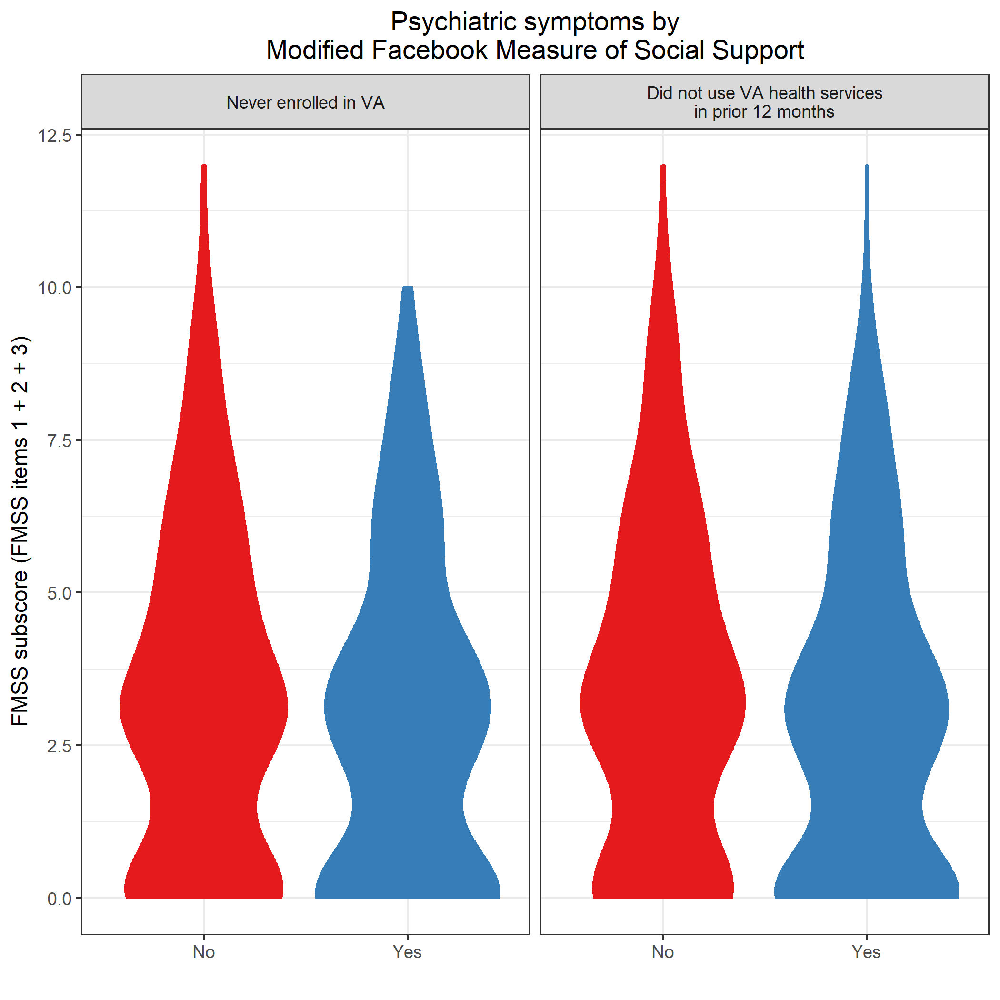


## Adjusted comparisons


Filter subjects with missing covariates.


Set modeling covariates.


```
## [1] "age"                      "gender"                  
## [3] "race"                     "hispanic"                
## [5] "marital2"                 "countSocialMediaExclFB"  
## [7] "comm_inperson"            "indSuicideConsideredEver"
## [9] "countSuicideAttempts"
```

### Never enrolled in VA


**PC-PTSD**


|model      |term                                              | oddsratio| std.error| statistic| p.value|
|:----------|:-------------------------------------------------|---------:|---------:|---------:|-------:|
|Unadjusted |(Intercept)                                       |     0.345|     0.226|    -4.709|   0.000|
|Unadjusted |fmssSubscore                                      |     0.927|     0.058|    -1.290|   0.197|
|Unadjusted |indNotPTSDTRUE                                    |     2.625|     0.288|     3.355|   0.001|
|Unadjusted |fmssSubscore:indNotPTSDTRUE                       |     1.011|     0.073|     0.155|   0.877|
|Adjusted   |(Intercept)                                       |     0.768|     0.456|    -0.579|   0.563|
|Adjusted   |fmssSubscore                                      |     0.955|     0.060|    -0.774|   0.439|
|Adjusted   |age                                               |     0.980|     0.008|    -2.439|   0.015|
|Adjusted   |genderFemale                                      |     0.797|     0.258|    -0.879|   0.379|
|Adjusted   |genderA gender not listed here                    |     2.138|     1.444|     0.526|   0.599|
|Adjusted   |raceAmerican Indian/Alaska Native/Native Hawaiian |     1.166|     0.908|     0.170|   0.865|
|Adjusted   |raceAsian                                         |     1.300|     0.806|     0.325|   0.745|
|Adjusted   |raceBlack or African American                     |     0.419|     1.130|    -0.769|   0.442|
|Adjusted   |raceMultiple races                                |     0.732|     0.364|    -0.856|   0.392|
|Adjusted   |raceOther                                         |     1.214|     0.635|     0.305|   0.761|
|Adjusted   |hispanicYes                                       |     1.649|     0.420|     1.192|   0.233|
|Adjusted   |marital2Single/Divorced/Widowed/Separated         |     1.082|     0.209|     0.377|   0.706|
|Adjusted   |countSocialMediaExclFB                            |     0.810|     0.108|    -1.952|   0.051|
|Adjusted   |comm_inpersonOnce a week                          |     1.051|     0.347|     0.143|   0.887|
|Adjusted   |comm_inpersonA few times a week                   |     0.923|     0.292|    -0.275|   0.784|
|Adjusted   |comm_inpersonOnce a day                           |     1.692|     0.349|     1.508|   0.132|
|Adjusted   |comm_inpersonSeveral times a day                  |     1.487|     0.258|     1.538|   0.124|
|Adjusted   |indSuicideConsideredEverTRUE                      |     1.218|     0.214|     0.922|   0.356|
|Adjusted   |countSuicideAttempts                              |     0.512|     0.234|    -2.857|   0.004|
|Adjusted   |indNotPTSDTRUE                                    |     2.459|     0.304|     2.958|   0.003|
|Adjusted   |fmssSubscore:indNotPTSDTRUE                       |     0.984|     0.075|    -0.214|   0.831|

\newline


|model      | null.deviance| df.null|   logLik|     AIC|     BIC| deviance| df.residual| nobs|
|:----------|-------------:|-------:|--------:|-------:|-------:|--------:|-----------:|----:|
|Unadjusted |       726.641|     572| -346.909| 701.819| 719.222|  693.819|         569|  573|
|Adjusted   |       726.641|     572| -331.281| 704.561| 795.930|  662.561|         552|  573|

**PHQ-2**


|model      |term                                              | oddsratio| std.error| statistic| p.value|
|:----------|:-------------------------------------------------|---------:|---------:|---------:|-------:|
|Unadjusted |(Intercept)                                       |     0.485|     0.265|    -2.727|   0.006|
|Unadjusted |fmssSubscore                                      |     0.856|     0.074|    -2.109|   0.035|
|Unadjusted |indNotPHQTRUE                                     |     1.353|     0.310|     0.976|   0.329|
|Unadjusted |fmssSubscore:indNotPHQTRUE                        |     1.123|     0.083|     1.394|   0.163|
|Adjusted   |(Intercept)                                       |     1.283|     0.462|     0.539|   0.590|
|Adjusted   |fmssSubscore                                      |     0.872|     0.074|    -1.860|   0.063|
|Adjusted   |age                                               |     0.978|     0.008|    -2.730|   0.006|
|Adjusted   |genderFemale                                      |     0.799|     0.256|    -0.877|   0.381|
|Adjusted   |genderA gender not listed here                    |     1.533|     1.472|     0.290|   0.772|
|Adjusted   |raceAmerican Indian/Alaska Native/Native Hawaiian |     1.012|     0.895|     0.013|   0.989|
|Adjusted   |raceAsian                                         |     1.276|     0.784|     0.311|   0.756|
|Adjusted   |raceBlack or African American                     |     0.355|     1.149|    -0.901|   0.368|
|Adjusted   |raceMultiple races                                |     0.728|     0.356|    -0.893|   0.372|
|Adjusted   |raceOther                                         |     1.173|     0.618|     0.258|   0.796|
|Adjusted   |hispanicYes                                       |     1.597|     0.408|     1.146|   0.252|
|Adjusted   |marital2Single/Divorced/Widowed/Separated         |     1.044|     0.206|     0.209|   0.834|
|Adjusted   |countSocialMediaExclFB                            |     0.800|     0.106|    -2.100|   0.036|
|Adjusted   |comm_inpersonOnce a week                          |     0.980|     0.344|    -0.060|   0.952|
|Adjusted   |comm_inpersonA few times a week                   |     0.900|     0.288|    -0.367|   0.714|
|Adjusted   |comm_inpersonOnce a day                           |     1.686|     0.343|     1.521|   0.128|
|Adjusted   |comm_inpersonSeveral times a day                  |     1.534|     0.252|     1.697|   0.090|
|Adjusted   |indSuicideConsideredEverTRUE                      |     1.184|     0.214|     0.789|   0.430|
|Adjusted   |countSuicideAttempts                              |     0.495|     0.227|    -3.090|   0.002|
|Adjusted   |indNotPHQTRUE                                     |     1.234|     0.327|     0.644|   0.520|
|Adjusted   |fmssSubscore:indNotPHQTRUE                        |     1.120|     0.084|     1.342|   0.180|

\newline


|model      | null.deviance| df.null|   logLik|     AIC|     BIC| deviance| df.residual| nobs|
|:----------|-------------:|-------:|--------:|-------:|-------:|--------:|-----------:|----:|
|Unadjusted |       728.856|     573| -356.950| 721.900| 739.311|  713.900|         570|  574|
|Adjusted   |       728.856|     573| -338.029| 718.058| 809.463|  676.058|         553|  574|

**AUDIT-C**


|model      |term                                              | oddsratio| std.error| statistic| p.value|
|:----------|:-------------------------------------------------|---------:|---------:|---------:|-------:|
|Unadjusted |(Intercept)                                       |     0.793|     0.209|    -1.107|   0.268|
|Unadjusted |fmssSubscore                                      |     0.894|     0.056|    -2.008|   0.045|
|Unadjusted |indNotAuditCTRUE                                  |     0.613|     0.277|    -1.765|   0.078|
|Unadjusted |fmssSubscore:indNotAuditCTRUE                     |     1.083|     0.071|     1.124|   0.261|
|Adjusted   |(Intercept)                                       |     1.756|     0.428|     1.315|   0.188|
|Adjusted   |fmssSubscore                                      |     0.914|     0.059|    -1.525|   0.127|
|Adjusted   |age                                               |     0.980|     0.008|    -2.450|   0.014|
|Adjusted   |genderFemale                                      |     0.863|     0.256|    -0.576|   0.565|
|Adjusted   |raceAmerican Indian/Alaska Native/Native Hawaiian |     1.057|     0.893|     0.062|   0.951|
|Adjusted   |raceAsian                                         |     1.514|     0.785|     0.529|   0.597|
|Adjusted   |raceBlack or African American                     |     0.395|     1.136|    -0.818|   0.413|
|Adjusted   |raceMultiple races                                |     0.735|     0.355|    -0.865|   0.387|
|Adjusted   |raceOther                                         |     1.256|     0.612|     0.372|   0.710|
|Adjusted   |hispanicYes                                       |     1.616|     0.409|     1.174|   0.240|
|Adjusted   |marital2Single/Divorced/Widowed/Separated         |     0.951|     0.209|    -0.242|   0.809|
|Adjusted   |countSocialMediaExclFB                            |     0.802|     0.106|    -2.077|   0.038|
|Adjusted   |comm_inpersonOnce a week                          |     1.036|     0.343|     0.103|   0.918|
|Adjusted   |comm_inpersonA few times a week                   |     1.058|     0.285|     0.198|   0.843|
|Adjusted   |comm_inpersonOnce a day                           |     1.996|     0.343|     2.016|   0.044|
|Adjusted   |comm_inpersonSeveral times a day                  |     1.693|     0.249|     2.110|   0.035|
|Adjusted   |indSuicideConsideredEverTRUE                      |     1.001|     0.208|     0.003|   0.998|
|Adjusted   |countSuicideAttempts                              |     0.496|     0.226|    -3.100|   0.002|
|Adjusted   |indNotAuditCTRUE                                  |     0.644|     0.298|    -1.480|   0.139|
|Adjusted   |fmssSubscore:indNotAuditCTRUE                     |     1.068|     0.074|     0.890|   0.373|

\newline


|model      | null.deviance| df.null|   logLik|     AIC|     BIC| deviance| df.residual| nobs|
|:----------|-------------:|-------:|--------:|-------:|-------:|--------:|-----------:|----:|
|Unadjusted |       724.419|     571| -358.757| 725.514| 742.910|  717.514|         568|  572|
|Adjusted   |       724.419|     571| -338.018| 716.035| 803.018|  676.035|         552|  572|

**DSI-SS**


|model      |term                                              | oddsratio| std.error| statistic| p.value|
|:----------|:-------------------------------------------------|---------:|---------:|---------:|-------:|
|Unadjusted |(Intercept)                                       |     0.369|     0.297|    -3.350|   0.001|
|Unadjusted |fmssSubscore                                      |     1.068|     0.075|     0.881|   0.378|
|Unadjusted |indNotDSISSTRUE                                   |     1.871|     0.335|     1.872|   0.061|
|Unadjusted |fmssSubscore:indNotDSISSTRUE                      |     0.849|     0.084|    -1.948|   0.051|
|Adjusted   |(Intercept)                                       |     0.996|     0.501|    -0.009|   0.993|
|Adjusted   |fmssSubscore                                      |     1.089|     0.078|     1.086|   0.278|
|Adjusted   |age                                               |     0.979|     0.008|    -2.545|   0.011|
|Adjusted   |genderFemale                                      |     0.808|     0.256|    -0.834|   0.404|
|Adjusted   |genderA gender not listed here                    |     1.266|     1.437|     0.164|   0.870|
|Adjusted   |raceAmerican Indian/Alaska Native/Native Hawaiian |     1.218|     0.892|     0.221|   0.825|
|Adjusted   |raceAsian                                         |     1.394|     0.777|     0.427|   0.669|
|Adjusted   |raceBlack or African American                     |     0.381|     1.151|    -0.837|   0.402|
|Adjusted   |raceMultiple races                                |     0.693|     0.356|    -1.030|   0.303|
|Adjusted   |raceOther                                         |     1.133|     0.612|     0.203|   0.839|
|Adjusted   |hispanicYes                                       |     1.678|     0.409|     1.266|   0.206|
|Adjusted   |marital2Single/Divorced/Widowed/Separated         |     1.099|     0.208|     0.453|   0.651|
|Adjusted   |countSocialMediaExclFB                            |     0.812|     0.105|    -1.981|   0.048|
|Adjusted   |comm_inpersonOnce a week                          |     1.039|     0.343|     0.112|   0.910|
|Adjusted   |comm_inpersonA few times a week                   |     1.005|     0.285|     0.016|   0.987|
|Adjusted   |comm_inpersonOnce a day                           |     1.847|     0.341|     1.798|   0.072|
|Adjusted   |comm_inpersonSeveral times a day                  |     1.723|     0.249|     2.181|   0.029|
|Adjusted   |indSuicideConsideredEverTRUE                      |     1.037|     0.219|     0.167|   0.867|
|Adjusted   |countSuicideAttempts                              |     0.472|     0.227|    -3.308|   0.001|
|Adjusted   |indNotDSISSTRUE                                   |     1.470|     0.369|     1.044|   0.297|
|Adjusted   |fmssSubscore:indNotDSISSTRUE                      |     0.845|     0.088|    -1.913|   0.056|

\newline


|model      | null.deviance| df.null|   logLik|     AIC|     BIC| deviance| df.residual| nobs|
|:----------|-------------:|-------:|--------:|-------:|-------:|--------:|-----------:|----:|
|Unadjusted |       728.856|     573| -360.533| 729.065| 746.476|  721.065|         570|  574|
|Adjusted   |       728.856|     573| -339.481| 720.961| 812.367|  678.961|         553|  574|


### Did not use VA health services in prior 12 months


**PC-PTSD**


|model      |term                                              | oddsratio| std.error| statistic| p.value|
|:----------|:-------------------------------------------------|---------:|---------:|---------:|-------:|
|Unadjusted |(Intercept)                                       |     0.750|     0.195|    -1.475|   0.140|
|Unadjusted |fmssSubscore                                      |     0.963|     0.047|    -0.789|   0.430|
|Unadjusted |indNotPTSDTRUE                                    |     3.674|     0.276|     4.712|   0.000|
|Unadjusted |fmssSubscore:indNotPTSDTRUE                       |     0.954|     0.065|    -0.712|   0.476|
|Adjusted   |(Intercept)                                       |     1.703|     0.428|     1.244|   0.214|
|Adjusted   |fmssSubscore                                      |     0.990|     0.050|    -0.198|   0.843|
|Adjusted   |age                                               |     0.981|     0.008|    -2.493|   0.013|
|Adjusted   |genderFemale                                      |     0.559|     0.238|    -2.447|   0.014|
|Adjusted   |genderA gender not listed here                    |     0.770|     1.457|    -0.179|   0.858|
|Adjusted   |raceAmerican Indian/Alaska Native/Native Hawaiian |     1.679|     0.860|     0.603|   0.546|
|Adjusted   |raceAsian                                         |     1.630|     0.828|     0.590|   0.555|
|Adjusted   |raceBlack or African American                     |     0.854|     0.824|    -0.191|   0.849|
|Adjusted   |raceMultiple races                                |     0.629|     0.329|    -1.408|   0.159|
|Adjusted   |raceOther                                         |     1.211|     0.604|     0.317|   0.751|
|Adjusted   |hispanicYes                                       |     1.871|     0.446|     1.404|   0.160|
|Adjusted   |marital2Single/Divorced/Widowed/Separated         |     0.853|     0.200|    -0.795|   0.426|
|Adjusted   |countSocialMediaExclFB                            |     0.991|     0.098|    -0.095|   0.924|
|Adjusted   |comm_inpersonOnce a week                          |     1.136|     0.318|     0.401|   0.689|
|Adjusted   |comm_inpersonA few times a week                   |     1.140|     0.272|     0.481|   0.631|
|Adjusted   |comm_inpersonOnce a day                           |     2.047|     0.360|     1.991|   0.046|
|Adjusted   |comm_inpersonSeveral times a day                  |     1.342|     0.247|     1.193|   0.233|
|Adjusted   |indSuicideConsideredEverTRUE                      |     1.108|     0.208|     0.492|   0.622|
|Adjusted   |countSuicideAttempts                              |     0.651|     0.156|    -2.763|   0.006|
|Adjusted   |indNotPTSDTRUE                                    |     3.426|     0.294|     4.184|   0.000|
|Adjusted   |fmssSubscore:indNotPTSDTRUE                       |     0.934|     0.069|    -0.995|   0.320|

\newline


|model      | null.deviance| df.null|   logLik|     AIC|     BIC| deviance| df.residual| nobs|
|:----------|-------------:|-------:|--------:|-------:|-------:|--------:|-----------:|----:|
|Unadjusted |       787.069|     571| -369.382| 746.763| 764.160|  738.763|         568|  572|
|Adjusted   |       787.069|     571| -352.144| 746.287| 837.619|  704.287|         551|  572|

**PHQ-2**


|model      |term                                              | oddsratio| std.error| statistic| p.value|
|:----------|:-------------------------------------------------|---------:|---------:|---------:|-------:|
|Unadjusted |(Intercept)                                       |     0.838|     0.243|    -0.729|   0.466|
|Unadjusted |fmssSubscore                                      |     0.896|     0.061|    -1.801|   0.072|
|Unadjusted |indNotPHQTRUE                                     |     2.216|     0.292|     2.729|   0.006|
|Unadjusted |fmssSubscore:indNotPHQTRUE                        |     1.071|     0.072|     0.959|   0.338|
|Adjusted   |(Intercept)                                       |     2.344|     0.439|     1.939|   0.052|
|Adjusted   |fmssSubscore                                      |     0.918|     0.062|    -1.365|   0.172|
|Adjusted   |age                                               |     0.977|     0.008|    -2.960|   0.003|
|Adjusted   |genderFemale                                      |     0.556|     0.235|    -2.496|   0.013|
|Adjusted   |genderA gender not listed here                    |     0.533|     1.553|    -0.405|   0.686|
|Adjusted   |raceAmerican Indian/Alaska Native/Native Hawaiian |     1.304|     0.872|     0.304|   0.761|
|Adjusted   |raceAsian                                         |     1.436|     0.788|     0.459|   0.646|
|Adjusted   |raceBlack or African American                     |     0.738|     0.848|    -0.358|   0.720|
|Adjusted   |raceMultiple races                                |     0.601|     0.323|    -1.577|   0.115|
|Adjusted   |raceOther                                         |     1.209|     0.603|     0.314|   0.753|
|Adjusted   |hispanicYes                                       |     1.670|     0.434|     1.182|   0.237|
|Adjusted   |marital2Single/Divorced/Widowed/Separated         |     0.822|     0.198|    -0.994|   0.320|
|Adjusted   |countSocialMediaExclFB                            |     0.961|     0.097|    -0.409|   0.683|
|Adjusted   |comm_inpersonOnce a week                          |     1.081|     0.316|     0.247|   0.805|
|Adjusted   |comm_inpersonA few times a week                   |     1.048|     0.269|     0.173|   0.863|
|Adjusted   |comm_inpersonOnce a day                           |     1.985|     0.358|     1.916|   0.055|
|Adjusted   |comm_inpersonSeveral times a day                  |     1.359|     0.243|     1.263|   0.207|
|Adjusted   |indSuicideConsideredEverTRUE                      |     1.132|     0.208|     0.595|   0.552|
|Adjusted   |countSuicideAttempts                              |     0.622|     0.156|    -3.051|   0.002|
|Adjusted   |indNotPHQTRUE                                     |     2.119|     0.311|     2.413|   0.016|
|Adjusted   |fmssSubscore:indNotPHQTRUE                        |     1.062|     0.075|     0.812|   0.417|

\newline


|model      | null.deviance| df.null|   logLik|     AIC|     BIC| deviance| df.residual| nobs|
|:----------|-------------:|-------:|--------:|-------:|-------:|--------:|-----------:|----:|
|Unadjusted |       788.261|     572| -377.901| 763.803| 781.206|  755.803|         569|  573|
|Adjusted   |       788.261|     572| -357.593| 757.186| 848.555|  715.186|         552|  573|

**AUDIT-C**


|model      |term                                              | oddsratio| std.error| statistic| p.value|
|:----------|:-------------------------------------------------|---------:|---------:|---------:|-------:|
|Unadjusted |(Intercept)                                       |     1.843|     0.212|     2.889|   0.004|
|Unadjusted |fmssSubscore                                      |     0.918|     0.053|    -1.620|   0.105|
|Unadjusted |indNotAuditCTRUE                                  |     0.692|     0.271|    -1.360|   0.174|
|Unadjusted |fmssSubscore:indNotAuditCTRUE                     |     1.046|     0.066|     0.681|   0.496|
|Adjusted   |(Intercept)                                       |     4.185|     0.416|     3.441|   0.001|
|Adjusted   |fmssSubscore                                      |     0.935|     0.057|    -1.197|   0.231|
|Adjusted   |age                                               |     0.981|     0.008|    -2.502|   0.012|
|Adjusted   |genderFemale                                      |     0.614|     0.232|    -2.102|   0.036|
|Adjusted   |raceAmerican Indian/Alaska Native/Native Hawaiian |     1.492|     0.849|     0.471|   0.638|
|Adjusted   |raceAsian                                         |     1.680|     0.778|     0.667|   0.505|
|Adjusted   |raceBlack or African American                     |     0.750|     0.819|    -0.352|   0.725|
|Adjusted   |raceMultiple races                                |     0.615|     0.318|    -1.528|   0.126|
|Adjusted   |raceOther                                         |     1.177|     0.580|     0.281|   0.779|
|Adjusted   |hispanicYes                                       |     1.740|     0.431|     1.286|   0.198|
|Adjusted   |marital2Single/Divorced/Widowed/Separated         |     0.762|     0.197|    -1.381|   0.167|
|Adjusted   |countSocialMediaExclFB                            |     0.970|     0.095|    -0.317|   0.751|
|Adjusted   |comm_inpersonOnce a week                          |     1.145|     0.311|     0.433|   0.665|
|Adjusted   |comm_inpersonA few times a week                   |     1.361|     0.262|     1.176|   0.240|
|Adjusted   |comm_inpersonOnce a day                           |     2.455|     0.356|     2.524|   0.012|
|Adjusted   |comm_inpersonSeveral times a day                  |     1.603|     0.237|     1.991|   0.047|
|Adjusted   |indSuicideConsideredEverTRUE                      |     0.898|     0.199|    -0.542|   0.587|
|Adjusted   |countSuicideAttempts                              |     0.609|     0.153|    -3.235|   0.001|
|Adjusted   |indNotAuditCTRUE                                  |     0.698|     0.294|    -1.223|   0.221|
|Adjusted   |fmssSubscore:indNotAuditCTRUE                     |     1.045|     0.070|     0.634|   0.526|

\newline


|model      | null.deviance| df.null|   logLik|     AIC|     BIC| deviance| df.residual| nobs|
|:----------|-------------:|-------:|--------:|-------:|-------:|--------:|-----------:|----:|
|Unadjusted |       785.467|     570| -389.900| 787.799| 805.189|  779.799|         567|  571|
|Adjusted   |       785.467|     570| -364.576| 769.153| 856.101|  729.153|         551|  571|

**DSI-SS**


|model      |term                                              | oddsratio| std.error| statistic| p.value|
|:----------|:-------------------------------------------------|---------:|---------:|---------:|-------:|
|Unadjusted |(Intercept)                                       |     0.965|     0.270|    -0.133|   0.894|
|Unadjusted |fmssSubscore                                      |     0.934|     0.072|    -0.959|   0.337|
|Unadjusted |indNotDSISSTRUE                                   |     1.801|     0.311|     1.895|   0.058|
|Unadjusted |fmssSubscore:indNotDSISSTRUE                      |     1.006|     0.080|     0.075|   0.940|
|Adjusted   |(Intercept)                                       |     2.877|     0.473|     2.233|   0.026|
|Adjusted   |fmssSubscore                                      |     0.935|     0.075|    -0.889|   0.374|
|Adjusted   |age                                               |     0.978|     0.008|    -2.897|   0.004|
|Adjusted   |genderFemale                                      |     0.578|     0.232|    -2.366|   0.018|
|Adjusted   |genderA gender not listed here                    |     0.538|     1.498|    -0.414|   0.679|
|Adjusted   |raceAmerican Indian/Alaska Native/Native Hawaiian |     1.447|     0.837|     0.442|   0.659|
|Adjusted   |raceAsian                                         |     1.514|     0.779|     0.533|   0.594|
|Adjusted   |raceBlack or African American                     |     0.748|     0.827|    -0.352|   0.725|
|Adjusted   |raceMultiple races                                |     0.615|     0.319|    -1.526|   0.127|
|Adjusted   |raceOther                                         |     1.086|     0.581|     0.142|   0.887|
|Adjusted   |hispanicYes                                       |     1.781|     0.430|     1.342|   0.179|
|Adjusted   |marital2Single/Divorced/Widowed/Separated         |     0.823|     0.196|    -0.993|   0.321|
|Adjusted   |countSocialMediaExclFB                            |     0.977|     0.095|    -0.248|   0.804|
|Adjusted   |comm_inpersonOnce a week                          |     1.115|     0.312|     0.348|   0.728|
|Adjusted   |comm_inpersonA few times a week                   |     1.267|     0.261|     0.907|   0.364|
|Adjusted   |comm_inpersonOnce a day                           |     2.181|     0.350|     2.225|   0.026|
|Adjusted   |comm_inpersonSeveral times a day                  |     1.596|     0.237|     1.969|   0.049|
|Adjusted   |indSuicideConsideredEverTRUE                      |     1.021|     0.209|     0.102|   0.919|
|Adjusted   |countSuicideAttempts                              |     0.617|     0.154|    -3.142|   0.002|
|Adjusted   |indNotDSISSTRUE                                   |     1.384|     0.347|     0.937|   0.349|
|Adjusted   |fmssSubscore:indNotDSISSTRUE                      |     1.028|     0.084|     0.326|   0.744|

\newline


|model      | null.deviance| df.null|   logLik|     AIC|     BIC| deviance| df.residual| nobs|
|:----------|-------------:|-------:|--------:|-------:|-------:|--------:|-----------:|----:|
|Unadjusted |        787.84|     572| -387.732| 783.464| 800.868|  775.464|         569|  573|
|Adjusted   |        787.84|     572| -365.252| 772.505| 863.873|  730.505|         552|  573|
# Respond to peer review comments

> On Jul 25, 2018, at 1:46 PM, Alan Teo <teoa@ohsu.edu> wrote:
> 
> Hi Ben, 
> 
> Hope summer is going great for you! Could you respond to two of the peer review
> comments? I'd appreciate if you could provide information to include in the
> response letter and any additional text to include in the paper.
> 
> For your convenience I've attached the paper and appended the two items below:
> 
> 3. Were demographic variables such as age, sex, marital status, etc. related to
> the frequency of social contact (either in-person or Facebook)? These
> demographic characteristics, in particular, may meaningfully relate to your
> constructs of interest and provide a context for some of the findings. 


|yvariable |fb_freq                       | mean |  sd  | min | max |  n  | freq  |
|:---------|:-----------------------------|:----:|:----:|:---:|:---:|:---:|:-----:|
|age       |Less_than_several_times_a_day | 42.8 | 12.9 | 22  | 75  | 133 | 22.7% |
|age       |Several_times_a_day           | 39.2 | 11.6 | 20  | 74  | 452 | 77.3% |

```
## 
## 	Welch Two Sample t-test
## 
## data:  age by fb_freq
## t = 2.9466, df = 198.73, p-value = 0.003597
## alternative hypothesis: true difference in means between group Less_than_several_times_a_day and group Several_times_a_day is not equal to 0
## 95 percent confidence interval:
##  1.214001 6.126840
## sample estimates:
## mean in group Less_than_several_times_a_day 
##                                    42.84962 
##           mean in group Several_times_a_day 
##                                    39.17920
```


|gender                   |fb_freq                       |  n  |  N  | freq  |
|:------------------------|:-----------------------------|:---:|:---:|:-----:|
|Male                     |Less_than_several_times_a_day | 108 | 472 | 0.229 |
|Male                     |Several_times_a_day           | 364 | 472 | 0.771 |
|Female                   |Less_than_several_times_a_day | 25  | 111 | 0.225 |
|Female                   |Several_times_a_day           | 86  | 111 | 0.775 |
|A gender not listed here |Several_times_a_day           |  2  |  2  | 1.000 |

```
## Warning in chisq.test(dfTemp$gender, dfTemp$fb_freq): Chi-squared approximation
## may be incorrect
```

```
## 
## 	Pearson's Chi-squared test
## 
## data:  dfTemp$gender and dfTemp$fb_freq
## X-squared = 0.5971, df = 2, p-value = 0.7419
```


|marital2                          |fb_freq                       |  n  |  N  | freq  |
|:---------------------------------|:-----------------------------|:---:|:---:|:-----:|
|Married or living as married      |Less_than_several_times_a_day | 79  | 362 | 0.218 |
|Married or living as married      |Several_times_a_day           | 283 | 362 | 0.782 |
|Single/Divorced/Widowed/Separated |Less_than_several_times_a_day | 53  | 222 | 0.239 |
|Single/Divorced/Widowed/Separated |Several_times_a_day           | 169 | 222 | 0.761 |

```
## 
## 	Pearson's Chi-squared test with Yates' continuity correction
## 
## data:  dfTemp$marital2 and dfTemp$fb_freq
## X-squared = 0.22395, df = 1, p-value = 0.636
```

Age was significantly associated with frequency of Facebook use `fb_freq`
(collapsed groups).
Several-times-a-day Facebook users were slightly younger on average.
The difference was only 
3.7 years
(42.8 years
versus
39.2 years).
Gender and marital status (collapsed groups) are not significantly associated with frequency of Facebook use.
 
> 4. How highly correlated are in-person contact with Facebook contact? Authors
> should address the potential concerns of multicollinearity of IVs in the
> logistic regression model.

Rerun `analyzeRQ[123].Rmd` without `comm_inperson` as a covariate in `covar`.
Compare with output from commit `632302` (6/11/2018).

* The models including `comm_inperson` had slightly attenuated coefficients for
`comm_facebook`
* The models not including `comm_inperson` had coefficients for `comm_facebook`
that were slightly away from the null; but still not significantly different
from the null
* Conclusion: the correlation between `comm_inperson` and `comm_facebook` does
not greatly bias the association between `comm_facebook` and any of the outcomes
# Correlation matrix for subset of variables

Context:

```
From: "Zhu, Yiqin" <Yiqin.Zhu@Pennmedicine.upenn.edu>  
Date: Tuesday, November 16, 2021 at 10:18 AM  
To: Alan Teo <teoa@ohsu.edu>  
Subject: [EXTERNAL] Correlation Matrix of your Paper - Request from a Researcher at UPenn  

Dear Dr. Alan Teo

My name is Yiqin Zhu and I am a research assistant under Dr. Lily Brown at the
University of Pennsylvania. Dr. Brown is working on a review paper and
meta-analysis. In the process, she came across your article entitled "Frequency
of social contact in-person vs. on Facebook: An examination of associations with
psychiatric symptoms in military veterans". She would be very interested in
including the paper in the analysis, but would need a correlation matrix from
the variables that you included in order to do so. I am writing on her behalf to
inquire about whether you might be willing to share the correlation matrix that
corresponds to the dataset from this article.

If you have any questions or concerns about this, you are welcome to contact Dr.
Lily Brown – her email address is lilybr@pennmedicine.upenn.edu and her office
phone number is 215-746-3346. She is happy to answer any questions that you
have, or to arrange for a time to speak if that would be helpful.

Thank you very much for considering.

Sincerely,

Yiqin Zhu
Center for the Treatment and Study of Anxiety
Research Assistant
University of Pennsylvania
```

and

```
Dear Dr. Teo,

Thank you so much! For this paper, we are interested in the correlations between
the following:

PC-PTSD
In-person social interaction
Social media social contact
DSI-SS

Please let me know if you need additional information. Thank you!

Lily A. Brown, PhD
Director
Center for the Treatment and Study of Anxiety
Assistant Professor
```

* `ptsd` PC-PTSD
  * Name of scale: PC-PTSD 
  * 6-point scale
  * Positive screen: `ptsd_intrusive` + `ptsd_avoidant` + `ptsd_guarded` + `ptsd_numb` + `ptsd_guilty` $\ge$ 3
* `comm_inperson` In-person social interaction
  * 5-point scale
* `fmss` Social media social contact
  * Modified Facebook Measure of Social Support (FMSS)
  * Continuous scale
  * Reverse-scored items are `fmss_r7` through `fmss_r10`
* `dsiss` DSI-SS
  * See [Joiner 2002](http://www.sciencedirect.com/science/article/pii/S0005796701000171)
  * *Scores on each item range from 0 to 3 and, for the inventory, from 0 to 12, with higher scores reflecting greater severity of suicidal ideation.*

Univariate frequency tables or histogram.


| ptsd| freq|      prop|
|----:|----:|---------:|
|    0|  184| 0.3134583|
|    1|   60| 0.1022147|
|    2|   75| 0.1277683|
|    3|   71| 0.1209540|
|    4|   72| 0.1226576|
|    5|  123| 0.2095400|
|   NA|    2| 0.0034072|


|comm_inperson                     | freq|      prop|
|:---------------------------------|----:|---------:|
|(1) Every few weeks or less often |  169| 0.2879046|
|(2) Once a week                   |   70| 0.1192504|
|(3) A few times a week            |  114| 0.1942078|
|(4) Once a day                    |   58| 0.0988075|
|(5) Several times a day           |  175| 0.2981261|
|(NA) NA                           |    1| 0.0017036|


| dsiss| freq|      prop|
|-----:|----:|---------:|
|     0|  411| 0.7001704|
|     1|   42| 0.0715503|
|     2|   29| 0.0494037|
|     3|   36| 0.0613288|
|     4|   28| 0.0477002|
|     5|   21| 0.0357751|
|     6|    6| 0.0102215|
|     7|    7| 0.0119250|
|     8|    3| 0.0051107|
|     9|    2| 0.0034072|
|    NA|    2| 0.0034072|


Correlation matrix.


|                      |       ptsd| comm_inperson_numeric|       fmss|      dsiss|
|:---------------------|----------:|---------------------:|----------:|----------:|
|ptsd                  |  1.0000000|            -0.2384990| -0.1295715|  0.3446499|
|comm_inperson_numeric | -0.2384990|             1.0000000|  0.0928634| -0.1300879|
|fmss                  | -0.1295715|             0.0928634|  1.0000000| -0.1428703|
|dsiss                 |  0.3446499|            -0.1300879| -0.1428703|  1.0000000|
