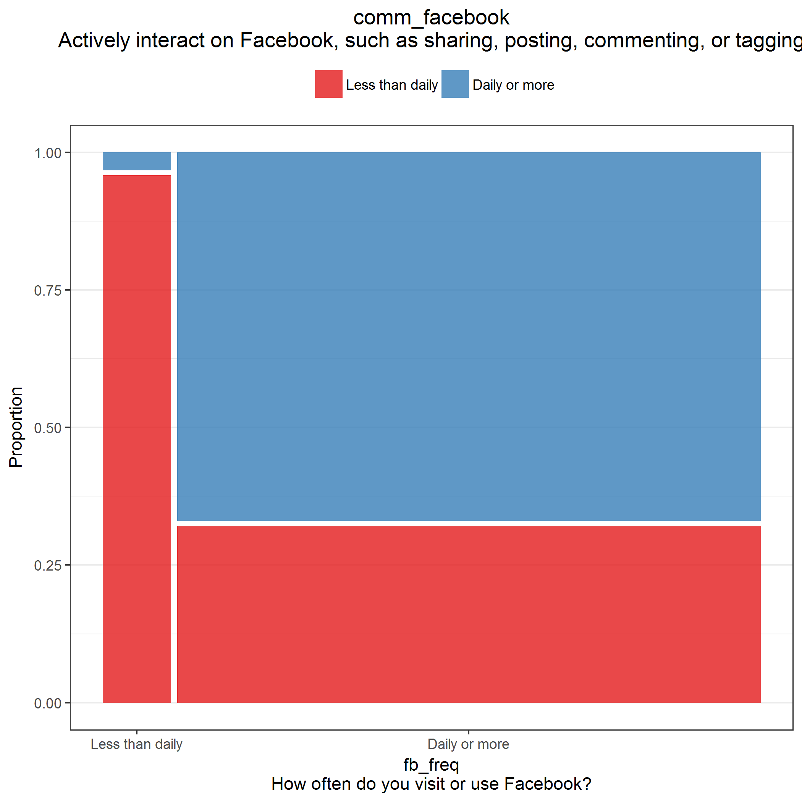
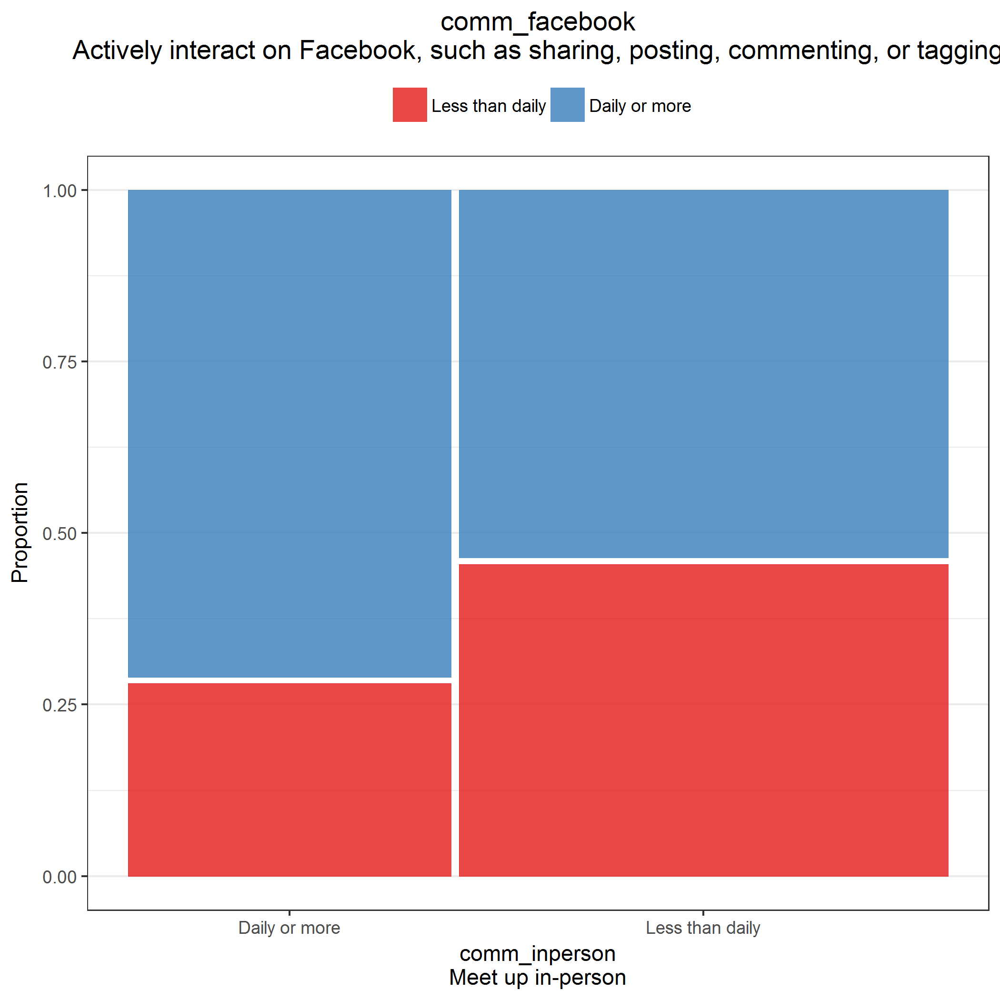
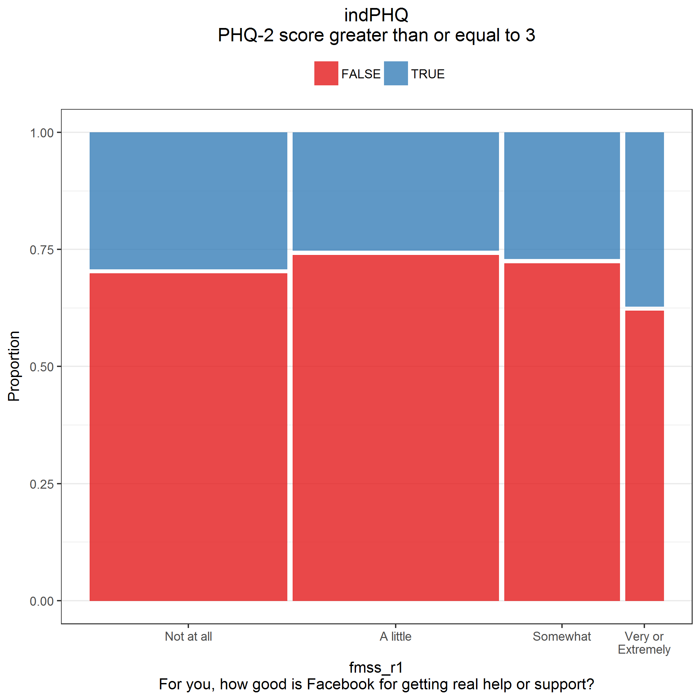
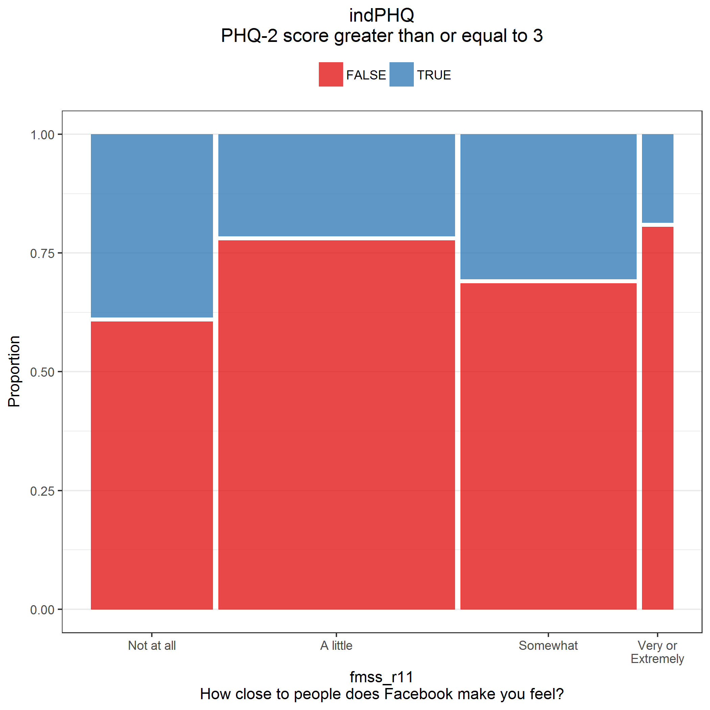
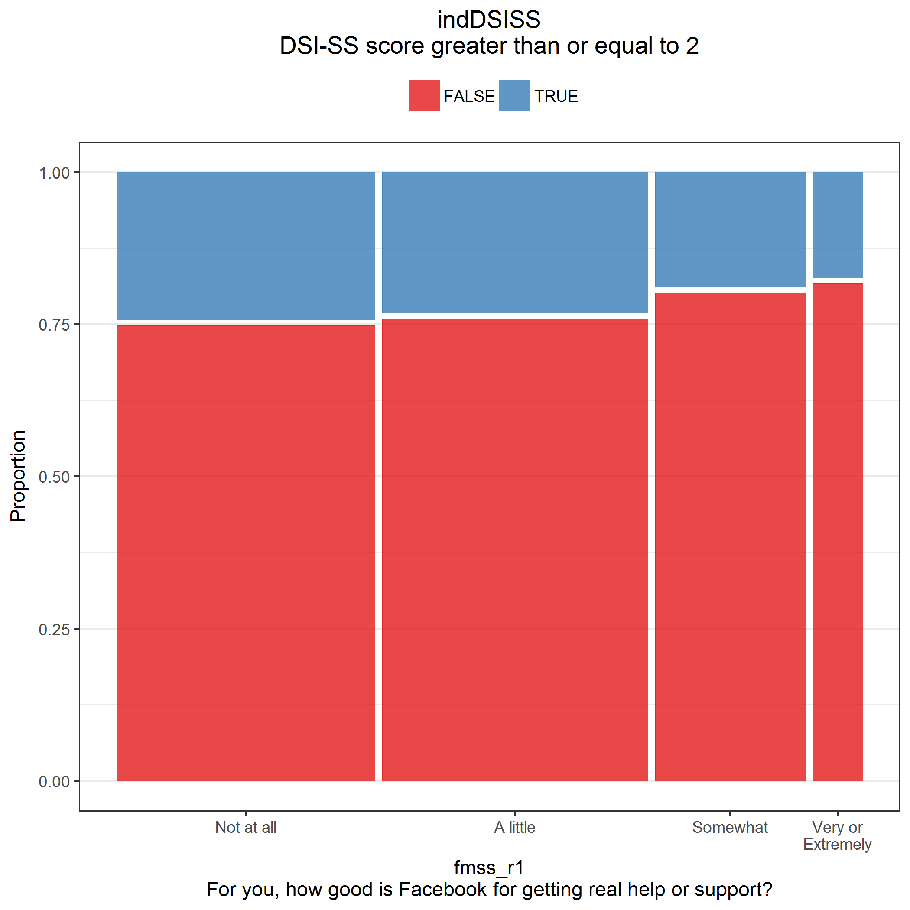
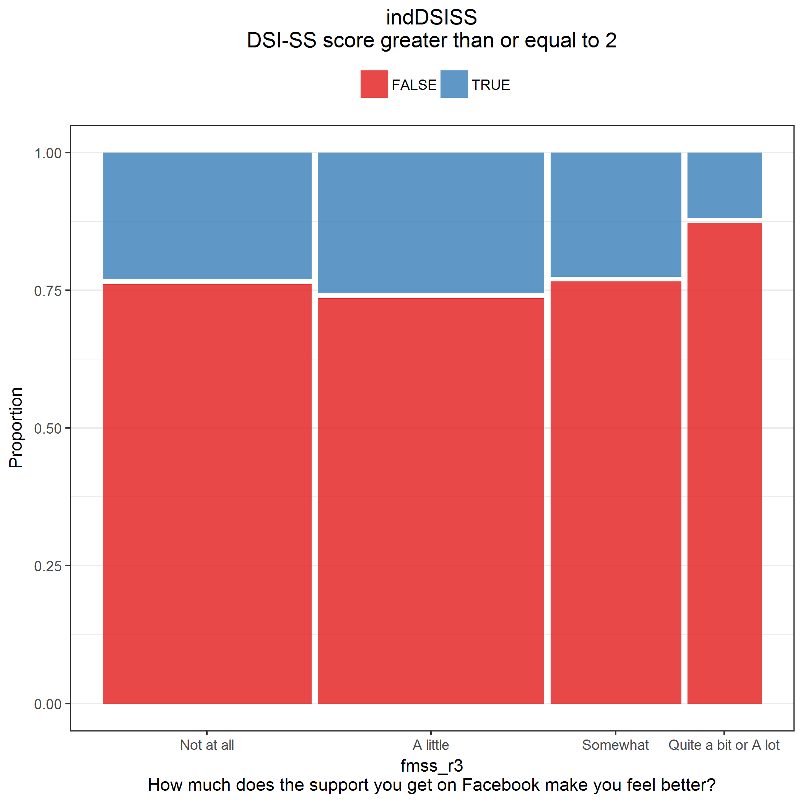
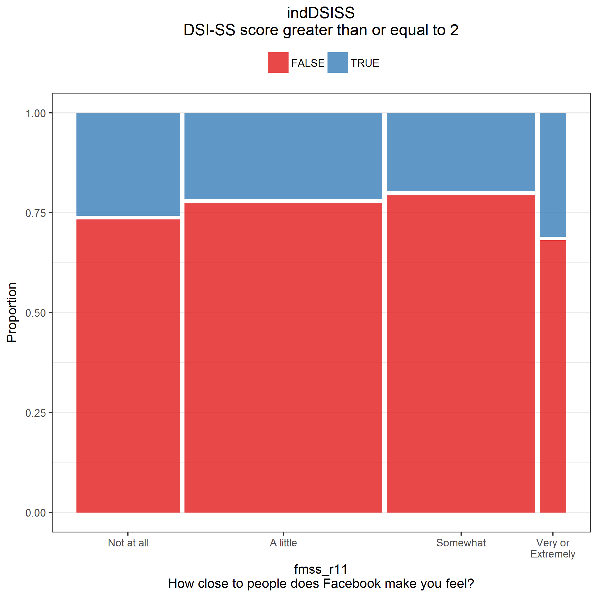
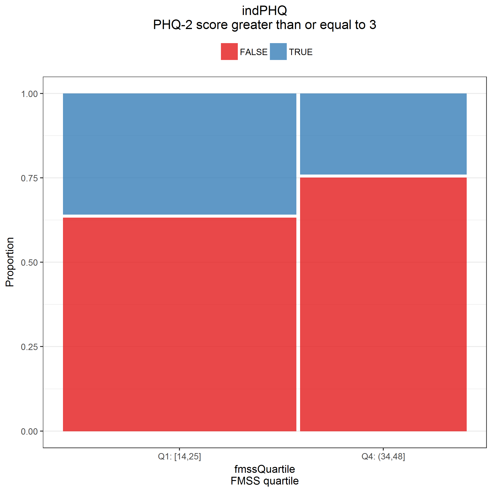
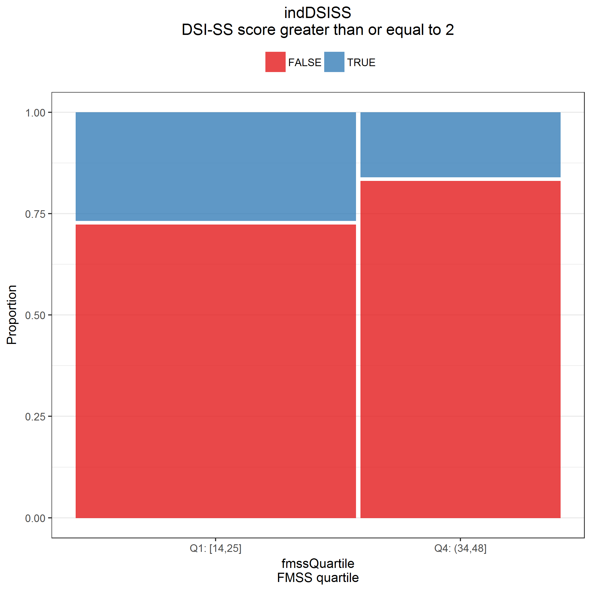

# Read data

**Most of this code was developed in Phase 1.**
Results will be suppressed for brevity.

**Use only the REDCap survey data**

Notes on the REDCap identifier variables:

* If `[consent] == 1`, they started the eligibility survey; 
  * if `== 0` or `== NA`, they didn't.
* If `[consent_and_eligibility_complete] == 2`, they finished the screener (whether eligible or ineligible); 
  * if `== 0`, they dropped out or never started.
* If `[eligible] == 1`, they completed the screener and were eligible; 
  * if `== 0`, they completed and were ineligible;
  * if `== NA` , they dropped out or never started.
* If `[veterans_and_social_media_use_co] == 2`, they finished the survey; 
  * if `== 0`, they dropped out or never started (this includes people who were ineligible or didn't consent).
* If `[analytic_sample] == 0`, they completed the survey but were disqualified for data quality reasons; 
  * if `== 1`, they completed survey and was not disqualified for data quality reasons;
  * if `== NA`, they didn't complete the survey.


| consent| consent_and_eligibility_complete| eligible| veterans_and_social_media_use_co| analytic_sample|   n|
|-------:|--------------------------------:|--------:|--------------------------------:|---------------:|---:|
|       0|                                0|       NA|                                0|              NA|   8|
|       0|                                2|        0|                                0|              NA|   7|
|       1|                                0|       NA|                                0|              NA|  84|
|       1|                                2|        0|                                0|              NA| 534|
|       1|                                2|        1|                                0|              NA| 106|
|       1|                                2|        1|                                2|               0|  18|
|       1|                                2|        1|                                2|               1| 587|
|      NA|                                0|       NA|                                0|              NA|  96|

Inclusion criteria

* Completed survey and was not disqualified for data quality reasons; `[analytic_sample] == 1`

**Number included: n = 587**

Cleaning

* Parse out `fba` into 2 separate variables for `image` and `text`
* Assign indicator for survey participation, `indSurveyParticipation`
  * `analytic_sample == 1`: Participant completed survey and was not disqualified for data quality reasons
* Assign indicator for eligibility screener participation, `indScreenerParticipation`
  * `eligible == 1`: Participant completed eligibility screener and was eligible to participate in full survey


## Use of VA health services


Recoding logic

* Primary analysis will code `9` (not sure) as `0` (No)
* Sensitivity analysis will exclude the `9` values from the analysis
* If `va_ever_enrolled == FALSE` & `is.na(va_use_12mo)`, then recode `va_use_12mo` to `FALSE`
* If `va_use_12mo == TRUE` & `va_ever_enrolled == FALSE`, then recode `va_ever_enrolled` to `TRUE`
* Code indicators `indVANeverEnrolled` and `indVANotUse12mo` as the logical opposites of `va_ever_enrolled` and `va_use_12mo`


## Independent variables

* Score the Modified Facebook Measure of Social Support (FMSS)
  * Reverse-scored items are `fmss_r7` through `fmss_r10`
* Standardize FMSS
* Prep FMSS items
  * Combine categories due to small cell sizes


```
##       fmss           fmssZ         
##  Min.   :14.00   Min.   :-2.29729  
##  1st Qu.:25.00   1st Qu.:-0.62179  
##  Median :29.00   Median :-0.01252  
##  Mean   :29.08   Mean   : 0.00000  
##  3rd Qu.:34.00   3rd Qu.: 0.74908  
##  Max.   :48.00   Max.   : 2.88153  
##  NA's   :15      NA's   :15
```

```
##       fmss fmssZ
## fmss     1     1
## fmssZ    1     1
```

```
##           fmss    fmssZ
## fmss  6.565197 2.562264
## fmssZ 2.562264 1.000000
```


|fmssQuartile |   n| min| max|
|:------------|---:|---:|---:|
|Q1: [14,25]  | 175|  14|  25|
|Q2: (25,29]  | 135|  26|  29|
|Q3: (29,34]  | 138|  30|  34|
|Q4: (34,48]  | 124|  35|  48|
|NA           |  15|  NA|  NA|

Check.


## Dependent variables

### Psychiatric symptoms (RQ1)

Code indicators for psychiatric disorder screening scales

* PTSD
  * Name of scale: PC-PTSD 
  * Positive screen: `ptsd_intrusive` + `ptsd_avoidant` + `ptsd_guarded` + `ptsd_numb` + `ptsd_guilty` $\ge$ 3
* Major depression
  * Name of scale: PHQ-2
  * Positive screen: `phq_interest` + `phq_mood` $\ge$ 3
* Alcohol misuse
  * Name of scale: AUDIT-C
  * Positive screen: `auditc_freq` + `auditc_amount` + `auditc_binge` $\ge$ 4 for men, $\ge$ 3 for women

Presence of suicidality is defined as DSI-SS score $\ge$ 2.
This cut-off score was chosen based on recommendations for population-based samples noted in 
[von Glischinski M Clin Psychol Psychotherapy 2015](http://onlinelibrary.wiley.com/doi/10.1002/cpp.2007/full)

* Score the DSI-SS inventory
  * See [Joiner 2002](http://www.sciencedirect.com/science/article/pii/S0005796701000171)
  * *Scores on each item range from 0 to 3 and, for the inventory, from 0 to 12, with higher scores reflecting greater severity of suicidal ideation.*


Check.


|yvariable |indPTSD | mean | sd  | min | max |  n  | freq  |
|:---------|:-------|:----:|:---:|:---:|:---:|:---:|:-----:|
|ptsd      |FALSE   | 0.9  | 0.9 |  0  |  2  | 236 | 47.0% |
|ptsd      |TRUE    | 4.2  | 0.8 |  3  |  5  | 266 | 53.0% |

\newline


|yvariable |indPHQ | mean | sd  | min | max |  n  | freq  |
|:---------|:------|:----:|:---:|:---:|:---:|:---:|:-----:|
|phq       |FALSE  | 1.0  | 0.9 |  0  |  2  | 422 | 72.0% |
|phq       |TRUE   | 4.5  | 1.2 |  3  |  6  | 164 | 28.0% |

\newline


|yvariable |indAuditC | mean | sd  | min | max |  n  | freq  |
|:---------|:---------|:----:|:---:|:---:|:---:|:---:|:-----:|
|auditc    |FALSE     | 1.8  | 0.8 |  1  |  3  | 234 | 49.1% |
|auditc    |TRUE      | 5.9  | 2.1 |  3  | 12  | 243 | 50.9% |

\newline


|yvariable |indDSISS | mean | sd  | min | max |  n  | freq  |
|:---------|:--------|:----:|:---:|:---:|:---:|:---:|:-----:|
|dsiss     |FALSE    | 0.1  | 0.3 |  0  |  1  | 453 | 77.4% |
|dsiss     |TRUE     | 3.9  | 1.6 |  2  |  9  | 132 | 22.6% |

Also create logical opposite for use in RQ3 modeling


### Social media use (RQ2)

* Spending more time on Facebook?
  * Frequency of Facebook use: `fb_freq`
  * Active use of Facebook: `comm_facebook`
* Sharing more personal or health-related information on social media?
  * `sm_emot_support`
  * `sm_med_info`
  * `sm_med_advice`
  * `sm_med_questions`
  * `sm_share_sympt`
  * `sm_share_health`
  * `sm_share_suicide`
  
Mutate variables to factors.


## Covariates

* Social media platforms used: `sm_used___1`, ..., `sm_used___7`, `sm_used___99`, `sm_used_other`
  * Recode the following `sm_used_other` values such that `sm_used___99 = 0`
    * `I use Wikipedia to read about illnesses I don't have; it's a curiosity/hobby thing.`
    * `just in person`
    * `Just plain internet search`
    * `TV/phone conversations, veterans group meetings`
    * `google; bing`
    * `aol`
    * `e-mail`
    * `Web MD`
    * `webmd`
* Offline social contact: `comm_inperson`
* History of suicidal ideation and suicide attempts
  * `suicide_considered_ever`
  * `suicide_considered_12mo`
  * `suicide_attempts` 


Check.


|smOther |sm_used_other                                                                       |   n|
|:-------|:-----------------------------------------------------------------------------------|---:|
|FALSE   |                                                                                    | 552|
|FALSE   |aol                                                                                 |   1|
|FALSE   |e-mail                                                                              |   1|
|FALSE   |google; bing                                                                        |   1|
|FALSE   |I use Wikipedia to read about illnesses I don't have; it's a curiosity/hobby thing. |   1|
|FALSE   |just in person                                                                      |   1|
|FALSE   |TV/phone conversations, veterans group meetings                                     |   1|
|FALSE   |Web MD,                                                                             |   1|
|FALSE   |webmd                                                                               |   1|
|TRUE    |4chan                                                                               |   2|
|TRUE    |Gmail Hangouts; Reddit.com                                                          |   1|
|TRUE    |Google+                                                                             |   2|
|TRUE    |I used LiveJournal for the majority of my service as well as my deployment to Iraq  |   1|
|TRUE    |Linked In                                                                           |   1|
|TRUE    |LinkedIn, Snapchat                                                                  |   1|
|TRUE    |LiveJournal                                                                         |   1|
|TRUE    |MIL.MIL                                                                             |   1|
|TRUE    |Ravelry Forums                                                                      |   1|
|TRUE    |reddit                                                                              |   3|
|TRUE    |Reddit                                                                              |   5|
|TRUE    |Snao Chat                                                                           |   1|
|TRUE    |snapchat                                                                            |   3|
|TRUE    |Snapchat                                                                            |   1|
|TRUE    |SnapChat                                                                            |   1|
|TRUE    |webmd, mayoclinic,wikipedia, va                                                     |   1|
|TRUE    |www.coping-with-epilepsy.com                                                        |   1|

\newline

Number of social media platforms used (excluding Facebook):


| countSocialMediaExclFB|   n|
|----------------------:|---:|
|                      0| 347|
|                      1| 138|
|                      2|  68|
|                      3|  21|
|                      4|  11|
|                      5|   2|

\newline


|comm_inperson                 |   n|
|:-----------------------------|---:|
|Several times a day           | 175|
|Once a day                    |  58|
|A few times a week            | 114|
|Once a week                   |  70|
|Every few weeks or less often | 169|
|NA                            |   1|

\newline


|indSuicideConsideredEver |indSuicideConsidered12mo |indSuicideAttempt | countSuicideAttempts|   n|
|:------------------------|:------------------------|:-----------------|--------------------:|---:|
|FALSE                    |FALSE                    |FALSE             |                    0| 330|
|TRUE                     |FALSE                    |FALSE             |                    0| 140|
|TRUE                     |FALSE                    |TRUE              |                    1|  31|
|TRUE                     |TRUE                     |FALSE             |                    0|  29|
|TRUE                     |FALSE                    |TRUE              |                    2|  16|
|TRUE                     |TRUE                     |TRUE              |                    1|  11|
|TRUE                     |FALSE                    |TRUE              |                    3|   9|
|TRUE                     |TRUE                     |TRUE              |                    3|   8|
|TRUE                     |TRUE                     |TRUE              |                    2|   7|
|TRUE                     |FALSE                    |TRUE              |                    4|   2|
|TRUE                     |FALSE                    |TRUE              |                    5|   2|
|TRUE                     |TRUE                     |TRUE              |                    5|   1|
|NA                       |NA                       |NA                |                  NaN|   1|
# Research Question 1

**Is perceived social support received from Facebook (FMSS) associated with lower rates of**

* Positive screens for psychiatric disorders
  * PC-PTSD
  * PHQ-2
  * AUDIT-C
* Positive screen for suicidality?
  * DSI-SS


## Unadjusted comparisons


|yvariable |indPTSD | mean | sd  | min | max |  n  | freq  |
|:---------|:-------|:----:|:---:|:---:|:---:|:---:|:-----:|
|fmss      |FALSE   | 29.3 | 6.4 | 14  | 45  | 228 | 46.6% |
|fmss      |TRUE    | 28.3 | 6.8 | 16  | 48  | 261 | 53.4% |

\newline


|yvariable |indPHQ | mean | sd  | min | max |  n  | freq  |
|:---------|:------|:----:|:---:|:---:|:---:|:---:|:-----:|
|fmss      |FALSE  | 29.5 | 6.4 | 16  | 48  | 412 | 72.2% |
|fmss      |TRUE   | 27.9 | 6.9 | 14  | 44  | 159 | 27.8% |

\newline


|yvariable |indAuditC | mean | sd  | min | max |  n  | freq  |
|:---------|:---------|:----:|:---:|:---:|:---:|:---:|:-----:|
|fmss      |FALSE     | 29.7 | 6.6 | 14  | 48  | 230 | 49.6% |
|fmss      |TRUE      | 29.0 | 6.3 | 16  | 45  | 234 | 50.4% |

\newline


|yvariable |indDSISS | mean | sd  | min | max |  n  | freq  |
|:---------|:--------|:----:|:---:|:---:|:---:|:---:|:-----:|
|fmss      |FALSE    | 29.5 | 6.6 | 16  | 48  | 442 | 77.5% |
|fmss      |TRUE     | 27.6 | 6.4 | 14  | 44  | 128 | 22.5% |

\newline


## Adjusted comparisons


```
##           fmss fmssZ
## fmss  6.565197     0
## fmssZ 0.000000     1
```

Filter subjects with missing covariates.


### PC-PTSD


|model      |term                                       | oddsratio| std.error| statistic| p.value|
|:----------|:------------------------------------------|---------:|---------:|---------:|-------:|
|Unadjusted |(Intercept)                                |     1.129|     0.091|     1.336|   0.182|
|Unadjusted |fmssZ                                      |     0.866|     0.090|    -1.600|   0.110|
|Adjusted   |(Intercept)                                |     0.428|     0.210|    -4.037|   0.000|
|Adjusted   |fmssZ                                      |     0.890|     0.099|    -1.181|   0.238|
|Adjusted   |countSocialMediaExclFB                     |     1.022|     0.099|     0.216|   0.829|
|Adjusted   |comm_inpersonOnce a day                    |     1.629|     0.358|     1.363|   0.173|
|Adjusted   |comm_inpersonA few times a week            |     1.326|     0.279|     1.013|   0.311|
|Adjusted   |comm_inpersonOnce a week                   |     1.907|     0.335|     1.925|   0.054|
|Adjusted   |comm_inpersonEvery few weeks or less often |     2.919|     0.258|     4.149|   0.000|
|Adjusted   |indSuicideConsideredEverTRUE               |     2.109|     0.215|     3.471|   0.001|
|Adjusted   |countSuicideAttempts                       |     1.680|     0.179|     2.895|   0.004|

\newline


|model      | null.deviance| df.null|   logLik|     AIC|     BIC| deviance| df.residual|
|:----------|-------------:|-------:|--------:|-------:|-------:|--------:|-----------:|
|Unadjusted |       673.151|     486| -335.287| 674.573| 682.950|  670.573|         485|
|Adjusted   |       673.151|     486| -304.159| 626.319| 664.013|  608.319|         478|


### PHQ-2


|model      |term                                       | oddsratio| std.error| statistic| p.value|
|:----------|:------------------------------------------|---------:|---------:|---------:|-------:|
|Unadjusted |(Intercept)                                |     0.379|     0.095|   -10.232|   0.000|
|Unadjusted |fmssZ                                      |     0.770|     0.096|    -2.713|   0.007|
|Adjusted   |(Intercept)                                |     0.141|     0.240|    -8.173|   0.000|
|Adjusted   |fmssZ                                      |     0.814|     0.102|    -2.008|   0.045|
|Adjusted   |countSocialMediaExclFB                     |     0.958|     0.105|    -0.405|   0.686|
|Adjusted   |comm_inpersonOnce a day                    |     1.052|     0.415|     0.121|   0.904|
|Adjusted   |comm_inpersonA few times a week            |     0.907|     0.320|    -0.305|   0.760|
|Adjusted   |comm_inpersonOnce a week                   |     1.849|     0.333|     1.844|   0.065|
|Adjusted   |comm_inpersonEvery few weeks or less often |     2.506|     0.264|     3.481|   0.000|
|Adjusted   |indSuicideConsideredEverTRUE               |     3.098|     0.222|     5.087|   0.000|
|Adjusted   |countSuicideAttempts                       |     1.245|     0.124|     1.764|   0.078|

\newline


|model      | null.deviance| df.null|   logLik|     AIC|     BIC| deviance| df.residual|
|:----------|-------------:|-------:|--------:|-------:|-------:|--------:|-----------:|
|Unadjusted |       672.272|     568| -332.363| 668.726| 677.413|  664.726|         567|
|Adjusted   |       672.272|     568| -297.957| 613.914| 653.009|  595.914|         560|


### AUDIT-C


|model      |term                                       | oddsratio| std.error| statistic| p.value|
|:----------|:------------------------------------------|---------:|---------:|---------:|-------:|
|Unadjusted |(Intercept)                                |     1.031|     0.093|     0.323|   0.746|
|Unadjusted |fmssZ                                      |     0.891|     0.095|    -1.220|   0.222|
|Adjusted   |(Intercept)                                |     0.679|     0.202|    -1.915|   0.056|
|Adjusted   |fmssZ                                      |     0.912|     0.098|    -0.939|   0.348|
|Adjusted   |countSocialMediaExclFB                     |     1.045|     0.097|     0.450|   0.652|
|Adjusted   |comm_inpersonOnce a day                    |     1.253|     0.355|     0.635|   0.525|
|Adjusted   |comm_inpersonA few times a week            |     1.128|     0.267|     0.452|   0.652|
|Adjusted   |comm_inpersonOnce a week                   |     1.928|     0.332|     1.976|   0.048|
|Adjusted   |comm_inpersonEvery few weeks or less often |     1.627|     0.253|     1.926|   0.054|
|Adjusted   |indSuicideConsideredEverTRUE               |     1.463|     0.214|     1.781|   0.075|
|Adjusted   |countSuicideAttempts                       |     0.864|     0.132|    -1.108|   0.268|

\newline


|model      | null.deviance| df.null|   logLik|     AIC|     BIC| deviance| df.residual|
|:----------|-------------:|-------:|--------:|-------:|-------:|--------:|-----------:|
|Unadjusted |        640.39|     461| -319.447| 642.894| 651.165|  638.894|         460|
|Adjusted   |        640.39|     461| -314.297| 646.593| 683.813|  628.593|         453|


### DSI-SS


|model      |term                                       | oddsratio| std.error| statistic| p.value|
|:----------|:------------------------------------------|---------:|---------:|---------:|-------:|
|Unadjusted |(Intercept)                                |     0.280|     0.103|   -12.364|   0.000|
|Unadjusted |fmssZ                                      |     0.732|     0.105|    -2.981|   0.003|
|Adjusted   |(Intercept)                                |     0.074|     0.284|    -9.173|   0.000|
|Adjusted   |fmssZ                                      |     0.751|     0.114|    -2.514|   0.012|
|Adjusted   |countSocialMediaExclFB                     |     1.047|     0.110|     0.414|   0.679|
|Adjusted   |comm_inpersonOnce a day                    |     1.013|     0.467|     0.028|   0.978|
|Adjusted   |comm_inpersonA few times a week            |     1.122|     0.337|     0.341|   0.733|
|Adjusted   |comm_inpersonOnce a week                   |     1.428|     0.361|     0.986|   0.324|
|Adjusted   |comm_inpersonEvery few weeks or less often |     1.680|     0.295|     1.757|   0.079|
|Adjusted   |indSuicideConsideredEverTRUE               |     5.491|     0.256|     6.664|   0.000|
|Adjusted   |countSuicideAttempts                       |     1.295|     0.123|     2.102|   0.036|

\newline


|model      | null.deviance| df.null|   logLik|     AIC|     BIC| deviance| df.residual|
|:----------|-------------:|-------:|--------:|-------:|-------:|--------:|-----------:|
|Unadjusted |       604.194|     568| -297.503| 599.006| 607.694|  595.006|         567|
|Adjusted   |       604.194|     568| -254.388| 526.776| 565.871|  508.776|         560|


## Additional questions

> Some issues that additional analysis could clarify is whether people have a
> tendency to substitute social contact on social media for in-person social
> contact, and whether that substitution is bad for your emotional well-being.
> It would be interesting to look at:
> 
> * Do people who spend a lot of time (or frequently use) Facebook spend less
>   time meeting up in-person (i.e., possibly substitute one form of social
>   contact for another)? Variables: `comm_facebook`, `fb_freq`, `comm_inperson`
> * Do people who spend a lot of time (or frequently use) Facebook and spend
>   less time in-person have higher risk for psychiatric disorders?


```
## $rowvar
## [1] "comm_facebook: Actively interact on Facebook, such as sharing, posting, commenting, or tagging"
## 
## $colvar
## [1] "fb_freq: How often do you visit or use Facebook?"
## 
## $table
##                  fb_freq
## comm_facebook     Less than daily Daily or more Sum
##   Less than daily              59           170 229
##   Daily or more                 2           354 356
##   Sum                          61           524 585
## 
## $expected
##                  fb_freq
## comm_facebook     Less than daily Daily or more
##   Less than daily        23.87863      205.1214
##   Daily or more          37.12137      318.8786
## 
## $residual
##                  fb_freq
## comm_facebook     Less than daily Daily or more
##   Less than daily        7.187315     -2.452257
##   Daily or more         -5.764471      1.966793
## 
## $propRow
##                  fb_freq
## comm_facebook     Less than daily Daily or more   Sum
##   Less than daily           0.258         0.742 1.000
##   Daily or more             0.006         0.994 1.000
## 
## $propCol
##                  fb_freq
## comm_facebook     Less than daily Daily or more
##   Less than daily           0.967         0.324
##   Daily or more             0.033         0.676
##   Sum                       1.000         1.000
## 
## $chisq.test
## 
## 	Pearson's Chi-squared test with Yates' continuity correction
## 
## data:  T
## X-squared = 92.089, df = 1, p-value < 2.2e-16
## 
## 
## $plot
```



```
## $rowvar
## [1] "comm_facebook: Actively interact on Facebook, such as sharing, posting, commenting, or tagging"
## 
## $colvar
## [1] "comm_inperson: Meet up in-person"
## 
## $table
##                  comm_inperson
## comm_facebook     Daily or more Less than daily Sum
##   Less than daily            66             162 228
##   Daily or more             167             191 358
##   Sum                       233             353 586
## 
## $expected
##                  comm_inperson
## comm_facebook     Daily or more Less than daily
##   Less than daily      90.65529        137.3447
##   Daily or more       142.34471        215.6553
## 
## $residual
##                  comm_inperson
## comm_facebook     Daily or more Less than daily
##   Less than daily     -2.589486        2.103799
##   Daily or more        2.066519       -1.678920
## 
## $propRow
##                  comm_inperson
## comm_facebook     Daily or more Less than daily   Sum
##   Less than daily         0.289           0.711 1.000
##   Daily or more           0.466           0.534 1.000
## 
## $propCol
##                  comm_inperson
## comm_facebook     Daily or more Less than daily
##   Less than daily         0.283           0.459
##   Daily or more           0.717           0.541
##   Sum                     1.000           1.000
## 
## $chisq.test
## 
## 	Pearson's Chi-squared test with Yates' continuity correction
## 
## data:  T
## X-squared = 17.489, df = 1, p-value = 2.89e-05
## 
## 
## $plot
```



```
## $rowvar
## [1] "fb_freq: How often do you visit or use Facebook?"
## 
## $colvar
## [1] "comm_inperson: Meet up in-person"
## 
## $table
##                  comm_inperson
## fb_freq           Daily or more Less than daily Sum
##   Less than daily            23              37  60
##   Daily or more             210             314 524
##   Sum                       233             351 584
## 
## $expected
##                  comm_inperson
## fb_freq           Daily or more Less than daily
##   Less than daily      23.93836        36.06164
##   Daily or more       209.06164       314.93836
## 
## $residual
##                  comm_inperson
## fb_freq           Daily or more Less than daily
##   Less than daily   -0.19178761      0.15625897
##   Daily or more      0.06489788     -0.05287555
## 
## $propRow
##                  comm_inperson
## fb_freq           Daily or more Less than daily   Sum
##   Less than daily         0.383           0.617 1.000
##   Daily or more           0.401           0.599 1.000
## 
## $propCol
##                  comm_inperson
## fb_freq           Daily or more Less than daily
##   Less than daily         0.099           0.105
##   Daily or more           0.901           0.895
##   Sum                     1.000           1.000
## 
## $chisq.test
## 
## 	Pearson's Chi-squared test with Yates' continuity correction
## 
## data:  T
## X-squared = 0.014885, df = 1, p-value = 0.9029
## 
## 
## $plot
```


## FMSS items

Closely exam FMSS items 1, 3, and 11

* `fmss_r1` For you, how good is Facebook for getting real help or support?
* `fmss_r3` How much does the support you get on Facebook make you feel better?
* `fmss_r11` How close to people does Facebook make you feel?


```
## $rowvar
## [1] "indPHQ: PHQ-2 score greater than or equal to 3"
## 
## $colvar
## [1] "fmss_r1: For you, how good is Facebook for getting real help or support?"
## 
## $table
##        fmss_r1
## indPHQ  Not at all A little Somewhat Very or Extremely Sum
##   FALSE        146      161       88                25 420
##   TRUE          61       55       33                15 164
##   Sum          207      216      121                40 584
## 
## $expected
##        fmss_r1
## indPHQ  Not at all  A little Somewhat Very or Extremely
##   FALSE  148.86986 155.34247 87.02055          28.76712
##   TRUE    58.13014  60.65753 33.97945          11.23288
## 
## $residual
##        fmss_r1
## indPHQ  Not at all   A little   Somewhat Very or Extremely
##   FALSE -0.2352111  0.4539229  0.1049959        -0.7023630
##   TRUE   0.3764094 -0.7264150 -0.1680254         1.1239949
## 
## $propRow
##        fmss_r1
## indPHQ  Not at all A little Somewhat Very or Extremely   Sum
##   FALSE      0.348    0.383    0.210             0.060 1.000
##   TRUE       0.372    0.335    0.201             0.091 1.000
## 
## $propCol
##        fmss_r1
## indPHQ  Not at all A little Somewhat Very or Extremely
##   FALSE      0.705    0.745    0.727             0.625
##   TRUE       0.295    0.255    0.273             0.375
##   Sum        1.000    1.000    1.000             1.000
## 
## $chisq.test
## 
## 	Pearson's Chi-squared test
## 
## data:  T
## X-squared = 2.7267, df = 3, p-value = 0.4357
## 
## 
## $plot
```



```
## $rowvar
## [1] "indPHQ: PHQ-2 score greater than or equal to 3"
## 
## $colvar
## [1] "fmss_r3: How much does the support you get on Facebook make you feel better?"
## 
## $table
##        fmss_r3
## indPHQ  Not at all A little Somewhat Quite a bit or A lot Sum
##   FALSE        132      149       87                   51 419
##   TRUE          58       57       33                   16 164
##   Sum          190      206      120                   67 583
## 
## $expected
##        fmss_r3
## indPHQ  Not at all  A little Somewhat Quite a bit or A lot
##   FALSE  136.55232 148.05146 86.24357             48.15266
##   TRUE    53.44768  57.94854 33.75643             18.84734
## 
## $residual
##        fmss_r3
## indPHQ   Not at all    A little    Somewhat Quite a bit or A lot
##   FALSE -0.38956760  0.07795612  0.08145292           0.41032634
##   TRUE   0.62268430 -0.12460496 -0.13019424          -0.65586504
## 
## $propRow
##        fmss_r3
## indPHQ  Not at all A little Somewhat Quite a bit or A lot   Sum
##   FALSE      0.315    0.356    0.208                0.122 1.000
##   TRUE       0.354    0.348    0.201                0.098 1.000
## 
## $propCol
##        fmss_r3
## indPHQ  Not at all A little Somewhat Quite a bit or A lot
##   FALSE      0.695    0.723    0.725                0.761
##   TRUE       0.305    0.277    0.275                0.239
##   Sum        1.000    1.000    1.000                1.000
## 
## $chisq.test
## 
## 	Pearson's Chi-squared test
## 
## data:  T
## X-squared = 1.1832, df = 3, p-value = 0.757
## 
## 
## $plot
```


```
## $rowvar
## [1] "indPHQ: PHQ-2 score greater than or equal to 3"
## 
## $colvar
## [1] "fmss_r11: How close to people does Facebook make you feel?"
## 
## $table
##        fmss_r11
## indPHQ  Not at all A little Somewhat Very or Extremely Sum
##   FALSE         77      192      126                26 421
##   TRUE          49       53       56                 6 164
##   Sum          126      245      182                32 585
## 
## $expected
##        fmss_r11
## indPHQ  Not at all  A little  Somewhat Very or Extremely
##   FALSE   90.67692 176.31624 130.97778          23.02906
##   TRUE    35.32308  68.68376  51.02222           8.97094
## 
## $residual
##        fmss_r11
## indPHQ  Not at all   A little   Somewhat Very or Extremely
##   FALSE -1.4362830  1.1811473 -0.4349474         0.6190929
##   TRUE   2.3012253 -1.8924446  0.6968765        -0.9919161
## 
## $propRow
##        fmss_r11
## indPHQ  Not at all A little Somewhat Very or Extremely   Sum
##   FALSE      0.183    0.456    0.299             0.062 1.000
##   TRUE       0.299    0.323    0.341             0.037 1.000
## 
## $propCol
##        fmss_r11
## indPHQ  Not at all A little Somewhat Very or Extremely
##   FALSE      0.611    0.784    0.692             0.812
##   TRUE       0.389    0.216    0.308             0.188
##   Sum        1.000    1.000    1.000             1.000
## 
## $chisq.test
## 
## 	Pearson's Chi-squared test
## 
## data:  T
## X-squared = 14.377, df = 3, p-value = 0.002434
## 
## 
## $plot
```



```
## $rowvar
## [1] "indDSISS: DSI-SS score greater than or equal to 2"
## 
## $colvar
## [1] "fmss_r1: For you, how good is Facebook for getting real help or support?"
## 
## $table
##         fmss_r1
## indDSISS Not at all A little Somewhat Very or Extremely Sum
##    FALSE        157      164       98                33 452
##    TRUE          51       50       23                 7 131
##    Sum          208      214      121                40 583
## 
## $expected
##         fmss_r1
## indDSISS Not at all  A little Somewhat Very or Extremely
##    FALSE  161.26244 165.91424 93.81132         31.012007
##    TRUE    46.73756  48.08576 27.18868          8.987993
## 
## $residual
##         fmss_r1
## indDSISS Not at all   A little   Somewhat Very or Extremely
##    FALSE -0.3356535 -0.1486120  0.4324635         0.3569850
##    TRUE   0.6234833  0.2760498 -0.8033098        -0.6631069
## 
## $propRow
##         fmss_r1
## indDSISS Not at all A little Somewhat Very or Extremely   Sum
##    FALSE      0.347    0.363    0.217             0.073 1.000
##    TRUE       0.389    0.382    0.176             0.053 1.000
## 
## $propCol
##         fmss_r1
## indDSISS Not at all A little Somewhat Very or Extremely
##    FALSE      0.755    0.766    0.810             0.825
##    TRUE       0.245    0.234    0.190             0.175
##    Sum        1.000    1.000    1.000             1.000
## 
## $chisq.test
## 
## 	Pearson's Chi-squared test
## 
## data:  T
## X-squared = 1.9992, df = 3, p-value = 0.5726
## 
## 
## $plot
```



```
## $rowvar
## [1] "indDSISS: DSI-SS score greater than or equal to 2"
## 
## $colvar
## [1] "fmss_r3: How much does the support you get on Facebook make you feel better?"
## 
## $table
##         fmss_r3
## indDSISS Not at all A little Somewhat Quite a bit or A lot Sum
##    FALSE        146      153       92                   59 450
##    TRUE          44       53       27                    8 132
##    Sum          190      206      119                   67 582
## 
## $expected
##         fmss_r3
## indDSISS Not at all  A little Somewhat Quite a bit or A lot
##    FALSE  146.90722 159.27835 92.01031             51.80412
##    TRUE    43.09278  46.72165 26.98969             15.19588
## 
## $residual
##         fmss_r3
## indDSISS   Not at all     A little     Somewhat Quite a bit or A lot
##    FALSE -0.074849581 -0.497470330 -0.001074756          0.999773273
##    TRUE   0.138200198  0.918515469  0.001984400         -1.845953742
## 
## $propRow
##         fmss_r3
## indDSISS Not at all A little Somewhat Quite a bit or A lot   Sum
##    FALSE      0.324    0.340    0.204                0.131 1.000
##    TRUE       0.333    0.402    0.205                0.061 1.000
## 
## $propCol
##         fmss_r3
## indDSISS Not at all A little Somewhat Quite a bit or A lot
##    FALSE      0.768    0.743    0.773                0.881
##    TRUE       0.232    0.257    0.227                0.119
##    Sum        1.000    1.000    1.000                1.000
## 
## $chisq.test
## 
## 	Pearson's Chi-squared test
## 
## data:  T
## X-squared = 5.5229, df = 3, p-value = 0.1373
## 
## 
## $plot
```



```
## $rowvar
## [1] "indDSISS: DSI-SS score greater than or equal to 2"
## 
## $colvar
## [1] "fmss_r11: How close to people does Facebook make you feel?"
## 
## $table
##         fmss_r11
## indDSISS Not at all A little Somewhat Very or Extremely Sum
##    FALSE         94      190      146                22 452
##    TRUE          33       53       36                10 132
##    Sum          127      243      182                32 584
## 
## $expected
##         fmss_r11
## indDSISS Not at all  A little  Somewhat Very or Extremely
##    FALSE   98.29452 188.07534 140.86301         24.767123
##    TRUE    28.70548  54.92466  41.13699          7.232877
## 
## $residual
##         fmss_r11
## indDSISS Not at all   A little   Somewhat Very or Extremely
##    FALSE -0.4331617  0.1403420  0.4328226        -0.5560204
##    TRUE   0.8015531 -0.2596987 -0.8009256         1.0288996
## 
## $propRow
##         fmss_r11
## indDSISS Not at all A little Somewhat Very or Extremely   Sum
##    FALSE      0.208    0.420    0.323             0.049 1.000
##    TRUE       0.250    0.402    0.273             0.076 1.000
## 
## $propCol
##         fmss_r11
## indDSISS Not at all A little Somewhat Very or Extremely
##    FALSE      0.740    0.782    0.802             0.688
##    TRUE       0.260    0.218    0.198             0.312
##    Sum        1.000    1.000    1.000             1.000
## 
## $chisq.test
## 
## 	Pearson's Chi-squared test
## 
## data:  T
## X-squared = 3.1139, df = 3, p-value = 0.3744
## 
## 
## $plot
```




### PHQ-2


|model      |term                                       | oddsratio| std.error| statistic| p.value|
|:----------|:------------------------------------------|---------:|---------:|---------:|-------:|
|Unadjusted |(Intercept)                                |     0.638|     0.201|    -2.236|   0.025|
|Unadjusted |fmss_r1A little                            |     1.129|     0.303|     0.401|   0.688|
|Unadjusted |fmss_r1Somewhat                            |     1.515|     0.368|     1.129|   0.259|
|Unadjusted |fmss_r1Very or Extremely                   |     2.909|     0.510|     2.094|   0.036|
|Unadjusted |fmss_r3A little                            |     0.878|     0.315|    -0.413|   0.680|
|Unadjusted |fmss_r3Somewhat                            |     0.731|     0.375|    -0.835|   0.404|
|Unadjusted |fmss_r3Quite a bit or A lot                |     0.481|     0.488|    -1.501|   0.133|
|Unadjusted |fmss_r11A little                           |     0.438|     0.253|    -3.265|   0.001|
|Unadjusted |fmss_r11Somewhat                           |     0.659|     0.279|    -1.496|   0.135|
|Unadjusted |fmss_r11Very or Extremely                  |     0.332|     0.531|    -2.079|   0.038|
|Adjusted   |(Intercept)                                |     0.237|     0.301|    -4.782|   0.000|
|Adjusted   |fmss_r1A little                            |     0.919|     0.334|    -0.253|   0.800|
|Adjusted   |fmss_r1Somewhat                            |     1.462|     0.401|     0.946|   0.344|
|Adjusted   |fmss_r1Very or Extremely                   |     2.985|     0.557|     1.964|   0.049|
|Adjusted   |fmss_r3A little                            |     0.948|     0.347|    -0.154|   0.877|
|Adjusted   |fmss_r3Somewhat                            |     0.682|     0.411|    -0.930|   0.352|
|Adjusted   |fmss_r3Quite a bit or A lot                |     0.417|     0.539|    -1.622|   0.105|
|Adjusted   |fmss_r11A little                           |     0.493|     0.272|    -2.596|   0.009|
|Adjusted   |fmss_r11Somewhat                           |     0.688|     0.304|    -1.230|   0.219|
|Adjusted   |fmss_r11Very or Extremely                  |     0.302|     0.586|    -2.044|   0.041|
|Adjusted   |countSocialMediaExclFB                     |     0.926|     0.104|    -0.739|   0.460|
|Adjusted   |comm_inpersonOnce a day                    |     1.162|     0.409|     0.368|   0.713|
|Adjusted   |comm_inpersonA few times a week            |     0.910|     0.325|    -0.291|   0.771|
|Adjusted   |comm_inpersonOnce a week                   |     2.145|     0.336|     2.269|   0.023|
|Adjusted   |comm_inpersonEvery few weeks or less often |     2.511|     0.267|     3.454|   0.001|
|Adjusted   |indSuicideConsideredEverTRUE               |     3.148|     0.224|     5.128|   0.000|
|Adjusted   |countSuicideAttempts                       |     1.309|     0.131|     2.049|   0.040|

\newline


|model      | null.deviance| df.null|   logLik|     AIC|     BIC| deviance| df.residual|
|:----------|-------------:|-------:|--------:|-------:|-------:|--------:|-----------:|
|Unadjusted |       688.956|     579| -334.892| 689.784| 733.414|  669.784|         570|
|Adjusted   |       688.956|     579| -297.869| 629.738| 703.910|  595.738|         563|


### DSI-SS


|model      |term                                       | oddsratio| std.error| statistic| p.value|
|:----------|:------------------------------------------|---------:|---------:|---------:|-------:|
|Unadjusted |(Intercept)                                |     0.349|     0.221|    -4.767|   0.000|
|Unadjusted |fmss_r1A little                            |     0.859|     0.309|    -0.490|   0.624|
|Unadjusted |fmss_r1Somewhat                            |     0.774|     0.386|    -0.664|   0.507|
|Unadjusted |fmss_r1Very or Extremely                   |     0.799|     0.582|    -0.385|   0.700|
|Unadjusted |fmss_r3A little                            |     1.345|     0.325|     0.913|   0.361|
|Unadjusted |fmss_r3Somewhat                            |     1.188|     0.389|     0.444|   0.657|
|Unadjusted |fmss_r3Quite a bit or A lot                |     0.484|     0.556|    -1.304|   0.192|
|Unadjusted |fmss_r11A little                           |     0.777|     0.269|    -0.937|   0.349|
|Unadjusted |fmss_r11Somewhat                           |     0.755|     0.308|    -0.911|   0.362|
|Unadjusted |fmss_r11Very or Extremely                  |     1.952|     0.490|     1.365|   0.172|
|Adjusted   |(Intercept)                                |     0.089|     0.357|    -6.773|   0.000|
|Adjusted   |fmss_r1A little                            |     0.658|     0.353|    -1.185|   0.236|
|Adjusted   |fmss_r1Somewhat                            |     0.629|     0.440|    -1.054|   0.292|
|Adjusted   |fmss_r1Very or Extremely                   |     0.665|     0.646|    -0.631|   0.528|
|Adjusted   |fmss_r3A little                            |     1.382|     0.370|     0.874|   0.382|
|Adjusted   |fmss_r3Somewhat                            |     1.117|     0.439|     0.252|   0.801|
|Adjusted   |fmss_r3Quite a bit or A lot                |     0.342|     0.635|    -1.690|   0.091|
|Adjusted   |fmss_r11A little                           |     0.957|     0.299|    -0.149|   0.882|
|Adjusted   |fmss_r11Somewhat                           |     0.853|     0.340|    -0.467|   0.640|
|Adjusted   |fmss_r11Very or Extremely                  |     2.815|     0.563|     1.840|   0.066|
|Adjusted   |countSocialMediaExclFB                     |     1.031|     0.111|     0.272|   0.786|
|Adjusted   |comm_inpersonOnce a day                    |     0.995|     0.467|    -0.011|   0.991|
|Adjusted   |comm_inpersonA few times a week            |     1.134|     0.340|     0.370|   0.711|
|Adjusted   |comm_inpersonOnce a week                   |     1.361|     0.364|     0.845|   0.398|
|Adjusted   |comm_inpersonEvery few weeks or less often |     1.897|     0.299|     2.141|   0.032|
|Adjusted   |indSuicideConsideredEverTRUE               |     5.921|     0.257|     6.928|   0.000|
|Adjusted   |countSuicideAttempts                       |     1.331|     0.129|     2.213|   0.027|

\newline


|model      | null.deviance| df.null|   logLik|     AIC|     BIC| deviance| df.residual|
|:----------|-------------:|-------:|--------:|-------:|-------:|--------:|-----------:|
|Unadjusted |       617.231|     579| -303.033| 626.066| 669.696|  606.066|         570|
|Adjusted   |       617.231|     579| -255.704| 545.408| 619.579|  511.408|         563|


## FMSS quartiles

Stratify by FMSS quartile and compare Q1 vs Q4.


```
## $rowvar
## [1] "indPHQ: PHQ-2 score greater than or equal to 3"
## 
## $colvar
## [1] "fmssQuartile: FMSS quartile"
## 
## $table
##        fmssQuartile
## indPHQ  Q1: [14,25] Q4: (34,48] Sum
##   FALSE         111          94 205
##   TRUE           63          30  93
##   Sum           174         124 298
## 
## $expected
##        fmssQuartile
## indPHQ  Q1: [14,25] Q4: (34,48]
##   FALSE   119.69799    85.30201
##   TRUE     54.30201    38.69799
## 
## $residual
##        fmssQuartile
## indPHQ  Q1: [14,25] Q4: (34,48]
##   FALSE  -0.7950150   0.9417575
##   TRUE    1.1803499  -1.3982169
## 
## $propRow
##        fmssQuartile
## indPHQ  Q1: [14,25] Q4: (34,48]   Sum
##   FALSE       0.541       0.459 1.000
##   TRUE        0.677       0.323 1.000
## 
## $propCol
##        fmssQuartile
## indPHQ  Q1: [14,25] Q4: (34,48]
##   FALSE       0.638       0.758
##   TRUE        0.362       0.242
##   Sum         1.000       1.000
## 
## $chisq.test
## 
## 	Pearson's Chi-squared test with Yates' continuity correction
## 
## data:  T
## X-squared = 4.3237, df = 1, p-value = 0.03759
## 
## 
## $plot
```



```
## $rowvar
## [1] "indDSISS: DSI-SS score greater than or equal to 2"
## 
## $colvar
## [1] "fmssQuartile: FMSS quartile"
## 
## $table
##         fmssQuartile
## indDSISS Q1: [14,25] Q4: (34,48] Sum
##    FALSE         127         104 231
##    TRUE           47          20  67
##    Sum           174         124 298
## 
## $expected
##         fmssQuartile
## indDSISS Q1: [14,25] Q4: (34,48]
##    FALSE   134.87919    96.12081
##    TRUE     39.12081    27.87919
## 
## $residual
##         fmssQuartile
## indDSISS Q1: [14,25] Q4: (34,48]
##    FALSE  -0.6784367   0.8036614
##    TRUE    1.2597313  -1.4922504
## 
## $propRow
##         fmssQuartile
## indDSISS Q1: [14,25] Q4: (34,48]   Sum
##    FALSE       0.550       0.450 1.000
##    TRUE        0.701       0.299 1.000
## 
## $propCol
##         fmssQuartile
## indDSISS Q1: [14,25] Q4: (34,48]
##    FALSE       0.730       0.839
##    TRUE        0.270       0.161
##    Sum         1.000       1.000
## 
## $chisq.test
## 
## 	Pearson's Chi-squared test with Yates' continuity correction
## 
## data:  T
## X-squared = 4.3153, df = 1, p-value = 0.03777
## 
## 
## $plot
```




### PHQ-2


|model      |term                                       | oddsratio| std.error| statistic| p.value|
|:----------|:------------------------------------------|---------:|---------:|---------:|-------:|
|Unadjusted |(Intercept)                                |     0.568|     0.158|    -3.591|   0.000|
|Unadjusted |fmssQuartileQ4: (34,48]                    |     0.562|     0.262|    -2.194|   0.028|
|Adjusted   |(Intercept)                                |     0.253|     0.328|    -4.200|   0.000|
|Adjusted   |fmssQuartileQ4: (34,48]                    |     0.591|     0.287|    -1.836|   0.066|
|Adjusted   |countSocialMediaExclFB                     |     0.946|     0.139|    -0.403|   0.687|
|Adjusted   |comm_inpersonOnce a day                    |     0.954|     0.553|    -0.085|   0.932|
|Adjusted   |comm_inpersonA few times a week            |     0.557|     0.441|    -1.328|   0.184|
|Adjusted   |comm_inpersonOnce a week                   |     2.104|     0.442|     1.682|   0.093|
|Adjusted   |comm_inpersonEvery few weeks or less often |     1.658|     0.350|     1.446|   0.148|
|Adjusted   |indSuicideConsideredEverTRUE               |     3.084|     0.301|     3.747|   0.000|
|Adjusted   |countSuicideAttempts                       |     1.170|     0.157|     1.001|   0.317|

\newline


|model      | null.deviance| df.null|  logLik|     AIC|     BIC| deviance| df.residual|
|:----------|-------------:|-------:|-------:|-------:|-------:|--------:|-----------:|
|Unadjusted |       369.970|     297| -182.51| 369.019| 376.413|  365.019|         296|
|Adjusted   |       366.891|     295| -162.91| 343.820| 377.033|  325.820|         287|


### DSI-SS


|model      |term                                       | oddsratio| std.error| statistic| p.value|
|:----------|:------------------------------------------|---------:|---------:|---------:|-------:|
|Unadjusted |(Intercept)                                |     0.370|     0.171|    -5.822|   0.000|
|Unadjusted |fmssQuartileQ4: (34,48]                    |     0.520|     0.298|    -2.197|   0.028|
|Adjusted   |(Intercept)                                |     0.061|     0.455|    -6.157|   0.000|
|Adjusted   |fmssQuartileQ4: (34,48]                    |     0.524|     0.337|    -1.918|   0.055|
|Adjusted   |countSocialMediaExclFB                     |     0.976|     0.157|    -0.155|   0.877|
|Adjusted   |comm_inpersonOnce a day                    |     1.910|     0.650|     0.995|   0.320|
|Adjusted   |comm_inpersonA few times a week            |     1.356|     0.494|     0.617|   0.537|
|Adjusted   |comm_inpersonOnce a week                   |     1.858|     0.517|     1.200|   0.230|
|Adjusted   |comm_inpersonEvery few weeks or less often |     2.594|     0.435|     2.191|   0.028|
|Adjusted   |indSuicideConsideredEverTRUE               |     7.312|     0.378|     5.265|   0.000|
|Adjusted   |countSuicideAttempts                       |     1.134|     0.156|     0.801|   0.423|

\newline


|model      | null.deviance| df.null|   logLik|     AIC|     BIC| deviance| df.residual|
|:----------|-------------:|-------:|--------:|-------:|-------:|--------:|-----------:|
|Unadjusted |       317.642|     297| -156.291| 316.581| 323.975|  312.581|         296|
|Adjusted   |       314.645|     296| -129.592| 277.183| 310.427|  259.183|         288|
