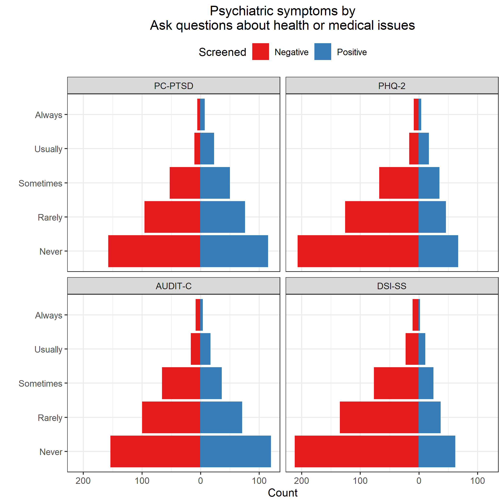

# Read data

**Most of this code was developed in Phase 1.**
Results will be suppressed for brevity.

**Use only the REDCap survey data**

Notes on the REDCap identifier variables:

* If `[consent] == 1`, they started the eligibility survey; 
  * if `== 0` or `== NA`, they didn't.
* If `[consent_and_eligibility_complete] == 2`, they finished the screener (whether eligible or ineligible); 
  * if `== 0`, they dropped out or never started.
* If `[eligible] == 1`, they completed the screener and were eligible; 
  * if `== 0`, they completed and were ineligible;
  * if `== NA` , they dropped out or never started.
* If `[veterans_and_social_media_use_co] == 2`, they finished the survey; 
  * if `== 0`, they dropped out or never started (this includes people who were ineligible or didn't consent).
* If `[analytic_sample] == 0`, they completed the survey but were disqualified for data quality reasons; 
  * if `== 1`, they completed survey and was not disqualified for data quality reasons;
  * if `== NA`, they didn't complete the survey.


| consent| consent_and_eligibility_complete| eligible| veterans_and_social_media_use_co| analytic_sample|   n|
|-------:|--------------------------------:|--------:|--------------------------------:|---------------:|---:|
|       0|                                0|       NA|                                0|              NA|   8|
|       0|                                2|        0|                                0|              NA|   7|
|       1|                                0|       NA|                                0|              NA|  84|
|       1|                                2|        0|                                0|              NA| 534|
|       1|                                2|        1|                                0|              NA| 106|
|       1|                                2|        1|                                2|               0|  18|
|       1|                                2|        1|                                2|               1| 587|
|      NA|                                0|       NA|                                0|              NA|  96|

Inclusion criteria

* Completed survey and was not disqualified for data quality reasons; `[analytic_sample] == 1`

**Number included: n = 587**

Cleaning

* Parse out `fba` into 2 separate variables for `image` and `text`
* Assign indicator for survey participation, `indSurveyParticipation`
  * `analytic_sample == 1`: Participant completed survey and was not disqualified for data quality reasons
* Assign indicator for eligibility screener participation, `indScreenerParticipation`
  * `eligible == 1`: Participant completed eligibility screener and was eligible to participate in full survey


## Use of VA health services


Recoding logic

* Primary analysis will code `9` (not sure) as `0` (No)
* Sensitivity analysis will exclude the `9` values from the analysis
* If `va_ever_enrolled == FALSE` & `is.na(va_use_12mo)`, then recode `va_use_12mo` to `FALSE`
* If `va_use_12mo == TRUE` & `va_ever_enrolled == FALSE`, then recode `va_ever_enrolled` to `TRUE`
* Code indicators `indVANeverEnrolled` and `indVANotUse12mo` as the logical opposites of `va_ever_enrolled` and `va_use_12mo`


## Independent variables

* Score the Modified Facebook Measure of Social Support (FMSS)
  * Reverse-scored items are `fmss_r7` through `fmss_r10`
* Standardize FMSS
* Prep FMSS items
  * Combine categories due to small cell sizes


```
##       fmss           fmssZ         
##  Min.   :14.00   Min.   :-2.29729  
##  1st Qu.:25.00   1st Qu.:-0.62179  
##  Median :29.00   Median :-0.01252  
##  Mean   :29.08   Mean   : 0.00000  
##  3rd Qu.:34.00   3rd Qu.: 0.74908  
##  Max.   :48.00   Max.   : 2.88153  
##  NA's   :15      NA's   :15
```

```
##       fmss fmssZ
## fmss     1     1
## fmssZ    1     1
```

```
##           fmss    fmssZ
## fmss  6.565197 2.562264
## fmssZ 2.562264 1.000000
```


|fmssQuartile |   n| min| max|
|:------------|---:|---:|---:|
|Q1: [14,25]  | 175|  14|  25|
|Q2: (25,29]  | 135|  26|  29|
|Q3: (29,34]  | 138|  30|  34|
|Q4: (34,48]  | 124|  35|  48|
|NA           |  15|  NA|  NA|

Check.


Cronbach's alpha for FMSS items 1-3.


```
## 
## Reliability analysis   
## Call: psych::alpha(x = .)
## 
##   raw_alpha std.alpha G6(smc) average_r S/N    ase mean  sd
##       0.91      0.91    0.87      0.77  10 0.0065  1.1 0.9
## 
##  lower alpha upper     95% confidence boundaries
## 0.9 0.91 0.92 
## 
##  Reliability if an item is dropped:
##         raw_alpha std.alpha G6(smc) average_r S/N alpha se
## fmss_r1      0.89      0.89    0.80      0.80 7.8   0.0094
## fmss_r2      0.85      0.85    0.74      0.74 5.7   0.0124
## fmss_r3      0.87      0.87    0.78      0.78 7.0   0.0104
## 
##  Item statistics 
##           n raw.r std.r r.cor r.drop mean   sd
## fmss_r1 585  0.91  0.91  0.84   0.80  1.0 0.94
## fmss_r2 584  0.93  0.93  0.89   0.84  1.1 0.97
## fmss_r3 584  0.92  0.92  0.86   0.82  1.1 1.03
## 
## Non missing response frequency for each item
##            0    1    2    3    4 miss
## fmss_r1 0.36 0.37 0.21 0.06 0.01 0.00
## fmss_r2 0.33 0.38 0.21 0.08 0.01 0.01
## fmss_r3 0.33 0.35 0.21 0.10 0.02 0.01
```

Cronbach's alpha for FMSS items 1-3 = Cronbach's alpha = 0.910


```
## Warning in `levels<-`(`*tmp*`, value = if (nl == nL) as.character(labels)
## else paste0(labels, : duplicated levels in factors are deprecated

## Warning in `levels<-`(`*tmp*`, value = if (nl == nL) as.character(labels)
## else paste0(labels, : duplicated levels in factors are deprecated

## Warning in `levels<-`(`*tmp*`, value = if (nl == nL) as.character(labels)
## else paste0(labels, : duplicated levels in factors are deprecated

## Warning in `levels<-`(`*tmp*`, value = if (nl == nL) as.character(labels)
## else paste0(labels, : duplicated levels in factors are deprecated
```


## Dependent variables

### Psychiatric symptoms (RQ1)

Code indicators for psychiatric disorder screening scales

* PTSD
  * Name of scale: PC-PTSD 
  * Positive screen: `ptsd_intrusive` + `ptsd_avoidant` + `ptsd_guarded` + `ptsd_numb` + `ptsd_guilty` $\ge$ 3
* Major depression
  * Name of scale: PHQ-2
  * Positive screen: `phq_interest` + `phq_mood` $\ge$ 3
* Alcohol misuse
  * Name of scale: AUDIT-C
  * Positive screen: `auditc_freq` + `auditc_amount` + `auditc_binge` $\ge$ 4 for men, $\ge$ 3 for women

Presence of suicidality is defined as DSI-SS score $\ge$ 2.
This cut-off score was chosen based on recommendations for population-based samples noted in 
[von Glischinski M Clin Psychol Psychotherapy 2015](http://onlinelibrary.wiley.com/doi/10.1002/cpp.2007/full)

* Score the DSI-SS inventory
  * See [Joiner 2002](http://www.sciencedirect.com/science/article/pii/S0005796701000171)
  * *Scores on each item range from 0 to 3 and, for the inventory, from 0 to 12, with higher scores reflecting greater severity of suicidal ideation.*


Check.


|yvariable |indPTSD | mean | sd  | min | max |  n  | freq  |
|:---------|:-------|:----:|:---:|:---:|:---:|:---:|:-----:|
|ptsd      |FALSE   | 0.9  | 0.9 |  0  |  2  | 236 | 47.0% |
|ptsd      |TRUE    | 4.2  | 0.8 |  3  |  5  | 266 | 53.0% |

\newline


|yvariable |indPHQ | mean | sd  | min | max |  n  | freq  |
|:---------|:------|:----:|:---:|:---:|:---:|:---:|:-----:|
|phq       |FALSE  | 1.0  | 0.9 |  0  |  2  | 422 | 72.0% |
|phq       |TRUE   | 4.5  | 1.2 |  3  |  6  | 164 | 28.0% |

\newline


|yvariable |indAuditC | mean | sd  | min | max |  n  | freq  |
|:---------|:---------|:----:|:---:|:---:|:---:|:---:|:-----:|
|auditc    |FALSE     | 1.8  | 0.8 |  1  |  3  | 234 | 49.1% |
|auditc    |TRUE      | 5.9  | 2.1 |  3  | 12  | 243 | 50.9% |

\newline


|yvariable |indDSISS | mean | sd  | min | max |  n  | freq  |
|:---------|:--------|:----:|:---:|:---:|:---:|:---:|:-----:|
|dsiss     |FALSE    | 0.1  | 0.3 |  0  |  1  | 453 | 77.4% |
|dsiss     |TRUE     | 3.9  | 1.6 |  2  |  9  | 132 | 22.6% |

Also create logical opposite for use in RQ3 modeling


### Social media use (RQ2)

* Spending more time on Facebook?
  * Frequency of Facebook use: `fb_freq`
  * Active use of Facebook: `comm_facebook`
* Sharing more personal or health-related information on social media?
  * `sm_emot_support`
  * `sm_med_info`
  * `sm_med_advice`
  * `sm_med_questions`
  * `sm_share_sympt`
  * `sm_share_health`
  * `sm_share_suicide`
  
Mutate variables to factors.


## Covariates

* Social media platforms used: `sm_used___1`, ..., `sm_used___7`, `sm_used___99`, `sm_used_other`
  * Recode the following `sm_used_other` values such that `sm_used___99 = 0`
    * `I use Wikipedia to read about illnesses I don't have; it's a curiosity/hobby thing.`
    * `just in person`
    * `Just plain internet search`
    * `TV/phone conversations, veterans group meetings`
    * `google; bing`
    * `aol`
    * `e-mail`
    * `Web MD`
    * `webmd`
* Offline social contact: `comm_inperson`
* History of suicidal ideation and suicide attempts
  * `suicide_considered_ever`
  * `suicide_considered_12mo`
  * `suicide_attempts` 


Check.


|smOther |sm_used_other                                                                       |   n|
|:-------|:-----------------------------------------------------------------------------------|---:|
|FALSE   |                                                                                    | 552|
|FALSE   |aol                                                                                 |   1|
|FALSE   |e-mail                                                                              |   1|
|FALSE   |google; bing                                                                        |   1|
|FALSE   |I use Wikipedia to read about illnesses I don't have; it's a curiosity/hobby thing. |   1|
|FALSE   |just in person                                                                      |   1|
|FALSE   |TV/phone conversations, veterans group meetings                                     |   1|
|FALSE   |Web MD,                                                                             |   1|
|FALSE   |webmd                                                                               |   1|
|TRUE    |4chan                                                                               |   2|
|TRUE    |Gmail Hangouts; Reddit.com                                                          |   1|
|TRUE    |Google+                                                                             |   2|
|TRUE    |I used LiveJournal for the majority of my service as well as my deployment to Iraq  |   1|
|TRUE    |Linked In                                                                           |   1|
|TRUE    |LinkedIn, Snapchat                                                                  |   1|
|TRUE    |LiveJournal                                                                         |   1|
|TRUE    |MIL.MIL                                                                             |   1|
|TRUE    |Ravelry Forums                                                                      |   1|
|TRUE    |reddit                                                                              |   3|
|TRUE    |Reddit                                                                              |   5|
|TRUE    |Snao Chat                                                                           |   1|
|TRUE    |snapchat                                                                            |   3|
|TRUE    |Snapchat                                                                            |   1|
|TRUE    |SnapChat                                                                            |   1|
|TRUE    |webmd, mayoclinic,wikipedia, va                                                     |   1|
|TRUE    |www.coping-with-epilepsy.com                                                        |   1|

\newline

Number of social media platforms used (excluding Facebook):


| countSocialMediaExclFB|   n|
|----------------------:|---:|
|                      0| 347|
|                      1| 138|
|                      2|  68|
|                      3|  21|
|                      4|  11|
|                      5|   2|

\newline


|comm_inperson                 |   n|
|:-----------------------------|---:|
|Several times a day           | 175|
|Once a day                    |  58|
|A few times a week            | 114|
|Once a week                   |  70|
|Every few weeks or less often | 169|
|NA                            |   1|

\newline


|indSuicideConsideredEver |indSuicideConsidered12mo |indSuicideAttempt | countSuicideAttempts|   n|
|:------------------------|:------------------------|:-----------------|--------------------:|---:|
|FALSE                    |FALSE                    |FALSE             |                    0| 330|
|TRUE                     |FALSE                    |FALSE             |                    0| 140|
|TRUE                     |FALSE                    |TRUE              |                    1|  31|
|TRUE                     |TRUE                     |FALSE             |                    0|  29|
|TRUE                     |FALSE                    |TRUE              |                    2|  16|
|TRUE                     |TRUE                     |TRUE              |                    1|  11|
|TRUE                     |FALSE                    |TRUE              |                    3|   9|
|TRUE                     |TRUE                     |TRUE              |                    3|   8|
|TRUE                     |TRUE                     |TRUE              |                    2|   7|
|TRUE                     |FALSE                    |TRUE              |                    4|   2|
|TRUE                     |FALSE                    |TRUE              |                    5|   2|
|TRUE                     |TRUE                     |TRUE              |                    5|   1|
|NA                       |NA                       |NA                |                  NaN|   1|
# Research Question 1

**Is perceived social support received from Facebook (FMSS) associated with lower rates of**

* Positive screens for psychiatric disorders
  * PC-PTSD
  * PHQ-2
  * AUDIT-C
* Positive screen for suicidality?
  * DSI-SS


## Unadjusted comparisons


|yvariable |indPTSD | mean | sd  | min | max |  n  | freq  |
|:---------|:-------|:----:|:---:|:---:|:---:|:---:|:-----:|
|fmss      |FALSE   | 29.3 | 6.4 | 14  | 45  | 228 | 46.6% |
|fmss      |TRUE    | 28.3 | 6.8 | 16  | 48  | 261 | 53.4% |

\newline


|yvariable |indPHQ | mean | sd  | min | max |  n  | freq  |
|:---------|:------|:----:|:---:|:---:|:---:|:---:|:-----:|
|fmss      |FALSE  | 29.5 | 6.4 | 16  | 48  | 412 | 72.2% |
|fmss      |TRUE   | 27.9 | 6.9 | 14  | 44  | 159 | 27.8% |

\newline


|yvariable |indAuditC | mean | sd  | min | max |  n  | freq  |
|:---------|:---------|:----:|:---:|:---:|:---:|:---:|:-----:|
|fmss      |FALSE     | 29.7 | 6.6 | 14  | 48  | 230 | 49.6% |
|fmss      |TRUE      | 29.0 | 6.3 | 16  | 45  | 234 | 50.4% |

\newline


|yvariable |indDSISS | mean | sd  | min | max |  n  | freq  |
|:---------|:--------|:----:|:---:|:---:|:---:|:---:|:-----:|
|fmss      |FALSE    | 29.5 | 6.6 | 16  | 48  | 442 | 77.5% |
|fmss      |TRUE     | 27.6 | 6.4 | 14  | 44  | 128 | 22.5% |

\newline


## Adjusted comparisons


```
##           fmss fmssZ
## fmss  6.565197     0
## fmssZ 0.000000     1
```

Filter subjects with missing covariates.


### PC-PTSD


|model      |term                                       | oddsratio| std.error| statistic| p.value|
|:----------|:------------------------------------------|---------:|---------:|---------:|-------:|
|Unadjusted |(Intercept)                                |     1.129|     0.091|     1.336|   0.182|
|Unadjusted |fmssZ                                      |     0.866|     0.090|    -1.600|   0.110|
|Adjusted   |(Intercept)                                |     0.428|     0.210|    -4.037|   0.000|
|Adjusted   |fmssZ                                      |     0.890|     0.099|    -1.181|   0.238|
|Adjusted   |countSocialMediaExclFB                     |     1.022|     0.099|     0.216|   0.829|
|Adjusted   |comm_inpersonOnce a day                    |     1.629|     0.358|     1.363|   0.173|
|Adjusted   |comm_inpersonA few times a week            |     1.326|     0.279|     1.013|   0.311|
|Adjusted   |comm_inpersonOnce a week                   |     1.907|     0.335|     1.925|   0.054|
|Adjusted   |comm_inpersonEvery few weeks or less often |     2.919|     0.258|     4.149|   0.000|
|Adjusted   |indSuicideConsideredEverTRUE               |     2.109|     0.215|     3.471|   0.001|
|Adjusted   |countSuicideAttempts                       |     1.680|     0.179|     2.895|   0.004|

\newline


|model      | null.deviance| df.null|   logLik|     AIC|     BIC| deviance| df.residual|
|:----------|-------------:|-------:|--------:|-------:|-------:|--------:|-----------:|
|Unadjusted |       673.151|     486| -335.287| 674.573| 682.950|  670.573|         485|
|Adjusted   |       673.151|     486| -304.159| 626.319| 664.013|  608.319|         478|


### PHQ-2


|model      |term                                       | oddsratio| std.error| statistic| p.value|
|:----------|:------------------------------------------|---------:|---------:|---------:|-------:|
|Unadjusted |(Intercept)                                |     0.379|     0.095|   -10.232|   0.000|
|Unadjusted |fmssZ                                      |     0.770|     0.096|    -2.713|   0.007|
|Adjusted   |(Intercept)                                |     0.141|     0.240|    -8.173|   0.000|
|Adjusted   |fmssZ                                      |     0.814|     0.102|    -2.008|   0.045|
|Adjusted   |countSocialMediaExclFB                     |     0.958|     0.105|    -0.405|   0.686|
|Adjusted   |comm_inpersonOnce a day                    |     1.052|     0.415|     0.121|   0.904|
|Adjusted   |comm_inpersonA few times a week            |     0.907|     0.320|    -0.305|   0.760|
|Adjusted   |comm_inpersonOnce a week                   |     1.849|     0.333|     1.844|   0.065|
|Adjusted   |comm_inpersonEvery few weeks or less often |     2.506|     0.264|     3.481|   0.000|
|Adjusted   |indSuicideConsideredEverTRUE               |     3.098|     0.222|     5.087|   0.000|
|Adjusted   |countSuicideAttempts                       |     1.245|     0.124|     1.764|   0.078|

\newline


|model      | null.deviance| df.null|   logLik|     AIC|     BIC| deviance| df.residual|
|:----------|-------------:|-------:|--------:|-------:|-------:|--------:|-----------:|
|Unadjusted |       672.272|     568| -332.363| 668.726| 677.413|  664.726|         567|
|Adjusted   |       672.272|     568| -297.957| 613.914| 653.009|  595.914|         560|


### AUDIT-C


|model      |term                                       | oddsratio| std.error| statistic| p.value|
|:----------|:------------------------------------------|---------:|---------:|---------:|-------:|
|Unadjusted |(Intercept)                                |     1.031|     0.093|     0.323|   0.746|
|Unadjusted |fmssZ                                      |     0.891|     0.095|    -1.220|   0.222|
|Adjusted   |(Intercept)                                |     0.679|     0.202|    -1.915|   0.056|
|Adjusted   |fmssZ                                      |     0.912|     0.098|    -0.939|   0.348|
|Adjusted   |countSocialMediaExclFB                     |     1.045|     0.097|     0.450|   0.652|
|Adjusted   |comm_inpersonOnce a day                    |     1.253|     0.355|     0.635|   0.525|
|Adjusted   |comm_inpersonA few times a week            |     1.128|     0.267|     0.452|   0.652|
|Adjusted   |comm_inpersonOnce a week                   |     1.928|     0.332|     1.976|   0.048|
|Adjusted   |comm_inpersonEvery few weeks or less often |     1.627|     0.253|     1.926|   0.054|
|Adjusted   |indSuicideConsideredEverTRUE               |     1.463|     0.214|     1.781|   0.075|
|Adjusted   |countSuicideAttempts                       |     0.864|     0.132|    -1.108|   0.268|

\newline


|model      | null.deviance| df.null|   logLik|     AIC|     BIC| deviance| df.residual|
|:----------|-------------:|-------:|--------:|-------:|-------:|--------:|-----------:|
|Unadjusted |        640.39|     461| -319.447| 642.894| 651.165|  638.894|         460|
|Adjusted   |        640.39|     461| -314.297| 646.593| 683.813|  628.593|         453|


### DSI-SS


|model      |term                                       | oddsratio| std.error| statistic| p.value|
|:----------|:------------------------------------------|---------:|---------:|---------:|-------:|
|Unadjusted |(Intercept)                                |     0.280|     0.103|   -12.364|   0.000|
|Unadjusted |fmssZ                                      |     0.732|     0.105|    -2.981|   0.003|
|Adjusted   |(Intercept)                                |     0.074|     0.284|    -9.173|   0.000|
|Adjusted   |fmssZ                                      |     0.751|     0.114|    -2.514|   0.012|
|Adjusted   |countSocialMediaExclFB                     |     1.047|     0.110|     0.414|   0.679|
|Adjusted   |comm_inpersonOnce a day                    |     1.013|     0.467|     0.028|   0.978|
|Adjusted   |comm_inpersonA few times a week            |     1.122|     0.337|     0.341|   0.733|
|Adjusted   |comm_inpersonOnce a week                   |     1.428|     0.361|     0.986|   0.324|
|Adjusted   |comm_inpersonEvery few weeks or less often |     1.680|     0.295|     1.757|   0.079|
|Adjusted   |indSuicideConsideredEverTRUE               |     5.491|     0.256|     6.664|   0.000|
|Adjusted   |countSuicideAttempts                       |     1.295|     0.123|     2.102|   0.036|

\newline


|model      | null.deviance| df.null|   logLik|     AIC|     BIC| deviance| df.residual|
|:----------|-------------:|-------:|--------:|-------:|-------:|--------:|-----------:|
|Unadjusted |       604.194|     568| -297.503| 599.006| 607.694|  595.006|         567|
|Adjusted   |       604.194|     568| -254.388| 526.776| 565.871|  508.776|         560|


## Additional questions

> Some issues that additional analysis could clarify is whether people have a
> tendency to substitute social contact on social media for in-person social
> contact, and whether that substitution is bad for your emotional well-being.
> It would be interesting to look at:
> 
> * Do people who spend a lot of time (or frequently use) Facebook spend less
>   time meeting up in-person (i.e., possibly substitute one form of social
>   contact for another)? Variables: `comm_facebook`, `fb_freq`, `comm_inperson`
> * Do people who spend a lot of time (or frequently use) Facebook and spend
>   less time in-person have higher risk for psychiatric disorders?


```
## $table
##                  fb_freq
## comm_facebook     Less than daily Daily or more Sum
##   Less than daily              59           170 229
##   Daily or more                 2           354 356
##   Sum                          61           524 585
## 
## $expected
##                  fb_freq
## comm_facebook     Less than daily Daily or more
##   Less than daily        23.87863      205.1214
##   Daily or more          37.12137      318.8786
## 
## $chisq.test
## 
## 	Pearson's Chi-squared test with Yates' continuity correction
## 
## data:  T
## X-squared = 92.089, df = 1, p-value < 2.2e-16
```

```
## $table
##                  comm_inperson
## comm_facebook     Daily or more Less than daily Sum
##   Less than daily            66             162 228
##   Daily or more             167             191 358
##   Sum                       233             353 586
## 
## $expected
##                  comm_inperson
## comm_facebook     Daily or more Less than daily
##   Less than daily      90.65529        137.3447
##   Daily or more       142.34471        215.6553
## 
## $chisq.test
## 
## 	Pearson's Chi-squared test with Yates' continuity correction
## 
## data:  T
## X-squared = 17.489, df = 1, p-value = 2.89e-05
```

```
## $table
##                  comm_inperson
## fb_freq           Daily or more Less than daily Sum
##   Less than daily            23              37  60
##   Daily or more             210             314 524
##   Sum                       233             351 584
## 
## $expected
##                  comm_inperson
## fb_freq           Daily or more Less than daily
##   Less than daily      23.93836        36.06164
##   Daily or more       209.06164       314.93836
## 
## $chisq.test
## 
## 	Pearson's Chi-squared test with Yates' continuity correction
## 
## data:  T
## X-squared = 0.014885, df = 1, p-value = 0.9029
```


## FMSS items

Closely exam FMSS items 1, 2, 3, and 11

* `fmss_r1` For you, how good is Facebook for getting real help or support?
* `fmss_r2` For the support you get on Facebook, how much practical help is it?
* `fmss_r3` How much does the support you get on Facebook make you feel better?
* `fmss_r11` How close to people does Facebook make you feel?


```
## $table
##        fmss_r1
## indPHQ  Not at all A little Somewhat Very or Extremely Very or Extremely
##   FALSE        146      161       88                25                 0
##   TRUE          61       55       33                15                 0
##   Sum          207      216      121                40                 0
##        fmss_r1
## indPHQ  Sum
##   FALSE 420
##   TRUE  164
##   Sum   584
## 
## $expected
##        fmss_r1
## indPHQ  Not at all  A little Somewhat Very or Extremely Very or Extremely
##   FALSE  148.86986 155.34247 87.02055          28.76712                 0
##   TRUE    58.13014  60.65753 33.97945          11.23288                 0
## 
## $chisq.test
## 
## 	Pearson's Chi-squared test
## 
## data:  T
## X-squared = NaN, df = 4, p-value = NA
```

```
## $table
##        fmss_r2
## indPHQ  None A little Some Quite a bit or A lot Quite a bit or A lot Sum
##   FALSE  132      160   93                   34                    0 419
##   TRUE    59       58   27                   20                    0 164
##   Sum    191      218  120                   54                    0 583
## 
## $expected
##        fmss_r2
## indPHQ       None  A little     Some Quite a bit or A lot
##   FALSE 137.27101 156.67581 86.24357             38.80961
##   TRUE   53.72899  61.32419 33.75643             15.19039
##        fmss_r2
## indPHQ  Quite a bit or A lot
##   FALSE                    0
##   TRUE                     0
## 
## $chisq.test
## 
## 	Pearson's Chi-squared test
## 
## data:  T
## X-squared = NaN, df = 4, p-value = NA
```

```
## $table
##        fmss_r3
## indPHQ  Not at all A little Somewhat Quite a bit or A lot
##   FALSE        132      149       87                   51
##   TRUE          58       57       33                   16
##   Sum          190      206      120                   67
##        fmss_r3
## indPHQ  Quite a bit or A lot Sum
##   FALSE                    0 419
##   TRUE                     0 164
##   Sum                      0 583
## 
## $expected
##        fmss_r3
## indPHQ  Not at all  A little Somewhat Quite a bit or A lot
##   FALSE  136.55232 148.05146 86.24357             48.15266
##   TRUE    53.44768  57.94854 33.75643             18.84734
##        fmss_r3
## indPHQ  Quite a bit or A lot
##   FALSE                    0
##   TRUE                     0
## 
## $chisq.test
## 
## 	Pearson's Chi-squared test
## 
## data:  T
## X-squared = NaN, df = 4, p-value = NA
```

```
## $table
##        fmss_r11
## indPHQ  Not at all A little Somewhat Very or Extremely Very or Extremely
##   FALSE         77      192      126                26                 0
##   TRUE          49       53       56                 6                 0
##   Sum          126      245      182                32                 0
##        fmss_r11
## indPHQ  Sum
##   FALSE 421
##   TRUE  164
##   Sum   585
## 
## $expected
##        fmss_r11
## indPHQ  Not at all  A little  Somewhat Very or Extremely Very or Extremely
##   FALSE   90.67692 176.31624 130.97778          23.02906                 0
##   TRUE    35.32308  68.68376  51.02222           8.97094                 0
## 
## $chisq.test
## 
## 	Pearson's Chi-squared test
## 
## data:  T
## X-squared = NaN, df = 4, p-value = NA
```

```
## $table
##         fmss_r1
## indDSISS Not at all A little Somewhat Very or Extremely Very or Extremely
##    FALSE        157      164       98                33                 0
##    TRUE          51       50       23                 7                 0
##    Sum          208      214      121                40                 0
##         fmss_r1
## indDSISS Sum
##    FALSE 452
##    TRUE  131
##    Sum   583
## 
## $expected
##         fmss_r1
## indDSISS Not at all  A little Somewhat Very or Extremely Very or Extremely
##    FALSE  161.26244 165.91424 93.81132         31.012007                 0
##    TRUE    46.73756  48.08576 27.18868          8.987993                 0
## 
## $chisq.test
## 
## 	Pearson's Chi-squared test
## 
## data:  T
## X-squared = NaN, df = 4, p-value = NA
```

```
## $table
##         fmss_r2
## indDSISS None A little Some Quite a bit or A lot Quite a bit or A lot Sum
##    FALSE  148      159  101                   43                    0 451
##    TRUE    43       58   19                   11                    0 131
##    Sum    191      217  120                   54                    0 582
## 
## $expected
##         fmss_r2
## indDSISS      None  A little     Some Quite a bit or A lot
##    FALSE 148.00859 168.15636 92.98969             41.84536
##    TRUE   42.99141  48.84364 27.01031             12.15464
##         fmss_r2
## indDSISS Quite a bit or A lot
##    FALSE                    0
##    TRUE                     0
## 
## $chisq.test
## 
## 	Pearson's Chi-squared test
## 
## data:  T
## X-squared = NaN, df = 4, p-value = NA
```

```
## $table
##         fmss_r3
## indDSISS Not at all A little Somewhat Quite a bit or A lot
##    FALSE        146      153       92                   59
##    TRUE          44       53       27                    8
##    Sum          190      206      119                   67
##         fmss_r3
## indDSISS Quite a bit or A lot Sum
##    FALSE                    0 450
##    TRUE                     0 132
##    Sum                      0 582
## 
## $expected
##         fmss_r3
## indDSISS Not at all  A little Somewhat Quite a bit or A lot
##    FALSE  146.90722 159.27835 92.01031             51.80412
##    TRUE    43.09278  46.72165 26.98969             15.19588
##         fmss_r3
## indDSISS Quite a bit or A lot
##    FALSE                    0
##    TRUE                     0
## 
## $chisq.test
## 
## 	Pearson's Chi-squared test
## 
## data:  T
## X-squared = NaN, df = 4, p-value = NA
```

```
## $table
##         fmss_r11
## indDSISS Not at all A little Somewhat Very or Extremely Very or Extremely
##    FALSE         94      190      146                22                 0
##    TRUE          33       53       36                10                 0
##    Sum          127      243      182                32                 0
##         fmss_r11
## indDSISS Sum
##    FALSE 452
##    TRUE  132
##    Sum   584
## 
## $expected
##         fmss_r11
## indDSISS Not at all  A little  Somewhat Very or Extremely
##    FALSE   98.29452 188.07534 140.86301         24.767123
##    TRUE    28.70548  54.92466  41.13699          7.232877
##         fmss_r11
## indDSISS Very or Extremely
##    FALSE                 0
##    TRUE                  0
## 
## $chisq.test
## 
## 	Pearson's Chi-squared test
## 
## data:  T
## X-squared = NaN, df = 4, p-value = NA
```


### PHQ-2


```
## Warning in `levels<-`(`*tmp*`, value = if (nl == nL) as.character(labels)
## else paste0(labels, : duplicated levels in factors are deprecated

## Warning in `levels<-`(`*tmp*`, value = if (nl == nL) as.character(labels)
## else paste0(labels, : duplicated levels in factors are deprecated

## Warning in `levels<-`(`*tmp*`, value = if (nl == nL) as.character(labels)
## else paste0(labels, : duplicated levels in factors are deprecated

## Warning in `levels<-`(`*tmp*`, value = if (nl == nL) as.character(labels)
## else paste0(labels, : duplicated levels in factors are deprecated

## Warning in `levels<-`(`*tmp*`, value = if (nl == nL) as.character(labels)
## else paste0(labels, : duplicated levels in factors are deprecated

## Warning in `levels<-`(`*tmp*`, value = if (nl == nL) as.character(labels)
## else paste0(labels, : duplicated levels in factors are deprecated

## Warning in `levels<-`(`*tmp*`, value = if (nl == nL) as.character(labels)
## else paste0(labels, : duplicated levels in factors are deprecated

## Warning in `levels<-`(`*tmp*`, value = if (nl == nL) as.character(labels)
## else paste0(labels, : duplicated levels in factors are deprecated
```


|model      |term                                       | oddsratio| std.error| statistic| p.value|
|:----------|:------------------------------------------|---------:|---------:|---------:|-------:|
|Unadjusted |(Intercept)                                |     0.655|     0.204|    -2.077|   0.038|
|Unadjusted |fmss_r1A little                            |     1.280|     0.341|     0.724|   0.469|
|Unadjusted |fmss_r1Somewhat                            |     1.819|     0.418|     1.431|   0.153|
|Unadjusted |fmss_r1Very or Extremely                   |     2.602|     0.582|     1.642|   0.101|
|Unadjusted |fmss_r1Very or Extremely                   |     4.545|     1.235|     1.226|   0.220|
|Unadjusted |fmss_r2A little                            |     0.743|     0.381|    -0.780|   0.435|
|Unadjusted |fmss_r2Some                                |     0.544|     0.478|    -1.273|   0.203|
|Unadjusted |fmss_r2Quite a bit or A lot                |     1.736|     0.618|     0.893|   0.372|
|Unadjusted |fmss_r2Quite a bit or A lot                |     0.439|     1.449|    -0.568|   0.570|
|Unadjusted |fmss_r3A little                            |     1.048|     0.368|     0.129|   0.898|
|Unadjusted |fmss_r3Somewhat                            |     0.894|     0.441|    -0.255|   0.799|
|Unadjusted |fmss_r3Quite a bit or A lot                |     0.379|     0.623|    -1.557|   0.119|
|Unadjusted |fmss_r3Quite a bit or A lot                |     0.274|     1.063|    -1.218|   0.223|
|Unadjusted |fmss_r11A little                           |     0.425|     0.255|    -3.358|   0.001|
|Unadjusted |fmss_r11Somewhat                           |     0.675|     0.283|    -1.389|   0.165|
|Unadjusted |fmss_r11Very or Extremely                  |     0.329|     0.573|    -1.944|   0.052|
|Unadjusted |fmss_r11Very or Extremely                  |     0.656|     1.347|    -0.313|   0.754|
|Adjusted   |(Intercept)                                |     0.236|     0.307|    -4.702|   0.000|
|Adjusted   |fmss_r1A little                            |     0.967|     0.370|    -0.090|   0.928|
|Adjusted   |fmss_r1Somewhat                            |     1.740|     0.454|     1.221|   0.222|
|Adjusted   |fmss_r1Very or Extremely                   |     2.638|     0.628|     1.545|   0.122|
|Adjusted   |fmss_r1Very or Extremely                   |     8.011|     1.317|     1.580|   0.114|
|Adjusted   |fmss_r2A little                            |     0.933|     0.413|    -0.167|   0.868|
|Adjusted   |fmss_r2Some                                |     0.604|     0.522|    -0.965|   0.334|
|Adjusted   |fmss_r2Quite a bit or A lot                |     1.607|     0.662|     0.717|   0.474|
|Adjusted   |fmss_r2Quite a bit or A lot                |     0.307|     1.622|    -0.729|   0.466|
|Adjusted   |fmss_r3A little                            |     1.013|     0.404|     0.031|   0.975|
|Adjusted   |fmss_r3Somewhat                            |     0.774|     0.481|    -0.531|   0.595|
|Adjusted   |fmss_r3Quite a bit or A lot                |     0.313|     0.685|    -1.694|   0.090|
|Adjusted   |fmss_r3Quite a bit or A lot                |     0.293|     1.120|    -1.095|   0.274|
|Adjusted   |fmss_r11A little                           |     0.481|     0.274|    -2.666|   0.008|
|Adjusted   |fmss_r11Somewhat                           |     0.714|     0.310|    -1.086|   0.277|
|Adjusted   |fmss_r11Very or Extremely                  |     0.295|     0.628|    -1.945|   0.052|
|Adjusted   |fmss_r11Very or Extremely                  |     0.490|     1.617|    -0.441|   0.659|
|Adjusted   |countSocialMediaExclFB                     |     0.935|     0.107|    -0.624|   0.533|
|Adjusted   |comm_inpersonOnce a day                    |     1.108|     0.415|     0.248|   0.804|
|Adjusted   |comm_inpersonA few times a week            |     0.951|     0.328|    -0.153|   0.878|
|Adjusted   |comm_inpersonOnce a week                   |     2.207|     0.342|     2.317|   0.021|
|Adjusted   |comm_inpersonEvery few weeks or less often |     2.609|     0.271|     3.542|   0.000|
|Adjusted   |indSuicideConsideredEverTRUE               |     3.003|     0.227|     4.852|   0.000|
|Adjusted   |countSuicideAttempts                       |     1.327|     0.135|     2.097|   0.036|

\newline


|model      | null.deviance| df.null|   logLik|     AIC|     BIC| deviance| df.residual|
|:----------|-------------:|-------:|--------:|-------:|-------:|--------:|-----------:|
|Unadjusted |       688.956|     579| -331.003| 696.007| 770.178|  662.007|         563|
|Adjusted   |       688.956|     579| -295.093| 638.186| 742.899|  590.186|         556|


### DSI-SS


```
## Warning in `levels<-`(`*tmp*`, value = if (nl == nL) as.character(labels)
## else paste0(labels, : duplicated levels in factors are deprecated

## Warning in `levels<-`(`*tmp*`, value = if (nl == nL) as.character(labels)
## else paste0(labels, : duplicated levels in factors are deprecated

## Warning in `levels<-`(`*tmp*`, value = if (nl == nL) as.character(labels)
## else paste0(labels, : duplicated levels in factors are deprecated

## Warning in `levels<-`(`*tmp*`, value = if (nl == nL) as.character(labels)
## else paste0(labels, : duplicated levels in factors are deprecated

## Warning in `levels<-`(`*tmp*`, value = if (nl == nL) as.character(labels)
## else paste0(labels, : duplicated levels in factors are deprecated

## Warning in `levels<-`(`*tmp*`, value = if (nl == nL) as.character(labels)
## else paste0(labels, : duplicated levels in factors are deprecated

## Warning in `levels<-`(`*tmp*`, value = if (nl == nL) as.character(labels)
## else paste0(labels, : duplicated levels in factors are deprecated

## Warning in `levels<-`(`*tmp*`, value = if (nl == nL) as.character(labels)
## else paste0(labels, : duplicated levels in factors are deprecated
```


|model      |term                                       | oddsratio| std.error| statistic| p.value|
|:----------|:------------------------------------------|---------:|---------:|---------:|-------:|
|Unadjusted |(Intercept)                                |     0.333|     0.226|    -4.873|   0.000|
|Unadjusted |fmss_r1A little                            |     0.759|     0.340|    -0.812|   0.417|
|Unadjusted |fmss_r1Somewhat                            |     0.771|     0.432|    -0.600|   0.548|
|Unadjusted |fmss_r1Very or Extremely                   |     0.615|     0.668|    -0.729|   0.466|
|Unadjusted |fmss_r1Very or Extremely                   |     1.045|     1.525|     0.029|   0.977|
|Unadjusted |fmss_r2A little                            |     1.473|     0.391|     0.992|   0.321|
|Unadjusted |fmss_r2Some                                |     0.881|     0.503|    -0.252|   0.801|
|Unadjusted |fmss_r2Quite a bit or A lot                |     2.242|     0.666|     1.212|   0.226|
|Unadjusted |fmss_r2Quite a bit or A lot                |     1.110|     1.487|     0.070|   0.944|
|Unadjusted |fmss_r3A little                            |     1.141|     0.380|     0.346|   0.729|
|Unadjusted |fmss_r3Somewhat                            |     1.101|     0.454|     0.211|   0.833|
|Unadjusted |fmss_r3Quite a bit or A lot                |     0.279|     0.703|    -1.818|   0.069|
|Unadjusted |fmss_r3Quite a bit or A lot                |     0.684|     1.086|    -0.350|   0.726|
|Unadjusted |fmss_r11A little                           |     0.780|     0.271|    -0.917|   0.359|
|Unadjusted |fmss_r11Somewhat                           |     0.803|     0.311|    -0.706|   0.480|
|Unadjusted |fmss_r11Very or Extremely                  |     2.199|     0.518|     1.522|   0.128|
|Unadjusted |fmss_r11Very or Extremely                  |     1.195|     1.434|     0.124|   0.901|
|Adjusted   |(Intercept)                                |     0.079|     0.367|    -6.924|   0.000|
|Adjusted   |fmss_r1A little                            |     0.533|     0.396|    -1.591|   0.112|
|Adjusted   |fmss_r1Somewhat                            |     0.625|     0.500|    -0.941|   0.347|
|Adjusted   |fmss_r1Very or Extremely                   |     0.593|     0.724|    -0.721|   0.471|
|Adjusted   |fmss_r1Very or Extremely                   |     1.508|     1.776|     0.231|   0.817|
|Adjusted   |fmss_r2A little                            |     1.930|     0.441|     1.492|   0.136|
|Adjusted   |fmss_r2Some                                |     0.976|     0.566|    -0.042|   0.966|
|Adjusted   |fmss_r2Quite a bit or A lot                |     1.680|     0.718|     0.722|   0.470|
|Adjusted   |fmss_r2Quite a bit or A lot                |     1.340|     1.746|     0.167|   0.867|
|Adjusted   |fmss_r3A little                            |     1.016|     0.427|     0.037|   0.971|
|Adjusted   |fmss_r3Somewhat                            |     0.964|     0.508|    -0.072|   0.942|
|Adjusted   |fmss_r3Quite a bit or A lot                |     0.178|     0.795|    -2.174|   0.030|
|Adjusted   |fmss_r3Quite a bit or A lot                |     0.643|     1.155|    -0.383|   0.702|
|Adjusted   |fmss_r11A little                           |     0.980|     0.302|    -0.068|   0.945|
|Adjusted   |fmss_r11Somewhat                           |     0.942|     0.347|    -0.174|   0.862|
|Adjusted   |fmss_r11Very or Extremely                  |     3.398|     0.595|     2.054|   0.040|
|Adjusted   |fmss_r11Very or Extremely                  |     0.754|     1.623|    -0.174|   0.862|
|Adjusted   |countSocialMediaExclFB                     |     1.038|     0.114|     0.323|   0.747|
|Adjusted   |comm_inpersonOnce a day                    |     0.958|     0.471|    -0.092|   0.927|
|Adjusted   |comm_inpersonA few times a week            |     1.199|     0.348|     0.522|   0.602|
|Adjusted   |comm_inpersonOnce a week                   |     1.499|     0.370|     1.094|   0.274|
|Adjusted   |comm_inpersonEvery few weeks or less often |     2.015|     0.306|     2.292|   0.022|
|Adjusted   |indSuicideConsideredEverTRUE               |     5.821|     0.260|     6.767|   0.000|
|Adjusted   |countSuicideAttempts                       |     1.380|     0.134|     2.402|   0.016|

\newline


|model      | null.deviance| df.null|   logLik|     AIC|     BIC| deviance| df.residual|
|:----------|-------------:|-------:|--------:|-------:|-------:|--------:|-----------:|
|Unadjusted |       617.231|     579| -299.953| 633.905| 708.077|  599.905|         563|
|Adjusted   |       617.231|     579| -252.078| 552.156| 656.868|  504.156|         556|


## FMSS quartiles

Stratify by FMSS quartile and compare Q1 vs Q4.


```
## $table
##        fmssQuartile
## indPHQ  Q1: [14,25] Q4: (34,48] Sum
##   FALSE         111          94 205
##   TRUE           63          30  93
##   Sum           174         124 298
## 
## $expected
##        fmssQuartile
## indPHQ  Q1: [14,25] Q4: (34,48]
##   FALSE   119.69799    85.30201
##   TRUE     54.30201    38.69799
## 
## $chisq.test
## 
## 	Pearson's Chi-squared test with Yates' continuity correction
## 
## data:  T
## X-squared = 4.3237, df = 1, p-value = 0.03759
```

```
## $table
##         fmssQuartile
## indDSISS Q1: [14,25] Q4: (34,48] Sum
##    FALSE         127         104 231
##    TRUE           47          20  67
##    Sum           174         124 298
## 
## $expected
##         fmssQuartile
## indDSISS Q1: [14,25] Q4: (34,48]
##    FALSE   134.87919    96.12081
##    TRUE     39.12081    27.87919
## 
## $chisq.test
## 
## 	Pearson's Chi-squared test with Yates' continuity correction
## 
## data:  T
## X-squared = 4.3153, df = 1, p-value = 0.03777
```


### PHQ-2


|model      |term                                       | oddsratio| std.error| statistic| p.value|
|:----------|:------------------------------------------|---------:|---------:|---------:|-------:|
|Unadjusted |(Intercept)                                |     0.568|     0.158|    -3.591|   0.000|
|Unadjusted |fmssQuartileQ4: (34,48]                    |     0.562|     0.262|    -2.194|   0.028|
|Adjusted   |(Intercept)                                |     0.253|     0.328|    -4.200|   0.000|
|Adjusted   |fmssQuartileQ4: (34,48]                    |     0.591|     0.287|    -1.836|   0.066|
|Adjusted   |countSocialMediaExclFB                     |     0.946|     0.139|    -0.403|   0.687|
|Adjusted   |comm_inpersonOnce a day                    |     0.954|     0.553|    -0.085|   0.932|
|Adjusted   |comm_inpersonA few times a week            |     0.557|     0.441|    -1.328|   0.184|
|Adjusted   |comm_inpersonOnce a week                   |     2.104|     0.442|     1.682|   0.093|
|Adjusted   |comm_inpersonEvery few weeks or less often |     1.658|     0.350|     1.446|   0.148|
|Adjusted   |indSuicideConsideredEverTRUE               |     3.084|     0.301|     3.747|   0.000|
|Adjusted   |countSuicideAttempts                       |     1.170|     0.157|     1.001|   0.317|

\newline


|model      | null.deviance| df.null|  logLik|     AIC|     BIC| deviance| df.residual|
|:----------|-------------:|-------:|-------:|-------:|-------:|--------:|-----------:|
|Unadjusted |       369.970|     297| -182.51| 369.019| 376.413|  365.019|         296|
|Adjusted   |       366.891|     295| -162.91| 343.820| 377.033|  325.820|         287|


### DSI-SS


|model      |term                                       | oddsratio| std.error| statistic| p.value|
|:----------|:------------------------------------------|---------:|---------:|---------:|-------:|
|Unadjusted |(Intercept)                                |     0.370|     0.171|    -5.822|   0.000|
|Unadjusted |fmssQuartileQ4: (34,48]                    |     0.520|     0.298|    -2.197|   0.028|
|Adjusted   |(Intercept)                                |     0.061|     0.455|    -6.157|   0.000|
|Adjusted   |fmssQuartileQ4: (34,48]                    |     0.524|     0.337|    -1.918|   0.055|
|Adjusted   |countSocialMediaExclFB                     |     0.976|     0.157|    -0.155|   0.877|
|Adjusted   |comm_inpersonOnce a day                    |     1.910|     0.650|     0.995|   0.320|
|Adjusted   |comm_inpersonA few times a week            |     1.356|     0.494|     0.617|   0.537|
|Adjusted   |comm_inpersonOnce a week                   |     1.858|     0.517|     1.200|   0.230|
|Adjusted   |comm_inpersonEvery few weeks or less often |     2.594|     0.435|     2.191|   0.028|
|Adjusted   |indSuicideConsideredEverTRUE               |     7.312|     0.378|     5.265|   0.000|
|Adjusted   |countSuicideAttempts                       |     1.134|     0.156|     0.801|   0.423|

\newline


|model      | null.deviance| df.null|   logLik|     AIC|     BIC| deviance| df.residual|
|:----------|-------------:|-------:|--------:|-------:|-------:|--------:|-----------:|
|Unadjusted |       317.642|     297| -156.291| 316.581| 323.975|  312.581|         296|
|Adjusted   |       314.645|     296| -129.592| 277.183| 310.427|  259.183|         288|
# Research Question 2

**Are certains features of social media use are associated with positive screens for psychiatric disorders or a positive screen for suicidality?**

* Spending more time on Facebook?
  * Frequency of Facebook use: `fb_freq`
  * Active use of Facebook: `comm_facebook`
* Sharing more personal or health-related information on social media?
  * Get emotional support from others `sm_emot_support`
  * Get information about health or medical topics `sm_med_info`
  * Get advice about health or medical topics `sm_med_advice`
  * Ask questions about health or medical issues `sm_med_questions`
  * Share symptoms such as mood swings, depression, anxiety, or sleep problems `sm_share_sympt`
  * Share information related to your health `sm_share_health`
  * Share thoughts about suicide or hurting yourself in some way `sm_share_suicide`
  
  
## Association between frequency of Facebook use and active use of Facebook

Correlation (Spearman) between frequency of Facebook use and active use of Facebook is
0.457


## Unadjusted comparisons





## Adjusted comparisons


Show the covariates used in the adjusted models.


```r
covar <- c("countSocialMediaExclFB",
           "comm_inperson",
           "indSuicideConsideredEver",
           "countSuicideAttempts")
```

Filter subjects with missing covariates.


Relabel factors; replace spaces with underscores.


### PC-PTSD vs Frequency of Facebook use


|model      |     F| df1| df2| pValue|
|:----------|-----:|---:|---:|------:|
|Unadjusted | 1.307|   5| 492|  0.259|
|Adjusted   | 1.326|   5| 485|  0.252|

\newline


|model      |term                                       | oddsratio| std.error| statistic| p.value|
|:----------|:------------------------------------------|---------:|---------:|---------:|-------:|
|Unadjusted |(Intercept)                                |     0.429|     0.690|    -1.228|   0.220|
|Unadjusted |fb_freqEvery_few_weeks                     |     4.667|     1.406|     1.096|   0.273|
|Unadjusted |fb_freqOnce_a_week                         |     1.167|     1.107|     0.139|   0.889|
|Unadjusted |fb_freqA_few_times_a_week                  |     3.769|     0.775|     1.712|   0.087|
|Unadjusted |fb_freqOnce_a_day                          |     3.733|     0.736|     1.791|   0.073|
|Unadjusted |fb_freqSeveral_times_a_day                 |     2.434|     0.698|     1.275|   0.202|
|Adjusted   |(Intercept)                                |     0.190|     0.736|    -2.256|   0.024|
|Adjusted   |fb_freqEvery_few_weeks                     |     3.447|     1.486|     0.833|   0.405|
|Adjusted   |fb_freqOnce_a_week                         |     0.847|     1.133|    -0.147|   0.883|
|Adjusted   |fb_freqA_few_times_a_week                  |     3.894|     0.797|     1.705|   0.088|
|Adjusted   |fb_freqOnce_a_day                          |     3.253|     0.761|     1.551|   0.121|
|Adjusted   |fb_freqSeveral_times_a_day                 |     2.171|     0.717|     1.081|   0.279|
|Adjusted   |countSocialMediaExclFB                     |     1.036|     0.097|     0.363|   0.717|
|Adjusted   |comm_inpersonOnce a day                    |     1.386|     0.351|     0.930|   0.352|
|Adjusted   |comm_inpersonA few times a week            |     1.210|     0.277|     0.686|   0.492|
|Adjusted   |comm_inpersonOnce a week                   |     1.902|     0.332|     1.939|   0.053|
|Adjusted   |comm_inpersonEvery few weeks or less often |     2.913|     0.257|     4.153|   0.000|
|Adjusted   |indSuicideConsideredEverTRUE               |     2.034|     0.213|     3.330|   0.001|
|Adjusted   |countSuicideAttempts                       |     1.695|     0.183|     2.877|   0.004|

\newline


|model      | null.deviance| df.null|   logLik|     AIC|     BIC| deviance| df.residual|
|:----------|-------------:|-------:|--------:|-------:|-------:|--------:|-----------:|
|Unadjusted |       689.017|     497| -341.074| 694.148| 719.412|  682.148|         492|
|Adjusted   |       689.017|     497| -309.614| 645.227| 699.965|  619.227|         485|


### PC-PTSD vs Active use of Facebook


|model      |     F| df1| df2| pValue|
|:----------|-----:|---:|---:|------:|
|Unadjusted | 1.451|   4| 495|  0.216|
|Adjusted   | 1.176|   4| 488|  0.321|

\newline


|model      |term                                       | oddsratio| std.error| statistic| p.value|
|:----------|:------------------------------------------|---------:|---------:|---------:|-------:|
|Unadjusted |(Intercept)                                |     1.333|     0.255|     1.130|   0.258|
|Unadjusted |comm_facebookOnce_a_week                   |     1.125|     0.429|     0.275|   0.784|
|Unadjusted |comm_facebookA_few_times_a_week            |     1.036|     0.325|     0.108|   0.914|
|Unadjusted |comm_facebookOnce_a_day                    |     0.964|     0.340|    -0.107|   0.915|
|Unadjusted |comm_facebookSeveral_times_a_day           |     0.661|     0.288|    -1.438|   0.151|
|Adjusted   |(Intercept)                                |     0.504|     0.338|    -2.025|   0.043|
|Adjusted   |comm_facebookOnce_a_week                   |     1.166|     0.461|     0.333|   0.739|
|Adjusted   |comm_facebookA_few_times_a_week            |     1.088|     0.348|     0.243|   0.808|
|Adjusted   |comm_facebookOnce_a_day                    |     1.167|     0.366|     0.422|   0.673|
|Adjusted   |comm_facebookSeveral_times_a_day           |     0.721|     0.316|    -1.035|   0.301|
|Adjusted   |countSocialMediaExclFB                     |     1.060|     0.097|     0.594|   0.552|
|Adjusted   |comm_inpersonOnce a day                    |     1.278|     0.354|     0.694|   0.488|
|Adjusted   |comm_inpersonA few times a week            |     1.163|     0.278|     0.543|   0.587|
|Adjusted   |comm_inpersonOnce a week                   |     1.700|     0.334|     1.588|   0.112|
|Adjusted   |comm_inpersonEvery few weeks or less often |     2.635|     0.260|     3.720|   0.000|
|Adjusted   |indSuicideConsideredEverTRUE               |     2.016|     0.213|     3.285|   0.001|
|Adjusted   |countSuicideAttempts                       |     1.774|     0.184|     3.109|   0.002|

\newline


|model      | null.deviance| df.null|  logLik|    AIC|     BIC| deviance| df.residual|
|:----------|-------------:|-------:|-------:|------:|-------:|--------:|-----------:|
|Unadjusted |       691.578|     499| -342.87| 695.74| 716.813|   685.74|         495|
|Adjusted   |       691.578|     499| -311.49| 646.98| 697.556|   622.98|         488|


### PC-PTSD vs Get emotional support from others


|model      |     F| df1| df2| pValue|
|:----------|-----:|---:|---:|------:|
|Unadjusted | 1.367|   4| 495|  0.244|
|Adjusted   | 1.415|   4| 488|  0.228|

\newline


|model      |term                                       | oddsratio| std.error| statistic| p.value|
|:----------|:------------------------------------------|---------:|---------:|---------:|-------:|
|Unadjusted |(Intercept)                                |     0.925|     0.150|    -0.523|   0.601|
|Unadjusted |sm_emot_supportRarely                      |     1.589|     0.219|     2.118|   0.034|
|Unadjusted |sm_emot_supportSometimes                   |     1.044|     0.240|     0.180|   0.857|
|Unadjusted |sm_emot_supportUsually                     |     1.399|     0.356|     0.944|   0.345|
|Unadjusted |sm_emot_supportAlways                      |     1.622|     0.925|     0.523|   0.601|
|Adjusted   |(Intercept)                                |     0.379|     0.238|    -4.070|   0.000|
|Adjusted   |sm_emot_supportRarely                      |     1.571|     0.238|     1.900|   0.057|
|Adjusted   |sm_emot_supportSometimes                   |     0.898|     0.268|    -0.399|   0.690|
|Adjusted   |sm_emot_supportUsually                     |     1.273|     0.393|     0.615|   0.538|
|Adjusted   |sm_emot_supportAlways                      |     1.105|     1.021|     0.097|   0.922|
|Adjusted   |countSocialMediaExclFB                     |     1.033|     0.100|     0.325|   0.745|
|Adjusted   |comm_inpersonOnce a day                    |     1.455|     0.351|     1.069|   0.285|
|Adjusted   |comm_inpersonA few times a week            |     1.250|     0.276|     0.806|   0.420|
|Adjusted   |comm_inpersonOnce a week                   |     1.937|     0.332|     1.994|   0.046|
|Adjusted   |comm_inpersonEvery few weeks or less often |     2.963|     0.257|     4.222|   0.000|
|Adjusted   |indSuicideConsideredEverTRUE               |     2.007|     0.214|     3.258|   0.001|
|Adjusted   |countSuicideAttempts                       |     1.749|     0.187|     2.992|   0.003|

\newline


|model      | null.deviance| df.null|   logLik|     AIC|     BIC| deviance| df.residual|
|:----------|-------------:|-------:|--------:|-------:|-------:|--------:|-----------:|
|Unadjusted |       691.578|     499| -343.031| 696.062| 717.135|  686.062|         495|
|Adjusted   |       691.578|     499| -310.992| 645.983| 696.559|  621.983|         488|


### PC-PTSD vs Get information about health or medical topics


|model      |     F| df1| df2| pValue|
|:----------|-----:|---:|---:|------:|
|Unadjusted | 0.779|   4| 494|  0.539|
|Adjusted   | 0.726|   4| 487|  0.574|

\newline


|model      |term                                       | oddsratio| std.error| statistic| p.value|
|:----------|:------------------------------------------|---------:|---------:|---------:|-------:|
|Unadjusted |(Intercept)                                |     1.133|     0.177|     0.707|   0.480|
|Unadjusted |sm_med_infoRarely                          |     0.835|     0.243|    -0.743|   0.457|
|Unadjusted |sm_med_infoSometimes                       |     1.044|     0.240|     0.179|   0.858|
|Unadjusted |sm_med_infoUsually                         |     1.387|     0.331|     0.989|   0.323|
|Unadjusted |sm_med_infoAlways                          |     0.706|     0.506|    -0.688|   0.492|
|Adjusted   |(Intercept)                                |     0.476|     0.252|    -2.942|   0.003|
|Adjusted   |sm_med_infoRarely                          |     0.744|     0.263|    -1.126|   0.260|
|Adjusted   |sm_med_infoSometimes                       |     1.007|     0.262|     0.026|   0.979|
|Adjusted   |sm_med_infoUsually                         |     1.223|     0.361|     0.557|   0.577|
|Adjusted   |sm_med_infoAlways                          |     0.756|     0.555|    -0.504|   0.614|
|Adjusted   |countSocialMediaExclFB                     |     1.020|     0.100|     0.199|   0.842|
|Adjusted   |comm_inpersonOnce a day                    |     1.434|     0.351|     1.027|   0.304|
|Adjusted   |comm_inpersonA few times a week            |     1.281|     0.276|     0.897|   0.370|
|Adjusted   |comm_inpersonOnce a week                   |     1.935|     0.332|     1.989|   0.047|
|Adjusted   |comm_inpersonEvery few weeks or less often |     2.860|     0.256|     4.111|   0.000|
|Adjusted   |indSuicideConsideredEverTRUE               |     2.001|     0.212|     3.273|   0.001|
|Adjusted   |countSuicideAttempts                       |     1.731|     0.182|     3.016|   0.003|

\newline


|model      | null.deviance| df.null|   logLik|     AIC|     BIC| deviance| df.residual|
|:----------|-------------:|-------:|--------:|-------:|-------:|--------:|-----------:|
|Unadjusted |       690.299|     498| -343.573| 697.146| 718.209|  687.146|         494|
|Adjusted   |       690.299|     498| -312.188| 648.375| 698.927|  624.375|         487|


### PC-PTSD vs Get advice about health or medical topics


|model      |     F| df1| df2| pValue|
|:----------|-----:|---:|---:|------:|
|Unadjusted | 1.795|   4| 495|  0.129|
|Adjusted   | 1.748|   4| 488|  0.138|

\newline


|model      |term                                       | oddsratio| std.error| statistic| p.value|
|:----------|:------------------------------------------|---------:|---------:|---------:|-------:|
|Unadjusted |(Intercept)                                |     1.089|     0.146|     0.583|   0.560|
|Unadjusted |sm_med_adviceRarely                        |     0.906|     0.219|    -0.450|   0.653|
|Unadjusted |sm_med_adviceSometimes                     |     1.212|     0.238|     0.810|   0.418|
|Unadjusted |sm_med_adviceUsually                       |     1.837|     0.397|     1.531|   0.126|
|Unadjusted |sm_med_adviceAlways                        |     0.306|     0.682|    -1.735|   0.083|
|Adjusted   |(Intercept)                                |     0.444|     0.232|    -3.496|   0.000|
|Adjusted   |sm_med_adviceRarely                        |     0.860|     0.237|    -0.636|   0.525|
|Adjusted   |sm_med_adviceSometimes                     |     1.238|     0.257|     0.831|   0.406|
|Adjusted   |sm_med_adviceUsually                       |     1.620|     0.426|     1.131|   0.258|
|Adjusted   |sm_med_adviceAlways                        |     0.243|     0.769|    -1.842|   0.065|
|Adjusted   |countSocialMediaExclFB                     |     1.025|     0.099|     0.248|   0.804|
|Adjusted   |comm_inpersonOnce a day                    |     1.458|     0.353|     1.067|   0.286|
|Adjusted   |comm_inpersonA few times a week            |     1.227|     0.278|     0.737|   0.461|
|Adjusted   |comm_inpersonOnce a week                   |     1.826|     0.331|     1.820|   0.069|
|Adjusted   |comm_inpersonEvery few weeks or less often |     2.832|     0.256|     4.060|   0.000|
|Adjusted   |indSuicideConsideredEverTRUE               |     2.044|     0.213|     3.358|   0.001|
|Adjusted   |countSuicideAttempts                       |     1.731|     0.180|     3.053|   0.002|

\newline


|model      | null.deviance| df.null|   logLik|     AIC|     BIC| deviance| df.residual|
|:----------|-------------:|-------:|--------:|-------:|-------:|--------:|-----------:|
|Unadjusted |       691.578|     499| -341.854| 693.709| 714.782|  683.709|         495|
|Adjusted   |       691.578|     499| -309.941| 643.882| 694.457|  619.882|         488|


### PC-PTSD vs Ask questions about health or medical issues


|model      |     F| df1| df2| pValue|
|:----------|-----:|---:|---:|------:|
|Unadjusted | 1.734|   4| 495|  0.141|
|Adjusted   | 1.033|   4| 488|  0.389|

\newline


|model      |term                                       | oddsratio| std.error| statistic| p.value|
|:----------|:------------------------------------------|---------:|---------:|---------:|-------:|
|Unadjusted |(Intercept)                                |     0.949|     0.132|    -0.396|   0.692|
|Unadjusted |sm_med_questionsRarely                     |     1.162|     0.213|     0.704|   0.481|
|Unadjusted |sm_med_questionsSometimes                  |     1.359|     0.253|     1.210|   0.226|
|Unadjusted |sm_med_questionsUsually                    |     2.897|     0.433|     2.454|   0.014|
|Unadjusted |sm_med_questionsAlways                     |     1.580|     0.659|     0.695|   0.487|
|Adjusted   |(Intercept)                                |     0.399|     0.225|    -4.082|   0.000|
|Adjusted   |sm_med_questionsRarely                     |     1.177|     0.231|     0.705|   0.481|
|Adjusted   |sm_med_questionsSometimes                  |     1.375|     0.270|     1.182|   0.237|
|Adjusted   |sm_med_questionsUsually                    |     2.319|     0.465|     1.810|   0.070|
|Adjusted   |sm_med_questionsAlways                     |     1.389|     0.716|     0.458|   0.647|
|Adjusted   |countSocialMediaExclFB                     |     0.993|     0.099|    -0.076|   0.940|
|Adjusted   |comm_inpersonOnce a day                    |     1.367|     0.349|     0.895|   0.371|
|Adjusted   |comm_inpersonA few times a week            |     1.232|     0.277|     0.754|   0.451|
|Adjusted   |comm_inpersonOnce a week                   |     1.818|     0.332|     1.799|   0.072|
|Adjusted   |comm_inpersonEvery few weeks or less often |     2.771|     0.255|     3.994|   0.000|
|Adjusted   |indSuicideConsideredEverTRUE               |     2.011|     0.213|     3.288|   0.001|
|Adjusted   |countSuicideAttempts                       |     1.718|     0.184|     2.941|   0.003|

\newline


|model      | null.deviance| df.null|   logLik|     AIC|     BIC| deviance| df.residual|
|:----------|-------------:|-------:|--------:|-------:|-------:|--------:|-----------:|
|Unadjusted |       691.578|     499| -342.028| 694.057| 715.130|  684.057|         495|
|Adjusted   |       691.578|     499| -311.705| 647.410| 697.986|  623.410|         488|


### PC-PTSD vs Share symptoms such as mood swings, depression, anxiety, or sleep problems


|model      |     F| df1| df2| pValue|
|:----------|-----:|---:|---:|------:|
|Unadjusted | 4.384|   4| 494|  0.002|
|Adjusted   | 1.890|   4| 487|  0.111|

\newline


|model      |term                                       | oddsratio| std.error| statistic| p.value|
|:----------|:------------------------------------------|---------:|---------:|---------:|-------:|
|Unadjusted |(Intercept)                                |     0.912|     0.124|    -0.741|   0.459|
|Unadjusted |sm_share_symptRarely                       |     1.046|     0.215|     0.210|   0.834|
|Unadjusted |sm_share_symptSometimes                    |     2.060|     0.277|     2.612|   0.009|
|Unadjusted |sm_share_symptUsually                      |     5.042|     0.509|     3.180|   0.001|
|Unadjusted |sm_share_symptAlways                       |     3.288|     0.826|     1.441|   0.149|
|Adjusted   |(Intercept)                                |     0.437|     0.217|    -3.825|   0.000|
|Adjusted   |sm_share_symptRarely                       |     0.914|     0.238|    -0.379|   0.705|
|Adjusted   |sm_share_symptSometimes                    |     1.533|     0.300|     1.425|   0.154|
|Adjusted   |sm_share_symptUsually                      |     3.051|     0.531|     2.100|   0.036|
|Adjusted   |sm_share_symptAlways                       |     2.139|     0.877|     0.867|   0.386|
|Adjusted   |countSocialMediaExclFB                     |     1.010|     0.099|     0.105|   0.916|
|Adjusted   |comm_inpersonOnce a day                    |     1.350|     0.351|     0.855|   0.392|
|Adjusted   |comm_inpersonA few times a week            |     1.257|     0.277|     0.826|   0.409|
|Adjusted   |comm_inpersonOnce a week                   |     1.838|     0.335|     1.815|   0.070|
|Adjusted   |comm_inpersonEvery few weeks or less often |     2.587|     0.258|     3.683|   0.000|
|Adjusted   |indSuicideConsideredEverTRUE               |     1.914|     0.216|     3.001|   0.003|
|Adjusted   |countSuicideAttempts                       |     1.683|     0.188|     2.776|   0.006|

\newline


|model      | null.deviance| df.null|   logLik|     AIC|     BIC| deviance| df.residual|
|:----------|-------------:|-------:|--------:|-------:|-------:|--------:|-----------:|
|Unadjusted |       690.075|     498| -334.839| 679.677| 700.740|  669.677|         494|
|Adjusted   |       690.075|     498| -309.268| 642.535| 693.087|  618.535|         487|


### PC-PTSD vs Share information related to your health


|model      |     F| df1| df2| pValue|
|:----------|-----:|---:|---:|------:|
|Unadjusted | 2.474|   4| 494|  0.044|
|Adjusted   | 1.367|   4| 487|  0.244|

\newline


|model      |term                                       | oddsratio| std.error| statistic| p.value|
|:----------|:------------------------------------------|---------:|---------:|---------:|-------:|
|Unadjusted |(Intercept)                                |     0.919|     0.130|    -0.651|   0.515|
|Unadjusted |sm_share_healthRarely                      |     1.238|     0.201|     1.062|   0.288|
|Unadjusted |sm_share_healthSometimes                   |     1.389|     0.280|     1.172|   0.241|
|Unadjusted |sm_share_healthUsually                     |    20.681|     1.034|     2.929|   0.003|
|Unadjusted |sm_share_healthAlways                      |     1.088|     0.827|     0.103|   0.918|
|Adjusted   |(Intercept)                                |     0.436|     0.219|    -3.793|   0.000|
|Adjusted   |sm_share_healthRarely                      |     0.998|     0.217|    -0.010|   0.992|
|Adjusted   |sm_share_healthSometimes                   |     1.017|     0.308|     0.053|   0.957|
|Adjusted   |sm_share_healthUsually                     |    11.086|     1.051|     2.290|   0.022|
|Adjusted   |sm_share_healthAlways                      |     0.680|     0.978|    -0.395|   0.693|
|Adjusted   |countSocialMediaExclFB                     |     1.015|     0.099|     0.152|   0.879|
|Adjusted   |comm_inpersonOnce a day                    |     1.449|     0.349|     1.064|   0.287|
|Adjusted   |comm_inpersonA few times a week            |     1.289|     0.278|     0.915|   0.360|
|Adjusted   |comm_inpersonOnce a week                   |     1.889|     0.335|     1.896|   0.058|
|Adjusted   |comm_inpersonEvery few weeks or less often |     2.630|     0.258|     3.742|   0.000|
|Adjusted   |indSuicideConsideredEverTRUE               |     1.946|     0.216|     3.087|   0.002|
|Adjusted   |countSuicideAttempts                       |     1.746|     0.189|     2.952|   0.003|

\newline


|model      | null.deviance| df.null|   logLik|     AIC|     BIC| deviance| df.residual|
|:----------|-------------:|-------:|--------:|-------:|-------:|--------:|-----------:|
|Unadjusted |       690.299|     498| -334.936| 679.872| 700.935|  669.872|         494|
|Adjusted   |       690.299|     498| -307.549| 639.099| 689.650|  615.099|         487|


### PC-PTSD vs Share thoughts about suicide or hurting yourself in some way


|model      |     F| df1| df2| pValue|
|:----------|-----:|---:|---:|------:|
|Unadjusted | 4.607|   4| 493|  0.001|
|Adjusted   | 3.094|   4| 486|  0.016|

\newline


|model      |term                                       | oddsratio| std.error| statistic| p.value|
|:----------|:------------------------------------------|---------:|---------:|---------:|-------:|
|Unadjusted |(Intercept)                                |     0.949|     0.098|    -0.537|   0.591|
|Unadjusted |sm_share_suicideRarely                     |     2.670|     0.320|     3.067|   0.002|
|Unadjusted |sm_share_suicideSometimes                  |     6.324|     0.770|     2.395|   0.017|
|Unadjusted |sm_share_suicideUsually                    |     8.431|     1.065|     2.002|   0.045|
|Unadjusted |sm_share_suicideAlways                     |     2.108|     1.229|     0.607|   0.544|
|Adjusted   |(Intercept)                                |     0.406|     0.210|    -4.289|   0.000|
|Adjusted   |sm_share_suicideRarely                     |     2.334|     0.342|     2.478|   0.013|
|Adjusted   |sm_share_suicideSometimes                  |     4.356|     0.803|     1.831|   0.067|
|Adjusted   |sm_share_suicideUsually                    |     7.922|     1.087|     1.904|   0.057|
|Adjusted   |sm_share_suicideAlways                     |     1.168|     1.486|     0.104|   0.917|
|Adjusted   |countSocialMediaExclFB                     |     1.023|     0.098|     0.229|   0.819|
|Adjusted   |comm_inpersonOnce a day                    |     1.498|     0.353|     1.143|   0.253|
|Adjusted   |comm_inpersonA few times a week            |     1.224|     0.281|     0.720|   0.472|
|Adjusted   |comm_inpersonOnce a week                   |     1.858|     0.333|     1.858|   0.063|
|Adjusted   |comm_inpersonEvery few weeks or less often |     2.951|     0.259|     4.178|   0.000|
|Adjusted   |indSuicideConsideredEverTRUE               |     1.804|     0.216|     2.731|   0.006|
|Adjusted   |countSuicideAttempts                       |     1.744|     0.187|     2.974|   0.003|

\newline


|model      | null.deviance| df.null|   logLik|     AIC|     BIC| deviance| df.residual|
|:----------|-------------:|-------:|--------:|-------:|-------:|--------:|-----------:|
|Unadjusted |       688.566|     497| -332.651| 675.303| 696.356|  665.303|         493|
|Adjusted   |       688.566|     497| -305.016| 634.031| 684.558|  610.031|         486|


### PHQ-2 vs Frequency of Facebook use


|model      |     F| df1| df2| pValue|
|:----------|-----:|---:|---:|------:|
|Unadjusted | 0.525|   5| 576|  0.757|
|Adjusted   | 0.389|   5| 569|  0.856|

\newline


|model      |term                                       | oddsratio| std.error| statistic| p.value|
|:----------|:------------------------------------------|---------:|---------:|---------:|-------:|
|Unadjusted |(Intercept)                                |     0.111|     1.054|    -2.084|   0.037|
|Unadjusted |fb_freqEvery_few_weeks                     |     0.000|   441.373|    -0.028|   0.978|
|Unadjusted |fb_freqOnce_a_week                         |     4.500|     1.364|     1.103|   0.270|
|Unadjusted |fb_freqA_few_times_a_week                  |     3.536|     1.113|     1.135|   0.256|
|Unadjusted |fb_freqOnce_a_day                          |     4.500|     1.083|     1.388|   0.165|
|Unadjusted |fb_freqSeveral_times_a_day                 |     3.375|     1.059|     1.148|   0.251|
|Adjusted   |(Intercept)                                |     0.045|     1.098|    -2.816|   0.005|
|Adjusted   |fb_freqEvery_few_weeks                     |     0.000|   650.476|    -0.021|   0.983|
|Adjusted   |fb_freqOnce_a_week                         |     3.437|     1.392|     0.887|   0.375|
|Adjusted   |fb_freqA_few_times_a_week                  |     3.692|     1.139|     1.147|   0.251|
|Adjusted   |fb_freqOnce_a_day                          |     3.930|     1.109|     1.234|   0.217|
|Adjusted   |fb_freqSeveral_times_a_day                 |     3.107|     1.080|     1.049|   0.294|
|Adjusted   |countSocialMediaExclFB                     |     0.905|     0.104|    -0.961|   0.337|
|Adjusted   |comm_inpersonOnce a day                    |     1.172|     0.400|     0.397|   0.692|
|Adjusted   |comm_inpersonA few times a week            |     0.839|     0.323|    -0.543|   0.587|
|Adjusted   |comm_inpersonOnce a week                   |     2.093|     0.329|     2.248|   0.025|
|Adjusted   |comm_inpersonEvery few weeks or less often |     2.680|     0.260|     3.787|   0.000|
|Adjusted   |indSuicideConsideredEverTRUE               |     3.132|     0.220|     5.185|   0.000|
|Adjusted   |countSuicideAttempts                       |     1.220|     0.127|     1.565|   0.118|

\newline


|model      | null.deviance| df.null|   logLik|     AIC|     BIC| deviance| df.residual|
|:----------|-------------:|-------:|--------:|-------:|-------:|--------:|-----------:|
|Unadjusted |       686.463|     581| -340.364| 692.728| 718.927|  680.728|         576|
|Adjusted   |       686.463|     581| -302.813| 631.626| 688.390|  605.626|         569|


### PHQ-2 vs Active use of Facebook


|model      |     F| df1| df2| pValue|
|:----------|-----:|---:|---:|------:|
|Unadjusted | 0.482|   4| 579|  0.749|
|Adjusted   | 0.471|   4| 572|  0.757|

\newline


|model      |term                                       | oddsratio| std.error| statistic| p.value|
|:----------|:------------------------------------------|---------:|---------:|---------:|-------:|
|Unadjusted |(Intercept)                                |     0.489|     0.254|    -2.808|   0.005|
|Unadjusted |comm_facebookOnce_a_week                   |     1.022|     0.424|     0.051|   0.960|
|Unadjusted |comm_facebookA_few_times_a_week            |     0.705|     0.331|    -1.057|   0.290|
|Unadjusted |comm_facebookOnce_a_day                    |     0.806|     0.338|    -0.638|   0.524|
|Unadjusted |comm_facebookSeveral_times_a_day           |     0.742|     0.291|    -1.026|   0.305|
|Adjusted   |(Intercept)                                |     0.171|     0.361|    -4.894|   0.000|
|Adjusted   |comm_facebookOnce_a_week                   |     1.063|     0.465|     0.131|   0.896|
|Adjusted   |comm_facebookA_few_times_a_week            |     0.679|     0.360|    -1.074|   0.283|
|Adjusted   |comm_facebookOnce_a_day                    |     0.929|     0.372|    -0.199|   0.842|
|Adjusted   |comm_facebookSeveral_times_a_day           |     0.808|     0.324|    -0.657|   0.511|
|Adjusted   |countSocialMediaExclFB                     |     0.919|     0.104|    -0.814|   0.416|
|Adjusted   |comm_inpersonOnce a day                    |     1.081|     0.401|     0.193|   0.847|
|Adjusted   |comm_inpersonA few times a week            |     0.901|     0.318|    -0.328|   0.743|
|Adjusted   |comm_inpersonOnce a week                   |     2.001|     0.332|     2.091|   0.037|
|Adjusted   |comm_inpersonEvery few weeks or less often |     2.519|     0.266|     3.474|   0.001|
|Adjusted   |indSuicideConsideredEverTRUE               |     3.268|     0.221|     5.367|   0.000|
|Adjusted   |countSuicideAttempts                       |     1.239|     0.126|     1.700|   0.089|

\newline


|model      | null.deviance| df.null|   logLik|     AIC|     BIC| deviance| df.residual|
|:----------|-------------:|-------:|--------:|-------:|-------:|--------:|-----------:|
|Unadjusted |       691.585|     583| -344.845| 699.691| 721.540|  689.691|         579|
|Adjusted   |       691.585|     583| -306.816| 637.632| 690.071|  613.632|         572|


### PHQ-2 vs Get emotional support from others


|model      |     F| df1| df2| pValue|
|:----------|-----:|---:|---:|------:|
|Unadjusted | 0.990|   4| 579|  0.412|
|Adjusted   | 0.789|   4| 572|  0.533|

\newline


|model      |term                                       | oddsratio| std.error| statistic| p.value|
|:----------|:------------------------------------------|---------:|---------:|---------:|-------:|
|Unadjusted |(Intercept)                                |     0.338|     0.159|    -6.836|   0.000|
|Unadjusted |sm_emot_supportRarely                      |     1.225|     0.226|     0.899|   0.369|
|Unadjusted |sm_emot_supportSometimes                   |     1.256|     0.248|     0.916|   0.359|
|Unadjusted |sm_emot_supportUsually                     |     0.987|     0.369|    -0.034|   0.973|
|Unadjusted |sm_emot_supportAlways                      |     3.950|     0.780|     1.761|   0.078|
|Adjusted   |(Intercept)                                |     0.128|     0.269|    -7.650|   0.000|
|Adjusted   |sm_emot_supportRarely                      |     1.193|     0.249|     0.709|   0.478|
|Adjusted   |sm_emot_supportSometimes                   |     1.211|     0.278|     0.690|   0.490|
|Adjusted   |sm_emot_supportUsually                     |     0.929|     0.407|    -0.182|   0.856|
|Adjusted   |sm_emot_supportAlways                      |     3.849|     0.851|     1.584|   0.113|
|Adjusted   |countSocialMediaExclFB                     |     0.909|     0.106|    -0.903|   0.367|
|Adjusted   |comm_inpersonOnce a day                    |     1.117|     0.405|     0.272|   0.785|
|Adjusted   |comm_inpersonA few times a week            |     0.913|     0.317|    -0.287|   0.774|
|Adjusted   |comm_inpersonOnce a week                   |     2.102|     0.329|     2.258|   0.024|
|Adjusted   |comm_inpersonEvery few weeks or less often |     2.692|     0.263|     3.765|   0.000|
|Adjusted   |indSuicideConsideredEverTRUE               |     3.097|     0.220|     5.144|   0.000|
|Adjusted   |countSuicideAttempts                       |     1.239|     0.128|     1.680|   0.093|

\newline


|model      | null.deviance| df.null|   logLik|     AIC|     BIC| deviance| df.residual|
|:----------|-------------:|-------:|--------:|-------:|-------:|--------:|-----------:|
|Unadjusted |       691.585|     583| -343.808| 697.615| 719.465|  687.615|         579|
|Adjusted   |       691.585|     583| -306.174| 636.347| 688.786|  612.347|         572|


### PHQ-2 vs Get information about health or medical topics


|model      |     F| df1| df2| pValue|
|:----------|-----:|---:|---:|------:|
|Unadjusted | 1.870|   4| 578|  0.114|
|Adjusted   | 2.022|   4| 571|  0.090|

\newline


|model      |term                                       | oddsratio| std.error| statistic| p.value|
|:----------|:------------------------------------------|---------:|---------:|---------:|-------:|
|Unadjusted |(Intercept)                                |     0.374|     0.185|    -5.309|   0.000|
|Unadjusted |sm_med_infoRarely                          |     0.770|     0.258|    -1.014|   0.310|
|Unadjusted |sm_med_infoSometimes                       |     1.224|     0.248|     0.817|   0.414|
|Unadjusted |sm_med_infoUsually                         |     1.605|     0.318|     1.489|   0.137|
|Unadjusted |sm_med_infoAlways                          |     0.629|     0.586|    -0.790|   0.429|
|Adjusted   |(Intercept)                                |     0.136|     0.285|    -7.020|   0.000|
|Adjusted   |sm_med_infoRarely                          |     0.709|     0.279|    -1.230|   0.219|
|Adjusted   |sm_med_infoSometimes                       |     1.345|     0.273|     1.083|   0.279|
|Adjusted   |sm_med_infoUsually                         |     1.539|     0.355|     1.216|   0.224|
|Adjusted   |sm_med_infoAlways                          |     0.733|     0.647|    -0.480|   0.631|
|Adjusted   |countSocialMediaExclFB                     |     0.880|     0.107|    -1.190|   0.234|
|Adjusted   |comm_inpersonOnce a day                    |     1.231|     0.405|     0.513|   0.608|
|Adjusted   |comm_inpersonA few times a week            |     0.952|     0.320|    -0.155|   0.877|
|Adjusted   |comm_inpersonOnce a week                   |     2.141|     0.332|     2.296|   0.022|
|Adjusted   |comm_inpersonEvery few weeks or less often |     2.758|     0.264|     3.849|   0.000|
|Adjusted   |indSuicideConsideredEverTRUE               |     3.146|     0.221|     5.185|   0.000|
|Adjusted   |countSuicideAttempts                       |     1.250|     0.126|     1.766|   0.077|

\newline


|model      | null.deviance| df.null|   logLik|     AIC|     BIC| deviance| df.residual|
|:----------|-------------:|-------:|--------:|-------:|-------:|--------:|-----------:|
|Unadjusted |       689.028|     582| -340.729| 691.458| 713.299|  681.458|         578|
|Adjusted   |       689.028|     582| -303.099| 630.198| 682.616|  606.198|         571|


### PHQ-2 vs Get advice about health or medical topics


|model      |     F| df1| df2| pValue|
|:----------|-----:|---:|---:|------:|
|Unadjusted | 2.053|   4| 579|  0.086|
|Adjusted   | 2.147|   4| 572|  0.074|

\newline


|model      |term                                       | oddsratio| std.error| statistic| p.value|
|:----------|:------------------------------------------|---------:|---------:|---------:|-------:|
|Unadjusted |(Intercept)                                |     0.343|     0.152|    -7.028|   0.000|
|Unadjusted |sm_med_adviceRarely                        |     0.979|     0.231|    -0.093|   0.926|
|Unadjusted |sm_med_adviceSometimes                     |     1.392|     0.240|     1.379|   0.168|
|Unadjusted |sm_med_adviceUsually                       |     2.331|     0.368|     2.298|   0.022|
|Unadjusted |sm_med_adviceAlways                        |     0.530|     0.784|    -0.811|   0.418|
|Adjusted   |(Intercept)                                |     0.129|     0.261|    -7.832|   0.000|
|Adjusted   |sm_med_adviceRarely                        |     0.916|     0.252|    -0.349|   0.727|
|Adjusted   |sm_med_adviceSometimes                     |     1.519|     0.263|     1.589|   0.112|
|Adjusted   |sm_med_adviceUsually                       |     2.205|     0.407|     1.942|   0.052|
|Adjusted   |sm_med_adviceAlways                        |     0.419|     0.857|    -1.015|   0.310|
|Adjusted   |countSocialMediaExclFB                     |     0.888|     0.106|    -1.124|   0.261|
|Adjusted   |comm_inpersonOnce a day                    |     1.112|     0.403|     0.263|   0.793|
|Adjusted   |comm_inpersonA few times a week            |     0.906|     0.319|    -0.308|   0.758|
|Adjusted   |comm_inpersonOnce a week                   |     2.057|     0.332|     2.175|   0.030|
|Adjusted   |comm_inpersonEvery few weeks or less often |     2.671|     0.262|     3.748|   0.000|
|Adjusted   |indSuicideConsideredEverTRUE               |     3.144|     0.221|     5.189|   0.000|
|Adjusted   |countSuicideAttempts                       |     1.260|     0.125|     1.842|   0.065|

\newline


|model      | null.deviance| df.null|   logLik|     AIC|     BIC| deviance| df.residual|
|:----------|-------------:|-------:|--------:|-------:|-------:|--------:|-----------:|
|Unadjusted |       691.585|     583| -341.701| 693.402| 715.252|  683.402|         579|
|Adjusted   |       691.585|     583| -303.356| 630.712| 683.151|  606.712|         572|


### PHQ-2 vs Ask questions about health or medical issues


|model      |     F| df1| df2| pValue|
|:----------|-----:|---:|---:|------:|
|Unadjusted | 2.746|   4| 579|  0.028|
|Adjusted   | 2.065|   4| 572|  0.084|

\newline


|model      |term                                       | oddsratio| std.error| statistic| p.value|
|:----------|:------------------------------------------|---------:|---------:|---------:|-------:|
|Unadjusted |(Intercept)                                |     0.317|     0.142|    -8.069|   0.000|
|Unadjusted |sm_med_questionsRarely                     |     1.135|     0.225|     0.565|   0.572|
|Unadjusted |sm_med_questionsSometimes                  |     1.600|     0.254|     1.850|   0.064|
|Unadjusted |sm_med_questionsUsually                    |     3.154|     0.381|     3.014|   0.003|
|Unadjusted |sm_med_questionsAlways                     |     1.183|     0.692|     0.243|   0.808|
|Adjusted   |(Intercept)                                |     0.120|     0.258|    -8.202|   0.000|
|Adjusted   |sm_med_questionsRarely                     |     1.204|     0.246|     0.754|   0.451|
|Adjusted   |sm_med_questionsSometimes                  |     1.697|     0.275|     1.925|   0.054|
|Adjusted   |sm_med_questionsUsually                    |     2.702|     0.422|     2.358|   0.018|
|Adjusted   |sm_med_questionsAlways                     |     0.762|     0.764|    -0.356|   0.722|
|Adjusted   |countSocialMediaExclFB                     |     0.881|     0.106|    -1.194|   0.233|
|Adjusted   |comm_inpersonOnce a day                    |     1.088|     0.404|     0.208|   0.835|
|Adjusted   |comm_inpersonA few times a week            |     0.901|     0.319|    -0.325|   0.745|
|Adjusted   |comm_inpersonOnce a week                   |     1.992|     0.333|     2.070|   0.038|
|Adjusted   |comm_inpersonEvery few weeks or less often |     2.617|     0.262|     3.671|   0.000|
|Adjusted   |indSuicideConsideredEverTRUE               |     3.134|     0.220|     5.181|   0.000|
|Adjusted   |countSuicideAttempts                       |     1.240|     0.126|     1.710|   0.087|

\newline


|model      | null.deviance| df.null|   logLik|     AIC|     BIC| deviance| df.residual|
|:----------|-------------:|-------:|--------:|-------:|-------:|--------:|-----------:|
|Unadjusted |       691.585|     583| -340.411| 690.822| 712.672|  680.822|         579|
|Adjusted   |       691.585|     583| -303.640| 631.279| 683.718|  607.279|         572|


### PHQ-2 vs Share symptoms such as mood swings, depression, anxiety, or sleep problems


|model      |     F| df1| df2| pValue|
|:----------|-----:|---:|---:|------:|
|Unadjusted | 5.983|   4| 578|  0.000|
|Adjusted   | 2.574|   4| 571|  0.037|

\newline


|model      |term                                       | oddsratio| std.error| statistic| p.value|
|:----------|:------------------------------------------|---------:|---------:|---------:|-------:|
|Unadjusted |(Intercept)                                |     0.285|     0.136|    -9.195|   0.000|
|Unadjusted |sm_share_symptRarely                       |     1.295|     0.228|     1.135|   0.256|
|Unadjusted |sm_share_symptSometimes                    |     2.338|     0.266|     3.194|   0.001|
|Unadjusted |sm_share_symptUsually                      |     5.261|     0.397|     4.183|   0.000|
|Unadjusted |sm_share_symptAlways                       |     1.503|     0.703|     0.579|   0.562|
|Adjusted   |(Intercept)                                |     0.129|     0.247|    -8.295|   0.000|
|Adjusted   |sm_share_symptRarely                       |     1.090|     0.251|     0.344|   0.731|
|Adjusted   |sm_share_symptSometimes                    |     1.779|     0.292|     1.971|   0.049|
|Adjusted   |sm_share_symptUsually                      |     3.128|     0.425|     2.681|   0.007|
|Adjusted   |sm_share_symptAlways                       |     0.827|     0.770|    -0.247|   0.805|
|Adjusted   |countSocialMediaExclFB                     |     0.905|     0.107|    -0.933|   0.351|
|Adjusted   |comm_inpersonOnce a day                    |     1.104|     0.404|     0.245|   0.806|
|Adjusted   |comm_inpersonA few times a week            |     0.933|     0.319|    -0.218|   0.827|
|Adjusted   |comm_inpersonOnce a week                   |     2.022|     0.334|     2.110|   0.035|
|Adjusted   |comm_inpersonEvery few weeks or less often |     2.547|     0.264|     3.545|   0.000|
|Adjusted   |indSuicideConsideredEverTRUE               |     2.888|     0.224|     4.731|   0.000|
|Adjusted   |countSuicideAttempts                       |     1.209|     0.127|     1.491|   0.136|

\newline


|model      | null.deviance| df.null|   logLik|     AIC|    BIC| deviance| df.residual|
|:----------|-------------:|-------:|--------:|-------:|------:|--------:|-----------:|
|Unadjusted |        690.93|     582| -333.355| 676.710| 698.55|  666.710|         578|
|Adjusted   |        690.93|     582| -302.471| 628.941| 681.36|  604.941|         571|


### PHQ-2 vs Share information related to your health


|model      |     F| df1| df2| pValue|
|:----------|-----:|---:|---:|------:|
|Unadjusted | 3.919|   4| 578|  0.004|
|Adjusted   | 1.739|   4| 571|  0.140|

\newline


|model      |term                                       | oddsratio| std.error| statistic| p.value|
|:----------|:------------------------------------------|---------:|---------:|---------:|-------:|
|Unadjusted |(Intercept)                                |     0.308|     0.141|    -8.355|   0.000|
|Unadjusted |sm_share_healthRarely                      |     1.380|     0.209|     1.542|   0.123|
|Unadjusted |sm_share_healthSometimes                   |     1.427|     0.292|     1.217|   0.224|
|Unadjusted |sm_share_healthUsually                     |     5.674|     0.465|     3.733|   0.000|
|Unadjusted |sm_share_healthAlways                      |     0.463|     1.078|    -0.714|   0.475|
|Adjusted   |(Intercept)                                |     0.139|     0.247|    -7.989|   0.000|
|Adjusted   |sm_share_healthRarely                      |     1.088|     0.227|     0.370|   0.711|
|Adjusted   |sm_share_healthSometimes                   |     1.070|     0.324|     0.208|   0.836|
|Adjusted   |sm_share_healthUsually                     |     2.995|     0.502|     2.184|   0.029|
|Adjusted   |sm_share_healthAlways                      |     0.203|     1.182|    -1.349|   0.177|
|Adjusted   |countSocialMediaExclFB                     |     0.908|     0.105|    -0.914|   0.361|
|Adjusted   |comm_inpersonOnce a day                    |     1.104|     0.402|     0.247|   0.805|
|Adjusted   |comm_inpersonA few times a week            |     0.918|     0.318|    -0.268|   0.789|
|Adjusted   |comm_inpersonOnce a week                   |     2.010|     0.332|     2.103|   0.035|
|Adjusted   |comm_inpersonEvery few weeks or less often |     2.495|     0.263|     3.481|   0.000|
|Adjusted   |indSuicideConsideredEverTRUE               |     2.979|     0.223|     4.903|   0.000|
|Adjusted   |countSuicideAttempts                       |     1.280|     0.130|     1.901|   0.057|

\newline


|model      | null.deviance| df.null|   logLik|     AIC|     BIC| deviance| df.residual|
|:----------|-------------:|-------:|--------:|-------:|-------:|--------:|-----------:|
|Unadjusted |        690.93|     582| -337.184| 684.368| 706.209|  674.368|         578|
|Adjusted   |        690.93|     582| -303.710| 631.420| 683.839|  607.420|         571|


### PHQ-2 vs Share thoughts about suicide or hurting yourself in some way


|model      |     F| df1| df2| pValue|
|:----------|-----:|---:|---:|------:|
|Unadjusted | 7.781|   4| 577|      0|
|Adjusted   | 5.292|   4| 570|      0|

\newline


|model      |term                                       | oddsratio| std.error| statistic| p.value|
|:----------|:------------------------------------------|---------:|---------:|---------:|-------:|
|Unadjusted |(Intercept)                                |     0.311|     0.105|   -11.097|   0.000|
|Unadjusted |sm_share_suicideRarely                     |     3.220|     0.287|     4.071|   0.000|
|Unadjusted |sm_share_suicideSometimes                  |     4.831|     0.537|     2.930|   0.003|
|Unadjusted |sm_share_suicideUsually                    |    11.271|     0.809|     2.995|   0.003|
|Unadjusted |sm_share_suicideAlways                     |     1.073|     1.159|     0.061|   0.951|
|Adjusted   |(Intercept)                                |     0.127|     0.241|    -8.558|   0.000|
|Adjusted   |sm_share_suicideRarely                     |     2.702|     0.315|     3.157|   0.002|
|Adjusted   |sm_share_suicideSometimes                  |     3.347|     0.568|     2.126|   0.034|
|Adjusted   |sm_share_suicideUsually                    |    10.870|     0.870|     2.743|   0.006|
|Adjusted   |sm_share_suicideAlways                     |     0.313|     1.257|    -0.925|   0.355|
|Adjusted   |countSocialMediaExclFB                     |     0.887|     0.108|    -1.108|   0.268|
|Adjusted   |comm_inpersonOnce a day                    |     1.206|     0.406|     0.461|   0.645|
|Adjusted   |comm_inpersonA few times a week            |     0.876|     0.325|    -0.406|   0.685|
|Adjusted   |comm_inpersonOnce a week                   |     2.076|     0.334|     2.188|   0.029|
|Adjusted   |comm_inpersonEvery few weeks or less often |     2.719|     0.267|     3.741|   0.000|
|Adjusted   |indSuicideConsideredEverTRUE               |     2.825|     0.224|     4.634|   0.000|
|Adjusted   |countSuicideAttempts                       |     1.263|     0.132|     1.768|   0.077|

\newline


|model      | null.deviance| df.null|   logLik|     AIC|     BIC| deviance| df.residual|
|:----------|-------------:|-------:|--------:|-------:|-------:|--------:|-----------:|
|Unadjusted |       690.273|     581| -328.601| 667.202| 689.035|  657.202|         577|
|Adjusted   |       690.273|     581| -295.884| 615.767| 668.165|  591.767|         570|


### AUDIT-C vs Frequency of Facebook use


|model      |     F| df1| df2| pValue|
|:----------|-----:|---:|---:|------:|
|Unadjusted | 0.953|   5| 467|  0.446|
|Adjusted   | 1.037|   5| 460|  0.395|

\newline


|model      |term                                       | oddsratio| std.error| statistic| p.value|
|:----------|:------------------------------------------|---------:|---------:|---------:|-------:|
|Unadjusted |(Intercept)                                |     0.200|     1.095|    -1.469|   0.142|
|Unadjusted |fb_freqEvery_few_weeks                     |     1.667|     1.592|     0.321|   0.748|
|Unadjusted |fb_freqOnce_a_week                         |     2.500|     1.643|     0.558|   0.577|
|Unadjusted |fb_freqA_few_times_a_week                  |     3.889|     1.152|     1.179|   0.238|
|Unadjusted |fb_freqOnce_a_day                          |     5.690|     1.125|     1.546|   0.122|
|Unadjusted |fb_freqSeveral_times_a_day                 |     5.578|     1.100|     1.562|   0.118|
|Adjusted   |(Intercept)                                |     0.117|     1.125|    -1.908|   0.056|
|Adjusted   |fb_freqEvery_few_weeks                     |     1.802|     1.609|     0.366|   0.714|
|Adjusted   |fb_freqOnce_a_week                         |     2.033|     1.659|     0.427|   0.669|
|Adjusted   |fb_freqA_few_times_a_week                  |     4.342|     1.165|     1.260|   0.208|
|Adjusted   |fb_freqOnce_a_day                          |     6.138|     1.138|     1.594|   0.111|
|Adjusted   |fb_freqSeveral_times_a_day                 |     6.150|     1.113|     1.631|   0.103|
|Adjusted   |countSocialMediaExclFB                     |     1.031|     0.095|     0.317|   0.752|
|Adjusted   |comm_inpersonOnce a day                    |     1.250|     0.350|     0.638|   0.523|
|Adjusted   |comm_inpersonA few times a week            |     1.180|     0.267|     0.620|   0.535|
|Adjusted   |comm_inpersonOnce a week                   |     1.863|     0.327|     1.900|   0.057|
|Adjusted   |comm_inpersonEvery few weeks or less often |     1.737|     0.252|     2.196|   0.028|
|Adjusted   |indSuicideConsideredEverTRUE               |     1.528|     0.212|     1.999|   0.046|
|Adjusted   |countSuicideAttempts                       |     0.858|     0.134|    -1.142|   0.253|

\newline


|model      | null.deviance| df.null|   logLik|     AIC|     BIC| deviance| df.residual|
|:----------|-------------:|-------:|--------:|-------:|-------:|--------:|-----------:|
|Unadjusted |        655.36|     472| -324.783| 661.567| 686.521|  649.567|         467|
|Adjusted   |        655.36|     472| -319.009| 664.018| 718.086|  638.018|         460|


### AUDIT-C vs Active use of Facebook


|model      |     F| df1| df2| pValue|
|:----------|-----:|---:|---:|------:|
|Unadjusted | 1.445|   4| 470|  0.218|
|Adjusted   | 1.557|   4| 463|  0.185|

\newline


|model      |term                                       | oddsratio| std.error| statistic| p.value|
|:----------|:------------------------------------------|---------:|---------:|---------:|-------:|
|Unadjusted |(Intercept)                                |     1.571|     0.279|     1.619|   0.105|
|Unadjusted |comm_facebookOnce_a_week                   |     0.414|     0.453|    -1.950|   0.051|
|Unadjusted |comm_facebookA_few_times_a_week            |     0.600|     0.343|    -1.492|   0.136|
|Unadjusted |comm_facebookOnce_a_day                    |     0.528|     0.363|    -1.761|   0.078|
|Unadjusted |comm_facebookSeveral_times_a_day           |     0.740|     0.311|    -0.966|   0.334|
|Adjusted   |(Intercept)                                |     0.994|     0.344|    -0.017|   0.986|
|Adjusted   |comm_facebookOnce_a_week                   |     0.435|     0.459|    -1.813|   0.070|
|Adjusted   |comm_facebookA_few_times_a_week            |     0.575|     0.352|    -1.569|   0.117|
|Adjusted   |comm_facebookOnce_a_day                    |     0.531|     0.374|    -1.688|   0.091|
|Adjusted   |comm_facebookSeveral_times_a_day           |     0.793|     0.324|    -0.717|   0.473|
|Adjusted   |countSocialMediaExclFB                     |     1.009|     0.096|     0.090|   0.928|
|Adjusted   |comm_inpersonOnce a day                    |     1.317|     0.353|     0.779|   0.436|
|Adjusted   |comm_inpersonA few times a week            |     1.176|     0.269|     0.600|   0.548|
|Adjusted   |comm_inpersonOnce a week                   |     1.920|     0.333|     1.962|   0.050|
|Adjusted   |comm_inpersonEvery few weeks or less often |     1.646|     0.256|     1.946|   0.052|
|Adjusted   |indSuicideConsideredEverTRUE               |     1.577|     0.215|     2.120|   0.034|
|Adjusted   |countSuicideAttempts                       |     0.845|     0.134|    -1.259|   0.208|

\newline


|model      | null.deviance| df.null|   logLik|     AIC|     BIC| deviance| df.residual|
|:----------|-------------:|-------:|--------:|-------:|-------:|--------:|-----------:|
|Unadjusted |       658.235|     474| -326.176| 662.352| 683.169|  652.352|         470|
|Adjusted   |       658.235|     474| -320.415| 664.830| 714.789|  640.830|         463|


### AUDIT-C vs Get emotional support from others


|model      |     F| df1| df2| pValue|
|:----------|-----:|---:|---:|------:|
|Unadjusted | 0.673|   4| 470|  0.611|
|Adjusted   | 0.436|   4| 463|  0.782|

\newline


|model      |term                                       | oddsratio| std.error| statistic| p.value|
|:----------|:------------------------------------------|---------:|---------:|---------:|-------:|
|Unadjusted |(Intercept)                                |     1.000|     0.155|     0.000|   1.000|
|Unadjusted |sm_emot_supportRarely                      |     1.149|     0.222|     0.624|   0.533|
|Unadjusted |sm_emot_supportSometimes                   |     1.146|     0.251|     0.542|   0.588|
|Unadjusted |sm_emot_supportUsually                     |     0.667|     0.358|    -1.132|   0.258|
|Unadjusted |sm_emot_supportAlways                      |     1.333|     0.779|     0.369|   0.712|
|Adjusted   |(Intercept)                                |     0.684|     0.229|    -1.660|   0.097|
|Adjusted   |sm_emot_supportRarely                      |     1.111|     0.230|     0.459|   0.646|
|Adjusted   |sm_emot_supportSometimes                   |     1.067|     0.264|     0.245|   0.807|
|Adjusted   |sm_emot_supportUsually                     |     0.707|     0.368|    -0.942|   0.346|
|Adjusted   |sm_emot_supportAlways                      |     1.406|     0.796|     0.428|   0.669|
|Adjusted   |countSocialMediaExclFB                     |     1.029|     0.097|     0.298|   0.766|
|Adjusted   |comm_inpersonOnce a day                    |     1.252|     0.350|     0.642|   0.521|
|Adjusted   |comm_inpersonA few times a week            |     1.112|     0.264|     0.403|   0.687|
|Adjusted   |comm_inpersonOnce a week                   |     1.839|     0.327|     1.861|   0.063|
|Adjusted   |comm_inpersonEvery few weeks or less often |     1.616|     0.250|     1.923|   0.054|
|Adjusted   |indSuicideConsideredEverTRUE               |     1.483|     0.212|     1.857|   0.063|
|Adjusted   |countSuicideAttempts                       |     0.872|     0.133|    -1.032|   0.302|

\newline


|model      | null.deviance| df.null|   logLik|     AIC|     BIC| deviance| df.residual|
|:----------|-------------:|-------:|--------:|-------:|-------:|--------:|-----------:|
|Unadjusted |       658.235|     474| -327.749| 665.498| 686.314|  655.498|         470|
|Adjusted   |       658.235|     474| -322.692| 669.383| 719.343|  645.383|         463|


### AUDIT-C vs Get information about health or medical topics


|model      |     F| df1| df2| pValue|
|:----------|-----:|---:|---:|------:|
|Unadjusted | 1.031|   4| 469|  0.391|
|Adjusted   | 1.244|   4| 462|  0.292|

\newline


|model      |term                                       | oddsratio| std.error| statistic| p.value|
|:----------|:------------------------------------------|---------:|---------:|---------:|-------:|
|Unadjusted |(Intercept)                                |     1.408|     0.187|     1.832|   0.067|
|Unadjusted |sm_med_infoRarely                          |     0.665|     0.248|    -1.648|   0.099|
|Unadjusted |sm_med_infoSometimes                       |     0.731|     0.252|    -1.245|   0.213|
|Unadjusted |sm_med_infoUsually                         |     0.583|     0.338|    -1.596|   0.111|
|Unadjusted |sm_med_infoAlways                          |     0.533|     0.571|    -1.102|   0.270|
|Adjusted   |(Intercept)                                |     0.953|     0.247|    -0.197|   0.844|
|Adjusted   |sm_med_infoRarely                          |     0.614|     0.253|    -1.921|   0.055|
|Adjusted   |sm_med_infoSometimes                       |     0.677|     0.262|    -1.491|   0.136|
|Adjusted   |sm_med_infoUsually                         |     0.538|     0.350|    -1.775|   0.076|
|Adjusted   |sm_med_infoAlways                          |     0.579|     0.585|    -0.933|   0.351|
|Adjusted   |countSocialMediaExclFB                     |     1.075|     0.098|     0.742|   0.458|
|Adjusted   |comm_inpersonOnce a day                    |     1.265|     0.352|     0.669|   0.503|
|Adjusted   |comm_inpersonA few times a week            |     1.098|     0.265|     0.351|   0.725|
|Adjusted   |comm_inpersonOnce a week                   |     1.884|     0.328|     1.932|   0.053|
|Adjusted   |comm_inpersonEvery few weeks or less often |     1.625|     0.251|     1.938|   0.053|
|Adjusted   |indSuicideConsideredEverTRUE               |     1.529|     0.212|     2.005|   0.045|
|Adjusted   |countSuicideAttempts                       |     0.868|     0.134|    -1.060|   0.289|

\newline


|model      | null.deviance| df.null|   logLik|     AIC|     BIC| deviance| df.residual|
|:----------|-------------:|-------:|--------:|-------:|-------:|--------:|-----------:|
|Unadjusted |       656.893|     473| -326.363| 662.725| 683.531|  652.725|         469|
|Adjusted   |       656.893|     473| -320.540| 665.080| 715.014|  641.080|         462|


### AUDIT-C vs Get advice about health or medical topics


|model      |     F| df1| df2| pValue|
|:----------|-----:|---:|---:|------:|
|Unadjusted | 3.136|   4| 470|  0.015|
|Adjusted   | 3.582|   4| 463|  0.007|

\newline


|model      |term                                       | oddsratio| std.error| statistic| p.value|
|:----------|:------------------------------------------|---------:|---------:|---------:|-------:|
|Unadjusted |(Intercept)                                |     1.438|     0.152|     2.385|   0.017|
|Unadjusted |sm_med_adviceRarely                        |     0.508|     0.223|    -3.036|   0.002|
|Unadjusted |sm_med_adviceSometimes                     |     0.670|     0.246|    -1.632|   0.103|
|Unadjusted |sm_med_adviceUsually                       |     1.313|     0.439|     0.620|   0.535|
|Unadjusted |sm_med_adviceAlways                        |     0.348|     0.723|    -1.461|   0.144|
|Adjusted   |(Intercept)                                |     0.959|     0.225|    -0.187|   0.852|
|Adjusted   |sm_med_adviceRarely                        |     0.452|     0.231|    -3.436|   0.001|
|Adjusted   |sm_med_adviceSometimes                     |     0.648|     0.252|    -1.724|   0.085|
|Adjusted   |sm_med_adviceUsually                       |     1.160|     0.452|     0.328|   0.743|
|Adjusted   |sm_med_adviceAlways                        |     0.363|     0.737|    -1.376|   0.169|
|Adjusted   |countSocialMediaExclFB                     |     1.075|     0.097|     0.745|   0.456|
|Adjusted   |comm_inpersonOnce a day                    |     1.165|     0.358|     0.427|   0.670|
|Adjusted   |comm_inpersonA few times a week            |     1.104|     0.268|     0.371|   0.711|
|Adjusted   |comm_inpersonOnce a week                   |     1.909|     0.333|     1.942|   0.052|
|Adjusted   |comm_inpersonEvery few weeks or less often |     1.626|     0.253|     1.922|   0.055|
|Adjusted   |indSuicideConsideredEverTRUE               |     1.620|     0.214|     2.251|   0.024|
|Adjusted   |countSuicideAttempts                       |     0.841|     0.135|    -1.280|   0.201|

\newline


|model      | null.deviance| df.null|   logLik|     AIC|     BIC| deviance| df.residual|
|:----------|-------------:|-------:|--------:|-------:|-------:|--------:|-----------:|
|Unadjusted |       658.235|     474| -322.696| 655.392| 676.208|  645.392|         470|
|Adjusted   |       658.235|     474| -316.220| 656.440| 706.399|  632.440|         463|


### AUDIT-C vs Ask questions about health or medical issues


|model      |     F| df1| df2| pValue|
|:----------|-----:|---:|---:|------:|
|Unadjusted | 1.211|   4| 470|  0.305|
|Adjusted   | 1.274|   4| 463|  0.279|

\newline


|model      |term                                       | oddsratio| std.error| statistic| p.value|
|:----------|:------------------------------------------|---------:|---------:|---------:|-------:|
|Unadjusted |(Intercept)                                |     1.227|     0.137|     1.494|   0.135|
|Unadjusted |sm_med_questionsRarely                     |     0.741|     0.214|    -1.398|   0.162|
|Unadjusted |sm_med_questionsSometimes                  |     0.648|     0.265|    -1.637|   0.102|
|Unadjusted |sm_med_questionsUsually                    |     1.304|     0.426|     0.624|   0.533|
|Unadjusted |sm_med_questionsAlways                     |     0.611|     0.776|    -0.634|   0.526|
|Adjusted   |(Intercept)                                |     0.835|     0.215|    -0.840|   0.401|
|Adjusted   |sm_med_questionsRarely                     |     0.701|     0.222|    -1.606|   0.108|
|Adjusted   |sm_med_questionsSometimes                  |     0.620|     0.269|    -1.778|   0.075|
|Adjusted   |sm_med_questionsUsually                    |     1.126|     0.438|     0.270|   0.787|
|Adjusted   |sm_med_questionsAlways                     |     0.596|     0.789|    -0.655|   0.513|
|Adjusted   |countSocialMediaExclFB                     |     1.054|     0.097|     0.549|   0.583|
|Adjusted   |comm_inpersonOnce a day                    |     1.166|     0.352|     0.438|   0.662|
|Adjusted   |comm_inpersonA few times a week            |     1.104|     0.266|     0.370|   0.711|
|Adjusted   |comm_inpersonOnce a week                   |     1.812|     0.330|     1.800|   0.072|
|Adjusted   |comm_inpersonEvery few weeks or less often |     1.599|     0.250|     1.878|   0.060|
|Adjusted   |indSuicideConsideredEverTRUE               |     1.564|     0.212|     2.114|   0.035|
|Adjusted   |countSuicideAttempts                       |     0.845|     0.134|    -1.256|   0.209|

\newline


|model      | null.deviance| df.null|   logLik|     AIC|     BIC| deviance| df.residual|
|:----------|-------------:|-------:|--------:|-------:|-------:|--------:|-----------:|
|Unadjusted |       658.235|     474| -326.672| 663.344| 684.160|  653.344|         470|
|Adjusted   |       658.235|     474| -321.007| 666.014| 715.973|  642.014|         463|


### AUDIT-C vs Share symptoms such as mood swings, depression, anxiety, or sleep problems


|model      |     F| df1| df2| pValue|
|:----------|-----:|---:|---:|------:|
|Unadjusted | 1.182|   4| 469|  0.318|
|Adjusted   | 1.547|   4| 462|  0.188|

\newline


|model      |term                                       | oddsratio| std.error| statistic| p.value|
|:----------|:------------------------------------------|---------:|---------:|---------:|-------:|
|Unadjusted |(Intercept)                                |     1.067|     0.127|     0.508|   0.612|
|Unadjusted |sm_share_symptRarely                       |     1.160|     0.216|     0.686|   0.493|
|Unadjusted |sm_share_symptSometimes                    |     0.908|     0.282|    -0.341|   0.733|
|Unadjusted |sm_share_symptUsually                      |     0.410|     0.471|    -1.894|   0.058|
|Unadjusted |sm_share_symptAlways                       |     0.938|     0.718|    -0.090|   0.928|
|Adjusted   |(Intercept)                                |     0.727|     0.209|    -1.529|   0.126|
|Adjusted   |sm_share_symptRarely                       |     1.040|     0.228|     0.172|   0.863|
|Adjusted   |sm_share_symptSometimes                    |     0.788|     0.295|    -0.809|   0.418|
|Adjusted   |sm_share_symptUsually                      |     0.323|     0.489|    -2.314|   0.021|
|Adjusted   |sm_share_symptAlways                       |     0.784|     0.736|    -0.331|   0.740|
|Adjusted   |countSocialMediaExclFB                     |     1.026|     0.097|     0.268|   0.789|
|Adjusted   |comm_inpersonOnce a day                    |     1.177|     0.348|     0.467|   0.640|
|Adjusted   |comm_inpersonA few times a week            |     1.114|     0.266|     0.406|   0.685|
|Adjusted   |comm_inpersonOnce a week                   |     1.897|     0.331|     1.934|   0.053|
|Adjusted   |comm_inpersonEvery few weeks or less often |     1.683|     0.251|     2.072|   0.038|
|Adjusted   |indSuicideConsideredEverTRUE               |     1.598|     0.216|     2.168|   0.030|
|Adjusted   |countSuicideAttempts                       |     0.892|     0.136|    -0.840|   0.401|

\newline


|model      | null.deviance| df.null|   logLik|     AIC|     BIC| deviance| df.residual|
|:----------|-------------:|-------:|--------:|-------:|-------:|--------:|-----------:|
|Unadjusted |         656.8|     473| -325.862| 661.724| 682.530|  651.724|         469|
|Adjusted   |         656.8|     473| -319.662| 663.323| 713.258|  639.323|         462|


### AUDIT-C vs Share information related to your health


|model      |     F| df1| df2| pValue|
|:----------|-----:|---:|---:|------:|
|Unadjusted | 0.700|   4| 470|  0.592|
|Adjusted   | 0.769|   4| 463|  0.546|

\newline


|model      |term                                       | oddsratio| std.error| statistic| p.value|
|:----------|:------------------------------------------|---------:|---------:|---------:|-------:|
|Unadjusted |(Intercept)                                |     1.102|     0.133|     0.730|   0.466|
|Unadjusted |sm_share_healthRarely                      |     0.975|     0.204|    -0.125|   0.900|
|Unadjusted |sm_share_healthSometimes                   |     0.814|     0.301|    -0.685|   0.493|
|Unadjusted |sm_share_healthUsually                     |     1.008|     0.478|     0.017|   0.986|
|Unadjusted |sm_share_healthAlways                      |     0.182|     1.103|    -1.546|   0.122|
|Adjusted   |(Intercept)                                |     0.757|     0.211|    -1.320|   0.187|
|Adjusted   |sm_share_healthRarely                      |     0.880|     0.211|    -0.608|   0.543|
|Adjusted   |sm_share_healthSometimes                   |     0.742|     0.314|    -0.951|   0.342|
|Adjusted   |sm_share_healthUsually                     |     0.761|     0.498|    -0.550|   0.582|
|Adjusted   |sm_share_healthAlways                      |     0.191|     1.116|    -1.481|   0.139|
|Adjusted   |countSocialMediaExclFB                     |     1.049|     0.096|     0.498|   0.618|
|Adjusted   |comm_inpersonOnce a day                    |     1.221|     0.350|     0.571|   0.568|
|Adjusted   |comm_inpersonA few times a week            |     1.091|     0.265|     0.327|   0.743|
|Adjusted   |comm_inpersonOnce a week                   |     1.844|     0.328|     1.864|   0.062|
|Adjusted   |comm_inpersonEvery few weeks or less often |     1.602|     0.251|     1.880|   0.060|
|Adjusted   |indSuicideConsideredEverTRUE               |     1.553|     0.214|     2.060|   0.039|
|Adjusted   |countSuicideAttempts                       |     0.897|     0.135|    -0.807|   0.420|

\newline


|model      | null.deviance| df.null|   logLik|     AIC|     BIC| deviance| df.residual|
|:----------|-------------:|-------:|--------:|-------:|-------:|--------:|-----------:|
|Unadjusted |       658.235|     474| -327.307| 664.615| 685.431|  654.615|         470|
|Adjusted   |       658.235|     474| -321.722| 667.444| 717.404|  643.444|         463|


### AUDIT-C vs Share thoughts about suicide or hurting yourself in some way


|model      |     F| df1| df2| pValue|
|:----------|-----:|---:|---:|------:|
|Unadjusted | 0.819|   4| 468|  0.513|
|Adjusted   | 0.614|   4| 461|  0.652|

\newline


|model      |term                                       | oddsratio| std.error| statistic| p.value|
|:----------|:------------------------------------------|---------:|---------:|---------:|-------:|
|Unadjusted |(Intercept)                                |     1.005|     0.099|     0.050|   0.960|
|Unadjusted |sm_share_suicideRarely                     |     1.697|     0.321|     1.647|   0.099|
|Unadjusted |sm_share_suicideSometimes                  |     1.161|     0.565|     0.264|   0.792|
|Unadjusted |sm_share_suicideUsually                    |     1.990|     0.872|     0.789|   0.430|
|Unadjusted |sm_share_suicideAlways                     |     0.000|   509.652|    -0.029|   0.977|
|Adjusted   |(Intercept)                                |     0.682|     0.199|    -1.920|   0.055|
|Adjusted   |sm_share_suicideRarely                     |     1.602|     0.329|     1.434|   0.152|
|Adjusted   |sm_share_suicideSometimes                  |     1.088|     0.583|     0.145|   0.885|
|Adjusted   |sm_share_suicideUsually                    |     1.827|     0.885|     0.681|   0.496|
|Adjusted   |sm_share_suicideAlways                     |     0.000|   495.355|    -0.029|   0.976|
|Adjusted   |countSocialMediaExclFB                     |     1.026|     0.096|     0.272|   0.786|
|Adjusted   |comm_inpersonOnce a day                    |     1.271|     0.351|     0.682|   0.495|
|Adjusted   |comm_inpersonA few times a week            |     1.082|     0.265|     0.298|   0.765|
|Adjusted   |comm_inpersonOnce a week                   |     1.837|     0.328|     1.855|   0.064|
|Adjusted   |comm_inpersonEvery few weeks or less often |     1.650|     0.251|     1.998|   0.046|
|Adjusted   |indSuicideConsideredEverTRUE               |     1.467|     0.213|     1.799|   0.072|
|Adjusted   |countSuicideAttempts                       |     0.874|     0.140|    -0.961|   0.337|

\newline


|model      | null.deviance| df.null|   logLik|     AIC|     BIC| deviance| df.residual|
|:----------|-------------:|-------:|--------:|-------:|-------:|--------:|-----------:|
|Unadjusted |        655.36|     472| -323.816| 657.632| 678.428|  647.632|         468|
|Adjusted   |        655.36|     472| -318.653| 661.306| 711.216|  637.306|         461|


### DSI-SS vs Frequency of Facebook use


|model      |     F| df1| df2| pValue|
|:----------|-----:|---:|---:|------:|
|Unadjusted | 0.641|   5| 576|  0.669|
|Adjusted   | 0.692|   5| 569|  0.630|

\newline


|model      |term                                       | oddsratio| std.error| statistic| p.value|
|:----------|:------------------------------------------|---------:|---------:|---------:|-------:|
|Unadjusted |(Intercept)                                |     0.250|     0.791|    -1.754|   0.080|
|Unadjusted |fb_freqEvery_few_weeks                     |     4.000|     1.275|     1.087|   0.277|
|Unadjusted |fb_freqOnce_a_week                         |     0.800|     1.351|    -0.165|   0.869|
|Unadjusted |fb_freqA_few_times_a_week                  |     0.706|     0.906|    -0.384|   0.701|
|Unadjusted |fb_freqOnce_a_day                          |     1.333|     0.836|     0.344|   0.731|
|Unadjusted |fb_freqSeveral_times_a_day                 |     1.172|     0.799|     0.199|   0.842|
|Adjusted   |(Intercept)                                |     0.104|     0.875|    -2.586|   0.010|
|Adjusted   |fb_freqEvery_few_weeks                     |     4.880|     1.389|     1.141|   0.254|
|Adjusted   |fb_freqOnce_a_week                         |     0.486|     1.416|    -0.510|   0.610|
|Adjusted   |fb_freqA_few_times_a_week                  |     0.559|     0.963|    -0.604|   0.546|
|Adjusted   |fb_freqOnce_a_day                          |     0.817|     0.893|    -0.227|   0.821|
|Adjusted   |fb_freqSeveral_times_a_day                 |     0.788|     0.850|    -0.281|   0.779|
|Adjusted   |countSocialMediaExclFB                     |     0.993|     0.108|    -0.065|   0.948|
|Adjusted   |comm_inpersonOnce a day                    |     0.975|     0.448|    -0.057|   0.954|
|Adjusted   |comm_inpersonA few times a week            |     1.095|     0.330|     0.276|   0.783|
|Adjusted   |comm_inpersonOnce a week                   |     1.311|     0.357|     0.758|   0.448|
|Adjusted   |comm_inpersonEvery few weeks or less often |     1.638|     0.288|     1.712|   0.087|
|Adjusted   |indSuicideConsideredEverTRUE               |     5.612|     0.251|     6.878|   0.000|
|Adjusted   |countSuicideAttempts                       |     1.295|     0.125|     2.068|   0.039|

\newline


|model      | null.deviance| df.null|   logLik|     AIC|     BIC| deviance| df.residual|
|:----------|-------------:|-------:|--------:|-------:|-------:|--------:|-----------:|
|Unadjusted |       620.726|     581| -308.724| 629.448| 655.647|  617.448|         576|
|Adjusted   |       620.726|     581| -264.010| 554.021| 610.785|  528.021|         569|


### DSI-SS vs Active use of Facebook


|model      |     F| df1| df2| pValue|
|:----------|-----:|---:|---:|------:|
|Unadjusted | 0.577|   4| 579|  0.680|
|Adjusted   | 0.722|   4| 572|  0.577|

\newline


|model      |term                                       | oddsratio| std.error| statistic| p.value|
|:----------|:------------------------------------------|---------:|---------:|---------:|-------:|
|Unadjusted |(Intercept)                                |     0.373|     0.269|    -3.674|   0.000|
|Unadjusted |comm_facebookOnce_a_week                   |     0.805|     0.465|    -0.465|   0.642|
|Unadjusted |comm_facebookA_few_times_a_week            |     0.915|     0.342|    -0.260|   0.795|
|Unadjusted |comm_facebookOnce_a_day                    |     0.688|     0.368|    -1.017|   0.309|
|Unadjusted |comm_facebookSeveral_times_a_day           |     0.691|     0.310|    -1.195|   0.232|
|Adjusted   |(Intercept)                                |     0.127|     0.396|    -5.218|   0.000|
|Adjusted   |comm_facebookOnce_a_week                   |     0.728|     0.521|    -0.610|   0.542|
|Adjusted   |comm_facebookA_few_times_a_week            |     0.741|     0.383|    -0.782|   0.434|
|Adjusted   |comm_facebookOnce_a_day                    |     0.630|     0.411|    -1.127|   0.260|
|Adjusted   |comm_facebookSeveral_times_a_day           |     0.566|     0.355|    -1.606|   0.108|
|Adjusted   |countSocialMediaExclFB                     |     1.005|     0.108|     0.044|   0.965|
|Adjusted   |comm_inpersonOnce a day                    |     0.986|     0.444|    -0.032|   0.974|
|Adjusted   |comm_inpersonA few times a week            |     0.996|     0.332|    -0.013|   0.989|
|Adjusted   |comm_inpersonOnce a week                   |     1.217|     0.361|     0.545|   0.586|
|Adjusted   |comm_inpersonEvery few weeks or less often |     1.522|     0.293|     1.432|   0.152|
|Adjusted   |indSuicideConsideredEverTRUE               |     5.650|     0.252|     6.874|   0.000|
|Adjusted   |countSuicideAttempts                       |     1.293|     0.124|     2.075|   0.038|

\newline


|model      | null.deviance| df.null|   logLik|     AIC|     BIC| deviance| df.residual|
|:----------|-------------:|-------:|--------:|-------:|-------:|--------:|-----------:|
|Unadjusted |       621.744|     583| -309.734| 629.468| 651.317|  619.468|         579|
|Adjusted   |       621.744|     583| -265.318| 554.636| 607.074|  530.636|         572|


### DSI-SS vs Get emotional support from others


|model      |     F| df1| df2| pValue|
|:----------|-----:|---:|---:|------:|
|Unadjusted | 0.485|   4| 579|  0.747|
|Adjusted   | 0.578|   4| 572|  0.679|

\newline


|model      |term                                       | oddsratio| std.error| statistic| p.value|
|:----------|:------------------------------------------|---------:|---------:|---------:|-------:|
|Unadjusted |(Intercept)                                |     0.263|     0.169|    -7.871|   0.000|
|Unadjusted |sm_emot_supportRarely                      |     1.311|     0.238|     1.136|   0.256|
|Unadjusted |sm_emot_supportSometimes                   |     0.985|     0.275|    -0.054|   0.957|
|Unadjusted |sm_emot_supportUsually                     |     1.128|     0.383|     0.315|   0.752|
|Unadjusted |sm_emot_supportAlways                      |     0.633|     1.093|    -0.419|   0.675|
|Adjusted   |(Intercept)                                |     0.086|     0.301|    -8.176|   0.000|
|Adjusted   |sm_emot_supportRarely                      |     1.077|     0.267|     0.277|   0.781|
|Adjusted   |sm_emot_supportSometimes                   |     0.746|     0.313|    -0.935|   0.350|
|Adjusted   |sm_emot_supportUsually                     |     0.914|     0.432|    -0.208|   0.836|
|Adjusted   |sm_emot_supportAlways                      |     0.348|     1.177|    -0.897|   0.370|
|Adjusted   |countSocialMediaExclFB                     |     1.002|     0.111|     0.016|   0.987|
|Adjusted   |comm_inpersonOnce a day                    |     1.099|     0.444|     0.213|   0.831|
|Adjusted   |comm_inpersonA few times a week            |     1.043|     0.330|     0.126|   0.899|
|Adjusted   |comm_inpersonOnce a week                   |     1.347|     0.357|     0.833|   0.405|
|Adjusted   |comm_inpersonEvery few weeks or less often |     1.649|     0.289|     1.728|   0.084|
|Adjusted   |indSuicideConsideredEverTRUE               |     5.511|     0.250|     6.823|   0.000|
|Adjusted   |countSuicideAttempts                       |     1.308|     0.125|     2.145|   0.032|

\newline


|model      | null.deviance| df.null|   logLik|     AIC|     BIC| deviance| df.residual|
|:----------|-------------:|-------:|--------:|-------:|-------:|--------:|-----------:|
|Unadjusted |       621.744|     583| -309.895| 629.790| 651.639|  619.790|         579|
|Adjusted   |       621.744|     583| -265.502| 555.003| 607.442|  531.003|         572|


### DSI-SS vs Get information about health or medical topics


|model      |     F| df1| df2| pValue|
|:----------|-----:|---:|---:|------:|
|Unadjusted | 0.702|   4| 578|  0.591|
|Adjusted   | 0.768|   4| 571|  0.546|

\newline


|model      |term                                       | oddsratio| std.error| statistic| p.value|
|:----------|:------------------------------------------|---------:|---------:|---------:|-------:|
|Unadjusted |(Intercept)                                |     0.287|     0.197|    -6.322|   0.000|
|Unadjusted |sm_med_infoRarely                          |     1.170|     0.262|     0.600|   0.549|
|Unadjusted |sm_med_infoSometimes                       |     0.929|     0.272|    -0.269|   0.788|
|Unadjusted |sm_med_infoUsually                         |     1.067|     0.355|     0.182|   0.856|
|Unadjusted |sm_med_infoAlways                          |     0.367|     0.769|    -1.304|   0.192|
|Adjusted   |(Intercept)                                |     0.087|     0.318|    -7.685|   0.000|
|Adjusted   |sm_med_infoRarely                          |     1.137|     0.290|     0.443|   0.657|
|Adjusted   |sm_med_infoSometimes                       |     0.878|     0.304|    -0.428|   0.669|
|Adjusted   |sm_med_infoUsually                         |     0.812|     0.399|    -0.523|   0.601|
|Adjusted   |sm_med_infoAlways                          |     0.314|     0.850|    -1.364|   0.173|
|Adjusted   |countSocialMediaExclFB                     |     1.007|     0.112|     0.063|   0.950|
|Adjusted   |comm_inpersonOnce a day                    |     1.025|     0.448|     0.056|   0.956|
|Adjusted   |comm_inpersonA few times a week            |     1.023|     0.332|     0.069|   0.945|
|Adjusted   |comm_inpersonOnce a week                   |     1.291|     0.355|     0.718|   0.473|
|Adjusted   |comm_inpersonEvery few weeks or less often |     1.617|     0.289|     1.661|   0.097|
|Adjusted   |indSuicideConsideredEverTRUE               |     5.413|     0.249|     6.772|   0.000|
|Adjusted   |countSuicideAttempts                       |     1.336|     0.126|     2.298|   0.022|

\newline


|model      | null.deviance| df.null|   logLik|     AIC|     BIC| deviance| df.residual|
|:----------|-------------:|-------:|--------:|-------:|-------:|--------:|-----------:|
|Unadjusted |       621.236|     582| -308.926| 627.852| 649.693|  617.852|         578|
|Adjusted   |       621.236|     582| -264.307| 552.614| 605.033|  528.614|         571|


### DSI-SS vs Get advice about health or medical topics


|model      |     F| df1| df2| pValue|
|:----------|-----:|---:|---:|------:|
|Unadjusted | 0.606|   4| 579|  0.659|
|Adjusted   | 0.806|   4| 572|  0.521|

\newline


|model      |term                                       | oddsratio| std.error| statistic| p.value|
|:----------|:------------------------------------------|---------:|---------:|---------:|-------:|
|Unadjusted |(Intercept)                                |     0.295|     0.158|    -7.725|   0.000|
|Unadjusted |sm_med_adviceRarely                        |     1.036|     0.238|     0.147|   0.883|
|Unadjusted |sm_med_adviceSometimes                     |     0.870|     0.267|    -0.519|   0.603|
|Unadjusted |sm_med_adviceUsually                       |     1.302|     0.404|     0.652|   0.514|
|Unadjusted |sm_med_adviceAlways                        |     0.282|     1.052|    -1.203|   0.229|
|Adjusted   |(Intercept)                                |     0.092|     0.291|    -8.201|   0.000|
|Adjusted   |sm_med_adviceRarely                        |     0.892|     0.264|    -0.431|   0.666|
|Adjusted   |sm_med_adviceSometimes                     |     0.750|     0.297|    -0.966|   0.334|
|Adjusted   |sm_med_adviceUsually                       |     0.996|     0.450|    -0.008|   0.993|
|Adjusted   |sm_med_adviceAlways                        |     0.170|     1.128|    -1.570|   0.116|
|Adjusted   |countSocialMediaExclFB                     |     1.009|     0.110|     0.086|   0.932|
|Adjusted   |comm_inpersonOnce a day                    |     1.042|     0.446|     0.092|   0.927|
|Adjusted   |comm_inpersonA few times a week            |     1.036|     0.331|     0.108|   0.914|
|Adjusted   |comm_inpersonOnce a week                   |     1.315|     0.358|     0.764|   0.445|
|Adjusted   |comm_inpersonEvery few weeks or less often |     1.631|     0.288|     1.700|   0.089|
|Adjusted   |indSuicideConsideredEverTRUE               |     5.452|     0.249|     6.801|   0.000|
|Adjusted   |countSuicideAttempts                       |     1.326|     0.125|     2.253|   0.024|

\newline


|model      | null.deviance| df.null|   logLik|     AIC|     BIC| deviance| df.residual|
|:----------|-------------:|-------:|--------:|-------:|-------:|--------:|-----------:|
|Unadjusted |       621.744|     583| -309.364| 628.727| 650.577|  618.727|         579|
|Adjusted   |       621.744|     583| -264.664| 553.327| 605.766|  529.327|         572|


### DSI-SS vs Ask questions about health or medical issues


|model      |     F| df1| df2| pValue|
|:----------|-----:|---:|---:|------:|
|Unadjusted | 0.683|   4| 579|  0.604|
|Adjusted   | 0.717|   4| 572|  0.581|

\newline


|model      |term                                       | oddsratio| std.error| statistic| p.value|
|:----------|:------------------------------------------|---------:|---------:|---------:|-------:|
|Unadjusted |(Intercept)                                |     0.284|     0.146|    -8.595|   0.000|
|Unadjusted |sm_med_questionsRarely                     |     0.945|     0.238|    -0.239|   0.811|
|Unadjusted |sm_med_questionsSometimes                  |     1.111|     0.276|     0.380|   0.704|
|Unadjusted |sm_med_questionsUsually                    |     1.598|     0.408|     1.148|   0.251|
|Unadjusted |sm_med_questionsAlways                     |     0.352|     1.059|    -0.987|   0.324|
|Adjusted   |(Intercept)                                |     0.085|     0.288|    -8.563|   0.000|
|Adjusted   |sm_med_questionsRarely                     |     0.893|     0.268|    -0.424|   0.672|
|Adjusted   |sm_med_questionsSometimes                  |     1.013|     0.303|     0.042|   0.966|
|Adjusted   |sm_med_questionsUsually                    |     1.061|     0.459|     0.129|   0.897|
|Adjusted   |sm_med_questionsAlways                     |     0.163|     1.117|    -1.622|   0.105|
|Adjusted   |countSocialMediaExclFB                     |     0.996|     0.111|    -0.034|   0.973|
|Adjusted   |comm_inpersonOnce a day                    |     1.047|     0.445|     0.103|   0.918|
|Adjusted   |comm_inpersonA few times a week            |     1.041|     0.332|     0.121|   0.904|
|Adjusted   |comm_inpersonOnce a week                   |     1.339|     0.359|     0.813|   0.416|
|Adjusted   |comm_inpersonEvery few weeks or less often |     1.687|     0.288|     1.814|   0.070|
|Adjusted   |indSuicideConsideredEverTRUE               |     5.487|     0.249|     6.831|   0.000|
|Adjusted   |countSuicideAttempts                       |     1.319|     0.125|     2.209|   0.027|

\newline


|model      | null.deviance| df.null|   logLik|     AIC|     BIC| deviance| df.residual|
|:----------|-------------:|-------:|--------:|-------:|-------:|--------:|-----------:|
|Unadjusted |       621.744|     583| -309.374| 628.747| 650.597|  618.747|         579|
|Adjusted   |       621.744|     583| -264.738| 553.477| 605.915|  529.477|         572|


### DSI-SS vs Share symptoms such as mood swings, depression, anxiety, or sleep problems


|model      |     F| df1| df2| pValue|
|:----------|-----:|---:|---:|------:|
|Unadjusted | 4.158|   4| 578|  0.002|
|Adjusted   | 1.348|   4| 571|  0.251|

\newline


|model      |term                                       | oddsratio| std.error| statistic| p.value|
|:----------|:------------------------------------------|---------:|---------:|---------:|-------:|
|Unadjusted |(Intercept)                                |     0.200|     0.152|   -10.595|   0.000|
|Unadjusted |sm_share_symptRarely                       |     1.927|     0.237|     2.770|   0.006|
|Unadjusted |sm_share_symptSometimes                    |     2.143|     0.287|     2.652|   0.008|
|Unadjusted |sm_share_symptUsually                      |     3.333|     0.402|     2.992|   0.003|
|Unadjusted |sm_share_symptAlways                       |     0.556|     1.065|    -0.552|   0.581|
|Adjusted   |(Intercept)                                |     0.073|     0.283|    -9.245|   0.000|
|Adjusted   |sm_share_symptRarely                       |     1.476|     0.264|     1.475|   0.140|
|Adjusted   |sm_share_symptSometimes                    |     1.345|     0.322|     0.920|   0.358|
|Adjusted   |sm_share_symptUsually                      |     1.649|     0.438|     1.143|   0.253|
|Adjusted   |sm_share_symptAlways                       |     0.218|     1.133|    -1.342|   0.179|
|Adjusted   |countSocialMediaExclFB                     |     0.988|     0.110|    -0.106|   0.916|
|Adjusted   |comm_inpersonOnce a day                    |     1.022|     0.445|     0.048|   0.962|
|Adjusted   |comm_inpersonA few times a week            |     1.038|     0.332|     0.113|   0.910|
|Adjusted   |comm_inpersonOnce a week                   |     1.250|     0.360|     0.620|   0.535|
|Adjusted   |comm_inpersonEvery few weeks or less often |     1.725|     0.289|     1.885|   0.059|
|Adjusted   |indSuicideConsideredEverTRUE               |     5.016|     0.252|     6.387|   0.000|
|Adjusted   |countSuicideAttempts                       |     1.323|     0.127|     2.196|   0.028|

\newline


|model      | null.deviance| df.null|   logLik|     AIC|     BIC| deviance| df.residual|
|:----------|-------------:|-------:|--------:|-------:|-------:|--------:|-----------:|
|Unadjusted |       621.236|     582| -302.156| 614.311| 636.152|  604.311|         578|
|Adjusted   |       621.236|     582| -263.491| 550.983| 603.401|  526.983|         571|


### DSI-SS vs Share information related to your health


|model      |     F| df1| df2| pValue|
|:----------|-----:|---:|---:|------:|
|Unadjusted | 3.283|   4| 578|  0.011|
|Adjusted   | 1.063|   4| 571|  0.374|

\newline


|model      |term                                       | oddsratio| std.error| statistic| p.value|
|:----------|:------------------------------------------|---------:|---------:|---------:|-------:|
|Unadjusted |(Intercept)                                |     0.222|     0.155|    -9.732|   0.000|
|Unadjusted |sm_share_healthRarely                      |     1.626|     0.223|     2.182|   0.029|
|Unadjusted |sm_share_healthSometimes                   |     1.289|     0.323|     0.785|   0.433|
|Unadjusted |sm_share_healthUsually                     |     4.510|     0.454|     3.320|   0.001|
|Unadjusted |sm_share_healthAlways                      |     0.000|   514.561|    -0.027|   0.978|
|Adjusted   |(Intercept)                                |     0.082|     0.283|    -8.863|   0.000|
|Adjusted   |sm_share_healthRarely                      |     1.167|     0.247|     0.625|   0.532|
|Adjusted   |sm_share_healthSometimes                   |     0.712|     0.363|    -0.935|   0.350|
|Adjusted   |sm_share_healthUsually                     |     2.127|     0.506|     1.493|   0.136|
|Adjusted   |sm_share_healthAlways                      |     0.000|   722.393|    -0.022|   0.982|
|Adjusted   |countSocialMediaExclFB                     |     1.009|     0.110|     0.077|   0.938|
|Adjusted   |comm_inpersonOnce a day                    |     1.002|     0.446|     0.005|   0.996|
|Adjusted   |comm_inpersonA few times a week            |     1.031|     0.333|     0.093|   0.926|
|Adjusted   |comm_inpersonOnce a week                   |     1.264|     0.362|     0.648|   0.517|
|Adjusted   |comm_inpersonEvery few weeks or less often |     1.589|     0.291|     1.588|   0.112|
|Adjusted   |indSuicideConsideredEverTRUE               |     5.233|     0.253|     6.549|   0.000|
|Adjusted   |countSuicideAttempts                       |     1.387|     0.132|     2.488|   0.013|

\newline


|model      | null.deviance| df.null|   logLik|     AIC|     BIC| deviance| df.residual|
|:----------|-------------:|-------:|--------:|-------:|-------:|--------:|-----------:|
|Unadjusted |       621.236|     582| -302.129| 614.258| 636.099|  604.258|         578|
|Adjusted   |       621.236|     582| -260.905| 545.810| 598.228|  521.810|         571|


### DSI-SS vs Share thoughts about suicide or hurting yourself in some way


|model      |      F| df1| df2| pValue|
|:----------|------:|---:|---:|------:|
|Unadjusted | 11.132|   4| 577|      0|
|Adjusted   |  6.657|   4| 570|      0|

\newline


|model      |term                                       | oddsratio| std.error| statistic| p.value|
|:----------|:------------------------------------------|---------:|---------:|---------:|-------:|
|Unadjusted |(Intercept)                                |     0.215|     0.117|   -13.098|   0.000|
|Unadjusted |sm_share_suicideRarely                     |     5.376|     0.293|     5.749|   0.000|
|Unadjusted |sm_share_suicideSometimes                  |     5.325|     0.531|     3.151|   0.002|
|Unadjusted |sm_share_suicideUsually                    |     5.824|     0.681|     2.587|   0.010|
|Unadjusted |sm_share_suicideAlways                     |     0.000|   727.699|    -0.019|   0.985|
|Adjusted   |(Intercept)                                |     0.069|     0.283|    -9.471|   0.000|
|Adjusted   |sm_share_suicideRarely                     |     4.466|     0.326|     4.584|   0.000|
|Adjusted   |sm_share_suicideSometimes                  |     3.064|     0.575|     1.948|   0.051|
|Adjusted   |sm_share_suicideUsually                    |     4.781|     0.750|     2.087|   0.037|
|Adjusted   |sm_share_suicideAlways                     |     0.000|   639.363|    -0.024|   0.981|
|Adjusted   |countSocialMediaExclFB                     |     0.954|     0.113|    -0.416|   0.678|
|Adjusted   |comm_inpersonOnce a day                    |     1.123|     0.454|     0.256|   0.798|
|Adjusted   |comm_inpersonA few times a week            |     1.017|     0.341|     0.049|   0.961|
|Adjusted   |comm_inpersonOnce a week                   |     1.300|     0.369|     0.710|   0.478|
|Adjusted   |comm_inpersonEvery few weeks or less often |     1.773|     0.298|     1.924|   0.054|
|Adjusted   |indSuicideConsideredEverTRUE               |     4.893|     0.256|     6.207|   0.000|
|Adjusted   |countSuicideAttempts                       |     1.334|     0.136|     2.122|   0.034|

\newline


|model      | null.deviance| df.null|   logLik|     AIC|     BIC| deviance| df.residual|
|:----------|-------------:|-------:|--------:|-------:|-------:|--------:|-----------:|
|Unadjusted |       620.726|     581| -287.469| 584.937| 606.769|  574.937|         577|
|Adjusted   |       620.726|     581| -250.517| 525.033| 577.431|  501.033|         570|


## F-tests


|depvar    |indepvar         |model      |      F| df1| df2| pValue|indSig |
|:---------|:----------------|:----------|------:|---:|---:|------:|:------|
|indPTSD   |fb_freq          |Unadjusted |  1.307|   5| 492|  0.259|.      |
|indPTSD   |fb_freq          |Adjusted   |  1.326|   5| 485|  0.252|.      |
|indPTSD   |comm_facebook    |Unadjusted |  1.451|   4| 495|  0.216|.      |
|indPTSD   |comm_facebook    |Adjusted   |  1.176|   4| 488|  0.321|.      |
|indPTSD   |sm_emot_support  |Unadjusted |  1.367|   4| 495|  0.244|.      |
|indPTSD   |sm_emot_support  |Adjusted   |  1.415|   4| 488|  0.228|.      |
|indPTSD   |sm_med_info      |Unadjusted |  0.779|   4| 494|  0.539|.      |
|indPTSD   |sm_med_info      |Adjusted   |  0.726|   4| 487|  0.574|.      |
|indPTSD   |sm_med_advice    |Unadjusted |  1.795|   4| 495|  0.129|.      |
|indPTSD   |sm_med_advice    |Adjusted   |  1.748|   4| 488|  0.138|.      |
|indPTSD   |sm_med_questions |Unadjusted |  1.734|   4| 495|  0.141|.      |
|indPTSD   |sm_med_questions |Adjusted   |  1.033|   4| 488|  0.389|.      |
|indPTSD   |sm_share_sympt   |Unadjusted |  4.384|   4| 494|  0.002|**     |
|indPTSD   |sm_share_sympt   |Adjusted   |  1.890|   4| 487|  0.111|.      |
|indPTSD   |sm_share_health  |Unadjusted |  2.474|   4| 494|  0.044|*      |
|indPTSD   |sm_share_health  |Adjusted   |  1.367|   4| 487|  0.244|.      |
|indPTSD   |sm_share_suicide |Unadjusted |  4.607|   4| 493|  0.001|**     |
|indPTSD   |sm_share_suicide |Adjusted   |  3.094|   4| 486|  0.016|*      |
|indPHQ    |fb_freq          |Unadjusted |  0.525|   5| 576|  0.757|.      |
|indPHQ    |fb_freq          |Adjusted   |  0.389|   5| 569|  0.856|.      |
|indPHQ    |comm_facebook    |Unadjusted |  0.482|   4| 579|  0.749|.      |
|indPHQ    |comm_facebook    |Adjusted   |  0.471|   4| 572|  0.757|.      |
|indPHQ    |sm_emot_support  |Unadjusted |  0.990|   4| 579|  0.412|.      |
|indPHQ    |sm_emot_support  |Adjusted   |  0.789|   4| 572|  0.533|.      |
|indPHQ    |sm_med_info      |Unadjusted |  1.870|   4| 578|  0.114|.      |
|indPHQ    |sm_med_info      |Adjusted   |  2.022|   4| 571|  0.090|.      |
|indPHQ    |sm_med_advice    |Unadjusted |  2.053|   4| 579|  0.086|.      |
|indPHQ    |sm_med_advice    |Adjusted   |  2.147|   4| 572|  0.074|.      |
|indPHQ    |sm_med_questions |Unadjusted |  2.746|   4| 579|  0.028|*      |
|indPHQ    |sm_med_questions |Adjusted   |  2.065|   4| 572|  0.084|.      |
|indPHQ    |sm_share_sympt   |Unadjusted |  5.983|   4| 578|  0.000|***    |
|indPHQ    |sm_share_sympt   |Adjusted   |  2.574|   4| 571|  0.037|*      |
|indPHQ    |sm_share_health  |Unadjusted |  3.919|   4| 578|  0.004|**     |
|indPHQ    |sm_share_health  |Adjusted   |  1.739|   4| 571|  0.140|.      |
|indPHQ    |sm_share_suicide |Unadjusted |  7.781|   4| 577|  0.000|***    |
|indPHQ    |sm_share_suicide |Adjusted   |  5.292|   4| 570|  0.000|***    |
|indAuditC |fb_freq          |Unadjusted |  0.953|   5| 467|  0.446|.      |
|indAuditC |fb_freq          |Adjusted   |  1.037|   5| 460|  0.395|.      |
|indAuditC |comm_facebook    |Unadjusted |  1.445|   4| 470|  0.218|.      |
|indAuditC |comm_facebook    |Adjusted   |  1.557|   4| 463|  0.185|.      |
|indAuditC |sm_emot_support  |Unadjusted |  0.673|   4| 470|  0.611|.      |
|indAuditC |sm_emot_support  |Adjusted   |  0.436|   4| 463|  0.782|.      |
|indAuditC |sm_med_info      |Unadjusted |  1.031|   4| 469|  0.391|.      |
|indAuditC |sm_med_info      |Adjusted   |  1.244|   4| 462|  0.292|.      |
|indAuditC |sm_med_advice    |Unadjusted |  3.136|   4| 470|  0.015|*      |
|indAuditC |sm_med_advice    |Adjusted   |  3.582|   4| 463|  0.007|**     |
|indAuditC |sm_med_questions |Unadjusted |  1.211|   4| 470|  0.305|.      |
|indAuditC |sm_med_questions |Adjusted   |  1.274|   4| 463|  0.279|.      |
|indAuditC |sm_share_sympt   |Unadjusted |  1.182|   4| 469|  0.318|.      |
|indAuditC |sm_share_sympt   |Adjusted   |  1.547|   4| 462|  0.188|.      |
|indAuditC |sm_share_health  |Unadjusted |  0.700|   4| 470|  0.592|.      |
|indAuditC |sm_share_health  |Adjusted   |  0.769|   4| 463|  0.546|.      |
|indAuditC |sm_share_suicide |Unadjusted |  0.819|   4| 468|  0.513|.      |
|indAuditC |sm_share_suicide |Adjusted   |  0.614|   4| 461|  0.652|.      |
|indDSISS  |fb_freq          |Unadjusted |  0.641|   5| 576|  0.669|.      |
|indDSISS  |fb_freq          |Adjusted   |  0.692|   5| 569|  0.630|.      |
|indDSISS  |comm_facebook    |Unadjusted |  0.577|   4| 579|  0.680|.      |
|indDSISS  |comm_facebook    |Adjusted   |  0.722|   4| 572|  0.577|.      |
|indDSISS  |sm_emot_support  |Unadjusted |  0.485|   4| 579|  0.747|.      |
|indDSISS  |sm_emot_support  |Adjusted   |  0.578|   4| 572|  0.679|.      |
|indDSISS  |sm_med_info      |Unadjusted |  0.702|   4| 578|  0.591|.      |
|indDSISS  |sm_med_info      |Adjusted   |  0.768|   4| 571|  0.546|.      |
|indDSISS  |sm_med_advice    |Unadjusted |  0.606|   4| 579|  0.659|.      |
|indDSISS  |sm_med_advice    |Adjusted   |  0.806|   4| 572|  0.521|.      |
|indDSISS  |sm_med_questions |Unadjusted |  0.683|   4| 579|  0.604|.      |
|indDSISS  |sm_med_questions |Adjusted   |  0.717|   4| 572|  0.581|.      |
|indDSISS  |sm_share_sympt   |Unadjusted |  4.158|   4| 578|  0.002|**     |
|indDSISS  |sm_share_sympt   |Adjusted   |  1.348|   4| 571|  0.251|.      |
|indDSISS  |sm_share_health  |Unadjusted |  3.283|   4| 578|  0.011|*      |
|indDSISS  |sm_share_health  |Adjusted   |  1.063|   4| 571|  0.374|.      |
|indDSISS  |sm_share_suicide |Unadjusted | 11.132|   4| 577|  0.000|***    |
|indDSISS  |sm_share_suicide |Adjusted   |  6.657|   4| 570|  0.000|***    |


## Additional questions

> An issue that additional data analysis could clarify is whether veterans who
> are actively experiencing psychiatric problems are using social media for
> health-related purposes. If so, this would suggest potential for an
> intervention that aims to increase the likelihood of veterans using social
> media to initiate help-seeking or take a screener for psychiatric problems
> after developing psychiatric symptoms. It would be interest to see if:
> 
> * Of those who screen positive for PTSD, alcohol misuse, depression, and
>   suicidal ideation, how often do they use a social media platform for health-
>   related concerns?
> * Anything else???
# Research Question 3

**Is perceived social support received from Facebook (FMSS) associated with health service utilization?**

* Among participants with positive screens for psychiatric disorders or suicidal ideation?
* Among all participants?

Use interaction terms to examine effect modification by positive screens for
psychiatric disorders or suicidal ideation.
**Look at the unadjusted and adjusted odds ratio for the `fmss` term.**

## Unadjusted comparisons


|yvariable |indVANeverEnrolled | mean | sd  | min | max |  n  | freq  |
|:---------|:------------------|:----:|:---:|:---:|:---:|:---:|:-----:|
|fmss      |FALSE              | 29.1 | 6.8 | 16  | 48  | 384 | 67.1% |
|fmss      |TRUE               | 29.1 | 6.2 | 14  | 45  | 188 | 32.9% |

\newline


|yvariable |indVANotUse12mo | mean | sd  | min | max |  n  | freq  |
|:---------|:---------------|:----:|:---:|:---:|:---:|:---:|:-----:|
|fmss      |FALSE           | 29.2 | 6.8 | 16  | 48  | 256 | 44.8% |
|fmss      |TRUE            | 29.0 | 6.4 | 14  | 45  | 315 | 55.2% |

\newline


## Adjusted comparisons


Filter subjects with missing covariates.


### Never enrolled in VA


**PC-PTSD**


|model      |term                                       | oddsratio| std.error| statistic| p.value|
|:----------|:------------------------------------------|---------:|---------:|---------:|-------:|
|Unadjusted |(Intercept)                                |     0.308|     0.647|    -1.820|   0.069|
|Unadjusted |fmss                                       |     0.995|     0.022|    -0.211|   0.833|
|Unadjusted |indNotPTSDTRUE                             |     4.464|     0.903|     1.656|   0.098|
|Unadjusted |fmss:indNotPTSDTRUE                        |     0.981|     0.031|    -0.617|   0.537|
|Adjusted   |(Intercept)                                |     0.517|     0.715|    -0.923|   0.356|
|Adjusted   |fmss                                       |     0.996|     0.023|    -0.178|   0.859|
|Adjusted   |countSocialMediaExclFB                     |     0.853|     0.110|    -1.439|   0.150|
|Adjusted   |comm_inpersonOnce a day                    |     1.002|     0.367|     0.007|   0.995|
|Adjusted   |comm_inpersonA few times a week            |     0.625|     0.297|    -1.585|   0.113|
|Adjusted   |comm_inpersonOnce a week                   |     0.624|     0.369|    -1.277|   0.201|
|Adjusted   |comm_inpersonEvery few weeks or less often |     0.692|     0.272|    -1.355|   0.176|
|Adjusted   |indSuicideConsideredEverTRUE               |     1.088|     0.230|     0.367|   0.714|
|Adjusted   |countSuicideAttempts                       |     0.557|     0.231|    -2.538|   0.011|
|Adjusted   |indNotPTSDTRUE                             |     3.513|     0.938|     1.340|   0.180|
|Adjusted   |fmss:indNotPTSDTRUE                        |     0.983|     0.032|    -0.534|   0.593|

\newline


|model      | null.deviance| df.null|   logLik|     AIC|     BIC| deviance| df.residual|
|:----------|-------------:|-------:|--------:|-------:|-------:|--------:|-----------:|
|Unadjusted |       598.166|     486| -287.412| 582.824| 599.577|  574.824|         483|
|Adjusted   |       598.166|     486| -278.724| 579.449| 625.520|  557.449|         476|

**PHQ-2**


|model      |term                                       | oddsratio| std.error| statistic| p.value|
|:----------|:------------------------------------------|---------:|---------:|---------:|-------:|
|Unadjusted |(Intercept)                                |     0.593|     0.787|    -0.665|   0.506|
|Unadjusted |fmss                                       |     0.975|     0.028|    -0.903|   0.367|
|Unadjusted |indNotPHQTRUE                              |     0.994|     0.924|    -0.007|   0.995|
|Unadjusted |fmss:indNotPHQTRUE                         |     1.026|     0.032|     0.780|   0.436|
|Adjusted   |(Intercept)                                |     1.150|     0.832|     0.168|   0.866|
|Adjusted   |fmss                                       |     0.971|     0.029|    -1.004|   0.315|
|Adjusted   |countSocialMediaExclFB                     |     0.819|     0.103|    -1.953|   0.051|
|Adjusted   |comm_inpersonOnce a day                    |     1.178|     0.321|     0.511|   0.609|
|Adjusted   |comm_inpersonA few times a week            |     0.657|     0.265|    -1.586|   0.113|
|Adjusted   |comm_inpersonOnce a week                   |     0.670|     0.333|    -1.204|   0.229|
|Adjusted   |comm_inpersonEvery few weeks or less often |     0.673|     0.244|    -1.627|   0.104|
|Adjusted   |indSuicideConsideredEverTRUE               |     1.127|     0.209|     0.572|   0.567|
|Adjusted   |countSuicideAttempts                       |     0.512|     0.218|    -3.064|   0.002|
|Adjusted   |indNotPHQTRUE                              |     0.682|     0.954|    -0.402|   0.688|
|Adjusted   |fmss:indNotPHQTRUE                         |     1.033|     0.033|     0.959|   0.337|

\newline


|model      | null.deviance| df.null|   logLik|     AIC|     BIC| deviance| df.residual|
|:----------|-------------:|-------:|--------:|-------:|-------:|--------:|-----------:|
|Unadjusted |       722.021|     568| -355.173| 718.345| 735.721|  710.345|         565|
|Adjusted   |       722.021|     568| -341.800| 705.599| 753.382|  683.599|         558|

**AUDIT-C**


|model      |term                                       | oddsratio| std.error| statistic| p.value|
|:----------|:------------------------------------------|---------:|---------:|---------:|-------:|
|Unadjusted |(Intercept)                                |     0.627|     0.641|    -0.728|   0.467|
|Unadjusted |fmss                                       |     0.997|     0.022|    -0.152|   0.880|
|Unadjusted |indNotAuditCTRUE                           |     0.596|     0.903|    -0.572|   0.567|
|Unadjusted |fmss:indNotAuditCTRUE                      |     1.017|     0.030|     0.564|   0.573|
|Adjusted   |(Intercept)                                |     0.945|     0.700|    -0.080|   0.936|
|Adjusted   |fmss                                       |     0.998|     0.023|    -0.085|   0.932|
|Adjusted   |countSocialMediaExclFB                     |     0.803|     0.108|    -2.029|   0.042|
|Adjusted   |comm_inpersonOnce a day                    |     1.324|     0.358|     0.782|   0.434|
|Adjusted   |comm_inpersonA few times a week            |     0.736|     0.283|    -1.083|   0.279|
|Adjusted   |comm_inpersonOnce a week                   |     0.786|     0.352|    -0.684|   0.494|
|Adjusted   |comm_inpersonEvery few weeks or less often |     0.705|     0.266|    -1.315|   0.188|
|Adjusted   |indSuicideConsideredEverTRUE               |     1.006|     0.223|     0.025|   0.980|
|Adjusted   |countSuicideAttempts                       |     0.522|     0.224|    -2.904|   0.004|
|Adjusted   |indNotAuditCTRUE                           |     0.629|     0.949|    -0.489|   0.625|
|Adjusted   |fmss:indNotAuditCTRUE                      |     1.014|     0.032|     0.447|   0.655|

\newline


|model      | null.deviance| df.null|   logLik|     AIC|     BIC| deviance| df.residual|
|:----------|-------------:|-------:|--------:|-------:|-------:|--------:|-----------:|
|Unadjusted |       604.537|     461| -302.038| 612.077| 628.619|  604.077|         458|
|Adjusted   |       604.537|     461| -289.318| 600.636| 646.128|  578.636|         451|

**DSI-SS**


|model      |term                                       | oddsratio| std.error| statistic| p.value|
|:----------|:------------------------------------------|---------:|---------:|---------:|-------:|
|Unadjusted |(Intercept)                                |     0.167|     0.868|    -2.061|   0.039|
|Unadjusted |fmss                                       |     1.036|     0.030|     1.163|   0.245|
|Unadjusted |indNotDSISSTRUE                            |     4.278|     0.984|     1.477|   0.140|
|Unadjusted |fmss:indNotDSISSTRUE                       |     0.954|     0.034|    -1.377|   0.168|
|Adjusted   |(Intercept)                                |     0.418|     0.948|    -0.920|   0.358|
|Adjusted   |fmss                                       |     1.033|     0.032|     1.011|   0.312|
|Adjusted   |countSocialMediaExclFB                     |     0.825|     0.101|    -1.907|   0.057|
|Adjusted   |comm_inpersonOnce a day                    |     1.160|     0.320|     0.463|   0.643|
|Adjusted   |comm_inpersonA few times a week            |     0.644|     0.265|    -1.658|   0.097|
|Adjusted   |comm_inpersonOnce a week                   |     0.643|     0.331|    -1.333|   0.183|
|Adjusted   |comm_inpersonEvery few weeks or less often |     0.595|     0.241|    -2.155|   0.031|
|Adjusted   |indSuicideConsideredEverTRUE               |     0.932|     0.212|    -0.330|   0.742|
|Adjusted   |countSuicideAttempts                       |     0.497|     0.219|    -3.193|   0.001|
|Adjusted   |indNotDSISSTRUE                            |     2.621|     1.038|     0.928|   0.353|
|Adjusted   |fmss:indNotDSISSTRUE                       |     0.959|     0.036|    -1.187|   0.235|

\newline


|model      | null.deviance| df.null|   logLik|     AIC|     BIC| deviance| df.residual|
|:----------|-------------:|-------:|--------:|-------:|-------:|--------:|-----------:|
|Unadjusted |       722.021|     568| -359.845| 727.690| 745.065|  719.690|         565|
|Adjusted   |       722.021|     568| -343.437| 708.874| 756.657|  686.874|         558|


### Did not use VA health services in prior 12 months


**PC-PTSD**


|model      |term                                       | oddsratio| std.error| statistic| p.value|
|:----------|:------------------------------------------|---------:|---------:|---------:|-------:|
|Unadjusted |(Intercept)                                |     0.740|     0.541|    -0.557|   0.577|
|Unadjusted |fmss                                       |     0.996|     0.019|    -0.215|   0.829|
|Unadjusted |indNotPTSDTRUE                             |     5.090|     0.858|     1.897|   0.058|
|Unadjusted |fmss:indNotPTSDTRUE                        |     0.982|     0.029|    -0.615|   0.538|
|Adjusted   |(Intercept)                                |     1.116|     0.607|     0.180|   0.857|
|Adjusted   |fmss                                       |     0.993|     0.019|    -0.363|   0.717|
|Adjusted   |countSocialMediaExclFB                     |     1.028|     0.098|     0.285|   0.776|
|Adjusted   |comm_inpersonOnce a day                    |     1.293|     0.371|     0.694|   0.488|
|Adjusted   |comm_inpersonA few times a week            |     0.907|     0.279|    -0.350|   0.726|
|Adjusted   |comm_inpersonOnce a week                   |     0.837|     0.332|    -0.538|   0.590|
|Adjusted   |comm_inpersonEvery few weeks or less often |     0.736|     0.256|    -1.202|   0.229|
|Adjusted   |indSuicideConsideredEverTRUE               |     0.923|     0.215|    -0.370|   0.711|
|Adjusted   |countSuicideAttempts                       |     0.679|     0.151|    -2.558|   0.011|
|Adjusted   |indNotPTSDTRUE                             |     3.933|     0.875|     1.565|   0.118|
|Adjusted   |fmss:indNotPTSDTRUE                        |     0.985|     0.029|    -0.523|   0.601|

\newline


|model      | null.deviance| df.null|   logLik|     AIC|     BIC| deviance| df.residual|
|:----------|-------------:|-------:|--------:|-------:|-------:|--------:|-----------:|
|Unadjusted |       672.743|     485| -318.269| 644.537| 661.282|  636.537|         482|
|Adjusted   |       672.743|     485| -311.247| 644.494| 690.542|  622.494|         475|

**PHQ-2**


|model      |term                                       | oddsratio| std.error| statistic| p.value|
|:----------|:------------------------------------------|---------:|---------:|---------:|-------:|
|Unadjusted |(Intercept)                                |     1.097|     0.686|     0.134|   0.893|
|Unadjusted |fmss                                       |     0.978|     0.024|    -0.911|   0.362|
|Unadjusted |indNotPHQTRUE                              |     1.937|     0.840|     0.787|   0.431|
|Unadjusted |fmss:indNotPHQTRUE                         |     1.013|     0.029|     0.449|   0.654|
|Adjusted   |(Intercept)                                |     1.785|     0.731|     0.793|   0.428|
|Adjusted   |fmss                                       |     0.975|     0.025|    -1.029|   0.304|
|Adjusted   |countSocialMediaExclFB                     |     0.956|     0.092|    -0.494|   0.621|
|Adjusted   |comm_inpersonOnce a day                    |     1.416|     0.340|     1.024|   0.306|
|Adjusted   |comm_inpersonA few times a week            |     0.852|     0.254|    -0.631|   0.528|
|Adjusted   |comm_inpersonOnce a week                   |     0.754|     0.308|    -0.917|   0.359|
|Adjusted   |comm_inpersonEvery few weeks or less often |     0.713|     0.234|    -1.449|   0.147|
|Adjusted   |indSuicideConsideredEverTRUE               |     1.042|     0.202|     0.205|   0.837|
|Adjusted   |countSuicideAttempts                       |     0.649|     0.145|    -2.989|   0.003|
|Adjusted   |indNotPHQTRUE                              |     1.476|     0.860|     0.453|   0.651|
|Adjusted   |fmss:indNotPHQTRUE                         |     1.016|     0.030|     0.549|   0.583|

\newline


|model      | null.deviance| df.null|   logLik|     AIC|     BIC| deviance| df.residual|
|:----------|-------------:|-------:|--------:|-------:|-------:|--------:|-----------:|
|Unadjusted |       781.482|     567| -376.186| 760.371| 777.740|  752.371|         564|
|Adjusted   |       781.482|     567| -366.608| 755.216| 802.979|  733.216|         557|

**AUDIT-C**


|model      |term                                       | oddsratio| std.error| statistic| p.value|
|:----------|:------------------------------------------|---------:|---------:|---------:|-------:|
|Unadjusted |(Intercept)                                |     1.448|     0.629|     0.588|   0.556|
|Unadjusted |fmss                                       |     1.000|     0.021|     0.005|   0.996|
|Unadjusted |indNotAuditCTRUE                           |     0.943|     0.882|    -0.067|   0.947|
|Unadjusted |fmss:indNotAuditCTRUE                      |     1.002|     0.029|     0.067|   0.947|
|Adjusted   |(Intercept)                                |     2.328|     0.688|     1.229|   0.219|
|Adjusted   |fmss                                       |     0.995|     0.022|    -0.207|   0.836|
|Adjusted   |countSocialMediaExclFB                     |     0.929|     0.101|    -0.730|   0.465|
|Adjusted   |comm_inpersonOnce a day                    |     1.853|     0.407|     1.516|   0.130|
|Adjusted   |comm_inpersonA few times a week            |     0.969|     0.278|    -0.114|   0.910|
|Adjusted   |comm_inpersonOnce a week                   |     0.903|     0.340|    -0.302|   0.763|
|Adjusted   |comm_inpersonEvery few weeks or less often |     0.687|     0.259|    -1.448|   0.148|
|Adjusted   |indSuicideConsideredEverTRUE               |     0.892|     0.220|    -0.519|   0.604|
|Adjusted   |countSuicideAttempts                       |     0.594|     0.158|    -3.289|   0.001|
|Adjusted   |indNotAuditCTRUE                           |     0.888|     0.915|    -0.130|   0.896|
|Adjusted   |fmss:indNotAuditCTRUE                      |     1.003|     0.030|     0.088|   0.930|

\newline


|model      | null.deviance| df.null|   logLik|     AIC|     BIC| deviance| df.residual|
|:----------|-------------:|-------:|--------:|-------:|-------:|--------:|-----------:|
|Unadjusted |       623.319|     460| -311.654| 631.309| 647.842|  623.309|         457|
|Adjusted   |       623.319|     460| -297.361| 616.722| 662.189|  594.722|         450|

**DSI-SS**


|model      |term                                       | oddsratio| std.error| statistic| p.value|
|:----------|:------------------------------------------|---------:|---------:|---------:|-------:|
|Unadjusted |(Intercept)                                |     0.762|     0.792|    -0.343|   0.732|
|Unadjusted |fmss                                       |     1.001|     0.028|     0.044|   0.965|
|Unadjusted |indNotDSISSTRUE                            |     2.726|     0.910|     1.102|   0.270|
|Unadjusted |fmss:indNotDSISSTRUE                       |     0.986|     0.032|    -0.454|   0.650|
|Adjusted   |(Intercept)                                |     1.597|     0.865|     0.541|   0.588|
|Adjusted   |fmss                                       |     0.995|     0.029|    -0.165|   0.869|
|Adjusted   |countSocialMediaExclFB                     |     0.962|     0.091|    -0.426|   0.670|
|Adjusted   |comm_inpersonOnce a day                    |     1.370|     0.336|     0.937|   0.349|
|Adjusted   |comm_inpersonA few times a week            |     0.871|     0.252|    -0.546|   0.585|
|Adjusted   |comm_inpersonOnce a week                   |     0.692|     0.304|    -1.212|   0.225|
|Adjusted   |comm_inpersonEvery few weeks or less often |     0.619|     0.228|    -2.096|   0.036|
|Adjusted   |indSuicideConsideredEverTRUE               |     0.944|     0.202|    -0.286|   0.775|
|Adjusted   |countSuicideAttempts                       |     0.643|     0.143|    -3.101|   0.002|
|Adjusted   |indNotDSISSTRUE                            |     1.772|     0.950|     0.602|   0.547|
|Adjusted   |fmss:indNotDSISSTRUE                       |     0.991|     0.033|    -0.273|   0.785|

\newline


|model      | null.deviance| df.null|   logLik|     AIC|     BIC| deviance| df.residual|
|:----------|-------------:|-------:|--------:|-------:|-------:|--------:|-----------:|
|Unadjusted |       781.065|     567| -386.015| 780.030| 797.398|  772.030|         564|
|Adjusted   |       781.065|     567| -373.584| 769.169| 816.932|  747.169|         557|
