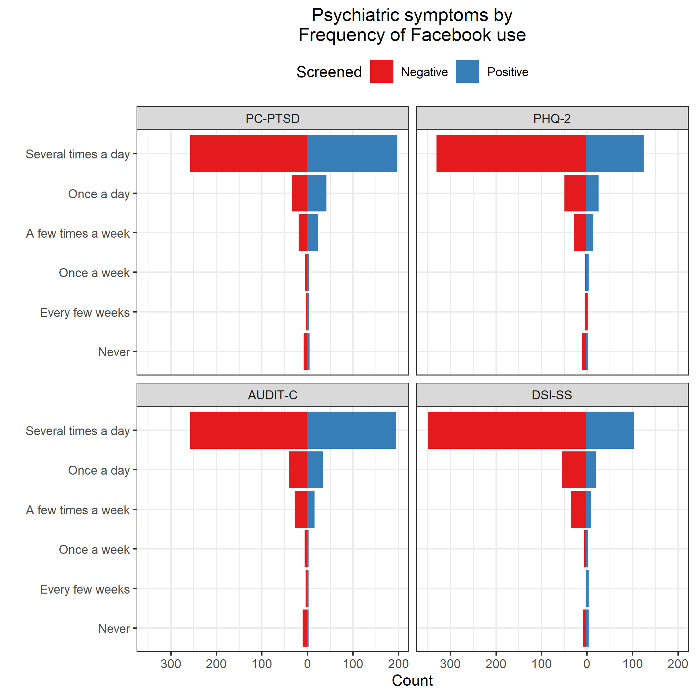
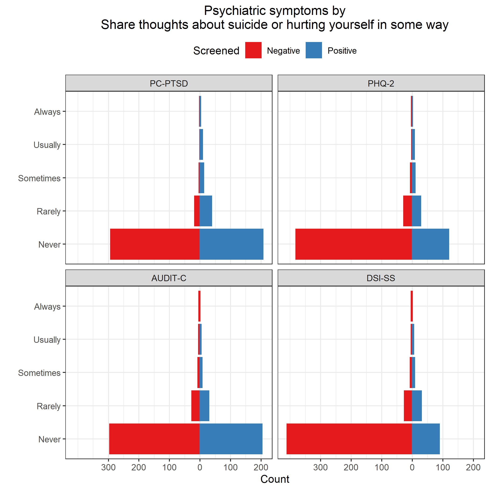

# Read data

**Most of this code was developed in Phase 1.**
Results will be suppressed for brevity.

**Use only the REDCap survey data**

Notes on the REDCap identifier variables:

* If `[consent] == 1`, they started the eligibility survey; 
  * if `== 0` or `== NA`, they didn't.
* If `[consent_and_eligibility_complete] == 2`, they finished the screener (whether eligible or ineligible); 
  * if `== 0`, they dropped out or never started.
* If `[eligible] == 1`, they completed the screener and were eligible; 
  * if `== 0`, they completed and were ineligible;
  * if `== NA` , they dropped out or never started.
* If `[veterans_and_social_media_use_co] == 2`, they finished the survey; 
  * if `== 0`, they dropped out or never started (this includes people who were ineligible or didn't consent).
* If `[analytic_sample] == 0`, they completed the survey but were disqualified for data quality reasons; 
  * if `== 1`, they completed survey and was not disqualified for data quality reasons;
  * if `== NA`, they didn't complete the survey.


Inclusion criteria

* Respondents who consented
* Eligible, ineligible, or missing eligibility indicator

**Number included: n = 1329**

Cleaning

* Parse out `fba` into 2 separate variables for `image` and `text`
* Assign indicator for survey participation, `indSurveyParticipation`
  * `analytic_sample == 1`: Participant completed survey and was not disqualified for data quality reasons
* Assign indicator for eligibility screener participation, `indScreenerParticipation`
  * `eligible == 1`: Participant completed eligibility screener and was eligible to participate in full survey


## Use of VA health services


Recoding logic

* Primary analysis will code `9` (not sure) as `0` (No)
* Sensitivity analysis will exclude the `9` values from the analysis
* If `va_ever_enrolled == FALSE` & `is.na(va_use_12mo)`, then recode `va_use_12mo` to `FALSE`
* If `va_use_12mo == TRUE` & `va_ever_enrolled == FALSE`, then recode `va_ever_enrolled` to `TRUE`
* Code indicators `indVANeverEnrolled` and `indVANotUse12mo` as the logical opposites of `va_ever_enrolled` and `va_use_12mo`


## Independent variables

* Score the Modified Facebook Measure of Social Support (FMSS)
  * Reverse-scored items are `fmss_r7` through `fmss_r10`


Check.


## Dependent variables

### Psychiatric symptoms (RQ1)

Code indicators for psychiatric disorder screening scales

* PTSD
  * Name of scale: PC-PTSD 
  * Positive screen: `ptsd_intrusive` + `ptsd_avoidant` + `ptsd_guarded` + `ptsd_numb` + `ptsd_guilty` $\ge$ 3
* Major depression
  * Name of scale: PHQ-2
  * Positive screen: `phq_interest` + `phq_mood` $\ge$ 3
* Alcohol misuse
  * Name of scale: AUDIT-C
  * Positive screen: `auditc_freq` + `auditc_amount` + `auditc_binge` $\ge$ 4 for men, $\ge$ 3 for women

Presence of suicidality is defined as DSI-SS score $\ge$ 2.
This cut-off score was chosen based on recommendations for population-based samples noted in 
[von Glischinski M Clin Psychol Psychotherapy 2015](http://onlinelibrary.wiley.com/doi/10.1002/cpp.2007/full)

* Score the DSI-SS inventory
  * See [Joiner 2002](http://www.sciencedirect.com/science/article/pii/S0005796701000171)
  * *Scores on each item range from 0 to 3 and, for the inventory, from 0 to 12, with higher scores reflecting greater severity of suicidal ideation.*


Check.


|yvariable |indPTSD | mean | sd  | min | max |  n  | freq  |
|:---------|:-------|:----:|:---:|:---:|:---:|:---:|:-----:|
|ptsd      |FALSE   | 0.9  | 0.9 |  0  |  2  | 255 | 47.9% |
|ptsd      |TRUE    | 4.2  | 0.8 |  3  |  5  | 277 | 52.1% |

\newline


|yvariable |indPHQ | mean | sd  | min | max |  n  | freq  |
|:---------|:------|:----:|:---:|:---:|:---:|:---:|:-----:|
|phq       |FALSE  | 0.9  | 0.9 |  0  |  2  | 448 | 72.3% |
|phq       |TRUE   | 4.5  | 1.2 |  3  |  6  | 172 | 27.7% |

\newline


|yvariable |indAuditC | mean | sd  | min | max |  n  | freq  |
|:---------|:---------|:----:|:---:|:---:|:---:|:---:|:-----:|
|auditc    |FALSE     | 1.8  | 0.8 |  1  |  3  | 246 | 49.0% |
|auditc    |TRUE      | 5.8  | 2.1 |  3  | 12  | 256 | 51.0% |

\newline


|yvariable |indDSISS | mean | sd  | min | max |  n  | freq  |
|:---------|:--------|:----:|:---:|:---:|:---:|:---:|:-----:|
|dsiss     |FALSE    | 0.1  | 0.3 |  0  |  1  | 482 | 78.2% |
|dsiss     |TRUE     | 3.9  | 1.6 |  2  |  9  | 134 | 21.8% |

Also create logical opposite for use in RQ3 modeling


### Social media use (RQ2)

* Spending more time on Facebook?
  * Frequency of Facebook use: `fb_freq`
  * Active use of Facebook: `comm_facebook`
* Sharing more personal or health-related information on social media?
  * `sm_emot_support`
  * `sm_med_info`
  * `sm_med_advice`
  * `sm_med_questions`
  * `sm_share_sympt`
  * `sm_share_health`
  * `sm_share_suicide`
  
Mutate variables to factors.


## Covariates

* Social media platforms used: `sm_used___1`, ..., `sm_used___7`, `sm_used___99`, `sm_used_other`
  * Recode the following `sm_used_other` values such that `sm_used___99 = 0`
    * `I use Wikipedia to read about illnesses I don't have; it's a curiosity/hobby thing.`
    * `just in person`
    * `Just plain internet search`
    * `TV/phone conversations, veterans group meetings`
    * `google; bing`
    * `aol`
    * `e-mail`
    * `Web MD`
    * `webmd`
* Offline social contact: `comm_inperson`
* History of suicidal ideation and suicide attempts
  * `suicide_considered_ever`
  * `suicide_considered_12mo`
  * `suicide_attempts` 


Check.


|smOther |sm_used_other                                                                       |    n|
|:-------|:-----------------------------------------------------------------------------------|----:|
|FALSE   |                                                                                    | 1289|
|FALSE   |aol                                                                                 |    1|
|FALSE   |e-mail                                                                              |    1|
|FALSE   |google; bing                                                                        |    1|
|FALSE   |I use Wikipedia to read about illnesses I don't have; it's a curiosity/hobby thing. |    1|
|FALSE   |just in person                                                                      |    1|
|FALSE   |Just plain internet search                                                          |    1|
|FALSE   |TV/phone conversations, veterans group meetings                                     |    1|
|FALSE   |Web MD,                                                                             |    1|
|FALSE   |webmd                                                                               |    1|
|TRUE    |4chan                                                                               |    2|
|TRUE    |Gmail Hangouts; Reddit.com                                                          |    1|
|TRUE    |Google+                                                                             |    2|
|TRUE    |I used LiveJournal for the majority of my service as well as my deployment to Iraq  |    1|
|TRUE    |light fighter                                                                       |    1|
|TRUE    |Linked In                                                                           |    1|
|TRUE    |LinkedIn, Snapchat                                                                  |    1|
|TRUE    |LiveJournal                                                                         |    1|
|TRUE    |MIL.MIL                                                                             |    1|
|TRUE    |Ravelry Forums                                                                      |    1|
|TRUE    |reddit                                                                              |    4|
|TRUE    |Reddit                                                                              |    5|
|TRUE    |Reddit, 4Chan                                                                       |    1|
|TRUE    |Snao Chat                                                                           |    1|
|TRUE    |snapchat                                                                            |    3|
|TRUE    |Snapchat                                                                            |    1|
|TRUE    |SnapChat                                                                            |    1|
|TRUE    |vetsprevail,patients like me                                                        |    1|
|TRUE    |webmd, mayoclinic,wikipedia, va                                                     |    1|
|TRUE    |www.coping-with-epilepsy.com                                                        |    1|

\newline


| countSocialMediaExclFB|    n|
|----------------------:|----:|
|                      0| 1059|
|                      1|  154|
|                      2|   80|
|                      3|   22|
|                      4|   12|
|                      5|    2|

\newline


|comm_inperson                 |   n|
|:-----------------------------|---:|
|Several times a day           | 202|
|Once a day                    |  74|
|A few times a week            | 135|
|Once a week                   |  80|
|Every few weeks or less often | 209|
|NA                            | 629|

\newline


|indSuicideConsideredEver |indSuicideConsidered12mo |indSuicideAttempt | countSuicideAttempts|   n|
|:------------------------|:------------------------|:-----------------|--------------------:|---:|
|NA                       |NA                       |NA                |                  NaN| 713|
|FALSE                    |FALSE                    |FALSE             |                    0| 350|
|TRUE                     |FALSE                    |FALSE             |                    0| 144|
|TRUE                     |FALSE                    |TRUE              |                    1|  34|
|TRUE                     |TRUE                     |FALSE             |                    0|  29|
|TRUE                     |FALSE                    |TRUE              |                    2|  19|
|TRUE                     |TRUE                     |TRUE              |                    1|  11|
|TRUE                     |FALSE                    |TRUE              |                    3|   9|
|TRUE                     |TRUE                     |TRUE              |                    3|   8|
|TRUE                     |TRUE                     |TRUE              |                    2|   7|
|TRUE                     |FALSE                    |TRUE              |                    4|   2|
|TRUE                     |FALSE                    |TRUE              |                    5|   2|
|TRUE                     |TRUE                     |TRUE              |                    5|   1|
# Research Question 1

**Is perceived social support received from Facebook (FMSS) associated with lower rates of**

* Positive screens for psychiatric disorders
  * PC-PTSD
  * PHQ-2
  * AUDIT-C
* Positive screen for suicidality?
  * DSI-SS


## Unadjusted comparisons


|yvariable |indPTSD | mean | sd  | min | max |  n  | freq  |
|:---------|:-------|:----:|:---:|:---:|:---:|:---:|:-----:|
|fmss      |FALSE   | 29.4 | 6.6 | 14  | 47  | 245 | 47.4% |
|fmss      |TRUE    | 28.4 | 6.8 | 16  | 48  | 272 | 52.6% |

\newline


|yvariable |indPHQ | mean | sd  | min | max |  n  | freq  |
|:---------|:------|:----:|:---:|:---:|:---:|:---:|:-----:|
|fmss      |FALSE  | 29.5 | 6.4 | 16  | 48  | 436 | 72.3% |
|fmss      |TRUE   | 28.0 | 6.8 | 14  | 44  | 167 | 27.7% |

\newline


|yvariable |indAuditC | mean | sd  | min | max |  n  | freq  |
|:---------|:---------|:----:|:---:|:---:|:---:|:---:|:-----:|
|fmss      |FALSE     | 29.7 | 6.6 | 14  | 48  | 241 | 49.4% |
|fmss      |TRUE      | 29.1 | 6.4 | 16  | 47  | 247 | 50.6% |

\newline


|yvariable |indDSISS | mean | sd  | min | max |  n  | freq  |
|:---------|:--------|:----:|:---:|:---:|:---:|:---:|:-----:|
|fmss      |FALSE    | 29.5 | 6.6 | 16  | 48  | 469 | 78.3% |
|fmss      |TRUE     | 27.6 | 6.4 | 14  | 44  | 130 | 21.7% |

\newline


## Adjusted comparisons


Filter subjects with missing covariates.


### PC-PTSD


|model      |term                                       | oddsratio| std.error| statistic| p.value|
|:----------|:------------------------------------------|---------:|---------:|---------:|-------:|
|Unadjusted |(Intercept)                                |     2.092|     0.395|     1.870|   0.062|
|Unadjusted |fmss                                       |     0.978|     0.013|    -1.664|   0.096|
|Adjusted   |(Intercept)                                |     0.743|     0.464|    -0.642|   0.521|
|Adjusted   |fmss                                       |     0.981|     0.015|    -1.307|   0.191|
|Adjusted   |countSocialMediaExclFB                     |     1.027|     0.097|     0.270|   0.787|
|Adjusted   |comm_inpersonOnce a day                    |     1.419|     0.348|     1.006|   0.315|
|Adjusted   |comm_inpersonA few times a week            |     1.321|     0.274|     1.015|   0.310|
|Adjusted   |comm_inpersonOnce a week                   |     1.918|     0.333|     1.956|   0.050|
|Adjusted   |comm_inpersonEvery few weeks or less often |     2.770|     0.251|     4.060|   0.000|
|Adjusted   |indSuicideConsideredEverTRUE               |     2.085|     0.211|     3.484|   0.000|
|Adjusted   |countSuicideAttempts                       |     1.675|     0.175|     2.952|   0.003|

\newline


|model      | null.deviance| df.null|   logLik|     AIC|     BIC| deviance| df.residual|
|:----------|-------------:|-------:|--------:|-------:|-------:|--------:|-----------:|
|Unadjusted |       704.395|     508| -350.803| 705.606| 714.071|  701.606|         507|
|Adjusted   |       704.395|     508| -318.709| 655.418| 693.510|  637.418|         500|


### PHQ-2


|model      |term                                       | oddsratio| std.error| statistic| p.value|
|:----------|:------------------------------------------|---------:|---------:|---------:|-------:|
|Unadjusted |(Intercept)                                |     1.147|     0.416|     0.330|   0.741|
|Unadjusted |fmss                                       |     0.963|     0.014|    -2.672|   0.008|
|Adjusted   |(Intercept)                                |     0.330|     0.489|    -2.268|   0.023|
|Adjusted   |fmss                                       |     0.970|     0.015|    -2.005|   0.045|
|Adjusted   |countSocialMediaExclFB                     |     0.972|     0.103|    -0.278|   0.781|
|Adjusted   |comm_inpersonOnce a day                    |     0.999|     0.410|    -0.003|   0.998|
|Adjusted   |comm_inpersonA few times a week            |     0.985|     0.314|    -0.048|   0.961|
|Adjusted   |comm_inpersonOnce a week                   |     2.073|     0.329|     2.216|   0.027|
|Adjusted   |comm_inpersonEvery few weeks or less often |     2.642|     0.259|     3.752|   0.000|
|Adjusted   |indSuicideConsideredEverTRUE               |     2.969|     0.218|     4.998|   0.000|
|Adjusted   |countSuicideAttempts                       |     1.232|     0.123|     1.699|   0.089|

\newline


|model      | null.deviance| df.null|   logLik|     AIC|     BIC| deviance| df.residual|
|:----------|-------------:|-------:|--------:|-------:|-------:|--------:|-----------:|
|Unadjusted |        703.22|     595| -347.957| 699.914| 708.694|  695.914|         594|
|Adjusted   |        703.22|     595| -312.064| 642.127| 681.639|  624.127|         587|


### AUDIT-C


|model      |term                                       | oddsratio| std.error| statistic| p.value|
|:----------|:------------------------------------------|---------:|---------:|---------:|-------:|
|Unadjusted |(Intercept)                                |     1.535|     0.421|     1.018|   0.309|
|Unadjusted |fmss                                       |     0.987|     0.014|    -0.962|   0.336|
|Adjusted   |(Intercept)                                |     0.897|     0.472|    -0.231|   0.818|
|Adjusted   |fmss                                       |     0.990|     0.014|    -0.701|   0.484|
|Adjusted   |countSocialMediaExclFB                     |     1.061|     0.095|     0.616|   0.538|
|Adjusted   |comm_inpersonOnce a day                    |     1.268|     0.338|     0.704|   0.482|
|Adjusted   |comm_inpersonA few times a week            |     1.150|     0.263|     0.532|   0.595|
|Adjusted   |comm_inpersonOnce a week                   |     1.828|     0.327|     1.846|   0.065|
|Adjusted   |comm_inpersonEvery few weeks or less often |     1.656|     0.247|     2.041|   0.041|
|Adjusted   |indSuicideConsideredEverTRUE               |     1.481|     0.210|     1.876|   0.061|
|Adjusted   |countSuicideAttempts                       |     0.876|     0.131|    -1.009|   0.313|

\newline


|model      | null.deviance| df.null|   logLik|     AIC|     BIC| deviance| df.residual|
|:----------|-------------:|-------:|--------:|-------:|-------:|--------:|-----------:|
|Unadjusted |       670.834|     483| -334.953| 673.906| 682.270|  669.906|         482|
|Adjusted   |       670.834|     483| -329.692| 677.384| 715.023|  659.384|         475|


### DSI-SS


|model      |term                                       | oddsratio| std.error| statistic| p.value|
|:----------|:------------------------------------------|---------:|---------:|---------:|-------:|
|Unadjusted |(Intercept)                                |     1.025|     0.450|     0.056|   0.956|
|Unadjusted |fmss                                       |     0.955|     0.016|    -2.933|   0.003|
|Adjusted   |(Intercept)                                |     0.250|     0.547|    -2.533|   0.011|
|Adjusted   |fmss                                       |     0.958|     0.017|    -2.544|   0.011|
|Adjusted   |countSocialMediaExclFB                     |     1.056|     0.109|     0.501|   0.616|
|Adjusted   |comm_inpersonOnce a day                    |     0.950|     0.463|    -0.111|   0.911|
|Adjusted   |comm_inpersonA few times a week            |     1.097|     0.333|     0.277|   0.782|
|Adjusted   |comm_inpersonOnce a week                   |     1.432|     0.358|     1.004|   0.315|
|Adjusted   |comm_inpersonEvery few weeks or less often |     1.572|     0.290|     1.557|   0.119|
|Adjusted   |indSuicideConsideredEverTRUE               |     5.764|     0.254|     6.898|   0.000|
|Adjusted   |countSuicideAttempts                       |     1.258|     0.121|     1.893|   0.058|

\newline


|model      | null.deviance| df.null|   logLik|     AIC|     BIC| deviance| df.residual|
|:----------|-------------:|-------:|--------:|-------:|-------:|--------:|-----------:|
|Unadjusted |       622.664|     595| -306.892| 617.784| 626.565|  613.784|         594|
|Adjusted   |       622.664|     595| -262.037| 542.074| 581.586|  524.074|         587|
# Research Question 2

**Are certains features of social media use are associated with positive screens for psychiatric disorders or a positive screen for suicidality?**

* Spending more time on Facebook?
  * Frequency of Facebook use: `fb_freq`
  * Active use of Facebook: `comm_facebook`
* Sharing more personal or health-related information on social media?
  * Get emotional support from others `sm_emot_support`
  * Get information about health or medical topics `sm_med_info`
  * Get advice about health or medical topics `sm_med_advice`
  * Ask questions about health or medical issues `sm_med_questions`
  * Share symptoms such as mood swings, depression, anxiety, or sleep problems `sm_share_sympt`
  * Share information related to your health `sm_share_health`
  * Share thoughts about suicide or hurting yourself in some way `sm_share_suicide`
  
  
## Association between frequency of Facebook use and active use of Facebook

Correlation (Spearman) between frequency of Facebook use and active use of Facebook is
0.446


## Unadjusted comparisons





## Adjusted comparisons


Show the covariates used in the adjusted models.


```r
covar <- c("countSocialMediaExclFB",
           "comm_inperson",
           "indSuicideConsideredEver",
           "countSuicideAttempts")
```

Filter subjects with missing covariates.


Relabel factors; replace spaces with underscores.


### PC-PTSD vs Frequency of Facebook use


|model      |     F| df1| df2| pValue|
|:----------|-----:|---:|---:|------:|
|Unadjusted | 1.204|   5| 516|  0.306|
|Adjusted   | 1.215|   5| 509|  0.301|

\newline


|model      |term                                       | oddsratio| std.error| statistic| p.value|
|:----------|:------------------------------------------|---------:|---------:|---------:|-------:|
|Unadjusted |(Intercept)                                |     0.429|     0.690|    -1.228|   0.220|
|Unadjusted |fb_freqEvery_few_weeks                     |     4.667|     1.406|     1.096|   0.273|
|Unadjusted |fb_freqOnce_a_week                         |     1.167|     1.107|     0.139|   0.889|
|Unadjusted |fb_freqA_few_times_a_week                  |     3.667|     0.770|     1.687|   0.092|
|Unadjusted |fb_freqOnce_a_day                          |     3.417|     0.732|     1.678|   0.093|
|Unadjusted |fb_freqSeveral_times_a_day                 |     2.357|     0.697|     1.230|   0.219|
|Adjusted   |(Intercept)                                |     0.204|     0.732|    -2.170|   0.030|
|Adjusted   |fb_freqEvery_few_weeks                     |     3.570|     1.488|     0.855|   0.392|
|Adjusted   |fb_freqOnce_a_week                         |     0.845|     1.130|    -0.149|   0.881|
|Adjusted   |fb_freqA_few_times_a_week                  |     3.662|     0.791|     1.641|   0.101|
|Adjusted   |fb_freqOnce_a_day                          |     2.870|     0.754|     1.399|   0.162|
|Adjusted   |fb_freqSeveral_times_a_day                 |     2.040|     0.714|     0.998|   0.318|
|Adjusted   |countSocialMediaExclFB                     |     1.031|     0.095|     0.326|   0.744|
|Adjusted   |comm_inpersonOnce a day                    |     1.216|     0.341|     0.572|   0.568|
|Adjusted   |comm_inpersonA few times a week            |     1.210|     0.272|     0.699|   0.485|
|Adjusted   |comm_inpersonOnce a week                   |     1.855|     0.326|     1.895|   0.058|
|Adjusted   |comm_inpersonEvery few weeks or less often |     2.674|     0.249|     3.956|   0.000|
|Adjusted   |indSuicideConsideredEverTRUE               |     2.002|     0.208|     3.333|   0.001|
|Adjusted   |countSuicideAttempts                       |     1.706|     0.179|     2.988|   0.003|

\newline


|model      | null.deviance| df.null|   logLik|     AIC|     BIC| deviance| df.residual|
|:----------|-------------:|-------:|--------:|-------:|-------:|--------:|-----------:|
|Unadjusted |       723.025|     521| -358.357| 728.714| 754.260|  716.714|         516|
|Adjusted   |       723.025|     521| -326.258| 678.516| 733.866|  652.516|         509|


### PC-PTSD vs Active use of Facebook


|model      |     F| df1| df2| pValue|
|:----------|-----:|---:|---:|------:|
|Unadjusted | 1.859|   4| 519|  0.116|
|Adjusted   | 1.592|   4| 512|  0.175|

\newline


|model      |term                                       | oddsratio| std.error| statistic| p.value|
|:----------|:------------------------------------------|---------:|---------:|---------:|-------:|
|Unadjusted |(Intercept)                                |     1.407|     0.252|     1.358|   0.175|
|Unadjusted |comm_facebookOnce_a_week                   |     0.933|     0.416|    -0.168|   0.867|
|Unadjusted |comm_facebookA_few_times_a_week            |     0.963|     0.319|    -0.118|   0.906|
|Unadjusted |comm_facebookOnce_a_day                    |     0.903|     0.334|    -0.307|   0.759|
|Unadjusted |comm_facebookSeveral_times_a_day           |     0.587|     0.284|    -1.872|   0.061|
|Adjusted   |(Intercept)                                |     0.568|     0.332|    -1.702|   0.089|
|Adjusted   |comm_facebookOnce_a_week                   |     0.944|     0.446|    -0.128|   0.898|
|Adjusted   |comm_facebookA_few_times_a_week            |     0.994|     0.340|    -0.019|   0.985|
|Adjusted   |comm_facebookOnce_a_day                    |     1.067|     0.358|     0.182|   0.855|
|Adjusted   |comm_facebookSeveral_times_a_day           |     0.621|     0.310|    -1.533|   0.125|
|Adjusted   |countSocialMediaExclFB                     |     1.060|     0.096|     0.608|   0.543|
|Adjusted   |comm_inpersonOnce a day                    |     1.142|     0.345|     0.385|   0.700|
|Adjusted   |comm_inpersonA few times a week            |     1.146|     0.274|     0.499|   0.617|
|Adjusted   |comm_inpersonOnce a week                   |     1.645|     0.329|     1.511|   0.131|
|Adjusted   |comm_inpersonEvery few weeks or less often |     2.397|     0.253|     3.460|   0.001|
|Adjusted   |indSuicideConsideredEverTRUE               |     1.983|     0.209|     3.276|   0.001|
|Adjusted   |countSuicideAttempts                       |     1.792|     0.180|     3.246|   0.001|

\newline


|model      | null.deviance| df.null|   logLik|     AIC|     BIC| deviance| df.residual|
|:----------|-------------:|-------:|--------:|-------:|-------:|--------:|-----------:|
|Unadjusted |       725.655|     523| -359.081| 728.163| 749.470|  718.163|         519|
|Adjusted   |       725.655|     523| -327.005| 678.009| 729.147|  654.009|         512|


### PC-PTSD vs Get emotional support from others


|model      |     F| df1| df2| pValue|
|:----------|-----:|---:|---:|------:|
|Unadjusted | 1.621|   4| 519|  0.167|
|Adjusted   | 1.820|   4| 512|  0.124|

\newline


|model      |term                                       | oddsratio| std.error| statistic| p.value|
|:----------|:------------------------------------------|---------:|---------:|---------:|-------:|
|Unadjusted |(Intercept)                                |     0.870|     0.147|    -0.950|   0.342|
|Unadjusted |sm_emot_supportRarely                      |     1.642|     0.214|     2.318|   0.020|
|Unadjusted |sm_emot_supportSometimes                   |     1.112|     0.234|     0.452|   0.651|
|Unadjusted |sm_emot_supportUsually                     |     1.555|     0.352|     1.255|   0.210|
|Unadjusted |sm_emot_supportAlways                      |     0.862|     0.778|    -0.191|   0.849|
|Adjusted   |(Intercept)                                |     0.374|     0.234|    -4.201|   0.000|
|Adjusted   |sm_emot_supportRarely                      |     1.633|     0.232|     2.115|   0.034|
|Adjusted   |sm_emot_supportSometimes                   |     0.996|     0.260|    -0.016|   0.987|
|Adjusted   |sm_emot_supportUsually                     |     1.396|     0.389|     0.859|   0.390|
|Adjusted   |sm_emot_supportAlways                      |     0.404|     0.899|    -1.007|   0.314|
|Adjusted   |countSocialMediaExclFB                     |     1.009|     0.098|     0.092|   0.926|
|Adjusted   |comm_inpersonOnce a day                    |     1.267|     0.341|     0.694|   0.488|
|Adjusted   |comm_inpersonA few times a week            |     1.236|     0.272|     0.779|   0.436|
|Adjusted   |comm_inpersonOnce a week                   |     1.846|     0.326|     1.879|   0.060|
|Adjusted   |comm_inpersonEvery few weeks or less often |     2.793|     0.250|     4.113|   0.000|
|Adjusted   |indSuicideConsideredEverTRUE               |     1.975|     0.209|     3.257|   0.001|
|Adjusted   |countSuicideAttempts                       |     1.775|     0.180|     3.181|   0.001|

\newline


|model      | null.deviance| df.null|   logLik|     AIC|     BIC| deviance| df.residual|
|:----------|-------------:|-------:|--------:|-------:|-------:|--------:|-----------:|
|Unadjusted |       725.655|     523| -359.556| 729.112| 750.419|  719.112|         519|
|Adjusted   |       725.655|     523| -326.496| 676.993| 728.131|  652.993|         512|


### PC-PTSD vs Get information about health or medical topics


|model      |     F| df1| df2| pValue|
|:----------|-----:|---:|---:|------:|
|Unadjusted | 1.232|   4| 517|  0.296|
|Adjusted   | 1.138|   4| 510|  0.338|

\newline


|model      |term                                       | oddsratio| std.error| statistic| p.value|
|:----------|:------------------------------------------|---------:|---------:|---------:|-------:|
|Unadjusted |(Intercept)                                |     1.127|     0.173|     0.691|   0.490|
|Unadjusted |sm_med_infoRarely                          |     0.818|     0.239|    -0.840|   0.401|
|Unadjusted |sm_med_infoSometimes                       |     0.943|     0.233|    -0.249|   0.803|
|Unadjusted |sm_med_infoUsually                         |     1.563|     0.323|     1.382|   0.167|
|Unadjusted |sm_med_infoAlways                          |     0.645|     0.496|    -0.883|   0.377|
|Adjusted   |(Intercept)                                |     0.489|     0.248|    -2.882|   0.004|
|Adjusted   |sm_med_infoRarely                          |     0.755|     0.256|    -1.096|   0.273|
|Adjusted   |sm_med_infoSometimes                       |     0.928|     0.255|    -0.291|   0.771|
|Adjusted   |sm_med_infoUsually                         |     1.464|     0.351|     1.086|   0.278|
|Adjusted   |sm_med_infoAlways                          |     0.631|     0.554|    -0.832|   0.405|
|Adjusted   |countSocialMediaExclFB                     |     1.016|     0.099|     0.164|   0.870|
|Adjusted   |comm_inpersonOnce a day                    |     1.231|     0.342|     0.609|   0.543|
|Adjusted   |comm_inpersonA few times a week            |     1.266|     0.272|     0.868|   0.385|
|Adjusted   |comm_inpersonOnce a week                   |     1.853|     0.327|     1.886|   0.059|
|Adjusted   |comm_inpersonEvery few weeks or less often |     2.610|     0.248|     3.869|   0.000|
|Adjusted   |indSuicideConsideredEverTRUE               |     1.958|     0.208|     3.238|   0.001|
|Adjusted   |countSuicideAttempts                       |     1.741|     0.178|     3.121|   0.002|

\newline


|model      | null.deviance| df.null|   logLik|     AIC|     BIC| deviance| df.residual|
|:----------|-------------:|-------:|--------:|-------:|-------:|--------:|-----------:|
|Unadjusted |       722.879|     521| -358.912| 727.824| 749.112|  717.824|         517|
|Adjusted   |       722.879|     521| -327.299| 678.597| 729.689|  654.597|         510|


### PC-PTSD vs Get advice about health or medical topics


|model      |     F| df1| df2| pValue|
|:----------|-----:|---:|---:|------:|
|Unadjusted | 2.330|   4| 519|  0.055|
|Adjusted   | 2.425|   4| 512|  0.047|

\newline


|model      |term                                       | oddsratio| std.error| statistic| p.value|
|:----------|:------------------------------------------|---------:|---------:|---------:|-------:|
|Unadjusted |(Intercept)                                |     1.042|     0.143|     0.286|   0.775|
|Unadjusted |sm_med_adviceRarely                        |     0.913|     0.213|    -0.426|   0.670|
|Unadjusted |sm_med_adviceSometimes                     |     1.195|     0.233|     0.765|   0.444|
|Unadjusted |sm_med_adviceUsually                       |     2.182|     0.389|     2.006|   0.045|
|Unadjusted |sm_med_adviceAlways                        |     0.288|     0.674|    -1.848|   0.065|
|Adjusted   |(Intercept)                                |     0.442|     0.229|    -3.569|   0.000|
|Adjusted   |sm_med_adviceRarely                        |     0.875|     0.230|    -0.579|   0.562|
|Adjusted   |sm_med_adviceSometimes                     |     1.222|     0.252|     0.795|   0.427|
|Adjusted   |sm_med_adviceUsually                       |     1.998|     0.416|     1.664|   0.096|
|Adjusted   |sm_med_adviceAlways                        |     0.184|     0.789|    -2.145|   0.032|
|Adjusted   |countSocialMediaExclFB                     |     1.014|     0.098|     0.143|   0.887|
|Adjusted   |comm_inpersonOnce a day                    |     1.276|     0.345|     0.708|   0.479|
|Adjusted   |comm_inpersonA few times a week            |     1.221|     0.273|     0.731|   0.465|
|Adjusted   |comm_inpersonOnce a week                   |     1.762|     0.326|     1.736|   0.083|
|Adjusted   |comm_inpersonEvery few weeks or less often |     2.631|     0.249|     3.885|   0.000|
|Adjusted   |indSuicideConsideredEverTRUE               |     2.011|     0.208|     3.352|   0.001|
|Adjusted   |countSuicideAttempts                       |     1.772|     0.177|     3.228|   0.001|

\newline


|model      | null.deviance| df.null|   logLik|     AIC|     BIC| deviance| df.residual|
|:----------|-------------:|-------:|--------:|-------:|-------:|--------:|-----------:|
|Unadjusted |       725.655|     523| -357.623| 725.246| 746.554|  715.246|         519|
|Adjusted   |       725.655|     523| -324.594| 673.188| 724.326|  649.188|         512|


### PC-PTSD vs Ask questions about health or medical issues


|model      |     F| df1| df2| pValue|
|:----------|-----:|---:|---:|------:|
|Unadjusted | 2.083|   4| 519|  0.082|
|Adjusted   | 1.370|   4| 512|  0.243|

\newline


|model      |term                                       | oddsratio| std.error| statistic| p.value|
|:----------|:------------------------------------------|---------:|---------:|---------:|-------:|
|Unadjusted |(Intercept)                                |     0.943|     0.129|    -0.453|   0.651|
|Unadjusted |sm_med_questionsRarely                     |     1.074|     0.208|     0.345|   0.730|
|Unadjusted |sm_med_questionsSometimes                  |     1.267|     0.248|     0.955|   0.340|
|Unadjusted |sm_med_questionsUsually                    |     3.314|     0.426|     2.810|   0.005|
|Unadjusted |sm_med_questionsAlways                     |     1.272|     0.619|     0.389|   0.697|
|Adjusted   |(Intercept)                                |     0.413|     0.221|    -3.998|   0.000|
|Adjusted   |sm_med_questionsRarely                     |     1.086|     0.225|     0.366|   0.714|
|Adjusted   |sm_med_questionsSometimes                  |     1.275|     0.264|     0.920|   0.357|
|Adjusted   |sm_med_questionsUsually                    |     2.767|     0.454|     2.242|   0.025|
|Adjusted   |sm_med_questionsAlways                     |     0.945|     0.690|    -0.082|   0.935|
|Adjusted   |countSocialMediaExclFB                     |     0.994|     0.097|    -0.066|   0.947|
|Adjusted   |comm_inpersonOnce a day                    |     1.210|     0.341|     0.558|   0.577|
|Adjusted   |comm_inpersonA few times a week            |     1.224|     0.272|     0.742|   0.458|
|Adjusted   |comm_inpersonOnce a week                   |     1.759|     0.327|     1.727|   0.084|
|Adjusted   |comm_inpersonEvery few weeks or less often |     2.552|     0.247|     3.787|   0.000|
|Adjusted   |indSuicideConsideredEverTRUE               |     1.995|     0.208|     3.320|   0.001|
|Adjusted   |countSuicideAttempts                       |     1.721|     0.179|     3.032|   0.002|

\newline


|model      | null.deviance| df.null|   logLik|     AIC|     BIC| deviance| df.residual|
|:----------|-------------:|-------:|--------:|-------:|-------:|--------:|-----------:|
|Unadjusted |       725.655|     523| -358.105| 726.210| 747.518|  716.210|         519|
|Adjusted   |       725.655|     523| -327.250| 678.501| 729.638|  654.501|         512|


### PC-PTSD vs Share symptoms such as mood swings, depression, anxiety, or sleep problems


|model      |     F| df1| df2| pValue|
|:----------|-----:|---:|---:|------:|
|Unadjusted | 4.949|   4| 518|  0.001|
|Adjusted   | 2.213|   4| 511|  0.066|

\newline


|model      |term                                       | oddsratio| std.error| statistic| p.value|
|:----------|:------------------------------------------|---------:|---------:|---------:|-------:|
|Unadjusted |(Intercept)                                |     0.876|     0.122|    -1.091|   0.275|
|Unadjusted |sm_share_symptRarely                       |     1.031|     0.210|     0.144|   0.885|
|Unadjusted |sm_share_symptSometimes                    |     2.152|     0.271|     2.824|   0.005|
|Unadjusted |sm_share_symptUsually                      |     5.709|     0.505|     3.451|   0.001|
|Unadjusted |sm_share_symptAlways                       |     2.283|     0.717|     1.151|   0.250|
|Adjusted   |(Intercept)                                |     0.439|     0.213|    -3.868|   0.000|
|Adjusted   |sm_share_symptRarely                       |     0.894|     0.231|    -0.486|   0.627|
|Adjusted   |sm_share_symptSometimes                    |     1.630|     0.292|     1.673|   0.094|
|Adjusted   |sm_share_symptUsually                      |     3.327|     0.527|     2.283|   0.022|
|Adjusted   |sm_share_symptAlways                       |     1.253|     0.786|     0.287|   0.774|
|Adjusted   |countSocialMediaExclFB                     |     1.015|     0.097|     0.155|   0.877|
|Adjusted   |comm_inpersonOnce a day                    |     1.197|     0.342|     0.525|   0.599|
|Adjusted   |comm_inpersonA few times a week            |     1.243|     0.273|     0.798|   0.425|
|Adjusted   |comm_inpersonOnce a week                   |     1.804|     0.330|     1.785|   0.074|
|Adjusted   |comm_inpersonEvery few weeks or less often |     2.383|     0.250|     3.470|   0.001|
|Adjusted   |indSuicideConsideredEverTRUE               |     1.881|     0.211|     2.988|   0.003|
|Adjusted   |countSuicideAttempts                       |     1.681|     0.183|     2.841|   0.004|

\newline


|model      | null.deviance| df.null|   logLik|     AIC|     BIC| deviance| df.residual|
|:----------|-------------:|-------:|--------:|-------:|-------:|--------:|-----------:|
|Unadjusted |       724.189|     522| -350.370| 710.739| 732.037|  700.739|         518|
|Adjusted   |       724.189|     522| -324.865| 673.730| 724.845|  649.730|         511|


### PC-PTSD vs Share information related to your health


|model      |     F| df1| df2| pValue|
|:----------|-----:|---:|---:|------:|
|Unadjusted | 2.572|   4| 518|  0.037|
|Adjusted   | 1.783|   4| 511|  0.131|

\newline


|model      |term                                       | oddsratio| std.error| statistic| p.value|
|:----------|:------------------------------------------|---------:|---------:|---------:|-------:|
|Unadjusted |(Intercept)                                |     0.906|     0.128|    -0.768|   0.443|
|Unadjusted |sm_share_healthRarely                      |     1.165|     0.196|     0.782|   0.434|
|Unadjusted |sm_share_healthSometimes                   |     1.398|     0.276|     1.214|   0.225|
|Unadjusted |sm_share_healthUsually                     |    22.069|     1.033|     2.996|   0.003|
|Unadjusted |sm_share_healthAlways                      |     0.828|     0.774|    -0.244|   0.807|
|Adjusted   |(Intercept)                                |     0.449|     0.215|    -3.731|   0.000|
|Adjusted   |sm_share_healthRarely                      |     0.924|     0.211|    -0.372|   0.710|
|Adjusted   |sm_share_healthSometimes                   |     1.050|     0.302|     0.162|   0.871|
|Adjusted   |sm_share_healthUsually                     |    11.614|     1.048|     2.339|   0.019|
|Adjusted   |sm_share_healthAlways                      |     0.345|     0.956|    -1.112|   0.266|
|Adjusted   |countSocialMediaExclFB                     |     1.013|     0.097|     0.134|   0.894|
|Adjusted   |comm_inpersonOnce a day                    |     1.276|     0.341|     0.715|   0.474|
|Adjusted   |comm_inpersonA few times a week            |     1.287|     0.273|     0.923|   0.356|
|Adjusted   |comm_inpersonOnce a week                   |     1.863|     0.331|     1.881|   0.060|
|Adjusted   |comm_inpersonEvery few weeks or less often |     2.454|     0.251|     3.577|   0.000|
|Adjusted   |indSuicideConsideredEverTRUE               |     1.909|     0.211|     3.066|   0.002|
|Adjusted   |countSuicideAttempts                       |     1.784|     0.185|     3.123|   0.002|

\newline


|model      | null.deviance| df.null|   logLik|     AIC|     BIC| deviance| df.residual|
|:----------|-------------:|-------:|--------:|-------:|-------:|--------:|-----------:|
|Unadjusted |       724.342|     522| -351.073| 712.147| 733.445|  702.147|         518|
|Adjusted   |       724.342|     522| -322.707| 669.415| 720.530|  645.415|         511|


### PC-PTSD vs Share thoughts about suicide or hurting yourself in some way


|model      |     F| df1| df2| pValue|
|:----------|-----:|---:|---:|------:|
|Unadjusted | 4.964|   4| 517|  0.001|
|Adjusted   | 3.211|   4| 510|  0.013|

\newline


|model      |term                                       | oddsratio| std.error| statistic| p.value|
|:----------|:------------------------------------------|---------:|---------:|---------:|-------:|
|Unadjusted |(Intercept)                                |     0.913|     0.095|    -0.953|   0.341|
|Unadjusted |sm_share_suicideRarely                     |     2.921|     0.317|     3.376|   0.001|
|Unadjusted |sm_share_suicideSometimes                  |     4.381|     0.653|     2.264|   0.024|
|Unadjusted |sm_share_suicideUsually                    |     8.762|     1.065|     2.038|   0.042|
|Unadjusted |sm_share_suicideAlways                     |     2.190|     1.228|     0.638|   0.523|
|Adjusted   |(Intercept)                                |     0.408|     0.206|    -4.348|   0.000|
|Adjusted   |sm_share_suicideRarely                     |     2.500|     0.338|     2.711|   0.007|
|Adjusted   |sm_share_suicideSometimes                  |     2.951|     0.685|     1.580|   0.114|
|Adjusted   |sm_share_suicideUsually                    |     8.225|     1.085|     1.943|   0.052|
|Adjusted   |sm_share_suicideAlways                     |     1.214|     1.474|     0.132|   0.895|
|Adjusted   |countSocialMediaExclFB                     |     1.019|     0.097|     0.191|   0.848|
|Adjusted   |comm_inpersonOnce a day                    |     1.317|     0.344|     0.802|   0.423|
|Adjusted   |comm_inpersonA few times a week            |     1.211|     0.276|     0.694|   0.488|
|Adjusted   |comm_inpersonOnce a week                   |     1.809|     0.328|     1.808|   0.071|
|Adjusted   |comm_inpersonEvery few weeks or less often |     2.711|     0.251|     3.981|   0.000|
|Adjusted   |indSuicideConsideredEverTRUE               |     1.780|     0.211|     2.732|   0.006|
|Adjusted   |countSuicideAttempts                       |     1.751|     0.182|     3.083|   0.002|

\newline


|model      | null.deviance| df.null|   logLik|     AIC|     BIC| deviance| df.residual|
|:----------|-------------:|-------:|--------:|-------:|-------:|--------:|-----------:|
|Unadjusted |       722.718|     521| -349.313| 708.625| 729.913|  698.625|         517|
|Adjusted   |       722.718|     521| -321.338| 666.676| 717.768|  642.676|         510|


### PHQ-2 vs Frequency of Facebook use


|model      |     F| df1| df2| pValue|
|:----------|-----:|---:|---:|------:|
|Unadjusted | 0.497|   5| 605|  0.778|
|Adjusted   | 0.415|   5| 598|  0.838|

\newline


|model      |term                                       | oddsratio| std.error| statistic| p.value|
|:----------|:------------------------------------------|---------:|---------:|---------:|-------:|
|Unadjusted |(Intercept)                                |     0.111|     1.054|    -2.084|   0.037|
|Unadjusted |fb_freqEvery_few_weeks                     |     0.000|   441.373|    -0.028|   0.978|
|Unadjusted |fb_freqOnce_a_week                         |     4.500|     1.364|     1.103|   0.270|
|Unadjusted |fb_freqA_few_times_a_week                  |     3.724|     1.109|     1.186|   0.236|
|Unadjusted |fb_freqOnce_a_day                          |     4.327|     1.082|     1.354|   0.176|
|Unadjusted |fb_freqSeveral_times_a_day                 |     3.339|     1.059|     1.138|   0.255|
|Adjusted   |(Intercept)                                |     0.045|     1.097|    -2.827|   0.005|
|Adjusted   |fb_freqEvery_few_weeks                     |     0.000|   652.539|    -0.021|   0.983|
|Adjusted   |fb_freqOnce_a_week                         |     3.416|     1.391|     0.883|   0.377|
|Adjusted   |fb_freqA_few_times_a_week                  |     3.811|     1.135|     1.179|   0.238|
|Adjusted   |fb_freqOnce_a_day                          |     3.841|     1.106|     1.217|   0.224|
|Adjusted   |fb_freqSeveral_times_a_day                 |     3.042|     1.080|     1.030|   0.303|
|Adjusted   |countSocialMediaExclFB                     |     0.914|     0.103|    -0.879|   0.379|
|Adjusted   |comm_inpersonOnce a day                    |     1.106|     0.395|     0.255|   0.798|
|Adjusted   |comm_inpersonA few times a week            |     0.912|     0.318|    -0.291|   0.771|
|Adjusted   |comm_inpersonOnce a week                   |     2.296|     0.324|     2.570|   0.010|
|Adjusted   |comm_inpersonEvery few weeks or less often |     2.762|     0.255|     3.983|   0.000|
|Adjusted   |indSuicideConsideredEverTRUE               |     2.992|     0.215|     5.087|   0.000|
|Adjusted   |countSuicideAttempts                       |     1.212|     0.125|     1.541|   0.123|

\newline


|model      | null.deviance| df.null|   logLik|     AIC|     BIC| deviance| df.residual|
|:----------|-------------:|-------:|--------:|-------:|-------:|--------:|-----------:|
|Unadjusted |       718.694|     610| -356.562| 725.124| 751.614|  713.124|         605|
|Adjusted   |       718.694|     610| -317.866| 661.732| 719.128|  635.732|         598|


### PHQ-2 vs Active use of Facebook


|model      |     F| df1| df2| pValue|
|:----------|-----:|---:|---:|------:|
|Unadjusted | 0.601|   4| 608|  0.662|
|Adjusted   | 0.477|   4| 601|  0.753|

\newline


|model      |term                                       | oddsratio| std.error| statistic| p.value|
|:----------|:------------------------------------------|---------:|---------:|---------:|-------:|
|Unadjusted |(Intercept)                                |     0.532|     0.248|    -2.550|   0.011|
|Unadjusted |comm_facebookOnce_a_week                   |     0.843|     0.416|    -0.412|   0.681|
|Unadjusted |comm_facebookA_few_times_a_week            |     0.661|     0.322|    -1.286|   0.198|
|Unadjusted |comm_facebookOnce_a_day                    |     0.702|     0.332|    -1.066|   0.287|
|Unadjusted |comm_facebookSeveral_times_a_day           |     0.673|     0.283|    -1.397|   0.163|
|Adjusted   |(Intercept)                                |     0.184|     0.353|    -4.797|   0.000|
|Adjusted   |comm_facebookOnce_a_week                   |     0.886|     0.453|    -0.267|   0.790|
|Adjusted   |comm_facebookA_few_times_a_week            |     0.639|     0.349|    -1.283|   0.200|
|Adjusted   |comm_facebookOnce_a_day                    |     0.804|     0.364|    -0.601|   0.548|
|Adjusted   |comm_facebookSeveral_times_a_day           |     0.733|     0.315|    -0.987|   0.324|
|Adjusted   |countSocialMediaExclFB                     |     0.929|     0.102|    -0.720|   0.471|
|Adjusted   |comm_inpersonOnce a day                    |     1.033|     0.396|     0.081|   0.936|
|Adjusted   |comm_inpersonA few times a week            |     0.966|     0.313|    -0.112|   0.911|
|Adjusted   |comm_inpersonOnce a week                   |     2.184|     0.326|     2.396|   0.017|
|Adjusted   |comm_inpersonEvery few weeks or less often |     2.581|     0.261|     3.639|   0.000|
|Adjusted   |indSuicideConsideredEverTRUE               |     3.113|     0.216|     5.258|   0.000|
|Adjusted   |countSuicideAttempts                       |     1.230|     0.124|     1.668|   0.095|

\newline


|model      | null.deviance| df.null|   logLik|     AIC|     BIC| deviance| df.residual|
|:----------|-------------:|-------:|--------:|-------:|-------:|--------:|-----------:|
|Unadjusted |       723.841|     612| -360.750| 731.499| 753.591|  721.499|         608|
|Adjusted   |       723.841|     612| -321.877| 667.754| 720.775|  643.754|         601|


### PHQ-2 vs Get emotional support from others


|model      |     F| df1| df2| pValue|
|:----------|-----:|---:|---:|------:|
|Unadjusted | 0.730|   4| 608|  0.571|
|Adjusted   | 0.432|   4| 601|  0.786|

\newline


|model      |term                                       | oddsratio| std.error| statistic| p.value|
|:----------|:------------------------------------------|---------:|---------:|---------:|-------:|
|Unadjusted |(Intercept)                                |     0.325|     0.157|    -7.168|   0.000|
|Unadjusted |sm_emot_supportRarely                      |     1.270|     0.222|     1.075|   0.282|
|Unadjusted |sm_emot_supportSometimes                   |     1.317|     0.242|     1.139|   0.255|
|Unadjusted |sm_emot_supportUsually                     |     1.110|     0.360|     0.290|   0.771|
|Unadjusted |sm_emot_supportAlways                      |     2.459|     0.689|     1.306|   0.191|
|Adjusted   |(Intercept)                                |     0.122|     0.266|    -7.897|   0.000|
|Adjusted   |sm_emot_supportRarely                      |     1.247|     0.244|     0.907|   0.365|
|Adjusted   |sm_emot_supportSometimes                   |     1.277|     0.268|     0.911|   0.362|
|Adjusted   |sm_emot_supportUsually                     |     1.020|     0.397|     0.051|   0.960|
|Adjusted   |sm_emot_supportAlways                      |     1.889|     0.750|     0.849|   0.396|
|Adjusted   |countSocialMediaExclFB                     |     0.909|     0.104|    -0.912|   0.362|
|Adjusted   |comm_inpersonOnce a day                    |     1.082|     0.398|     0.198|   0.843|
|Adjusted   |comm_inpersonA few times a week            |     0.989|     0.311|    -0.037|   0.970|
|Adjusted   |comm_inpersonOnce a week                   |     2.268|     0.323|     2.533|   0.011|
|Adjusted   |comm_inpersonEvery few weeks or less often |     2.778|     0.257|     3.978|   0.000|
|Adjusted   |indSuicideConsideredEverTRUE               |     2.952|     0.214|     5.051|   0.000|
|Adjusted   |countSuicideAttempts                       |     1.230|     0.125|     1.660|   0.097|

\newline


|model      | null.deviance| df.null|   logLik|     AIC|     BIC| deviance| df.residual|
|:----------|-------------:|-------:|--------:|-------:|-------:|--------:|-----------:|
|Unadjusted |       723.841|     612| -360.475| 730.950| 753.041|  720.950|         608|
|Adjusted   |       723.841|     612| -321.966| 667.932| 720.953|  643.932|         601|


### PHQ-2 vs Get information about health or medical topics


|model      |     F| df1| df2| pValue|
|:----------|-----:|---:|---:|------:|
|Unadjusted | 2.224|   4| 606|  0.065|
|Adjusted   | 2.309|   4| 599|  0.057|

\newline


|model      |term                                       | oddsratio| std.error| statistic| p.value|
|:----------|:------------------------------------------|---------:|---------:|---------:|-------:|
|Unadjusted |(Intercept)                                |     0.387|     0.180|    -5.280|   0.000|
|Unadjusted |sm_med_infoRarely                          |     0.735|     0.252|    -1.221|   0.222|
|Unadjusted |sm_med_infoSometimes                       |     1.089|     0.242|     0.352|   0.725|
|Unadjusted |sm_med_infoUsually                         |     1.700|     0.306|     1.733|   0.083|
|Unadjusted |sm_med_infoAlways                          |     0.574|     0.581|    -0.956|   0.339|
|Adjusted   |(Intercept)                                |     0.138|     0.279|    -7.082|   0.000|
|Adjusted   |sm_med_infoRarely                          |     0.693|     0.272|    -1.350|   0.177|
|Adjusted   |sm_med_infoSometimes                       |     1.189|     0.266|     0.649|   0.517|
|Adjusted   |sm_med_infoUsually                         |     1.725|     0.342|     1.597|   0.110|
|Adjusted   |sm_med_infoAlways                          |     0.596|     0.647|    -0.801|   0.423|
|Adjusted   |countSocialMediaExclFB                     |     0.891|     0.106|    -1.092|   0.275|
|Adjusted   |comm_inpersonOnce a day                    |     1.124|     0.400|     0.291|   0.771|
|Adjusted   |comm_inpersonA few times a week            |     1.043|     0.314|     0.134|   0.893|
|Adjusted   |comm_inpersonOnce a week                   |     2.336|     0.326|     2.599|   0.009|
|Adjusted   |comm_inpersonEvery few weeks or less often |     2.819|     0.258|     4.013|   0.000|
|Adjusted   |indSuicideConsideredEverTRUE               |     2.977|     0.216|     5.048|   0.000|
|Adjusted   |countSuicideAttempts                       |     1.243|     0.125|     1.737|   0.082|

\newline


|model      | null.deviance| df.null|   logLik|     AIC|     BIC| deviance| df.residual|
|:----------|-------------:|-------:|--------:|-------:|-------:|--------:|-----------:|
|Unadjusted |       720.625|     610| -355.835| 721.670| 743.746|  711.670|         606|
|Adjusted   |       720.625|     610| -317.435| 658.869| 711.851|  634.869|         599|


### PHQ-2 vs Get advice about health or medical topics


|model      |     F| df1| df2| pValue|
|:----------|-----:|---:|---:|------:|
|Unadjusted | 2.448|   4| 608|  0.045|
|Adjusted   | 2.626|   4| 601|  0.034|

\newline


|model      |term                                       | oddsratio| std.error| statistic| p.value|
|:----------|:------------------------------------------|---------:|---------:|---------:|-------:|
|Unadjusted |(Intercept)                                |     0.343|     0.148|    -7.218|   0.000|
|Unadjusted |sm_med_adviceRarely                        |     0.966|     0.226|    -0.155|   0.877|
|Unadjusted |sm_med_adviceSometimes                     |     1.349|     0.237|     1.265|   0.206|
|Unadjusted |sm_med_adviceUsually                       |     2.501|     0.354|     2.591|   0.010|
|Unadjusted |sm_med_adviceAlways                        |     0.486|     0.778|    -0.926|   0.354|
|Adjusted   |(Intercept)                                |     0.128|     0.257|    -7.987|   0.000|
|Adjusted   |sm_med_adviceRarely                        |     0.890|     0.245|    -0.478|   0.633|
|Adjusted   |sm_med_adviceSometimes                     |     1.460|     0.260|     1.457|   0.145|
|Adjusted   |sm_med_adviceUsually                       |     2.393|     0.391|     2.233|   0.026|
|Adjusted   |sm_med_adviceAlways                        |     0.325|     0.854|    -1.318|   0.188|
|Adjusted   |countSocialMediaExclFB                     |     0.892|     0.105|    -1.091|   0.275|
|Adjusted   |comm_inpersonOnce a day                    |     1.054|     0.399|     0.132|   0.895|
|Adjusted   |comm_inpersonA few times a week            |     0.986|     0.314|    -0.044|   0.965|
|Adjusted   |comm_inpersonOnce a week                   |     2.253|     0.326|     2.489|   0.013|
|Adjusted   |comm_inpersonEvery few weeks or less often |     2.765|     0.257|     3.954|   0.000|
|Adjusted   |indSuicideConsideredEverTRUE               |     2.993|     0.216|     5.069|   0.000|
|Adjusted   |countSuicideAttempts                       |     1.265|     0.124|     1.888|   0.059|

\newline


|model      | null.deviance| df.null|   logLik|     AIC|     BIC| deviance| df.residual|
|:----------|-------------:|-------:|--------:|-------:|-------:|--------:|-----------:|
|Unadjusted |       723.841|     612| -357.027| 724.054| 746.146|  714.054|         608|
|Adjusted   |       723.841|     612| -317.334| 658.668| 711.689|  634.668|         601|


### PHQ-2 vs Ask questions about health or medical issues


|model      |     F| df1| df2| pValue|
|:----------|-----:|---:|---:|------:|
|Unadjusted | 3.007|   4| 608|  0.018|
|Adjusted   | 2.252|   4| 601|  0.062|

\newline


|model      |term                                       | oddsratio| std.error| statistic| p.value|
|:----------|:------------------------------------------|---------:|---------:|---------:|-------:|
|Unadjusted |(Intercept)                                |     0.324|     0.139|    -8.137|   0.000|
|Unadjusted |sm_med_questionsRarely                     |     1.068|     0.220|     0.297|   0.766|
|Unadjusted |sm_med_questionsSometimes                  |     1.478|     0.250|     1.561|   0.118|
|Unadjusted |sm_med_questionsUsually                    |     3.269|     0.365|     3.241|   0.001|
|Unadjusted |sm_med_questionsAlways                     |     1.029|     0.681|     0.042|   0.967|
|Adjusted   |(Intercept)                                |     0.122|     0.254|    -8.269|   0.000|
|Adjusted   |sm_med_questionsRarely                     |     1.119|     0.240|     0.469|   0.639|
|Adjusted   |sm_med_questionsSometimes                  |     1.514|     0.270|     1.535|   0.125|
|Adjusted   |sm_med_questionsUsually                    |     2.838|     0.403|     2.588|   0.010|
|Adjusted   |sm_med_questionsAlways                     |     0.579|     0.750|    -0.728|   0.467|
|Adjusted   |countSocialMediaExclFB                     |     0.891|     0.104|    -1.104|   0.270|
|Adjusted   |comm_inpersonOnce a day                    |     1.031|     0.400|     0.076|   0.939|
|Adjusted   |comm_inpersonA few times a week            |     0.979|     0.314|    -0.069|   0.945|
|Adjusted   |comm_inpersonOnce a week                   |     2.176|     0.327|     2.379|   0.017|
|Adjusted   |comm_inpersonEvery few weeks or less often |     2.692|     0.257|     3.856|   0.000|
|Adjusted   |indSuicideConsideredEverTRUE               |     2.996|     0.216|     5.085|   0.000|
|Adjusted   |countSuicideAttempts                       |     1.235|     0.125|     1.696|   0.090|

\newline


|model      | null.deviance| df.null|   logLik|     AIC|     BIC| deviance| df.residual|
|:----------|-------------:|-------:|--------:|-------:|-------:|--------:|-----------:|
|Unadjusted |       723.841|     612| -356.031| 722.061| 744.153|  712.061|         608|
|Adjusted   |       723.841|     612| -318.307| 660.615| 713.635|  636.615|         601|


### PHQ-2 vs Share symptoms such as mood swings, depression, anxiety, or sleep problems


|model      |     F| df1| df2| pValue|
|:----------|-----:|---:|---:|------:|
|Unadjusted | 6.696|   4| 607|  0.000|
|Adjusted   | 3.005|   4| 600|  0.018|

\newline


|model      |term                                       | oddsratio| std.error| statistic| p.value|
|:----------|:------------------------------------------|---------:|---------:|---------:|-------:|
|Unadjusted |(Intercept)                                |     0.285|     0.134|    -9.409|   0.000|
|Unadjusted |sm_share_symptRarely                       |     1.251|     0.224|     0.999|   0.318|
|Unadjusted |sm_share_symptSometimes                    |     2.274|     0.260|     3.156|   0.002|
|Unadjusted |sm_share_symptUsually                      |     5.856|     0.389|     4.546|   0.000|
|Unadjusted |sm_share_symptAlways                       |     1.318|     0.690|     0.400|   0.689|
|Adjusted   |(Intercept)                                |     0.127|     0.244|    -8.447|   0.000|
|Adjusted   |sm_share_symptRarely                       |     1.047|     0.246|     0.186|   0.853|
|Adjusted   |sm_share_symptSometimes                    |     1.714|     0.285|     1.892|   0.058|
|Adjusted   |sm_share_symptUsually                      |     3.354|     0.417|     2.901|   0.004|
|Adjusted   |sm_share_symptAlways                       |     0.633|     0.753|    -0.607|   0.544|
|Adjusted   |countSocialMediaExclFB                     |     0.920|     0.105|    -0.794|   0.427|
|Adjusted   |comm_inpersonOnce a day                    |     1.058|     0.399|     0.141|   0.888|
|Adjusted   |comm_inpersonA few times a week            |     1.008|     0.314|     0.024|   0.981|
|Adjusted   |comm_inpersonOnce a week                   |     2.246|     0.328|     2.463|   0.014|
|Adjusted   |comm_inpersonEvery few weeks or less often |     2.619|     0.259|     3.716|   0.000|
|Adjusted   |indSuicideConsideredEverTRUE               |     2.753|     0.220|     4.610|   0.000|
|Adjusted   |countSuicideAttempts                       |     1.203|     0.126|     1.462|   0.144|

\newline


|model      | null.deviance| df.null|   logLik|     AIC|     BIC| deviance| df.residual|
|:----------|-------------:|-------:|--------:|-------:|-------:|--------:|-----------:|
|Unadjusted |       723.191|     611| -347.877| 705.754| 727.837|  695.754|         607|
|Adjusted   |       723.191|     611| -316.585| 657.169| 710.170|  633.169|         600|


### PHQ-2 vs Share information related to your health


|model      |     F| df1| df2| pValue|
|:----------|-----:|---:|---:|------:|
|Unadjusted | 4.246|   4| 607|  0.002|
|Adjusted   | 2.125|   4| 600|  0.076|

\newline


|model      |term                                       | oddsratio| std.error| statistic| p.value|
|:----------|:------------------------------------------|---------:|---------:|---------:|-------:|
|Unadjusted |(Intercept)                                |     0.311|     0.138|    -8.478|   0.000|
|Unadjusted |sm_share_healthRarely                      |     1.342|     0.204|     1.445|   0.148|
|Unadjusted |sm_share_healthSometimes                   |     1.336|     0.289|     1.002|   0.316|
|Unadjusted |sm_share_healthUsually                     |     6.033|     0.459|     3.916|   0.000|
|Unadjusted |sm_share_healthAlways                      |     0.402|     1.070|    -0.852|   0.394|
|Adjusted   |(Intercept)                                |     0.138|     0.244|    -8.109|   0.000|
|Adjusted   |sm_share_healthRarely                      |     1.047|     0.222|     0.206|   0.837|
|Adjusted   |sm_share_healthSometimes                   |     0.990|     0.321|    -0.031|   0.976|
|Adjusted   |sm_share_healthUsually                     |     3.104|     0.496|     2.285|   0.022|
|Adjusted   |sm_share_healthAlways                      |     0.147|     1.157|    -1.658|   0.097|
|Adjusted   |countSocialMediaExclFB                     |     0.916|     0.104|    -0.839|   0.402|
|Adjusted   |comm_inpersonOnce a day                    |     1.058|     0.397|     0.143|   0.886|
|Adjusted   |comm_inpersonA few times a week            |     0.994|     0.313|    -0.018|   0.986|
|Adjusted   |comm_inpersonOnce a week                   |     2.210|     0.327|     2.423|   0.015|
|Adjusted   |comm_inpersonEvery few weeks or less often |     2.594|     0.258|     3.694|   0.000|
|Adjusted   |indSuicideConsideredEverTRUE               |     2.850|     0.218|     4.800|   0.000|
|Adjusted   |countSuicideAttempts                       |     1.292|     0.129|     1.983|   0.047|

\newline


|model      | null.deviance| df.null|   logLik|     AIC|     BIC| deviance| df.residual|
|:----------|-------------:|-------:|--------:|-------:|-------:|--------:|-----------:|
|Unadjusted |       723.191|     611| -352.464| 714.928| 737.012|  704.928|         607|
|Adjusted   |       723.191|     611| -317.667| 659.333| 712.334|  635.333|         600|


### PHQ-2 vs Share thoughts about suicide or hurting yourself in some way


|model      |     F| df1| df2| pValue|
|:----------|-----:|---:|---:|------:|
|Unadjusted | 7.819|   4| 605|      0|
|Adjusted   | 5.213|   4| 598|      0|

\newline


|model      |term                                       | oddsratio| std.error| statistic| p.value|
|:----------|:------------------------------------------|---------:|---------:|---------:|-------:|
|Unadjusted |(Intercept)                                |     0.308|     0.103|   -11.438|   0.000|
|Unadjusted |sm_share_suicideRarely                     |     3.252|     0.282|     4.180|   0.000|
|Unadjusted |sm_share_suicideSometimes                  |     4.181|     0.514|     2.781|   0.005|
|Unadjusted |sm_share_suicideUsually                    |    11.382|     0.808|     3.009|   0.003|
|Unadjusted |sm_share_suicideAlways                     |     1.084|     1.159|     0.070|   0.945|
|Adjusted   |(Intercept)                                |     0.123|     0.239|    -8.768|   0.000|
|Adjusted   |sm_share_suicideRarely                     |     2.659|     0.309|     3.170|   0.002|
|Adjusted   |sm_share_suicideSometimes                  |     2.957|     0.543|     1.998|   0.046|
|Adjusted   |sm_share_suicideUsually                    |    10.887|     0.863|     2.765|   0.006|
|Adjusted   |sm_share_suicideAlways                     |     0.324|     1.257|    -0.898|   0.369|
|Adjusted   |countSocialMediaExclFB                     |     0.900|     0.106|    -0.995|   0.320|
|Adjusted   |comm_inpersonOnce a day                    |     1.156|     0.401|     0.361|   0.718|
|Adjusted   |comm_inpersonA few times a week            |     0.955|     0.319|    -0.143|   0.886|
|Adjusted   |comm_inpersonOnce a week                   |     2.289|     0.328|     2.523|   0.012|
|Adjusted   |comm_inpersonEvery few weeks or less often |     2.756|     0.262|     3.865|   0.000|
|Adjusted   |indSuicideConsideredEverTRUE               |     2.728|     0.220|     4.572|   0.000|
|Adjusted   |countSuicideAttempts                       |     1.254|     0.130|     1.747|   0.081|

\newline


|model      | null.deviance| df.null|   logLik|     AIC|     BIC| deviance| df.residual|
|:----------|-------------:|-------:|--------:|-------:|-------:|--------:|-----------:|
|Unadjusted |       719.977|     609| -343.461| 696.922| 718.989|  686.922|         605|
|Adjusted   |       719.977|     609| -309.840| 643.679| 696.641|  619.679|         598|


### AUDIT-C vs Frequency of Facebook use


|model      |     F| df1| df2| pValue|
|:----------|-----:|---:|---:|------:|
|Unadjusted | 1.026|   5| 490|  0.402|
|Adjusted   | 1.082|   5| 483|  0.369|

\newline


|model      |term                                       | oddsratio| std.error| statistic| p.value|
|:----------|:------------------------------------------|---------:|---------:|---------:|-------:|
|Unadjusted |(Intercept)                                |     0.200|     1.095|    -1.469|   0.142|
|Unadjusted |fb_freqEvery_few_weeks                     |     1.667|     1.592|     0.321|   0.748|
|Unadjusted |fb_freqOnce_a_week                         |     2.500|     1.643|     0.558|   0.577|
|Unadjusted |fb_freqA_few_times_a_week                  |     3.684|     1.151|     1.133|   0.257|
|Unadjusted |fb_freqOnce_a_day                          |     5.645|     1.123|     1.541|   0.123|
|Unadjusted |fb_freqSeveral_times_a_day                 |     5.608|     1.100|     1.567|   0.117|
|Adjusted   |(Intercept)                                |     0.117|     1.123|    -1.914|   0.056|
|Adjusted   |fb_freqEvery_few_weeks                     |     1.777|     1.608|     0.358|   0.721|
|Adjusted   |fb_freqOnce_a_week                         |     1.954|     1.659|     0.404|   0.686|
|Adjusted   |fb_freqA_few_times_a_week                  |     4.133|     1.163|     1.221|   0.222|
|Adjusted   |fb_freqOnce_a_day                          |     6.018|     1.135|     1.582|   0.114|
|Adjusted   |fb_freqSeveral_times_a_day                 |     6.078|     1.112|     1.623|   0.105|
|Adjusted   |countSocialMediaExclFB                     |     1.054|     0.094|     0.555|   0.579|
|Adjusted   |comm_inpersonOnce a day                    |     1.259|     0.333|     0.690|   0.490|
|Adjusted   |comm_inpersonA few times a week            |     1.194|     0.263|     0.675|   0.500|
|Adjusted   |comm_inpersonOnce a week                   |     1.697|     0.319|     1.655|   0.098|
|Adjusted   |comm_inpersonEvery few weeks or less often |     1.748|     0.246|     2.267|   0.023|
|Adjusted   |indSuicideConsideredEverTRUE               |     1.553|     0.208|     2.114|   0.035|
|Adjusted   |countSuicideAttempts                       |     0.871|     0.133|    -1.040|   0.298|

\newline


|model      | null.deviance| df.null|   logLik|     AIC|     BIC| deviance| df.residual|
|:----------|-------------:|-------:|--------:|-------:|-------:|--------:|-----------:|
|Unadjusted |       687.207|     495| -340.520| 693.040| 718.280|  681.040|         490|
|Adjusted   |       687.207|     495| -334.743| 695.486| 750.171|  669.486|         483|


### AUDIT-C vs Active use of Facebook


|model      |     F| df1| df2| pValue|
|:----------|-----:|---:|---:|------:|
|Unadjusted | 1.234|   4| 493|  0.296|
|Adjusted   | 1.329|   4| 486|  0.258|

\newline


|model      |term                                       | oddsratio| std.error| statistic| p.value|
|:----------|:------------------------------------------|---------:|---------:|---------:|-------:|
|Unadjusted |(Intercept)                                |     1.545|     0.274|     1.591|   0.112|
|Unadjusted |comm_facebookOnce_a_week                   |     0.462|     0.435|    -1.775|   0.076|
|Unadjusted |comm_facebookA_few_times_a_week            |     0.576|     0.337|    -1.635|   0.102|
|Unadjusted |comm_facebookOnce_a_day                    |     0.584|     0.355|    -1.514|   0.130|
|Unadjusted |comm_facebookSeveral_times_a_day           |     0.747|     0.305|    -0.959|   0.337|
|Adjusted   |(Intercept)                                |     0.959|     0.338|    -0.123|   0.902|
|Adjusted   |comm_facebookOnce_a_week                   |     0.487|     0.441|    -1.633|   0.102|
|Adjusted   |comm_facebookA_few_times_a_week            |     0.556|     0.346|    -1.697|   0.090|
|Adjusted   |comm_facebookOnce_a_day                    |     0.597|     0.366|    -1.408|   0.159|
|Adjusted   |comm_facebookSeveral_times_a_day           |     0.792|     0.316|    -0.739|   0.460|
|Adjusted   |countSocialMediaExclFB                     |     1.036|     0.095|     0.370|   0.711|
|Adjusted   |comm_inpersonOnce a day                    |     1.312|     0.336|     0.808|   0.419|
|Adjusted   |comm_inpersonA few times a week            |     1.178|     0.265|     0.619|   0.536|
|Adjusted   |comm_inpersonOnce a week                   |     1.722|     0.323|     1.681|   0.093|
|Adjusted   |comm_inpersonEvery few weeks or less often |     1.673|     0.251|     2.052|   0.040|
|Adjusted   |indSuicideConsideredEverTRUE               |     1.604|     0.210|     2.245|   0.025|
|Adjusted   |countSuicideAttempts                       |     0.857|     0.132|    -1.170|   0.242|

\newline


|model      | null.deviance| df.null|   logLik|     AIC|     BIC| deviance| df.residual|
|:----------|-------------:|-------:|--------:|-------:|-------:|--------:|-----------:|
|Unadjusted |       690.085|     497| -342.542| 695.083| 716.136|  685.083|         493|
|Adjusted   |       690.085|     497| -336.800| 697.601| 748.128|  673.601|         486|


### AUDIT-C vs Get emotional support from others


|model      |     F| df1| df2| pValue|
|:----------|-----:|---:|---:|------:|
|Unadjusted | 0.692|   4| 493|  0.598|
|Adjusted   | 0.416|   4| 486|  0.797|

\newline


|model      |term                                       | oddsratio| std.error| statistic| p.value|
|:----------|:------------------------------------------|---------:|---------:|---------:|-------:|
|Unadjusted |(Intercept)                                |     0.966|     0.151|    -0.227|   0.821|
|Unadjusted |sm_emot_supportRarely                      |     1.169|     0.218|     0.719|   0.472|
|Unadjusted |sm_emot_supportSometimes                   |     1.267|     0.245|     0.967|   0.333|
|Unadjusted |sm_emot_supportUsually                     |     0.733|     0.351|    -0.884|   0.377|
|Unadjusted |sm_emot_supportAlways                      |     1.294|     0.688|     0.374|   0.708|
|Adjusted   |(Intercept)                                |     0.650|     0.226|    -1.912|   0.056|
|Adjusted   |sm_emot_supportRarely                      |     1.133|     0.225|     0.556|   0.578|
|Adjusted   |sm_emot_supportSometimes                   |     1.188|     0.256|     0.672|   0.502|
|Adjusted   |sm_emot_supportUsually                     |     0.773|     0.360|    -0.715|   0.474|
|Adjusted   |sm_emot_supportAlways                      |     1.272|     0.701|     0.343|   0.732|
|Adjusted   |countSocialMediaExclFB                     |     1.043|     0.096|     0.433|   0.665|
|Adjusted   |comm_inpersonOnce a day                    |     1.265|     0.334|     0.706|   0.480|
|Adjusted   |comm_inpersonA few times a week            |     1.133|     0.260|     0.481|   0.631|
|Adjusted   |comm_inpersonOnce a week                   |     1.658|     0.319|     1.585|   0.113|
|Adjusted   |comm_inpersonEvery few weeks or less often |     1.648|     0.245|     2.041|   0.041|
|Adjusted   |indSuicideConsideredEverTRUE               |     1.508|     0.208|     1.973|   0.048|
|Adjusted   |countSuicideAttempts                       |     0.886|     0.132|    -0.922|   0.357|

\newline


|model      | null.deviance| df.null|   logLik|     AIC|     BIC| deviance| df.residual|
|:----------|-------------:|-------:|--------:|-------:|-------:|--------:|-----------:|
|Unadjusted |       690.085|     497| -343.644| 697.289| 718.342|  687.289|         493|
|Adjusted   |       690.085|     497| -338.651| 701.301| 751.829|  677.301|         486|


### AUDIT-C vs Get information about health or medical topics


|model      |     F| df1| df2| pValue|
|:----------|-----:|---:|---:|------:|
|Unadjusted | 0.753|   4| 491|  0.556|
|Adjusted   | 0.929|   4| 484|  0.447|

\newline


|model      |term                                       | oddsratio| std.error| statistic| p.value|
|:----------|:------------------------------------------|---------:|---------:|---------:|-------:|
|Unadjusted |(Intercept)                                |     1.358|     0.181|     1.693|   0.090|
|Unadjusted |sm_med_infoRarely                          |     0.690|     0.242|    -1.532|   0.125|
|Unadjusted |sm_med_infoSometimes                       |     0.756|     0.245|    -1.142|   0.253|
|Unadjusted |sm_med_infoUsually                         |     0.657|     0.329|    -1.274|   0.203|
|Unadjusted |sm_med_infoAlways                          |     0.644|     0.548|    -0.802|   0.422|
|Adjusted   |(Intercept)                                |     0.909|     0.243|    -0.394|   0.693|
|Adjusted   |sm_med_infoRarely                          |     0.648|     0.247|    -1.761|   0.078|
|Adjusted   |sm_med_infoSometimes                       |     0.711|     0.253|    -1.346|   0.178|
|Adjusted   |sm_med_infoUsually                         |     0.622|     0.340|    -1.396|   0.163|
|Adjusted   |sm_med_infoAlways                          |     0.684|     0.561|    -0.676|   0.499|
|Adjusted   |countSocialMediaExclFB                     |     1.088|     0.096|     0.871|   0.384|
|Adjusted   |comm_inpersonOnce a day                    |     1.252|     0.334|     0.673|   0.501|
|Adjusted   |comm_inpersonA few times a week            |     1.108|     0.261|     0.392|   0.695|
|Adjusted   |comm_inpersonOnce a week                   |     1.672|     0.319|     1.610|   0.107|
|Adjusted   |comm_inpersonEvery few weeks or less often |     1.611|     0.245|     1.944|   0.052|
|Adjusted   |indSuicideConsideredEverTRUE               |     1.554|     0.208|     2.123|   0.034|
|Adjusted   |countSuicideAttempts                       |     0.875|     0.133|    -1.008|   0.313|

\newline


|model      | null.deviance| df.null|   logLik|     AIC|     BIC| deviance| df.residual|
|:----------|-------------:|-------:|--------:|-------:|-------:|--------:|-----------:|
|Unadjusted |       687.312|     495| -342.139| 694.278| 715.311|  684.278|         491|
|Adjusted   |       687.312|     495| -336.582| 697.165| 747.644|  673.165|         484|


### AUDIT-C vs Get advice about health or medical topics


|model      |     F| df1| df2| pValue|
|:----------|-----:|---:|---:|------:|
|Unadjusted | 2.740|   4| 493|  0.028|
|Adjusted   | 3.146|   4| 486|  0.014|

\newline


|model      |term                                       | oddsratio| std.error| statistic| p.value|
|:----------|:------------------------------------------|---------:|---------:|---------:|-------:|
|Unadjusted |(Intercept)                                |     1.363|     0.147|     2.101|   0.036|
|Unadjusted |sm_med_adviceRarely                        |     0.545|     0.217|    -2.806|   0.005|
|Unadjusted |sm_med_adviceSometimes                     |     0.734|     0.241|    -1.284|   0.199|
|Unadjusted |sm_med_adviceUsually                       |     1.468|     0.434|     0.884|   0.376|
|Unadjusted |sm_med_adviceAlways                        |     0.489|     0.662|    -1.080|   0.280|
|Adjusted   |(Intercept)                                |     0.890|     0.221|    -0.529|   0.597|
|Adjusted   |sm_med_adviceRarely                        |     0.494|     0.223|    -3.164|   0.002|
|Adjusted   |sm_med_adviceSometimes                     |     0.718|     0.247|    -1.344|   0.179|
|Adjusted   |sm_med_adviceUsually                       |     1.345|     0.444|     0.668|   0.504|
|Adjusted   |sm_med_adviceAlways                        |     0.496|     0.675|    -1.039|   0.299|
|Adjusted   |countSocialMediaExclFB                     |     1.089|     0.096|     0.887|   0.375|
|Adjusted   |comm_inpersonOnce a day                    |     1.161|     0.339|     0.441|   0.659|
|Adjusted   |comm_inpersonA few times a week            |     1.129|     0.263|     0.461|   0.645|
|Adjusted   |comm_inpersonOnce a week                   |     1.696|     0.323|     1.636|   0.102|
|Adjusted   |comm_inpersonEvery few weeks or less often |     1.655|     0.247|     2.040|   0.041|
|Adjusted   |indSuicideConsideredEverTRUE               |     1.640|     0.210|     2.358|   0.018|
|Adjusted   |countSuicideAttempts                       |     0.857|     0.134|    -1.154|   0.248|

\newline


|model      | null.deviance| df.null|   logLik|     AIC|     BIC| deviance| df.residual|
|:----------|-------------:|-------:|--------:|-------:|-------:|--------:|-----------:|
|Unadjusted |       690.085|     497| -339.439| 688.878| 709.931|  678.878|         493|
|Adjusted   |       690.085|     497| -333.040| 690.081| 740.608|  666.081|         486|


### AUDIT-C vs Ask questions about health or medical issues


|model      |     F| df1| df2| pValue|
|:----------|-----:|---:|---:|------:|
|Unadjusted | 1.335|   4| 493|  0.256|
|Adjusted   | 1.412|   4| 486|  0.229|

\newline


|model      |term                                       | oddsratio| std.error| statistic| p.value|
|:----------|:------------------------------------------|---------:|---------:|---------:|-------:|
|Unadjusted |(Intercept)                                |     1.225|     0.133|     1.524|   0.128|
|Unadjusted |sm_med_questionsRarely                     |     0.726|     0.209|    -1.529|   0.126|
|Unadjusted |sm_med_questionsSometimes                  |     0.653|     0.260|    -1.638|   0.101|
|Unadjusted |sm_med_questionsUsually                    |     1.387|     0.420|     0.779|   0.436|
|Unadjusted |sm_med_questionsAlways                     |     0.816|     0.720|    -0.283|   0.777|
|Adjusted   |(Intercept)                                |     0.818|     0.213|    -0.944|   0.345|
|Adjusted   |sm_med_questionsRarely                     |     0.687|     0.216|    -1.738|   0.082|
|Adjusted   |sm_med_questionsSometimes                  |     0.625|     0.264|    -1.776|   0.076|
|Adjusted   |sm_med_questionsUsually                    |     1.227|     0.431|     0.474|   0.635|
|Adjusted   |sm_med_questionsAlways                     |     0.774|     0.734|    -0.349|   0.727|
|Adjusted   |countSocialMediaExclFB                     |     1.077|     0.095|     0.781|   0.435|
|Adjusted   |comm_inpersonOnce a day                    |     1.172|     0.335|     0.474|   0.636|
|Adjusted   |comm_inpersonA few times a week            |     1.125|     0.262|     0.450|   0.652|
|Adjusted   |comm_inpersonOnce a week                   |     1.670|     0.322|     1.593|   0.111|
|Adjusted   |comm_inpersonEvery few weeks or less often |     1.621|     0.245|     1.975|   0.048|
|Adjusted   |indSuicideConsideredEverTRUE               |     1.579|     0.208|     2.200|   0.028|
|Adjusted   |countSuicideAttempts                       |     0.853|     0.133|    -1.201|   0.230|

\newline


|model      | null.deviance| df.null|   logLik|     AIC|     BIC| deviance| df.residual|
|:----------|-------------:|-------:|--------:|-------:|-------:|--------:|-----------:|
|Unadjusted |       690.085|     497| -342.340| 694.680| 715.733|  684.680|         493|
|Adjusted   |       690.085|     497| -336.636| 697.272| 747.800|  673.272|         486|


### AUDIT-C vs Share symptoms such as mood swings, depression, anxiety, or sleep problems


|model      |     F| df1| df2| pValue|
|:----------|-----:|---:|---:|------:|
|Unadjusted | 1.066|   4| 492|  0.373|
|Adjusted   | 1.335|   4| 485|  0.256|

\newline


|model      |term                                       | oddsratio| std.error| statistic| p.value|
|:----------|:------------------------------------------|---------:|---------:|---------:|-------:|
|Unadjusted |(Intercept)                                |     1.039|     0.124|     0.309|   0.757|
|Unadjusted |sm_share_symptRarely                       |     1.215|     0.211|     0.920|   0.357|
|Unadjusted |sm_share_symptSometimes                    |     0.933|     0.277|    -0.249|   0.803|
|Unadjusted |sm_share_symptUsually                      |     0.481|     0.450|    -1.624|   0.104|
|Unadjusted |sm_share_symptAlways                       |     1.203|     0.682|     0.271|   0.786|
|Adjusted   |(Intercept)                                |     0.697|     0.206|    -1.754|   0.079|
|Adjusted   |sm_share_symptRarely                       |     1.106|     0.222|     0.454|   0.650|
|Adjusted   |sm_share_symptSometimes                    |     0.816|     0.289|    -0.704|   0.482|
|Adjusted   |sm_share_symptUsually                      |     0.382|     0.468|    -2.053|   0.040|
|Adjusted   |sm_share_symptAlways                       |     0.981|     0.699|    -0.027|   0.979|
|Adjusted   |countSocialMediaExclFB                     |     1.044|     0.095|     0.447|   0.655|
|Adjusted   |comm_inpersonOnce a day                    |     1.198|     0.332|     0.544|   0.586|
|Adjusted   |comm_inpersonA few times a week            |     1.134|     0.262|     0.479|   0.632|
|Adjusted   |comm_inpersonOnce a week                   |     1.695|     0.322|     1.639|   0.101|
|Adjusted   |comm_inpersonEvery few weeks or less often |     1.709|     0.246|     2.179|   0.029|
|Adjusted   |indSuicideConsideredEverTRUE               |     1.600|     0.211|     2.222|   0.026|
|Adjusted   |countSuicideAttempts                       |     0.906|     0.135|    -0.730|   0.465|

\newline


|model      | null.deviance| df.null|   logLik|     AIC|     BIC| deviance| df.residual|
|:----------|-------------:|-------:|--------:|-------:|-------:|--------:|-----------:|
|Unadjusted |       688.648|     496| -342.094| 694.188| 715.231|  684.188|         492|
|Adjusted   |       688.648|     496| -336.099| 696.197| 746.700|  672.197|         485|


### AUDIT-C vs Share information related to your health


|model      |     F| df1| df2| pValue|
|:----------|-----:|---:|---:|------:|
|Unadjusted | 0.382|   4| 493|  0.822|
|Adjusted   | 0.408|   4| 486|  0.803|

\newline


|model      |term                                       | oddsratio| std.error| statistic| p.value|
|:----------|:------------------------------------------|---------:|---------:|---------:|-------:|
|Unadjusted |(Intercept)                                |     1.061|     0.130|     0.455|   0.649|
|Unadjusted |sm_share_healthRarely                      |     1.031|     0.199|     0.155|   0.876|
|Unadjusted |sm_share_healthSometimes                   |     0.910|     0.295|    -0.319|   0.750|
|Unadjusted |sm_share_healthUsually                     |     1.047|     0.477|     0.097|   0.923|
|Unadjusted |sm_share_healthAlways                      |     0.377|     0.847|    -1.152|   0.249|
|Adjusted   |(Intercept)                                |     0.717|     0.208|    -1.603|   0.109|
|Adjusted   |sm_share_healthRarely                      |     0.934|     0.205|    -0.334|   0.739|
|Adjusted   |sm_share_healthSometimes                   |     0.839|     0.307|    -0.570|   0.569|
|Adjusted   |sm_share_healthUsually                     |     0.787|     0.496|    -0.482|   0.629|
|Adjusted   |sm_share_healthAlways                      |     0.376|     0.863|    -1.133|   0.257|
|Adjusted   |countSocialMediaExclFB                     |     1.064|     0.094|     0.659|   0.510|
|Adjusted   |comm_inpersonOnce a day                    |     1.234|     0.333|     0.632|   0.528|
|Adjusted   |comm_inpersonA few times a week            |     1.112|     0.261|     0.407|   0.684|
|Adjusted   |comm_inpersonOnce a week                   |     1.673|     0.320|     1.608|   0.108|
|Adjusted   |comm_inpersonEvery few weeks or less often |     1.644|     0.245|     2.025|   0.043|
|Adjusted   |indSuicideConsideredEverTRUE               |     1.571|     0.209|     2.161|   0.031|
|Adjusted   |countSuicideAttempts                       |     0.902|     0.133|    -0.775|   0.438|

\newline


|model      | null.deviance| df.null|   logLik|     AIC|     BIC| deviance| df.residual|
|:----------|-------------:|-------:|--------:|-------:|-------:|--------:|-----------:|
|Unadjusted |       690.085|     497| -344.205| 698.410| 719.463|  688.410|         493|
|Adjusted   |       690.085|     497| -338.614| 701.228| 751.755|  677.228|         486|


### AUDIT-C vs Share thoughts about suicide or hurting yourself in some way


|model      |     F| df1| df2| pValue|
|:----------|-----:|---:|---:|------:|
|Unadjusted | 0.861|   4| 491|  0.487|
|Adjusted   | 0.616|   4| 484|  0.651|

\newline


|model      |term                                       | oddsratio| std.error| statistic| p.value|
|:----------|:------------------------------------------|---------:|---------:|---------:|-------:|
|Unadjusted |(Intercept)                                |     1.005|     0.097|     0.048|   0.961|
|Unadjusted |sm_share_suicideRarely                     |     1.698|     0.320|     1.652|   0.099|
|Unadjusted |sm_share_suicideSometimes                  |     1.327|     0.549|     0.516|   0.606|
|Unadjusted |sm_share_suicideUsually                    |     1.991|     0.871|     0.790|   0.429|
|Unadjusted |sm_share_suicideAlways                     |     0.000|   509.652|    -0.029|   0.977|
|Adjusted   |(Intercept)                                |     0.668|     0.196|    -2.054|   0.040|
|Adjusted   |sm_share_suicideRarely                     |     1.594|     0.328|     1.423|   0.155|
|Adjusted   |sm_share_suicideSometimes                  |     1.227|     0.563|     0.362|   0.717|
|Adjusted   |sm_share_suicideUsually                    |     1.796|     0.885|     0.661|   0.508|
|Adjusted   |sm_share_suicideAlways                     |     0.000|   494.250|    -0.030|   0.976|
|Adjusted   |countSocialMediaExclFB                     |     1.048|     0.095|     0.493|   0.622|
|Adjusted   |comm_inpersonOnce a day                    |     1.291|     0.335|     0.762|   0.446|
|Adjusted   |comm_inpersonA few times a week            |     1.102|     0.261|     0.372|   0.710|
|Adjusted   |comm_inpersonOnce a week                   |     1.676|     0.320|     1.614|   0.106|
|Adjusted   |comm_inpersonEvery few weeks or less often |     1.672|     0.246|     2.094|   0.036|
|Adjusted   |indSuicideConsideredEverTRUE               |     1.491|     0.209|     1.910|   0.056|
|Adjusted   |countSuicideAttempts                       |     0.884|     0.139|    -0.891|   0.373|

\newline


|model      | null.deviance| df.null|   logLik|     AIC|     BIC| deviance| df.residual|
|:----------|-------------:|-------:|--------:|-------:|-------:|--------:|-----------:|
|Unadjusted |       687.207|     495| -339.654| 689.308| 710.340|  679.308|         491|
|Adjusted   |       687.207|     495| -334.552| 693.104| 743.582|  669.104|         484|


### DSI-SS vs Frequency of Facebook use


|model      |     F| df1| df2| pValue|
|:----------|-----:|---:|---:|------:|
|Unadjusted | 0.646|   5| 605|  0.665|
|Adjusted   | 0.784|   5| 598|  0.562|

\newline


|model      |term                                       | oddsratio| std.error| statistic| p.value|
|:----------|:------------------------------------------|---------:|---------:|---------:|-------:|
|Unadjusted |(Intercept)                                |     0.250|     0.791|    -1.754|   0.080|
|Unadjusted |fb_freqEvery_few_weeks                     |     4.000|     1.275|     1.087|   0.277|
|Unadjusted |fb_freqOnce_a_week                         |     0.800|     1.351|    -0.165|   0.869|
|Unadjusted |fb_freqA_few_times_a_week                  |     0.667|     0.905|    -0.448|   0.654|
|Unadjusted |fb_freqOnce_a_day                          |     1.220|     0.835|     0.238|   0.812|
|Unadjusted |fb_freqSeveral_times_a_day                 |     1.130|     0.798|     0.154|   0.878|
|Adjusted   |(Intercept)                                |     0.106|     0.877|    -2.555|   0.011|
|Adjusted   |fb_freqEvery_few_weeks                     |     5.075|     1.390|     1.169|   0.242|
|Adjusted   |fb_freqOnce_a_week                         |     0.484|     1.420|    -0.512|   0.609|
|Adjusted   |fb_freqA_few_times_a_week                  |     0.504|     0.965|    -0.710|   0.478|
|Adjusted   |fb_freqOnce_a_day                          |     0.781|     0.893|    -0.277|   0.782|
|Adjusted   |fb_freqSeveral_times_a_day                 |     0.751|     0.852|    -0.336|   0.737|
|Adjusted   |countSocialMediaExclFB                     |     0.999|     0.107|    -0.012|   0.990|
|Adjusted   |comm_inpersonOnce a day                    |     0.911|     0.444|    -0.209|   0.834|
|Adjusted   |comm_inpersonA few times a week            |     1.066|     0.328|     0.196|   0.844|
|Adjusted   |comm_inpersonOnce a week                   |     1.306|     0.353|     0.756|   0.450|
|Adjusted   |comm_inpersonEvery few weeks or less often |     1.505|     0.283|     1.444|   0.149|
|Adjusted   |indSuicideConsideredEverTRUE               |     5.840|     0.249|     7.091|   0.000|
|Adjusted   |countSuicideAttempts                       |     1.259|     0.122|     1.878|   0.060|

\newline


|model      | null.deviance| df.null|   logLik|     AIC|     BIC| deviance| df.residual|
|:----------|-------------:|-------:|--------:|-------:|-------:|--------:|-----------:|
|Unadjusted |       640.268|     610| -318.479| 648.959| 675.449|  636.959|         605|
|Adjusted   |       640.268|     610| -272.314| 570.627| 628.024|  544.627|         598|


### DSI-SS vs Active use of Facebook


|model      |     F| df1| df2| pValue|
|:----------|-----:|---:|---:|------:|
|Unadjusted | 0.714|   4| 608|  0.583|
|Adjusted   | 0.986|   4| 601|  0.414|

\newline


|model      |term                                       | oddsratio| std.error| statistic| p.value|
|:----------|:------------------------------------------|---------:|---------:|---------:|-------:|
|Unadjusted |(Intercept)                                |     0.385|     0.263|    -3.632|   0.000|
|Unadjusted |comm_facebookOnce_a_week                   |     0.709|     0.459|    -0.749|   0.454|
|Unadjusted |comm_facebookA_few_times_a_week            |     0.830|     0.336|    -0.555|   0.579|
|Unadjusted |comm_facebookOnce_a_day                    |     0.634|     0.363|    -1.256|   0.209|
|Unadjusted |comm_facebookSeveral_times_a_day           |     0.641|     0.304|    -1.463|   0.143|
|Adjusted   |(Intercept)                                |     0.136|     0.390|    -5.115|   0.000|
|Adjusted   |comm_facebookOnce_a_week                   |     0.671|     0.512|    -0.779|   0.436|
|Adjusted   |comm_facebookA_few_times_a_week            |     0.656|     0.377|    -1.118|   0.263|
|Adjusted   |comm_facebookOnce_a_day                    |     0.557|     0.406|    -1.444|   0.149|
|Adjusted   |comm_facebookSeveral_times_a_day           |     0.512|     0.348|    -1.923|   0.054|
|Adjusted   |countSocialMediaExclFB                     |     1.009|     0.107|     0.084|   0.933|
|Adjusted   |comm_inpersonOnce a day                    |     0.922|     0.440|    -0.184|   0.854|
|Adjusted   |comm_inpersonA few times a week            |     0.965|     0.329|    -0.108|   0.914|
|Adjusted   |comm_inpersonOnce a week                   |     1.201|     0.357|     0.513|   0.608|
|Adjusted   |comm_inpersonEvery few weeks or less often |     1.375|     0.288|     1.103|   0.270|
|Adjusted   |indSuicideConsideredEverTRUE               |     5.925|     0.250|     7.103|   0.000|
|Adjusted   |countSuicideAttempts                       |     1.258|     0.122|     1.886|   0.059|

\newline


|model      | null.deviance| df.null|   logLik|     AIC|     BIC| deviance| df.residual|
|:----------|-------------:|-------:|--------:|-------:|-------:|--------:|-----------:|
|Unadjusted |       641.248|     612| -319.228| 648.456| 670.547|  638.456|         608|
|Adjusted   |       641.248|     612| -273.282| 570.564| 623.584|  546.564|         601|


### DSI-SS vs Get emotional support from others


|model      |     F| df1| df2| pValue|
|:----------|-----:|---:|---:|------:|
|Unadjusted | 0.553|   4| 608|  0.697|
|Adjusted   | 0.955|   4| 601|  0.432|

\newline


|model      |term                                       | oddsratio| std.error| statistic| p.value|
|:----------|:------------------------------------------|---------:|---------:|---------:|-------:|
|Unadjusted |(Intercept)                                |     0.263|     0.166|    -8.064|   0.000|
|Unadjusted |sm_emot_supportRarely                      |     1.251|     0.235|     0.953|   0.341|
|Unadjusted |sm_emot_supportSometimes                   |     0.909|     0.271|    -0.352|   0.725|
|Unadjusted |sm_emot_supportUsually                     |     1.101|     0.380|     0.254|   0.800|
|Unadjusted |sm_emot_supportAlways                      |     0.476|     1.073|    -0.692|   0.489|
|Adjusted   |(Intercept)                                |     0.088|     0.297|    -8.203|   0.000|
|Adjusted   |sm_emot_supportRarely                      |     1.011|     0.264|     0.043|   0.966|
|Adjusted   |sm_emot_supportSometimes                   |     0.663|     0.307|    -1.336|   0.182|
|Adjusted   |sm_emot_supportUsually                     |     0.839|     0.430|    -0.409|   0.682|
|Adjusted   |sm_emot_supportAlways                      |     0.236|     1.142|    -1.266|   0.206|
|Adjusted   |countSocialMediaExclFB                     |     1.011|     0.110|     0.103|   0.918|
|Adjusted   |comm_inpersonOnce a day                    |     1.026|     0.440|     0.059|   0.953|
|Adjusted   |comm_inpersonA few times a week            |     1.013|     0.328|     0.039|   0.969|
|Adjusted   |comm_inpersonOnce a week                   |     1.338|     0.353|     0.825|   0.410|
|Adjusted   |comm_inpersonEvery few weeks or less often |     1.503|     0.284|     1.432|   0.152|
|Adjusted   |indSuicideConsideredEverTRUE               |     5.791|     0.249|     7.064|   0.000|
|Adjusted   |countSuicideAttempts                       |     1.288|     0.124|     2.040|   0.041|

\newline


|model      | null.deviance| df.null|   logLik|     AIC|     BIC| deviance| df.residual|
|:----------|-------------:|-------:|--------:|-------:|-------:|--------:|-----------:|
|Unadjusted |       641.248|     612| -319.460| 648.921| 671.012|  638.921|         608|
|Adjusted   |       641.248|     612| -273.063| 570.125| 623.145|  546.125|         601|


### DSI-SS vs Get information about health or medical topics


|model      |     F| df1| df2| pValue|
|:----------|-----:|---:|---:|------:|
|Unadjusted | 0.698|   4| 606|  0.593|
|Adjusted   | 0.909|   4| 599|  0.458|

\newline


|model      |term                                       | oddsratio| std.error| statistic| p.value|
|:----------|:------------------------------------------|---------:|---------:|---------:|-------:|
|Unadjusted |(Intercept)                                |     0.281|     0.194|    -6.540|   0.000|
|Unadjusted |sm_med_infoRarely                          |     1.144|     0.259|     0.519|   0.604|
|Unadjusted |sm_med_infoSometimes                       |     0.914|     0.268|    -0.334|   0.738|
|Unadjusted |sm_med_infoUsually                         |     1.007|     0.351|     0.020|   0.984|
|Unadjusted |sm_med_infoAlways                          |     0.356|     0.766|    -1.348|   0.178|
|Adjusted   |(Intercept)                                |     0.086|     0.315|    -7.780|   0.000|
|Adjusted   |sm_med_infoRarely                          |     1.115|     0.285|     0.380|   0.704|
|Adjusted   |sm_med_infoSometimes                       |     0.868|     0.299|    -0.474|   0.636|
|Adjusted   |sm_med_infoUsually                         |     0.775|     0.394|    -0.646|   0.518|
|Adjusted   |sm_med_infoAlways                          |     0.274|     0.839|    -1.542|   0.123|
|Adjusted   |countSocialMediaExclFB                     |     1.014|     0.111|     0.128|   0.898|
|Adjusted   |comm_inpersonOnce a day                    |     0.968|     0.443|    -0.072|   0.942|
|Adjusted   |comm_inpersonA few times a week            |     0.993|     0.329|    -0.021|   0.983|
|Adjusted   |comm_inpersonOnce a week                   |     1.284|     0.351|     0.712|   0.476|
|Adjusted   |comm_inpersonEvery few weeks or less often |     1.494|     0.284|     1.416|   0.157|
|Adjusted   |indSuicideConsideredEverTRUE               |     5.605|     0.247|     6.971|   0.000|
|Adjusted   |countSuicideAttempts                       |     1.309|     0.124|     2.171|   0.030|

\newline


|model      | null.deviance| df.null|   logLik|     AIC|     BIC| deviance| df.residual|
|:----------|-------------:|-------:|--------:|-------:|-------:|--------:|-----------:|
|Unadjusted |       640.268|     610| -318.433| 646.866| 668.942|  636.866|         606|
|Adjusted   |       640.268|     610| -272.377| 568.754| 621.735|  544.754|         599|


### DSI-SS vs Get advice about health or medical topics


|model      |     F| df1| df2| pValue|
|:----------|-----:|---:|---:|------:|
|Unadjusted | 0.553|   4| 608|  0.697|
|Adjusted   | 1.016|   4| 601|  0.398|

\newline


|model      |term                                       | oddsratio| std.error| statistic| p.value|
|:----------|:------------------------------------------|---------:|---------:|---------:|-------:|
|Unadjusted |(Intercept)                                |     0.290|     0.155|    -8.001|   0.000|
|Unadjusted |sm_med_adviceRarely                        |     0.981|     0.235|    -0.083|   0.934|
|Unadjusted |sm_med_adviceSometimes                     |     0.861|     0.265|    -0.564|   0.572|
|Unadjusted |sm_med_adviceUsually                       |     1.188|     0.398|     0.432|   0.666|
|Unadjusted |sm_med_adviceAlways                        |     0.265|     1.049|    -1.266|   0.206|
|Adjusted   |(Intercept)                                |     0.093|     0.287|    -8.291|   0.000|
|Adjusted   |sm_med_adviceRarely                        |     0.814|     0.260|    -0.790|   0.430|
|Adjusted   |sm_med_adviceSometimes                     |     0.724|     0.295|    -1.093|   0.274|
|Adjusted   |sm_med_adviceUsually                       |     0.882|     0.442|    -0.284|   0.776|
|Adjusted   |sm_med_adviceAlways                        |     0.140|     1.112|    -1.771|   0.077|
|Adjusted   |countSocialMediaExclFB                     |     1.020|     0.109|     0.178|   0.859|
|Adjusted   |comm_inpersonOnce a day                    |     0.983|     0.441|    -0.038|   0.970|
|Adjusted   |comm_inpersonA few times a week            |     1.010|     0.328|     0.030|   0.976|
|Adjusted   |comm_inpersonOnce a week                   |     1.324|     0.353|     0.796|   0.426|
|Adjusted   |comm_inpersonEvery few weeks or less often |     1.511|     0.283|     1.458|   0.145|
|Adjusted   |indSuicideConsideredEverTRUE               |     5.727|     0.248|     7.044|   0.000|
|Adjusted   |countSuicideAttempts                       |     1.299|     0.123|     2.121|   0.034|

\newline


|model      | null.deviance| df.null|   logLik|     AIC|     BIC| deviance| df.residual|
|:----------|-------------:|-------:|--------:|-------:|-------:|--------:|-----------:|
|Unadjusted |       641.248|     612| -319.174| 648.348| 670.440|  638.348|         608|
|Adjusted   |       641.248|     612| -272.528| 569.056| 622.076|  545.056|         601|


### DSI-SS vs Ask questions about health or medical issues


|model      |     F| df1| df2| pValue|
|:----------|-----:|---:|---:|------:|
|Unadjusted | 0.621|   4| 608|  0.648|
|Adjusted   | 0.865|   4| 601|  0.485|

\newline


|model      |term                                       | oddsratio| std.error| statistic| p.value|
|:----------|:------------------------------------------|---------:|---------:|---------:|-------:|
|Unadjusted |(Intercept)                                |     0.281|     0.144|    -8.844|   0.000|
|Unadjusted |sm_med_questionsRarely                     |     0.897|     0.235|    -0.460|   0.646|
|Unadjusted |sm_med_questionsSometimes                  |     1.069|     0.274|     0.245|   0.806|
|Unadjusted |sm_med_questionsUsually                    |     1.426|     0.401|     0.885|   0.376|
|Unadjusted |sm_med_questionsAlways                     |     0.324|     1.054|    -1.069|   0.285|
|Adjusted   |(Intercept)                                |     0.085|     0.285|    -8.647|   0.000|
|Adjusted   |sm_med_questionsRarely                     |     0.848|     0.264|    -0.624|   0.532|
|Adjusted   |sm_med_questionsSometimes                  |     0.942|     0.300|    -0.199|   0.843|
|Adjusted   |sm_med_questionsUsually                    |     0.947|     0.450|    -0.121|   0.904|
|Adjusted   |sm_med_questionsAlways                     |     0.138|     1.103|    -1.794|   0.073|
|Adjusted   |countSocialMediaExclFB                     |     1.007|     0.110|     0.059|   0.953|
|Adjusted   |comm_inpersonOnce a day                    |     0.981|     0.441|    -0.044|   0.965|
|Adjusted   |comm_inpersonA few times a week            |     1.015|     0.328|     0.046|   0.963|
|Adjusted   |comm_inpersonOnce a week                   |     1.341|     0.354|     0.829|   0.407|
|Adjusted   |comm_inpersonEvery few weeks or less often |     1.560|     0.283|     1.570|   0.117|
|Adjusted   |indSuicideConsideredEverTRUE               |     5.727|     0.247|     7.054|   0.000|
|Adjusted   |countSuicideAttempts                       |     1.294|     0.124|     2.081|   0.037|

\newline


|model      | null.deviance| df.null|   logLik|     AIC|     BIC| deviance| df.residual|
|:----------|-------------:|-------:|--------:|-------:|-------:|--------:|-----------:|
|Unadjusted |       641.248|     612| -319.196| 648.393| 670.485|  638.393|         608|
|Adjusted   |       641.248|     612| -272.710| 569.419| 622.440|  545.419|         601|


### DSI-SS vs Share symptoms such as mood swings, depression, anxiety, or sleep problems


|model      |     F| df1| df2| pValue|
|:----------|-----:|---:|---:|------:|
|Unadjusted | 3.661|   4| 607|  0.006|
|Adjusted   | 1.123|   4| 600|  0.345|

\newline


|model      |term                                       | oddsratio| std.error| statistic| p.value|
|:----------|:------------------------------------------|---------:|---------:|---------:|-------:|
|Unadjusted |(Intercept)                                |     0.199|     0.149|   -10.853|   0.000|
|Unadjusted |sm_share_symptRarely                       |     1.808|     0.234|     2.536|   0.011|
|Unadjusted |sm_share_symptSometimes                    |     2.015|     0.284|     2.469|   0.014|
|Unadjusted |sm_share_symptUsually                      |     3.022|     0.394|     2.804|   0.005|
|Unadjusted |sm_share_symptAlways                       |     0.504|     1.059|    -0.647|   0.517|
|Adjusted   |(Intercept)                                |     0.073|     0.280|    -9.334|   0.000|
|Adjusted   |sm_share_symptRarely                       |     1.342|     0.260|     1.130|   0.258|
|Adjusted   |sm_share_symptSometimes                    |     1.244|     0.318|     0.686|   0.493|
|Adjusted   |sm_share_symptUsually                      |     1.359|     0.430|     0.714|   0.475|
|Adjusted   |sm_share_symptAlways                       |     0.179|     1.116|    -1.543|   0.123|
|Adjusted   |countSocialMediaExclFB                     |     0.997|     0.109|    -0.029|   0.977|
|Adjusted   |comm_inpersonOnce a day                    |     0.962|     0.440|    -0.089|   0.929|
|Adjusted   |comm_inpersonA few times a week            |     1.012|     0.328|     0.035|   0.972|
|Adjusted   |comm_inpersonOnce a week                   |     1.268|     0.355|     0.670|   0.503|
|Adjusted   |comm_inpersonEvery few weeks or less often |     1.593|     0.284|     1.637|   0.102|
|Adjusted   |indSuicideConsideredEverTRUE               |     5.338|     0.251|     6.684|   0.000|
|Adjusted   |countSuicideAttempts                       |     1.295|     0.125|     2.065|   0.039|

\newline


|model      | null.deviance| df.null|   logLik|     AIC|     BIC| deviance| df.residual|
|:----------|-------------:|-------:|--------:|-------:|-------:|--------:|-----------:|
|Unadjusted |       640.758|     611| -312.920| 635.840| 657.924|  625.840|         607|
|Adjusted   |       640.758|     611| -272.219| 568.439| 621.439|  544.439|         600|


### DSI-SS vs Share information related to your health


|model      |     F| df1| df2| pValue|
|:----------|-----:|---:|---:|------:|
|Unadjusted | 2.871|   4| 607|  0.022|
|Adjusted   | 0.902|   4| 600|  0.462|

\newline


|model      |term                                       | oddsratio| std.error| statistic| p.value|
|:----------|:------------------------------------------|---------:|---------:|---------:|-------:|
|Unadjusted |(Intercept)                                |     0.222|     0.152|    -9.920|   0.000|
|Unadjusted |sm_share_healthRarely                      |     1.494|     0.219|     1.828|   0.067|
|Unadjusted |sm_share_healthSometimes                   |     1.223|     0.320|     0.629|   0.530|
|Unadjusted |sm_share_healthUsually                     |     4.134|     0.444|     3.195|   0.001|
|Unadjusted |sm_share_healthAlways                      |     0.000|   485.133|    -0.029|   0.977|
|Adjusted   |(Intercept)                                |     0.082|     0.280|    -8.930|   0.000|
|Adjusted   |sm_share_healthRarely                      |     1.045|     0.244|     0.182|   0.856|
|Adjusted   |sm_share_healthSometimes                   |     0.660|     0.360|    -1.153|   0.249|
|Adjusted   |sm_share_healthUsually                     |     1.833|     0.496|     1.221|   0.222|
|Adjusted   |sm_share_healthAlways                      |     0.000|   685.263|    -0.023|   0.981|
|Adjusted   |countSocialMediaExclFB                     |     1.013|     0.109|     0.122|   0.903|
|Adjusted   |comm_inpersonOnce a day                    |     0.958|     0.441|    -0.098|   0.922|
|Adjusted   |comm_inpersonA few times a week            |     1.015|     0.330|     0.044|   0.965|
|Adjusted   |comm_inpersonOnce a week                   |     1.279|     0.358|     0.688|   0.491|
|Adjusted   |comm_inpersonEvery few weeks or less often |     1.487|     0.287|     1.385|   0.166|
|Adjusted   |indSuicideConsideredEverTRUE               |     5.537|     0.251|     6.822|   0.000|
|Adjusted   |countSuicideAttempts                       |     1.363|     0.129|     2.400|   0.016|

\newline


|model      | null.deviance| df.null|   logLik|     AIC|     BIC| deviance| df.residual|
|:----------|-------------:|-------:|--------:|-------:|-------:|--------:|-----------:|
|Unadjusted |       640.758|     611| -312.610| 635.220| 657.304|  625.220|         607|
|Adjusted   |       640.758|     611| -269.121| 562.241| 615.242|  538.241|         600|


### DSI-SS vs Share thoughts about suicide or hurting yourself in some way


|model      |      F| df1| df2| pValue|
|:----------|------:|---:|---:|------:|
|Unadjusted | 10.954|   4| 605|      0|
|Adjusted   |  6.267|   4| 598|      0|

\newline


|model      |term                                       | oddsratio| std.error| statistic| p.value|
|:----------|:------------------------------------------|---------:|---------:|---------:|-------:|
|Unadjusted |(Intercept)                                |     0.208|     0.116|   -13.560|   0.000|
|Unadjusted |sm_share_suicideRarely                     |     5.155|     0.287|     5.711|   0.000|
|Unadjusted |sm_share_suicideSometimes                  |     4.811|     0.513|     3.061|   0.002|
|Unadjusted |sm_share_suicideUsually                    |     6.014|     0.681|     2.635|   0.008|
|Unadjusted |sm_share_suicideAlways                     |     0.000|   727.699|    -0.019|   0.985|
|Adjusted   |(Intercept)                                |     0.068|     0.279|    -9.625|   0.000|
|Adjusted   |sm_share_suicideRarely                     |     4.046|     0.319|     4.385|   0.000|
|Adjusted   |sm_share_suicideSometimes                  |     2.949|     0.556|     1.945|   0.052|
|Adjusted   |sm_share_suicideUsually                    |     4.956|     0.748|     2.139|   0.032|
|Adjusted   |sm_share_suicideAlways                     |     0.000|   645.370|    -0.023|   0.981|
|Adjusted   |countSocialMediaExclFB                     |     0.958|     0.112|    -0.383|   0.702|
|Adjusted   |comm_inpersonOnce a day                    |     1.064|     0.448|     0.138|   0.890|
|Adjusted   |comm_inpersonA few times a week            |     1.010|     0.336|     0.029|   0.977|
|Adjusted   |comm_inpersonOnce a week                   |     1.316|     0.363|     0.755|   0.450|
|Adjusted   |comm_inpersonEvery few weeks or less often |     1.619|     0.292|     1.652|   0.099|
|Adjusted   |indSuicideConsideredEverTRUE               |     5.048|     0.253|     6.403|   0.000|
|Adjusted   |countSuicideAttempts                       |     1.286|     0.132|     1.904|   0.057|

\newline


|model      | null.deviance| df.null|   logLik|     AIC|     BIC| deviance| df.residual|
|:----------|-------------:|-------:|--------:|-------:|-------:|--------:|-----------:|
|Unadjusted |       639.776|     609| -297.590| 605.180| 627.247|  595.180|         605|
|Adjusted   |       639.776|     609| -259.937| 543.874| 596.836|  519.874|         598|


## F-tests


|depvar    |indepvar         |model      |      F| df1| df2| pValue|indSig |
|:---------|:----------------|:----------|------:|---:|---:|------:|:------|
|indPTSD   |fb_freq          |Unadjusted |  1.204|   5| 516|  0.306|.      |
|indPTSD   |fb_freq          |Adjusted   |  1.215|   5| 509|  0.301|.      |
|indPTSD   |comm_facebook    |Unadjusted |  1.859|   4| 519|  0.116|.      |
|indPTSD   |comm_facebook    |Adjusted   |  1.592|   4| 512|  0.175|.      |
|indPTSD   |sm_emot_support  |Unadjusted |  1.621|   4| 519|  0.167|.      |
|indPTSD   |sm_emot_support  |Adjusted   |  1.820|   4| 512|  0.124|.      |
|indPTSD   |sm_med_info      |Unadjusted |  1.232|   4| 517|  0.296|.      |
|indPTSD   |sm_med_info      |Adjusted   |  1.138|   4| 510|  0.338|.      |
|indPTSD   |sm_med_advice    |Unadjusted |  2.330|   4| 519|  0.055|.      |
|indPTSD   |sm_med_advice    |Adjusted   |  2.425|   4| 512|  0.047|*      |
|indPTSD   |sm_med_questions |Unadjusted |  2.083|   4| 519|  0.082|.      |
|indPTSD   |sm_med_questions |Adjusted   |  1.370|   4| 512|  0.243|.      |
|indPTSD   |sm_share_sympt   |Unadjusted |  4.949|   4| 518|  0.001|***    |
|indPTSD   |sm_share_sympt   |Adjusted   |  2.213|   4| 511|  0.066|.      |
|indPTSD   |sm_share_health  |Unadjusted |  2.572|   4| 518|  0.037|*      |
|indPTSD   |sm_share_health  |Adjusted   |  1.783|   4| 511|  0.131|.      |
|indPTSD   |sm_share_suicide |Unadjusted |  4.964|   4| 517|  0.001|***    |
|indPTSD   |sm_share_suicide |Adjusted   |  3.211|   4| 510|  0.013|*      |
|indPHQ    |fb_freq          |Unadjusted |  0.497|   5| 605|  0.778|.      |
|indPHQ    |fb_freq          |Adjusted   |  0.415|   5| 598|  0.838|.      |
|indPHQ    |comm_facebook    |Unadjusted |  0.601|   4| 608|  0.662|.      |
|indPHQ    |comm_facebook    |Adjusted   |  0.477|   4| 601|  0.753|.      |
|indPHQ    |sm_emot_support  |Unadjusted |  0.730|   4| 608|  0.571|.      |
|indPHQ    |sm_emot_support  |Adjusted   |  0.432|   4| 601|  0.786|.      |
|indPHQ    |sm_med_info      |Unadjusted |  2.224|   4| 606|  0.065|.      |
|indPHQ    |sm_med_info      |Adjusted   |  2.309|   4| 599|  0.057|.      |
|indPHQ    |sm_med_advice    |Unadjusted |  2.448|   4| 608|  0.045|*      |
|indPHQ    |sm_med_advice    |Adjusted   |  2.626|   4| 601|  0.034|*      |
|indPHQ    |sm_med_questions |Unadjusted |  3.007|   4| 608|  0.018|*      |
|indPHQ    |sm_med_questions |Adjusted   |  2.252|   4| 601|  0.062|.      |
|indPHQ    |sm_share_sympt   |Unadjusted |  6.696|   4| 607|  0.000|***    |
|indPHQ    |sm_share_sympt   |Adjusted   |  3.005|   4| 600|  0.018|*      |
|indPHQ    |sm_share_health  |Unadjusted |  4.246|   4| 607|  0.002|**     |
|indPHQ    |sm_share_health  |Adjusted   |  2.125|   4| 600|  0.076|.      |
|indPHQ    |sm_share_suicide |Unadjusted |  7.819|   4| 605|  0.000|***    |
|indPHQ    |sm_share_suicide |Adjusted   |  5.213|   4| 598|  0.000|***    |
|indAuditC |fb_freq          |Unadjusted |  1.026|   5| 490|  0.402|.      |
|indAuditC |fb_freq          |Adjusted   |  1.082|   5| 483|  0.369|.      |
|indAuditC |comm_facebook    |Unadjusted |  1.234|   4| 493|  0.296|.      |
|indAuditC |comm_facebook    |Adjusted   |  1.329|   4| 486|  0.258|.      |
|indAuditC |sm_emot_support  |Unadjusted |  0.692|   4| 493|  0.598|.      |
|indAuditC |sm_emot_support  |Adjusted   |  0.416|   4| 486|  0.797|.      |
|indAuditC |sm_med_info      |Unadjusted |  0.753|   4| 491|  0.556|.      |
|indAuditC |sm_med_info      |Adjusted   |  0.929|   4| 484|  0.447|.      |
|indAuditC |sm_med_advice    |Unadjusted |  2.740|   4| 493|  0.028|*      |
|indAuditC |sm_med_advice    |Adjusted   |  3.146|   4| 486|  0.014|*      |
|indAuditC |sm_med_questions |Unadjusted |  1.335|   4| 493|  0.256|.      |
|indAuditC |sm_med_questions |Adjusted   |  1.412|   4| 486|  0.229|.      |
|indAuditC |sm_share_sympt   |Unadjusted |  1.066|   4| 492|  0.373|.      |
|indAuditC |sm_share_sympt   |Adjusted   |  1.335|   4| 485|  0.256|.      |
|indAuditC |sm_share_health  |Unadjusted |  0.382|   4| 493|  0.822|.      |
|indAuditC |sm_share_health  |Adjusted   |  0.408|   4| 486|  0.803|.      |
|indAuditC |sm_share_suicide |Unadjusted |  0.861|   4| 491|  0.487|.      |
|indAuditC |sm_share_suicide |Adjusted   |  0.616|   4| 484|  0.651|.      |
|indDSISS  |fb_freq          |Unadjusted |  0.646|   5| 605|  0.665|.      |
|indDSISS  |fb_freq          |Adjusted   |  0.784|   5| 598|  0.562|.      |
|indDSISS  |comm_facebook    |Unadjusted |  0.714|   4| 608|  0.583|.      |
|indDSISS  |comm_facebook    |Adjusted   |  0.986|   4| 601|  0.414|.      |
|indDSISS  |sm_emot_support  |Unadjusted |  0.553|   4| 608|  0.697|.      |
|indDSISS  |sm_emot_support  |Adjusted   |  0.955|   4| 601|  0.432|.      |
|indDSISS  |sm_med_info      |Unadjusted |  0.698|   4| 606|  0.593|.      |
|indDSISS  |sm_med_info      |Adjusted   |  0.909|   4| 599|  0.458|.      |
|indDSISS  |sm_med_advice    |Unadjusted |  0.553|   4| 608|  0.697|.      |
|indDSISS  |sm_med_advice    |Adjusted   |  1.016|   4| 601|  0.398|.      |
|indDSISS  |sm_med_questions |Unadjusted |  0.621|   4| 608|  0.648|.      |
|indDSISS  |sm_med_questions |Adjusted   |  0.865|   4| 601|  0.485|.      |
|indDSISS  |sm_share_sympt   |Unadjusted |  3.661|   4| 607|  0.006|**     |
|indDSISS  |sm_share_sympt   |Adjusted   |  1.123|   4| 600|  0.345|.      |
|indDSISS  |sm_share_health  |Unadjusted |  2.871|   4| 607|  0.022|*      |
|indDSISS  |sm_share_health  |Adjusted   |  0.902|   4| 600|  0.462|.      |
|indDSISS  |sm_share_suicide |Unadjusted | 10.954|   4| 605|  0.000|***    |
|indDSISS  |sm_share_suicide |Adjusted   |  6.267|   4| 598|  0.000|***    |
# Research Question 3

**Is perceived social support received from Facebook (FMSS) associated with health service utilization?**

* Among participants with positive screens for psychiatric disorders or suicidal ideation?
* Among all participants?

Use interaction terms to examine effect modification by positive screens for
psychiatric disorders or suicidal ideation.
**Look at the unadjusted and adjusted odds ratio for the `fmss` term.**

## Unadjusted comparisons


|yvariable |indVANeverEnrolled | mean | sd  | min | max |  n  | freq  |
|:---------|:------------------|:----:|:---:|:---:|:---:|:---:|:-----:|
|fmss      |FALSE              | 29.1 | 6.9 | 16  | 51  | 413 | 67.8% |
|fmss      |TRUE               | 29.1 | 6.2 | 14  | 45  | 196 | 32.2% |

\newline


|yvariable |indVANotUse12mo | mean | sd  | min | max |  n  | freq  |
|:---------|:---------------|:----:|:---:|:---:|:---:|:---:|:-----:|
|fmss      |FALSE           | 29.2 | 6.9 | 16  | 51  | 275 | 45.2% |
|fmss      |TRUE            | 29.0 | 6.5 | 14  | 47  | 333 | 54.8% |

\newline


## Adjusted comparisons


Filter subjects with missing covariates.


### Never enrolled in VA


**PC-PTSD**


|model      |term                                       | oddsratio| std.error| statistic| p.value|
|:----------|:------------------------------------------|---------:|---------:|---------:|-------:|
|Unadjusted |(Intercept)                                |     0.313|     0.637|    -1.823|   0.068|
|Unadjusted |fmss                                       |     0.996|     0.022|    -0.195|   0.845|
|Unadjusted |indNotPTSDTRUE                             |     3.546|     0.876|     1.446|   0.148|
|Unadjusted |fmss:indNotPTSDTRUE                        |     0.986|     0.030|    -0.459|   0.647|
|Adjusted   |(Intercept)                                |     0.549|     0.705|    -0.850|   0.395|
|Adjusted   |fmss                                       |     0.996|     0.023|    -0.164|   0.870|
|Adjusted   |countSocialMediaExclFB                     |     0.843|     0.109|    -1.566|   0.117|
|Adjusted   |comm_inpersonOnce a day                    |     0.937|     0.354|    -0.183|   0.855|
|Adjusted   |comm_inpersonA few times a week            |     0.661|     0.288|    -1.436|   0.151|
|Adjusted   |comm_inpersonOnce a week                   |     0.616|     0.366|    -1.321|   0.187|
|Adjusted   |comm_inpersonEvery few weeks or less often |     0.643|     0.265|    -1.665|   0.096|
|Adjusted   |indSuicideConsideredEverTRUE               |     1.074|     0.226|     0.317|   0.752|
|Adjusted   |countSuicideAttempts                       |     0.556|     0.225|    -2.602|   0.009|
|Adjusted   |indNotPTSDTRUE                             |     2.626|     0.913|     1.057|   0.291|
|Adjusted   |fmss:indNotPTSDTRUE                        |     0.990|     0.031|    -0.333|   0.739|

\newline


|model      | null.deviance| df.null|   logLik|     AIC|     BIC| deviance| df.residual|
|:----------|-------------:|-------:|--------:|-------:|-------:|--------:|-----------:|
|Unadjusted |       624.047|     508| -301.862| 611.724| 628.654|  603.724|         505|
|Adjusted   |       624.047|     508| -292.589| 607.179| 653.736|  585.179|         498|

**PHQ-2**


|model      |term                                       | oddsratio| std.error| statistic| p.value|
|:----------|:------------------------------------------|---------:|---------:|---------:|-------:|
|Unadjusted |(Intercept)                                |     0.595|     0.794|    -0.655|   0.513|
|Unadjusted |fmss                                       |     0.973|     0.028|    -0.969|   0.332|
|Unadjusted |indNotPHQTRUE                              |     0.933|     0.922|    -0.076|   0.940|
|Unadjusted |fmss:indNotPHQTRUE                         |     1.030|     0.032|     0.916|   0.360|
|Adjusted   |(Intercept)                                |     1.147|     0.837|     0.164|   0.870|
|Adjusted   |fmss                                       |     0.970|     0.029|    -1.049|   0.294|
|Adjusted   |countSocialMediaExclFB                     |     0.811|     0.102|    -2.068|   0.039|
|Adjusted   |comm_inpersonOnce a day                    |     1.212|     0.308|     0.624|   0.533|
|Adjusted   |comm_inpersonA few times a week            |     0.692|     0.260|    -1.415|   0.157|
|Adjusted   |comm_inpersonOnce a week                   |     0.664|     0.331|    -1.235|   0.217|
|Adjusted   |comm_inpersonEvery few weeks or less often |     0.646|     0.240|    -1.820|   0.069|
|Adjusted   |indSuicideConsideredEverTRUE               |     1.147|     0.206|     0.666|   0.506|
|Adjusted   |countSuicideAttempts                       |     0.509|     0.215|    -3.146|   0.002|
|Adjusted   |indNotPHQTRUE                              |     0.635|     0.951|    -0.478|   0.633|
|Adjusted   |fmss:indNotPHQTRUE                         |     1.037|     0.033|     1.083|   0.279|

\newline


|model      | null.deviance| df.null|   logLik|     AIC|     BIC| deviance| df.residual|
|:----------|-------------:|-------:|--------:|-------:|-------:|--------:|-----------:|
|Unadjusted |       754.974|     595| -370.363| 748.725| 766.286|  740.725|         592|
|Adjusted   |       754.974|     595| -356.096| 734.193| 782.485|  712.193|         585|

**AUDIT-C**


|model      |term                                       | oddsratio| std.error| statistic| p.value|
|:----------|:------------------------------------------|---------:|---------:|---------:|-------:|
|Unadjusted |(Intercept)                                |     0.573|     0.617|    -0.904|   0.366|
|Unadjusted |fmss                                       |     0.999|     0.021|    -0.046|   0.963|
|Unadjusted |indNotAuditCTRUE                           |     0.664|     0.879|    -0.466|   0.641|
|Unadjusted |fmss:indNotAuditCTRUE                      |     1.014|     0.029|     0.492|   0.623|
|Adjusted   |(Intercept)                                |     0.848|     0.679|    -0.243|   0.808|
|Adjusted   |fmss                                       |     1.001|     0.022|     0.028|   0.978|
|Adjusted   |countSocialMediaExclFB                     |     0.800|     0.107|    -2.086|   0.037|
|Adjusted   |comm_inpersonOnce a day                    |     1.372|     0.341|     0.927|   0.354|
|Adjusted   |comm_inpersonA few times a week            |     0.786|     0.277|    -0.870|   0.384|
|Adjusted   |comm_inpersonOnce a week                   |     0.787|     0.349|    -0.686|   0.493|
|Adjusted   |comm_inpersonEvery few weeks or less often |     0.694|     0.262|    -1.394|   0.163|
|Adjusted   |indSuicideConsideredEverTRUE               |     1.008|     0.219|     0.038|   0.969|
|Adjusted   |countSuicideAttempts                       |     0.509|     0.226|    -2.989|   0.003|
|Adjusted   |indNotAuditCTRUE                           |     0.668|     0.925|    -0.436|   0.663|
|Adjusted   |fmss:indNotAuditCTRUE                      |     1.013|     0.031|     0.414|   0.679|

\newline


|model      | null.deviance| df.null|   logLik|     AIC|     BIC| deviance| df.residual|
|:----------|-------------:|-------:|--------:|-------:|-------:|--------:|-----------:|
|Unadjusted |       632.232|     483| -315.898| 639.797| 656.525|  631.797|         480|
|Adjusted   |       632.232|     483| -302.148| 626.295| 672.298|  604.295|         473|

**DSI-SS**


|model      |term                                       | oddsratio| std.error| statistic| p.value|
|:----------|:------------------------------------------|---------:|---------:|---------:|-------:|
|Unadjusted |(Intercept)                                |     0.170|     0.870|    -2.036|   0.042|
|Unadjusted |fmss                                       |     1.034|     0.030|     1.112|   0.266|
|Unadjusted |indNotDSISSTRUE                            |     3.823|     0.979|     1.370|   0.171|
|Unadjusted |fmss:indNotDSISSTRUE                       |     0.959|     0.034|    -1.249|   0.211|
|Adjusted   |(Intercept)                                |     0.419|     0.949|    -0.918|   0.359|
|Adjusted   |fmss                                       |     1.032|     0.032|     0.977|   0.329|
|Adjusted   |countSocialMediaExclFB                     |     0.817|     0.100|    -2.023|   0.043|
|Adjusted   |comm_inpersonOnce a day                    |     1.195|     0.307|     0.581|   0.561|
|Adjusted   |comm_inpersonA few times a week            |     0.676|     0.260|    -1.506|   0.132|
|Adjusted   |comm_inpersonOnce a week                   |     0.628|     0.328|    -1.415|   0.157|
|Adjusted   |comm_inpersonEvery few weeks or less often |     0.566|     0.237|    -2.404|   0.016|
|Adjusted   |indSuicideConsideredEverTRUE               |     0.950|     0.210|    -0.246|   0.806|
|Adjusted   |countSuicideAttempts                       |     0.497|     0.215|    -3.258|   0.001|
|Adjusted   |indNotDSISSTRUE                            |     2.395|     1.035|     0.844|   0.399|
|Adjusted   |fmss:indNotDSISSTRUE                       |     0.962|     0.036|    -1.076|   0.282|

\newline


|model      | null.deviance| df.null|   logLik|     AIC|     BIC| deviance| df.residual|
|:----------|-------------:|-------:|--------:|-------:|-------:|--------:|-----------:|
|Unadjusted |       754.974|     595| -376.438| 760.875| 778.436|  752.875|         592|
|Adjusted   |       754.974|     595| -358.601| 739.202| 787.495|  717.202|         585|


### Did not use VA health services in prior 12 months


**PC-PTSD**


|model      |term                                       | oddsratio| std.error| statistic| p.value|
|:----------|:------------------------------------------|---------:|---------:|---------:|-------:|
|Unadjusted |(Intercept)                                |     0.725|     0.536|    -0.599|   0.549|
|Unadjusted |fmss                                       |     0.997|     0.018|    -0.156|   0.876|
|Unadjusted |indNotPTSDTRUE                             |     5.458|     0.832|     2.040|   0.041|
|Unadjusted |fmss:indNotPTSDTRUE                        |     0.980|     0.028|    -0.720|   0.471|
|Adjusted   |(Intercept)                                |     1.105|     0.600|     0.166|   0.868|
|Adjusted   |fmss                                       |     0.995|     0.019|    -0.255|   0.799|
|Adjusted   |countSocialMediaExclFB                     |     1.002|     0.096|     0.016|   0.987|
|Adjusted   |comm_inpersonOnce a day                    |     1.029|     0.353|     0.080|   0.936|
|Adjusted   |comm_inpersonA few times a week            |     0.861|     0.274|    -0.547|   0.584|
|Adjusted   |comm_inpersonOnce a week                   |     0.776|     0.329|    -0.771|   0.441|
|Adjusted   |comm_inpersonEvery few weeks or less often |     0.719|     0.249|    -1.322|   0.186|
|Adjusted   |indSuicideConsideredEverTRUE               |     0.970|     0.212|    -0.142|   0.887|
|Adjusted   |countSuicideAttempts                       |     0.688|     0.147|    -2.549|   0.011|
|Adjusted   |indNotPTSDTRUE                             |     4.121|     0.849|     1.668|   0.095|
|Adjusted   |fmss:indNotPTSDTRUE                        |     0.983|     0.028|    -0.589|   0.556|

\newline


|model      | null.deviance| df.null|   logLik|     AIC|     BIC| deviance| df.residual|
|:----------|-------------:|-------:|--------:|-------:|-------:|--------:|-----------:|
|Unadjusted |       702.693|     507| -332.327| 672.653| 689.575|  664.653|         504|
|Adjusted   |       702.693|     507| -326.152| 674.303| 720.839|  652.303|         497|

**PHQ-2**


|model      |term                                       | oddsratio| std.error| statistic| p.value|
|:----------|:------------------------------------------|---------:|---------:|---------:|-------:|
|Unadjusted |(Intercept)                                |     1.025|     0.685|     0.036|   0.971|
|Unadjusted |fmss                                       |     0.979|     0.024|    -0.873|   0.383|
|Unadjusted |indNotPHQTRUE                              |     2.165|     0.831|     0.930|   0.353|
|Unadjusted |fmss:indNotPHQTRUE                         |     1.011|     0.029|     0.399|   0.690|
|Adjusted   |(Intercept)                                |     1.658|     0.728|     0.694|   0.488|
|Adjusted   |fmss                                       |     0.976|     0.025|    -0.977|   0.329|
|Adjusted   |countSocialMediaExclFB                     |     0.940|     0.091|    -0.678|   0.498|
|Adjusted   |comm_inpersonOnce a day                    |     1.227|     0.323|     0.635|   0.526|
|Adjusted   |comm_inpersonA few times a week            |     0.825|     0.252|    -0.765|   0.444|
|Adjusted   |comm_inpersonOnce a week                   |     0.704|     0.306|    -1.148|   0.251|
|Adjusted   |comm_inpersonEvery few weeks or less often |     0.702|     0.229|    -1.544|   0.123|
|Adjusted   |indSuicideConsideredEverTRUE               |     1.112|     0.199|     0.535|   0.593|
|Adjusted   |countSuicideAttempts                       |     0.649|     0.142|    -3.044|   0.002|
|Adjusted   |indNotPHQTRUE                              |     1.645|     0.849|     0.586|   0.558|
|Adjusted   |fmss:indNotPHQTRUE                         |     1.015|     0.029|     0.522|   0.602|

\newline


|model      | null.deviance| df.null|   logLik|     AIC|     BIC| deviance| df.residual|
|:----------|-------------:|-------:|--------:|-------:|-------:|--------:|-----------:|
|Unadjusted |       818.162|     594| -391.922| 791.845| 809.399|  783.845|         591|
|Adjusted   |       818.162|     594| -382.617| 787.234| 835.508|  765.234|         584|

**AUDIT-C**


|model      |term                                       | oddsratio| std.error| statistic| p.value|
|:----------|:------------------------------------------|---------:|---------:|---------:|-------:|
|Unadjusted |(Intercept)                                |     1.491|     0.604|     0.662|   0.508|
|Unadjusted |fmss                                       |     1.000|     0.020|    -0.019|   0.985|
|Unadjusted |indNotAuditCTRUE                           |     1.031|     0.858|     0.036|   0.971|
|Unadjusted |fmss:indNotAuditCTRUE                      |     0.999|     0.029|    -0.033|   0.974|
|Adjusted   |(Intercept)                                |     2.257|     0.659|     1.234|   0.217|
|Adjusted   |fmss                                       |     0.998|     0.021|    -0.113|   0.910|
|Adjusted   |countSocialMediaExclFB                     |     0.915|     0.099|    -0.896|   0.370|
|Adjusted   |comm_inpersonOnce a day                    |     1.496|     0.374|     1.078|   0.281|
|Adjusted   |comm_inpersonA few times a week            |     0.924|     0.274|    -0.290|   0.772|
|Adjusted   |comm_inpersonOnce a week                   |     0.809|     0.335|    -0.634|   0.526|
|Adjusted   |comm_inpersonEvery few weeks or less often |     0.701|     0.255|    -1.395|   0.163|
|Adjusted   |indSuicideConsideredEverTRUE               |     0.946|     0.216|    -0.256|   0.798|
|Adjusted   |countSuicideAttempts                       |     0.595|     0.155|    -3.354|   0.001|
|Adjusted   |indNotAuditCTRUE                           |     0.997|     0.887|    -0.003|   0.998|
|Adjusted   |fmss:indNotAuditCTRUE                      |     0.999|     0.029|    -0.047|   0.963|

\newline


|model      | null.deviance| df.null|   logLik|     AIC|     BIC| deviance| df.residual|
|:----------|-------------:|-------:|--------:|-------:|-------:|--------:|-----------:|
|Unadjusted |       651.561|     482| -325.778| 659.556| 676.276|  651.556|         479|
|Adjusted   |       651.561|     482| -312.467| 646.934| 692.915|  624.934|         472|

**DSI-SS**


|model      |term                                       | oddsratio| std.error| statistic| p.value|
|:----------|:------------------------------------------|---------:|---------:|---------:|-------:|
|Unadjusted |(Intercept)                                |     0.737|     0.789|    -0.387|   0.698|
|Unadjusted |fmss                                       |     1.004|     0.028|     0.135|   0.893|
|Unadjusted |indNotDSISSTRUE                            |     2.754|     0.900|     1.125|   0.260|
|Unadjusted |fmss:indNotDSISSTRUE                       |     0.984|     0.031|    -0.519|   0.604|
|Adjusted   |(Intercept)                                |     1.569|     0.860|     0.524|   0.600|
|Adjusted   |fmss                                       |     0.998|     0.029|    -0.071|   0.943|
|Adjusted   |countSocialMediaExclFB                     |     0.946|     0.090|    -0.615|   0.538|
|Adjusted   |comm_inpersonOnce a day                    |     1.196|     0.319|     0.563|   0.574|
|Adjusted   |comm_inpersonA few times a week            |     0.835|     0.249|    -0.723|   0.470|
|Adjusted   |comm_inpersonOnce a week                   |     0.629|     0.300|    -1.542|   0.123|
|Adjusted   |comm_inpersonEvery few weeks or less often |     0.596|     0.223|    -2.320|   0.020|
|Adjusted   |indSuicideConsideredEverTRUE               |     0.990|     0.199|    -0.048|   0.962|
|Adjusted   |countSuicideAttempts                       |     0.641|     0.139|    -3.193|   0.001|
|Adjusted   |indNotDSISSTRUE                            |     1.809|     0.940|     0.631|   0.528|
|Adjusted   |fmss:indNotDSISSTRUE                       |     0.989|     0.033|    -0.326|   0.744|

\newline


|model      | null.deviance| df.null|   logLik|     AIC|     BIC| deviance| df.residual|
|:----------|-------------:|-------:|--------:|-------:|-------:|--------:|-----------:|
|Unadjusted |        817.73|     594| -404.816| 817.631| 835.185|  809.631|         591|
|Adjusted   |        817.73|     594| -391.758| 805.516| 853.790|  783.516|         584|
