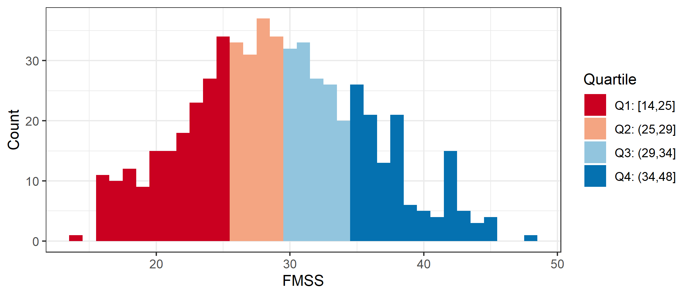

# Read data

**Most of this code was developed in Phase 1.**
Results will be suppressed for brevity.

**Use only the REDCap survey data**

Notes on the REDCap identifier variables:

* If `[consent] == 1`, they started the eligibility survey; 
  * if `== 0` or `== NA`, they didn't.
* If `[consent_and_eligibility_complete] == 2`, they finished the screener (whether eligible or ineligible); 
  * if `== 0`, they dropped out or never started.
* If `[eligible] == 1`, they completed the screener and were eligible; 
  * if `== 0`, they completed and were ineligible;
  * if `== NA` , they dropped out or never started.
* If `[veterans_and_social_media_use_co] == 2`, they finished the survey; 
  * if `== 0`, they dropped out or never started (this includes people who were ineligible or didn't consent).
* If `[analytic_sample] == 0`, they completed the survey but were disqualified for data quality reasons; 
  * if `== 1`, they completed survey and was not disqualified for data quality reasons;
  * if `== NA`, they didn't complete the survey.


Inclusion criteria

* Respondents who consented
* Eligible, ineligible, or missing eligibility indicator

**Number included: n = 1329**

Cleaning

* Parse out `fba` into 2 separate variables for `image` and `text`
* Assign indicator for survey participation, `indSurveyParticipation`
  * `analytic_sample == 1`: Participant completed survey and was not disqualified for data quality reasons
* Assign indicator for eligibility screener participation, `indScreenerParticipation`
  * `eligible == 1`: Participant completed eligibility screener and was eligible to participate in full survey


## Use of VA health services


Recoding logic

* Primary analysis will code `9` (not sure) as `0` (No)
* Sensitivity analysis will exclude the `9` values from the analysis
* If `va_ever_enrolled == FALSE` & `is.na(va_use_12mo)`, then recode `va_use_12mo` to `FALSE`
* If `va_use_12mo == TRUE` & `va_ever_enrolled == FALSE`, then recode `va_ever_enrolled` to `TRUE`
* Code indicators `indVANeverEnrolled` and `indVANotUse12mo` as the logical opposites of `va_ever_enrolled` and `va_use_12mo`


## Independent variables

* Score the Modified Facebook Measure of Social Support (FMSS)
  * Reverse-scored items are `fmss_r7` through `fmss_r10`


Check.




## Psychiatric symptoms

Code indicators for psychiatric disorder screening scales

* PTSD
  * Name of scale: PC-PTSD 
  * Positive screen: `ptsd_intrusive` + `ptsd_avoidant` + `ptsd_guarded` + `ptsd_numb` + `ptsd_guilty` $\ge$ 3
* Major depression
  * Name of scale: PHQ-2
  * Positive screen: `phq_interest` + `phq_mood` $\ge$ 3
* Alcohol misuse
  * Name of scale: AUDIT-C
  * Positive screen: `auditc_freq` + `auditc_amount` + `auditc_binge` $\ge$ 4 for men, $\ge$ 3 for women

Presence of suicidality is defined as DSI-SS score $\ge$ 2.
This cut-off score was chosen based on recommendations for population-based samples noted in 
[von Glischinski M Clin Psychol Psychotherapy 2015](http://onlinelibrary.wiley.com/doi/10.1002/cpp.2007/full)

* Score the DSI-SS inventory
  * See [Joiner 2002](http://www.sciencedirect.com/science/article/pii/S0005796701000171)
  * *Scores on each item range from 0 to 3 and, for the inventory, from 0 to 12, with higher scores reflecting greater severity of suicidal ideation.*


Check.


|yvariable |indPTSD | mean | sd  | min | max |  n  | freq  |
|:---------|:-------|:----:|:---:|:---:|:---:|:---:|:-----:|
|ptsd      |FALSE   | 0.9  | 0.9 |  0  |  2  | 255 | 47.9% |
|ptsd      |TRUE    | 4.2  | 0.8 |  3  |  5  | 277 | 52.1% |

\newline


|yvariable |indPHQ | mean | sd  | min | max |  n  | freq  |
|:---------|:------|:----:|:---:|:---:|:---:|:---:|:-----:|
|phq       |FALSE  | 0.9  | 0.9 |  0  |  2  | 448 | 72.3% |
|phq       |TRUE   | 4.5  | 1.2 |  3  |  6  | 172 | 27.7% |

\newline


|yvariable |indAuditC | mean | sd  | min | max |  n  | freq  |
|:---------|:---------|:----:|:---:|:---:|:---:|:---:|:-----:|
|auditc    |FALSE     | 1.8  | 0.8 |  1  |  3  | 246 | 49.0% |
|auditc    |TRUE      | 5.8  | 2.1 |  3  | 12  | 256 | 51.0% |

\newline


|yvariable |indDSISS | mean | sd  | min | max |  n  | freq  |
|:---------|:--------|:----:|:---:|:---:|:---:|:---:|:-----:|
|dsiss     |FALSE    | 0.1  | 0.3 |  0  |  1  | 482 | 78.2% |
|dsiss     |TRUE     | 3.9  | 1.6 |  2  |  9  | 134 | 21.8% |


## Covariates

* Social media platforms used: `sm_used___1`, ..., `sm_used___7`, `sm_used___99`, `sm_used_other`
  * Recode the following `sm_used_other` values such that `sm_used___99 = 0`
    * `I use Wikipedia to read about illnesses I don't have; it's a curiosity/hobby thing.`
    * `just in person`
    * `Just plain internet search`
    * `TV/phone conversations, veterans group meetings`
    * `google; bing`
    * `aol`
    * `e-mail`
    * `Web MD`
    * `webmd`
* Offline social contact: `comm_inperson`
* History of suicidal ideation and suicide attempts
  * `suicide_considered_ever`
  * `suicide_considered_12mo`
  * `suicide_attempts` 


Check.


|smOther |sm_used_other                                                                       |    n|
|:-------|:-----------------------------------------------------------------------------------|----:|
|FALSE   |                                                                                    | 1289|
|FALSE   |aol                                                                                 |    1|
|FALSE   |e-mail                                                                              |    1|
|FALSE   |google; bing                                                                        |    1|
|FALSE   |I use Wikipedia to read about illnesses I don't have; it's a curiosity/hobby thing. |    1|
|FALSE   |just in person                                                                      |    1|
|FALSE   |Just plain internet search                                                          |    1|
|FALSE   |TV/phone conversations, veterans group meetings                                     |    1|
|FALSE   |Web MD,                                                                             |    1|
|FALSE   |webmd                                                                               |    1|
|TRUE    |4chan                                                                               |    2|
|TRUE    |Gmail Hangouts; Reddit.com                                                          |    1|
|TRUE    |Google+                                                                             |    2|
|TRUE    |I used LiveJournal for the majority of my service as well as my deployment to Iraq  |    1|
|TRUE    |light fighter                                                                       |    1|
|TRUE    |Linked In                                                                           |    1|
|TRUE    |LinkedIn, Snapchat                                                                  |    1|
|TRUE    |LiveJournal                                                                         |    1|
|TRUE    |MIL.MIL                                                                             |    1|
|TRUE    |Ravelry Forums                                                                      |    1|
|TRUE    |reddit                                                                              |    4|
|TRUE    |Reddit                                                                              |    5|
|TRUE    |Reddit, 4Chan                                                                       |    1|
|TRUE    |Snao Chat                                                                           |    1|
|TRUE    |snapchat                                                                            |    3|
|TRUE    |Snapchat                                                                            |    1|
|TRUE    |SnapChat                                                                            |    1|
|TRUE    |vetsprevail,patients like me                                                        |    1|
|TRUE    |webmd, mayoclinic,wikipedia, va                                                     |    1|
|TRUE    |www.coping-with-epilepsy.com                                                        |    1|

\newline


| countSocialMediaExclFB|    n|
|----------------------:|----:|
|                      0| 1059|
|                      1|  154|
|                      2|   80|
|                      3|   22|
|                      4|   12|
|                      5|    2|

\newline


|comm_inperson                 |   n|
|:-----------------------------|---:|
|Several times a day           | 202|
|Once a day                    |  74|
|A few times a week            | 135|
|Once a week                   |  80|
|Every few weeks or less often | 209|
|NA                            | 629|

\newline


|indSuicideConsideredEver |indSuicideConsidered12mo |indSuicideAttempt | countSuicideAttempts|   n|
|:------------------------|:------------------------|:-----------------|--------------------:|---:|
|NA                       |NA                       |NA                |                  NaN| 713|
|FALSE                    |FALSE                    |FALSE             |                    0| 350|
|TRUE                     |FALSE                    |FALSE             |                    0| 144|
|TRUE                     |FALSE                    |TRUE              |                    1|  34|
|TRUE                     |TRUE                     |FALSE             |                    0|  29|
|TRUE                     |FALSE                    |TRUE              |                    2|  19|
|TRUE                     |TRUE                     |TRUE              |                    1|  11|
|TRUE                     |FALSE                    |TRUE              |                    3|   9|
|TRUE                     |TRUE                     |TRUE              |                    3|   8|
|TRUE                     |TRUE                     |TRUE              |                    2|   7|
|TRUE                     |FALSE                    |TRUE              |                    4|   2|
|TRUE                     |FALSE                    |TRUE              |                    5|   2|
|TRUE                     |TRUE                     |TRUE              |                    5|   1|
# Research Question 1

Is perceived social support received from Facebook (FMSS) associated with lower rates of 

* Positive screens for psychiatric disorders
  * PC-PTSD
  * PHQ-2
  * AUDIT-C
* Positive screen for suicidality?
  * DSI-SS


## Unadjusted comparisons


|yvariable |indPTSD | mean | sd  | min | max |  n  | freq  |
|:---------|:-------|:----:|:---:|:---:|:---:|:---:|:-----:|
|fmss      |FALSE   | 29.4 | 6.6 | 14  | 47  | 245 | 47.4% |
|fmss      |TRUE    | 28.4 | 6.8 | 16  | 48  | 272 | 52.6% |

\newline


|yvariable |indPHQ | mean | sd  | min | max |  n  | freq  |
|:---------|:------|:----:|:---:|:---:|:---:|:---:|:-----:|
|fmss      |FALSE  | 29.5 | 6.4 | 16  | 48  | 436 | 72.3% |
|fmss      |TRUE   | 28.0 | 6.8 | 14  | 44  | 167 | 27.7% |

\newline


|yvariable |indAuditC | mean | sd  | min | max |  n  | freq  |
|:---------|:---------|:----:|:---:|:---:|:---:|:---:|:-----:|
|fmss      |FALSE     | 29.7 | 6.6 | 14  | 48  | 241 | 49.4% |
|fmss      |TRUE      | 29.1 | 6.4 | 16  | 47  | 247 | 50.6% |

\newline


|yvariable |indDSISS | mean | sd  | min | max |  n  | freq  |
|:---------|:--------|:----:|:---:|:---:|:---:|:---:|:-----:|
|fmss      |FALSE    | 29.5 | 6.6 | 16  | 48  | 469 | 78.3% |
|fmss      |TRUE     | 27.6 | 6.4 | 14  | 44  | 130 | 21.7% |

\newline


## Adjusted comparisons


Filter subjects with missing covariates.


### PC-PTSD


|term        | estimate| std.error| statistic| p.value|
|:-----------|--------:|---------:|---------:|-------:|
|(Intercept) |   29.372|     0.431|    68.149|   0.000|
|indPTSDTRUE |   -0.994|     0.595|    -1.670|   0.096|

\newline


|term                                       | estimate| std.error| statistic| p.value|
|:------------------------------------------|--------:|---------:|---------:|-------:|
|(Intercept)                                |   29.207|     0.664|    43.998|   0.000|
|indPTSDTRUE                                |   -0.834|     0.629|    -1.326|   0.185|
|countSocialMediaExclFB                     |    0.975|     0.297|     3.284|   0.001|
|comm_inpersonOnce a day                    |   -0.081|     1.110|    -0.073|   0.942|
|comm_inpersonA few times a week            |   -0.045|     0.866|    -0.052|   0.959|
|comm_inpersonOnce a week                   |   -1.226|     1.033|    -1.187|   0.236|
|comm_inpersonEvery few weeks or less often |   -0.787|     0.788|    -0.999|   0.318|
|indSuicideConsideredEverTRUE               |   -0.717|     0.674|    -1.063|   0.288|
|countSuicideAttempts                       |    0.440|     0.405|     1.086|   0.278|

\newline


| r.squared| adj.r.squared| sigma| statistic| p.value| df|
|---------:|-------------:|-----:|---------:|-------:|--:|
|     0.035|         0.019| 6.651|     2.251|   0.023|  9|


```
## Warning: Removed 105 rows containing missing values (geom_point).
```


### PHQ-2


|term        | estimate| std.error| statistic| p.value|
|:-----------|--------:|---------:|---------:|-------:|
|(Intercept) |   29.564|     0.316|    93.699|   0.000|
|indPHQTRUE  |   -1.618|     0.600|    -2.699|   0.007|

\newline


|term                                       | estimate| std.error| statistic| p.value|
|:------------------------------------------|--------:|---------:|---------:|-------:|
|(Intercept)                                |   29.594|     0.566|    52.330|   0.000|
|indPHQTRUE                                 |   -1.266|     0.637|    -1.987|   0.047|
|countSocialMediaExclFB                     |    0.862|     0.278|     3.099|   0.002|
|comm_inpersonOnce a day                    |   -0.003|     0.974|    -0.003|   0.997|
|comm_inpersonA few times a week            |   -0.327|     0.784|    -0.416|   0.677|
|comm_inpersonOnce a week                   |   -0.940|     0.947|    -0.993|   0.321|
|comm_inpersonEvery few weeks or less often |   -1.036|     0.709|    -1.461|   0.145|
|indSuicideConsideredEverTRUE               |   -0.730|     0.614|    -1.189|   0.235|
|countSuicideAttempts                       |    0.345|     0.383|     0.902|   0.368|

\newline


| r.squared| adj.r.squared| sigma| statistic| p.value| df|
|---------:|-------------:|-----:|---------:|-------:|--:|
|     0.036|         0.022| 6.511|     2.704|   0.006|  9|


```
## Warning: Removed 18 rows containing missing values (geom_point).
```


### AUDIT-C


|term          | estimate| std.error| statistic| p.value|
|:-------------|--------:|---------:|---------:|-------:|
|(Intercept)   |   29.664|     0.423|    70.175|   0.000|
|indAuditCTRUE |   -0.570|     0.593|    -0.962|   0.337|

\newline


|term                                       | estimate| std.error| statistic| p.value|
|:------------------------------------------|--------:|---------:|---------:|-------:|
|(Intercept)                                |   30.022|     0.673|    44.599|   0.000|
|indAuditCTRUE                              |   -0.411|     0.593|    -0.693|   0.489|
|countSocialMediaExclFB                     |    0.963|     0.300|     3.206|   0.001|
|comm_inpersonOnce a day                    |   -0.064|     1.083|    -0.059|   0.953|
|comm_inpersonA few times a week            |   -0.687|     0.841|    -0.817|   0.414|
|comm_inpersonOnce a week                   |   -0.525|     1.035|    -0.508|   0.612|
|comm_inpersonEvery few weeks or less often |   -1.266|     0.789|    -1.605|   0.109|
|indSuicideConsideredEverTRUE               |   -1.440|     0.666|    -2.162|   0.031|
|countSuicideAttempts                       |    0.326|     0.415|     0.784|   0.434|

\newline


| r.squared| adj.r.squared| sigma| statistic| p.value| df|
|---------:|-------------:|-----:|---------:|-------:|--:|
|     0.037|         0.021| 6.451|     2.306|    0.02|  9|


```
## Warning: Removed 130 rows containing missing values (geom_point).
```


### DSI-SS


|term         | estimate| std.error| statistic| p.value|
|:------------|--------:|---------:|---------:|-------:|
|(Intercept)  |   29.525|     0.303|    97.437|   0.000|
|indDSISSTRUE |   -1.935|     0.651|    -2.972|   0.003|

\newline


|term                                       | estimate| std.error| statistic| p.value|
|:------------------------------------------|--------:|---------:|---------:|-------:|
|(Intercept)                                |   29.568|     0.564|    52.456|   0.000|
|indDSISSTRUE                               |   -1.787|     0.703|    -2.543|   0.011|
|countSocialMediaExclFB                     |    0.886|     0.277|     3.193|   0.001|
|comm_inpersonOnce a day                    |   -0.025|     0.973|    -0.025|   0.980|
|comm_inpersonA few times a week            |   -0.361|     0.782|    -0.462|   0.644|
|comm_inpersonOnce a week                   |   -1.017|     0.943|    -1.079|   0.281|
|comm_inpersonEvery few weeks or less often |   -1.155|     0.701|    -1.647|   0.100|
|indSuicideConsideredEverTRUE               |   -0.553|     0.627|    -0.883|   0.378|
|countSuicideAttempts                       |    0.393|     0.383|     1.026|   0.305|

\newline


| r.squared| adj.r.squared| sigma| statistic| p.value| df|
|---------:|-------------:|-----:|---------:|-------:|--:|
|      0.04|         0.027| 6.501|     3.067|   0.002|  9|


```
## Warning: Removed 18 rows containing missing values (geom_point).
```


